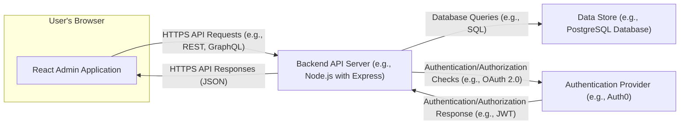
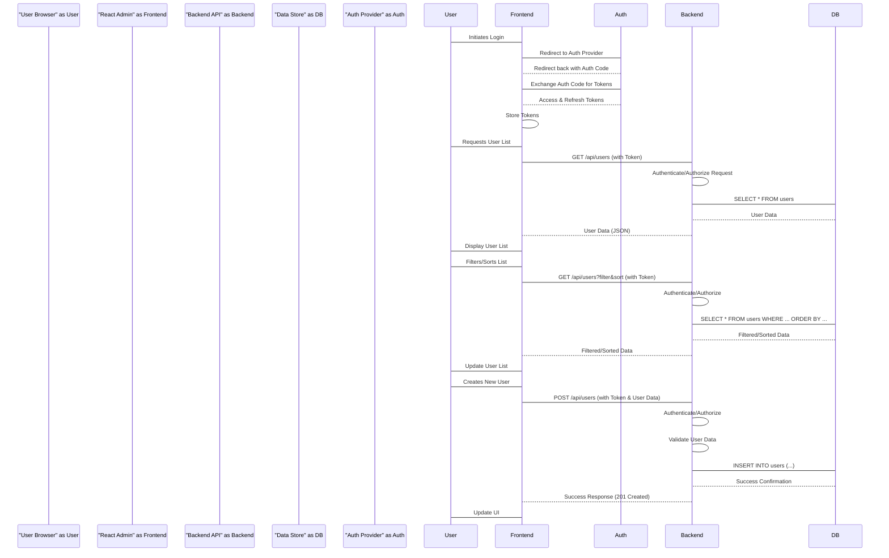

## Project Design Document: React Admin Application (Improved)

**1. Introduction**

This document provides an enhanced architectural design for a system built using the React Admin framework, specifically tailored for threat modeling. It builds upon the previous version by providing more concrete examples, deeper insights into data flow, and more specific security considerations. This detailed design will facilitate a more thorough and effective threat modeling process.

**2. Project Overview**

This project utilizes the React Admin framework to create a sophisticated administration interface for managing application data. The frontend application interacts with a backend API to perform standard CRUD operations on various data entities. React Admin's component library and abstractions streamline the development of feature-rich admin panels.

**3. Goals**

* Deliver a refined and more detailed architectural overview of the React Admin application.
* Clearly define key components, their responsibilities, and interactions.
* Provide a more granular illustration of data flow, including common user actions.
* Highlight specific potential security vulnerabilities relevant to the React Admin framework for targeted threat modeling.

**4. Target Audience**

This document is intended for:

* Security engineers conducting threat modeling activities.
* Development team members working on the React Admin application.
* Solution architects overseeing the system's design and security.

**5. System Architecture**

The React Admin application adheres to a client-server architecture. The frontend, constructed with React Admin, operates within the user's web browser and communicates with a dedicated backend API server.

**6. Component Description**

* **React Admin Application:**
    *  The frontend application built using the React Admin framework (version X.Y.Z).
    *  Responsible for rendering the user interface using React components, managing user interactions (e.g., form submissions, button clicks), and orchestrating API calls to the backend.
    *  Manages client-side application state (e.g., using Redux or Context API), handles routing based on user navigation, and manages client-side authentication state.
    *  Leverages React Admin's data provider abstraction to interact with the backend API. This includes handling data fetching, creation, updates, and deletions.
* **Backend API Server (e.g., Node.js with Express):**
    *  A server-side application built using Node.js and the Express framework.
    *  Responsible for implementing the core business logic, including data validation, processing, and orchestration.
    *  Exposes a RESTful API (or GraphQL endpoint) for the frontend to consume. Endpoints are secured using authentication and authorization mechanisms.
    *  Interacts with the Data Store to persist and retrieve data.
    *  May handle authentication directly or delegate it to an external Authentication Provider.
* **Data Store (e.g., PostgreSQL Database):**
    *  A PostgreSQL relational database serving as the persistent storage for the application's data.
    *  Accessed by the Backend API Server using database connectors (e.g., `pg` library in Node.js).
    *  Stores structured data according to a defined schema.
* **Authentication Provider (e.g., Auth0):**
    *  A third-party service (e.g., Auth0) responsible for user authentication and authorization.
    *  Provides mechanisms for user registration, login, and password management.
    *  Issues security tokens (e.g., JWTs) upon successful authentication, which are used by the Backend API Server to verify user identity and permissions.

**7. Data Flow (Detailed)**

The following describes the data flow for common user interactions within the React Admin application:

* **User Login (using Authentication Provider):**
    * User initiates the login process within the React Admin application.
    * React Admin redirects the user to the Authentication Provider's login page.
    * User submits credentials to the Authentication Provider.
    * The Authentication Provider verifies the credentials.
    * Upon successful authentication, the Authentication Provider redirects the user back to the React Admin application with an authorization code or directly with tokens.
    * React Admin exchanges the authorization code for access and refresh tokens (if applicable).
    * The access token is stored securely in the React Admin application (e.g., in memory or an HTTP-only cookie).

* **Fetching a List of Resources (e.g., Users):**
    * User navigates to the "Users" list view in the React Admin application.
    * React Admin's data provider makes an HTTPS GET request to the Backend API Server (e.g., `/api/users`). The request includes the authentication token in the `Authorization` header.
    * The Backend API Server authenticates and authorizes the request by verifying the token with the Authentication Provider (or its own secret key).
    * The Backend API Server queries the Data Store (e.g., `SELECT * FROM users`) to retrieve the list of users.
    * The Data Store returns the user data to the Backend API Server.
    * The Backend API Server formats the data (e.g., as a JSON array) and sends it back to the React Admin application in the HTTPS response.
    * React Admin renders the list of users in the user interface.

* **Filtering and Sorting a Resource List:**
    * User applies filters or sorts the "Users" list in the React Admin application.
    * React Admin's data provider makes an HTTPS GET request to the Backend API Server (e.g., `/api/users?_sort=name&_order=ASC&name_like=John`). The request includes filter and sort parameters.
    * The Backend API Server authenticates and authorizes the request.
    * The Backend API Server constructs a database query with the provided filters and sorting criteria (e.g., `SELECT * FROM users WHERE name LIKE '%John%' ORDER BY name ASC`).
    * The Data Store executes the query and returns the filtered and sorted data.
    * The Backend API Server sends the data back to the React Admin application.
    * React Admin updates the displayed list.

* **Creating a New Resource:**
    * User fills out a form to create a new user in the React Admin application.
    * React Admin's data provider makes an HTTPS POST request to the Backend API Server (e.g., `/api/users`) with the new user data in the request body (JSON). The request includes the authentication token.
    * The Backend API Server authenticates and authorizes the request.
    * The Backend API Server validates the incoming data.
    * The Backend API Server inserts the new user data into the Data Store (e.g., `INSERT INTO users (...) VALUES (...)`).
    * The Data Store confirms the successful insertion.
    * The Backend API Server sends a success response (e.g., HTTP 201 Created) back to the React Admin application, potentially including the newly created resource.
    * React Admin updates the user interface, potentially navigating to the detail view of the new user.

**8. Technologies Used**

* **Frontend:**
    * React (v18.x)
    * React Admin (v4.x)
    * JavaScript/TypeScript (using ES6+ syntax)
    * HTML5
    * CSS3 (potentially with a CSS-in-JS library like Material UI styles)
    * Redux or React Context for state management
    * A routing library (e.g., React Router)
* **Backend:**
    * Node.js (v16.x or later)
    * Express.js (v4.x)
    * [Specify ORM/ODM if used - e.g., Sequelize, TypeORM, Mongoose]
    * [Specify API documentation tool - e.g., Swagger/OpenAPI]
* **Data Store:**
    * PostgreSQL (v14 or later)
    * [Specify database migration tool - e.g., Knex.js, Flyway]
* **Authentication:**
    * OAuth 2.0 protocol
    * JSON Web Tokens (JWT)
    * Auth0 (or similar identity provider)

**9. Deployment Considerations**

* The React Admin application is typically built as a Single Page Application (SPA) and deployed as static files on a web server (e.g., Nginx, Apache) or a Content Delivery Network (CDN) like Cloudflare or AWS CloudFront.
* The Backend API Server is deployed as a separate application, potentially containerized using Docker and orchestrated with Kubernetes. It might be hosted on cloud platforms like AWS, Google Cloud, or Azure.
* The Data Store (PostgreSQL) is deployed and managed separately, potentially using managed database services offered by cloud providers.
* Communication between the frontend and backend **must** occur over HTTPS to ensure data confidentiality and integrity.
* Implement proper security headers (e.g., `Content-Security-Policy`, `Strict-Transport-Security`, `X-Frame-Options`) on both the frontend and backend.
* Consider network segmentation to isolate the backend API and database from public access.

**10. Security Considerations (Specific to React Admin)**

This section details potential security concerns, with a focus on aspects relevant to the React Admin framework:

* **Frontend Security:**
    * **Cross-Site Scripting (XSS):** Vulnerabilities in custom React components or through the use of `dangerouslySetInnerHTML`. Ensure proper sanitization of user-generated content.
    * **Client-Side Data Validation Bypass:** Relying solely on frontend validation. Backend validation is crucial.
    * **Exposure of Sensitive Information:** Accidental inclusion of sensitive data in client-side JavaScript code or browser storage. Avoid storing secrets or PII unnecessarily.
    * **Dependency Vulnerabilities:** Outdated or vulnerable npm packages used in the frontend. Regularly audit and update dependencies.
    * **Insecure Handling of Authentication Tokens:** Storing tokens insecurely (e.g., in local storage without proper protection). Consider HTTP-only cookies or secure in-memory storage.
* **Backend Security:**
    * **Injection Attacks:** SQL injection vulnerabilities in database queries if using raw queries. Utilize ORMs with parameterized queries.
    * **Broken Authentication and Authorization:** Flaws in the implementation of authentication and authorization logic, allowing unauthorized access. Ensure proper token verification and role-based access control.
    * **API Vulnerabilities:**
        * **Mass Assignment:** Allowing users to update unintended fields through API requests. Use allow-lists for data binding.
        * **Insecure Direct Object References (IDOR):** Exposing internal object IDs without proper authorization checks.
        * **Excessive Data Exposure:** Returning more data than necessary in API responses. Implement proper data filtering and pagination.
    * **Server-Side Request Forgery (SSRF):** If the backend makes requests to external resources based on user input, ensure proper validation and sanitization to prevent SSRF attacks.
    * **Dependency Vulnerabilities:** Outdated or vulnerable npm packages used in the backend. Regularly audit and update dependencies.
* **Communication Security:**
    * **Missing HTTPS:** All communication between the frontend and backend must be encrypted using HTTPS.
    * **Insecure Handling of Authentication Tokens:** Transmitting tokens over unencrypted connections or storing them insecurely.
    * **Cross-Site Request Forgery (CSRF):** Implement CSRF protection mechanisms (e.g., synchronizer tokens) to prevent malicious requests from other domains.
* **Data Store Security:**
    * **SQL Injection:** As mentioned above, a critical vulnerability if not handled properly.
    * **Unauthorized Access:** Secure database credentials and restrict access to authorized services only.
    * **Data Breaches:** Implement proper encryption at rest and in transit for sensitive data.
* **Authentication Security:**
    * **Weak Password Policies:** Enforce strong password requirements.
    * **Brute-Force Attacks:** Implement rate limiting on login endpoints.
    * **Vulnerabilities in Authentication Provider:** Stay updated on security advisories for the chosen authentication provider.

**11. Potential Threat Areas for Threat Modeling (Using STRIDE)**

Applying the STRIDE model, potential threat areas include:

* **Spoofing:**
    * Malicious actors impersonating legitimate users or services.
    * Countermeasures: Strong authentication mechanisms, mutual TLS.
* **Tampering:**
    * Unauthorized modification of data in transit or at rest.
    * Countermeasures: HTTPS, data integrity checks, access controls.
* **Repudiation:**
    * Users denying actions they performed.
    * Countermeasures: Audit logging, non-repudiation mechanisms.
* **Information Disclosure:**
    * Exposure of sensitive information to unauthorized parties.
    * Countermeasures: Encryption, access controls, secure coding practices.
* **Denial of Service (DoS):**
    * Overwhelming the application or its components, making it unavailable.
    * Countermeasures: Rate limiting, input validation, infrastructure scaling.
* **Elevation of Privilege:**
    * Unauthorized users gaining access to higher-level privileges.
    * Countermeasures: Robust authorization mechanisms, principle of least privilege.

**12. Conclusion**

This improved design document provides a more detailed and security-focused overview of the React Admin application. By outlining specific components, data flows, and potential vulnerabilities, it serves as a valuable resource for conducting thorough threat modeling. The identified threat areas, categorized using the STRIDE model, will guide the security team in identifying and mitigating potential risks, ultimately leading to a more secure and resilient application.
