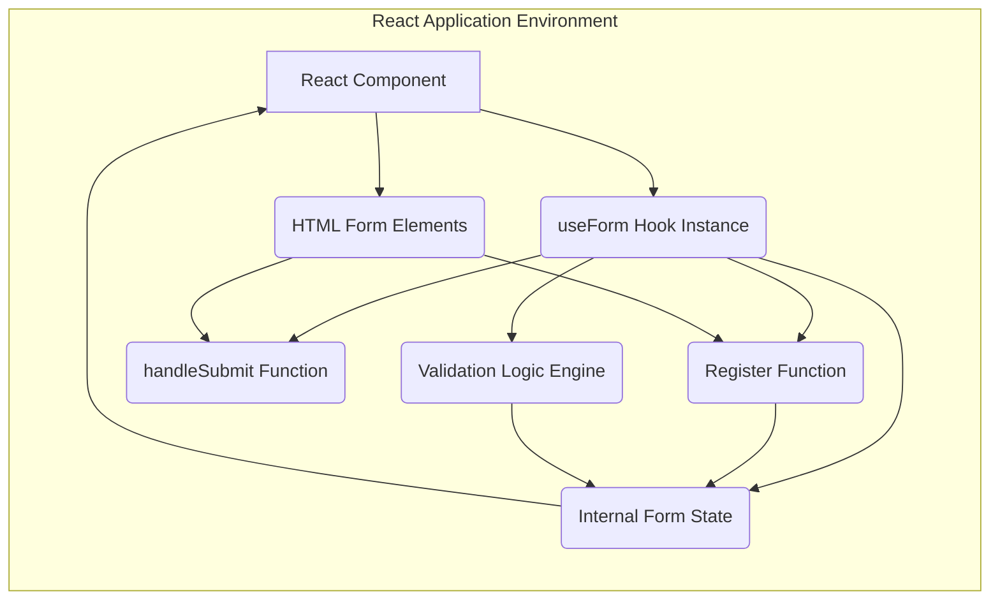
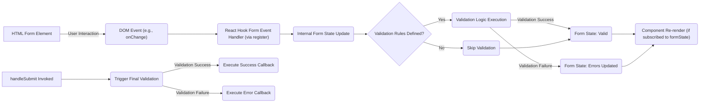

# Project Design Document: React Hook Form (For Threat Modeling)

**Version:** 1.1
**Date:** October 26, 2023
**Author:** AI Software Architect

## 1. Introduction

This document provides a detailed design overview of the React Hook Form library, specifically tailored for threat modeling activities. It outlines the key components, architecture, data flow, and security considerations to facilitate the identification and analysis of potential security vulnerabilities. This document serves as a foundation for understanding the library's structure and functionality from a security perspective.

## 2. Goals and Objectives

The primary goals of React Hook Form are to:

*   Offer a performant form management solution for React applications, minimizing unnecessary re-renders.
*   Provide a flexible API that integrates well with both simple and complex form scenarios.
*   Simplify form validation using various approaches, including built-in, schema-based, and custom methods.
*   Enhance developer experience with an intuitive and easy-to-use API.

This design document aims to:

*   Clearly describe the architectural components of React Hook Form and their interactions.
*   Illustrate the flow of data within the library, highlighting potential data entry and exit points.
*   Identify potential security risks and vulnerabilities associated with the library's design and usage.
*   Provide a basis for conducting thorough threat modeling exercises to secure applications utilizing React Hook Form.

## 3. Architectural Overview

React Hook Form is a client-side library designed to manage form state and validation within React applications. It primarily operates within the user's browser, interacting with the DOM and React's component lifecycle.

### 3.1. High-Level Architecture Diagram

### 3.2. Key Components and Responsibilities

*   **`useForm` Hook Instance:** The central API entry point. It initializes and manages the form state and provides various utility functions.
    *   **Responsibility:**  Orchestrates form state management, validation, and submission handling. Acts as the primary interface for interacting with the library.
*   **Internal Form State:**  An object managed by the `useForm` hook instance, holding the current values of form fields, validation errors, and form metadata (e.g., `isDirty`, `isValid`).
    *   **Responsibility:** Stores and updates the dynamic state of the form. Changes to this state trigger re-renders of subscribed components.
*   **`register` Function:**  A function returned by `useForm` used to register individual form fields. It returns props that need to be applied to the corresponding HTML form element.
    *   **Responsibility:**  Connects HTML form elements to the internal form state, enabling React Hook Form to track changes and manage their values.
*   **`handleSubmit` Function:**  A function returned by `useForm` used to handle form submission. It takes two callback functions: one for successful submission and one for handling validation errors.
    *   **Responsibility:**  Triggers form validation and executes the appropriate callback based on the validation result. Prevents default browser form submission.
*   **Validation Logic Engine:**  The internal mechanism responsible for executing validation rules. It can utilize built-in HTML5 validation, schema-based validation (via integration with libraries), or custom validation functions.
    *   **Responsibility:**  Evaluates the validity of form field values based on defined rules and updates the form state with any validation errors.
*   **Controller Component (Optional):** A utility component provided by React Hook Form to integrate with controlled components or UI libraries that require more explicit control over input values and change handlers.
    *   **Responsibility:** Bridges the gap between React Hook Form's uncontrolled approach and controlled components, allowing for seamless integration.
*   **Form Context (Internal):** While not directly manipulated by the user, React Hook Form leverages React's Context API internally to efficiently manage and share form state across descendant components within the same form.
    *   **Responsibility:** Provides a mechanism for components within the form to access and subscribe to the shared form state.

## 4. Data Flow

The data flow within a React Hook Form implementation involves several key steps:

1. **Field Registration:** When a component containing a form field renders, the `register` function is invoked, associating the HTML element with React Hook Form's internal state using the field's `name` attribute as a key.
2. **User Input and Change Detection:** As the user interacts with a registered form field, the browser updates the DOM element's value. React Hook Form listens for these changes through the event handlers applied by the `register` function.
3. **Internal State Update:** Upon detecting a change, React Hook Form updates its internal form state with the new value of the modified field. This update is performed efficiently to minimize unnecessary component re-renders.
4. **Validation Execution:** Based on the configured validation rules (either defined within the `register` options, through a schema resolver, or via custom functions), React Hook Form triggers validation of the affected field or the entire form. This can occur on events like `onChange`, `onBlur`, or during form submission.
5. **Error State Management:** If validation fails for any field, the corresponding error messages are stored within the internal form state.
6. **Form Submission Initiation:** When the user submits the form, the `handleSubmit` function is invoked.
7. **Pre-Submission Validation:** `handleSubmit` first triggers a final validation check of all registered fields.
8. **Callback Execution:**
    *   **Success:** If all fields are valid, the success callback function provided to `handleSubmit` is executed, typically receiving the current form data as an argument.
    *   **Failure:** If any field fails validation, the error callback function provided to `handleSubmit` is executed, usually receiving an object containing the validation errors.
9. **State-Driven Re-renders:** Changes to the internal form state (including field values, validation errors, and form status flags) trigger re-renders of React components that are subscribed to this state, allowing the UI to reflect the current form status.

### 4.1. Data Flow Diagram

## 5. Security Considerations

This section details potential security considerations relevant to applications using React Hook Form. It's crucial to understand that while React Hook Form simplifies form management, the overall security of the application depends on how the library is implemented and integrated with backend systems.

*   **Cross-Site Scripting (XSS) Vulnerabilities:**
    *   **Threat:** Improper handling of user input, especially when displaying validation error messages or dynamically rendering form values, can lead to XSS attacks. If malicious scripts are injected into these areas, they can be executed in the user's browser.
    *   **Mitigation:**
        *   **Strict Output Encoding:** Always sanitize and escape user-provided data before rendering it in the DOM. React's JSX provides some default protection, but be extra cautious with dynamically generated content.
        *   **Content Security Policy (CSP):** Implement a strong CSP to restrict the sources from which the browser can load resources, mitigating the impact of successful XSS attacks.
*   **Client-Side Validation Bypass:**
    *   **Threat:** Relying solely on client-side validation provided by React Hook Form is insecure. Attackers can bypass client-side checks by manipulating browser requests or disabling JavaScript.
    *   **Mitigation:**
        *   **Server-Side Validation is Mandatory:** Always perform comprehensive validation on the server-side to ensure data integrity and security before processing or storing any user input.
        *   **Treat Client-Side Validation as a UX Enhancement:** View client-side validation as a way to provide immediate feedback to the user, not as a primary security mechanism.
*   **Injection Attacks (Indirect):**
    *   **Threat:** While React Hook Form doesn't directly interact with databases, vulnerabilities in custom validation logic or improper handling of form data sent to the backend can indirectly lead to injection attacks (e.g., SQL injection, NoSQL injection) if the backend doesn't properly sanitize and validate the data.
    *   **Mitigation:**
        *   **Secure Backend Development Practices:** Adhere to secure coding practices on the backend, including parameterized queries or ORM usage to prevent SQL injection, and proper input sanitization for all data received from the client.
*   **Denial of Service (DoS) Attacks:**
    *   **Threat:** Malicious actors might attempt to submit excessively large or complex forms to overload client-side resources or the backend server.
    *   **Mitigation:**
        *   **Input Size Limits:** Implement limits on the size and complexity of form inputs on both the client and server sides.
        *   **Rate Limiting:** Implement rate limiting on form submission endpoints to prevent abuse.
        *   **Efficient Validation Logic:** Ensure validation rules are performant and avoid computationally expensive operations on the client-side.
*   **Cross-Site Request Forgery (CSRF) Attacks:**
    *   **Threat:** If form submissions to the backend are not protected against CSRF, attackers can trick users into making unintended requests on the application.
    *   **Mitigation:**
        *   **Anti-CSRF Tokens:** Implement CSRF protection mechanisms, such as synchronizer tokens, for all state-changing requests to the backend.
        *   **SameSite Cookie Attribute:** Utilize the `SameSite` attribute for cookies to help prevent CSRF attacks.
*   **Man-in-the-Middle (MitM) Attacks:**
    *   **Threat:** If form data is transmitted over an insecure connection (HTTP), attackers can intercept sensitive information.
    *   **Mitigation:**
        *   **Enforce HTTPS:** Ensure the entire application is served over HTTPS to encrypt all communication between the client and the server.
*   **Dependency Vulnerabilities:**
    *   **Threat:** Vulnerabilities in React Hook Form's dependencies (e.g., React itself or validation schema libraries) could introduce security risks.
    *   **Mitigation:**
        *   **Regularly Update Dependencies:** Keep React Hook Form and its dependencies updated to the latest versions to patch known security vulnerabilities.
        *   **Dependency Scanning:** Use tools like `npm audit` or `yarn audit` to identify and address potential vulnerabilities in project dependencies.
*   **Data Exposure in Browser History/Logs:**
    *   **Threat:** Sensitive data entered into forms might be inadvertently stored in browser history or client-side logs.
    *   **Mitigation:**
        *   **Avoid Storing Sensitive Data in URLs:** Ensure sensitive information is not included in URL parameters during form submission.
        *   **Proper Logging Practices:** Be mindful of what data is logged on the client-side and avoid logging sensitive information.

## 6. Dependencies

React Hook Form has a core dependency on:

*   **React:**  The fundamental JavaScript library for building user interfaces, providing the necessary hooks and component model for React Hook Form to function.

It also supports integration with various optional libraries for enhanced functionality:

*   **Schema Validation Libraries (e.g., Yup, Zod, Joi):** These libraries provide a declarative way to define validation schemas, which can be integrated with React Hook Form for more robust validation.
*   **UI Libraries (e.g., Material UI, Ant Design):** While not direct dependencies, React Hook Form is designed to integrate seamlessly with various UI libraries, often requiring specific adapter components (like the `<Controller>`).

## 7. Deployment

React Hook Form is a client-side library that is bundled with the React application during the build process. Deployment considerations are primarily focused on the secure deployment of the overall React application.

## 8. Future Considerations

*   Enhanced support for asynchronous validation scenarios.
*   Improved accessibility features and ARIA attribute management.
*   Further optimizations for performance in complex forms.
*   Potentially providing more built-in validation rules for common use cases.

This document provides a comprehensive design overview of React Hook Form, specifically tailored for threat modeling. It highlights key architectural components, data flow, and potential security considerations. This information should be used as a foundation for conducting thorough threat modeling exercises to identify and mitigate potential vulnerabilities in applications utilizing this library.
