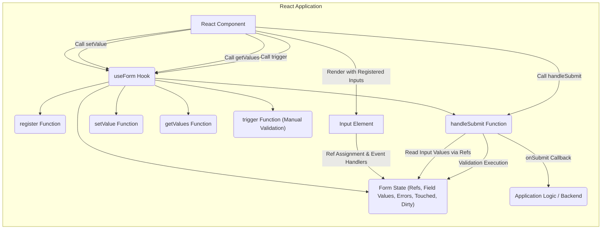
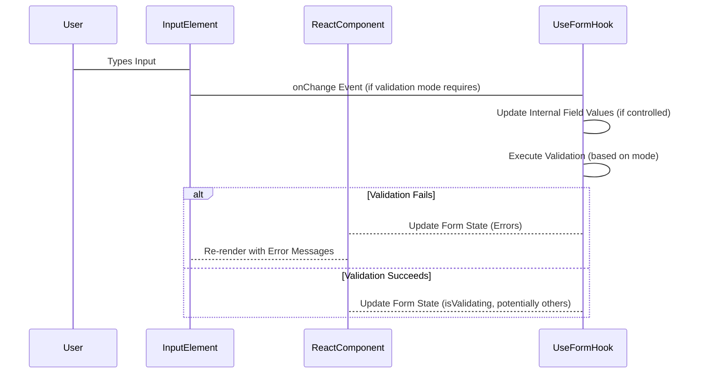

# Project Design Document: React Hook Form

**Version:** 1.1
**Date:** October 26, 2023
**Author:** AI Software Architect

## 1. Introduction

This document provides a detailed architectural design for the React Hook Form library. It outlines the library's purpose, key components, data flow, and security considerations. This document serves as a foundation for subsequent threat modeling activities, enabling a deeper understanding of potential vulnerabilities and attack vectors.

## 2. Goals

The primary goals of React Hook Form are:

*   Provide a performant and flexible form management solution for React applications.
*   Minimize re-renders by leveraging uncontrolled components and the `useRef` hook, enhancing application efficiency.
*   Offer a simple and intuitive API for common form functionalities, promoting developer productivity.
*   Support various validation strategies and integrate seamlessly with validation libraries, offering flexibility in data integrity enforcement.
*   Enhance developer experience by reducing boilerplate code associated with traditional form management.

## 3. Scope

This design document covers the core functionalities and architecture of the React Hook Form library as of its current state (based on the provided GitHub repository). It includes:

*   Form registration and management, detailing how input fields are connected to the library's state.
*   Input value tracking and updates, explaining how the library observes and reacts to changes in input values.
*   Validation mechanisms (both built-in and integration with external libraries), outlining the processes for ensuring data validity.
*   Form submission handling, describing the steps involved in collecting and processing form data upon submission.
*   Error management and display, detailing how validation errors are tracked and made available for UI presentation.
*   Integration with React's component lifecycle, explaining how the library interacts with React's rendering and update mechanisms.

This document does not cover:

*   Specific implementation details of validation libraries integrated with React Hook Form (e.g., the internal logic of Yup or Zod).
*   UI rendering aspects of forms; the library focuses on the underlying form logic and state management.
*   Backend API interactions for form submission, as these are highly application-specific and outside the library's direct control.

## 4. Architecture Overview

React Hook Form employs a hook-based architecture to manage form state and logic within React functional components. It primarily utilizes uncontrolled components and the `useRef` hook to directly interact with DOM input elements, minimizing unnecessary re-renders and optimizing performance.



*   **React Component:** The functional component utilizing the React Hook Form library to manage its form.
*   **`useForm` Hook:** The core hook provided by the library, responsible for initializing and managing the form's internal state and providing utility functions for interaction.
*   **Form State:** Internal state managed by `useForm`, encompassing:
    *   References (`refs`) to registered input elements, allowing direct DOM access.
    *   Field Values:  A representation of the current values of the form inputs.
    *   Errors: An object containing validation error messages for each field.
    *   Touched:  Indicates whether an input field has been interacted with.
    *   Dirty: Indicates whether the form's values have been changed from their initial state.
*   **Register Function:** A function returned by `useForm` used to register input elements with the library. This involves attaching a `ref` and potentially setting up event handlers.
*   **handleSubmit Function:** A function returned by `useForm` used to handle form submission. It orchestrates validation and invokes the provided `onSubmit` callback.
*   **setValue Function:** A function returned by `useForm` to programmatically update the value of a registered input, potentially triggering re-validation.
*   **getValues Function:** A function returned by `useForm` to retrieve the current values of registered inputs, either individually or as a complete form data object.
*   **trigger Function:** A function returned by `useForm` to manually trigger validation for specific fields or the entire form.
*   **Input Element:** Standard HTML input elements (or custom components) that are registered with React Hook Form, allowing the library to track their state.
*   **Application Logic / Backend:** The application-specific code responsible for handling the submitted form data, such as sending it to a backend API or updating local state.

## 5. Detailed Design

### 5.1. `useForm` Hook Internals

The `useForm` hook is the central orchestrator of form management within the library.

*   **Initialization and State Management:**
    *   Accepts an optional `options` object to configure form behavior, including `defaultValues`, `resolver` (for schema-based validation), and `mode` (for controlling when validation runs).
    *   Utilizes `useState` to manage reactive form state, such as `errors`, `isSubmitting`, `isDirty`, and `isValid`.
    *   Employs `useRef` to maintain stable references to input elements and internal state that doesn't trigger re-renders on modification (e.g., the `_formValues` ref).
    *   Initializes the `fieldReferences` ref to store references to registered input elements, keyed by their `name`.

*   **Registration Process (`register` function details):**
    *   Accepts the input element's `name` and an optional `validationOptions` object.
    *   Returns an object containing props to be spread onto the input element, including the `ref` and potentially `onChange`, `onBlur` event handlers depending on the configured validation `mode`.
    *   Internally, it attaches a ref to the input element and stores it in the `fieldReferences.current` object.
    *   Parses and stores validation rules specified in `validationOptions`, which are later used during validation.
    *   Sets up event listeners (if required by the validation mode) to trigger validation on input changes or blur events.

*   **Submission Flow (`handleSubmit` function details):**
    *   Accepts an `onSubmit` callback function and an optional `onValidate` callback for asynchronous validation.
    *   Returns an event handler function to be attached to the form's `onSubmit` event.
    *   When the event handler is triggered:
        *   Prevents the default browser form submission.
        *   Retrieves the current values of all registered inputs by accessing `fieldReferences.current[name].current.value`.
        *   Executes validation logic:
            *   If a `resolver` is provided, it uses the specified validation library to validate the form data.
            *   Otherwise, it iterates through the validation rules defined during registration for each field.
        *   If validation succeeds, it calls the provided `onSubmit` callback with the form data.
        *   If validation fails, it updates the internal `errors` state, causing a re-render, and potentially calls an `onError` callback (if provided in the `options`).

*   **Programmatic Value Updates (`setValue` function details):**
    *   Accepts the input `name`, the new `value`, and an optional `options` object to control validation and dirty state updates.
    *   Retrieves the corresponding input element ref from `fieldReferences.current`.
    *   Updates the `value` property of the DOM element directly.
    *   Triggers re-validation for the specified field or the entire form based on the `options` and the configured validation `mode`.
    *   Updates the internal `_formValues` ref to reflect the new value.

*   **Value Retrieval Mechanism (`getValues` function details):**
    *   Accepts an optional input `name` (or an array of names).
    *   If a name is provided, it retrieves the value from `fieldReferences.current[name].current.value`.
    *   If no name is provided, it iterates through all registered fields and returns an object containing their current values.

*   **Manual Validation Trigger (`trigger` function details):**
    *   Accepts an optional `name` (or an array of names) to specify which fields to validate.
    *   Programmatically triggers the validation logic for the specified fields, updating the `errors` state.

### 5.2. Validation Strategies

React Hook Form offers flexibility in how form data is validated:

*   **Built-in Validation Rules:**  Validation rules are defined as part of the `register` function's options (e.g., `required: true`, `minLength: 5`, `pattern: /^[a-zA-Z]+$/`). These are processed internally by the library.
*   **Schema-Based Validation with Resolvers:** Integrates with external validation libraries like Yup, Zod, and Joi through the `resolver` option in `useForm`. This allows for more complex and declarative validation logic defined in a separate schema. The `resolver` function transforms the schema validation result into a format compatible with React Hook Form's error state.
*   **Custom Validation Functions:** Developers can provide custom validation functions within the `register` options. These functions receive the input value and should return an error message (string) if invalid, or `true` (or nothing) if valid.

### 5.3. Re-render Optimization

React Hook Form is designed to minimize unnecessary re-renders, which is crucial for performance in complex forms:

*   **Uncontrolled Components as Primary Approach:** By primarily using uncontrolled components, the library avoids triggering re-renders when input values change. The source of truth resides in the DOM.
*   **Strategic Use of `useRef`:**  `useRef` is used to store references to DOM elements and internal state that doesn't need to trigger re-renders when updated. This allows the library to access input values directly without relying on React's state management for every change.
*   **Selective State Updates:** When state updates are necessary (e.g., for displaying errors), React Hook Form updates only the relevant parts of the state, preventing unnecessary re-renders of the entire form.
*   **`formState` Observation:** The `formState` object returned by `useForm` allows components to selectively subscribe to specific aspects of the form's state (e.g., `errors`, `isDirty`), further optimizing re-renders.

## 6. Data Flow Diagrams

### 6.1. Input Value Change with Validation



### 6.2. Form Submission and Validation

```mermaid
sequenceDiagram
    participant User
    participant FormElement
    participant ReactComponent
    participant UseFormHook
    participant ValidationLibrary
    participant ApplicationLogic

    User->FormElement: Clicks Submit Button
    FormElement->ReactComponent: onSubmit Event
    ReactComponent->UseFormHook: Call handleSubmit
    UseFormHook->UseFormHook: Retrieve Input Values via Refs
    opt with Resolver
        UseFormHook->ValidationLibrary: Validate Form Data
        ValidationLibrary-->UseFormHook: Validation Result
    else Built-in Validation
        UseFormHook->UseFormHook: Execute Built-in Validation Rules
    end
    alt Validation Success
        UseFormHook->ApplicationLogic: Call onSubmit Callback with Form Data
    else Validation Failure
        UseFormHook->ReactComponent: Update Error State
        ReactComponent-->FormElement: Re-render with Error Messages
    end
```

## 7. Key Components

*   **`useForm` Hook:** The central hook managing form state, validation, and submission.
*   **`register` Function:**  Used to register input elements and their validation rules.
*   **`handleSubmit` Function:**  Handles form submission and triggers validation.
*   **`setValue` Function:**  Programmatically updates input values and triggers re-validation.
*   **`getValues` Function:**  Retrieves current form values.
*   **`trigger` Function:**  Manually triggers validation for specific fields.
*   **`formState` Object:** Provides reactive access to the form's state (errors, isDirty, isValid, etc.).
*   **`control` Object:** Offers advanced control, including methods for registering custom components and managing their state.
*   **`Controller` Component:** Facilitates integration with controlled components and UI libraries by providing a standardized way to connect them to React Hook Form.

## 8. Security Considerations

Given React Hook Form's client-side nature, security considerations primarily revolve around protecting against client-side vulnerabilities and ensuring data integrity.

*   **Cross-Site Scripting (XSS) Vulnerabilities:**
    *   **Rendering User-Provided Data in Error Messages:** If error messages or default values are derived from user input without proper sanitization, they could be exploited for XSS. Ensure that any user-controlled strings displayed in the UI are properly escaped or rendered using React's built-in protection mechanisms.
    *   **Custom Validation Logic:**  If custom validation functions directly manipulate the DOM or execute arbitrary scripts based on input, it could introduce XSS risks.
*   **Cross-Site Request Forgery (CSRF):**
    *   React Hook Form itself doesn't inherently prevent CSRF. Applications using React Hook Form must implement CSRF protection mechanisms, such as including anti-CSRF tokens in form submissions, which are validated on the server.
*   **Client-Side Validation Bypass:**
    *   Client-side validation provided by React Hook Form enhances user experience but is not a security measure. Attackers can bypass client-side validation by manipulating the DOM or intercepting network requests. **Server-side validation is mandatory** to ensure data integrity and prevent malicious data from being processed.
*   **Data Tampering:**
    *   Users can potentially manipulate form data in the browser before submission. Relying solely on client-side logic for critical decisions is insecure. Server-side verification of all submitted data is essential.
*   **Exposure of Sensitive Information:**
    *   Avoid storing sensitive information directly in the form state for extended periods. Ensure secure transmission of sensitive data to the backend using HTTPS. Be mindful of what data is persisted in browser history or local storage if using features like "remember me."
*   **Dependency Chain Vulnerabilities:**
    *   Regularly audit and update React Hook Form and its dependencies to patch any known security vulnerabilities in the library itself or its transitive dependencies. Use tools like `npm audit` or `yarn audit`.
*   **Input Sanitization:**
    *   While React Hook Form manages form data, it does not automatically sanitize input. Implement input sanitization on the client-side (with caution, as it can be bypassed) and, more importantly, on the server-side to prevent injection attacks (e.g., SQL injection, command injection).
*   **Man-in-the-Middle (MITM) Attacks:**
    *   Ensure that form submissions occur over HTTPS to protect data in transit from MITM attacks. This is a general web security best practice, not specific to React Hook Form.
*   **State Injection:** While less direct, if the application logic improperly handles or trusts data from `getValues` without further validation, it could lead to vulnerabilities if an attacker can manipulate the form state indirectly.

## 9. Deployment Considerations

React Hook Form is a client-side library and is typically deployed as part of a React application's frontend build.

*   **Bundling:** The library is included in the application's JavaScript bundle using tools like Webpack, Parcel, or Vite. Ensure that the bundling process is configured correctly to optimize the bundle size and remove unnecessary code.
*   **CDN (Less Common):** While possible, deploying React Hook Form via a CDN is less common due to its tight integration with application code. If used, ensure the CDN source is reputable and the integrity of the delivered files is verified (e.g., using Subresource Integrity).
*   **npm/Yarn/pnpm:** The library is typically installed as a dependency using a package manager like npm, Yarn, or pnpm. Follow best practices for managing dependencies and ensuring their security.

## 10. Assumptions and Constraints

*   **React Environment:** The library is designed for use within React applications (version 16.8 or later due to its reliance on hooks).
*   **JavaScript Environment:**  Assumes a modern JavaScript environment compatible with the features used by the library.
*   **Client-Side Focus:** React Hook Form primarily manages client-side form logic. Server-side validation, data sanitization, and backend interactions are the responsibility of the application developer.
*   **Uncontrolled Components Preference:** While supporting controlled components, the library is optimized for and primarily designed around the use of uncontrolled components for performance reasons.
*   **Developer Responsibility for Security:** Developers are responsible for implementing comprehensive security measures at all levels of the application, including server-side validation, input sanitization, and protection against common web vulnerabilities. React Hook Form provides tools for form management but does not enforce security policies.

This improved document provides a more detailed and security-focused architectural design for React Hook Form, offering a stronger foundation for threat modeling and security analysis.