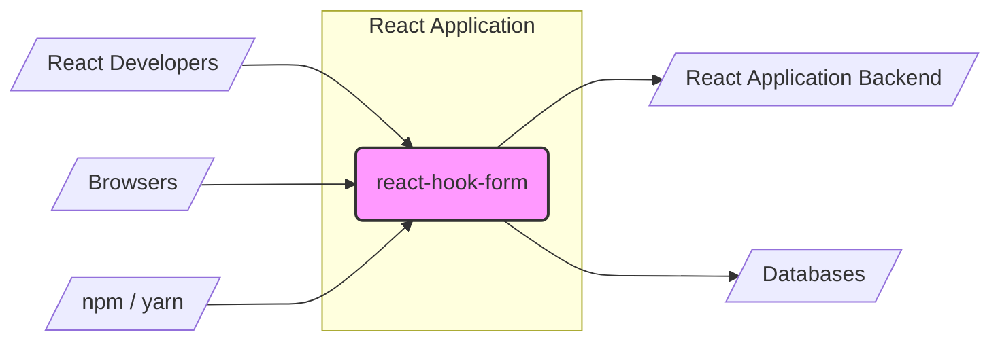
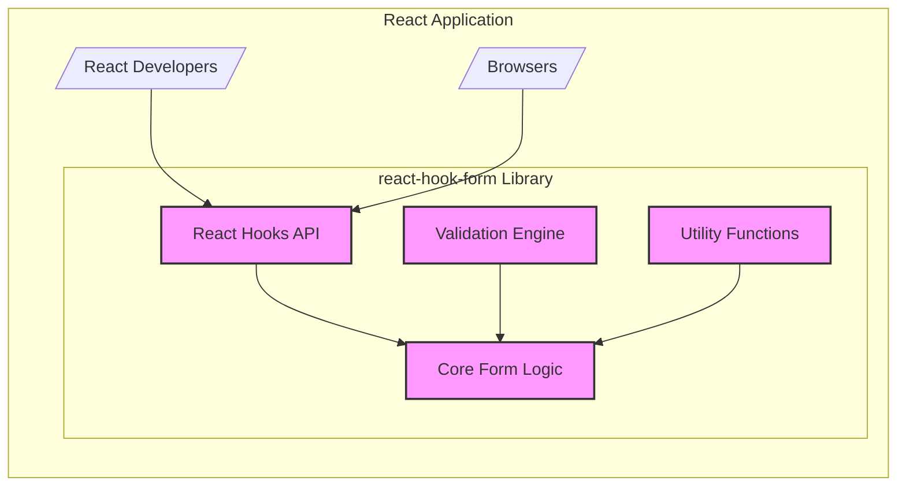
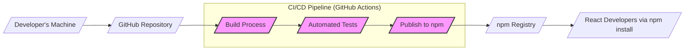
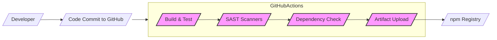

# BUSINESS POSTURE

This project, react-hook-form, is a library designed to simplify and optimize form handling in React applications.

- Business Priorities and Goals:
  - Provide a performant and developer-friendly way to manage forms in React.
  - Reduce boilerplate code associated with traditional React form handling.
  - Improve the user experience of web applications by ensuring efficient form interactions.
  - Achieve wide adoption within the React developer community as the go-to form library.

- Business Risks:
  - Security vulnerabilities in react-hook-form could be exploited in numerous applications using the library, leading to widespread data breaches or application malfunctions.
  - Poor performance or bugs could lead to negative developer perception and hinder adoption.
  - Lack of maintenance or community support could make the library unreliable and risky to use in production applications.
  - Legal and compliance risks if the library mishandles user data or introduces vulnerabilities that violate data protection regulations (e.g., GDPR, CCPA).

# SECURITY POSTURE

- Existing Security Controls:
  - security control: Open Source - The project is open source, allowing for community review and scrutiny of the codebase. Implemented in: GitHub repository.
  - security control: Community Contributions - Active community involvement in identifying and fixing bugs and potential security issues. Implemented in: GitHub community, pull requests, issue tracking.
  - security control: Unit Tests -  The project likely includes unit tests to ensure the functionality and robustness of the form handling logic. Implemented in: Project codebase, testing framework.
  - security control: TypeScript - Usage of TypeScript adds type safety, potentially reducing certain classes of errors and vulnerabilities. Implemented in: Project codebase, language choice.

- Accepted Risks:
  - accepted risk: Reliance on Community Security Audits - Security is primarily reliant on community review rather than dedicated security audits.
  - accepted risk: Dependency Vulnerabilities - Potential vulnerabilities in third-party dependencies used by react-hook-form.
  - accepted risk: Lack of Formal Security Training for Contributors - Contributors may not have formal security training, potentially leading to unintentional security flaws.

- Recommended Security Controls:
  - security control: Static Application Security Testing (SAST) - Implement automated SAST tools in the CI/CD pipeline to detect potential code-level vulnerabilities.
  - security control: Dependency Scanning - Integrate dependency scanning tools to monitor and alert on known vulnerabilities in project dependencies.
  - security control: Security Focused Code Reviews - Encourage security-focused code reviews, especially for critical components and contributions from new developers.
  - security control: Vulnerability Disclosure Policy - Establish a clear vulnerability disclosure policy to allow security researchers to report issues responsibly.
  - security control: Regular Security Audits - Consider periodic security audits by external security experts, especially before major releases or when significant new features are added.

- Security Requirements:
  - Authentication: Not applicable for a front-end form library. Authentication is handled by the backend application consuming data from forms.
  - Authorization: Not applicable for a front-end form library. Authorization is handled by the backend application based on the submitted form data and user context.
  - Input Validation:
    - security requirement: react-hook-form must provide robust and flexible input validation mechanisms to prevent injection attacks (e.g., XSS, SQL injection if form data is directly used in backend queries).
    - security requirement: Validation should be configurable and extensible to handle various data types and validation rules.
    - security requirement: Error messages should be clear and informative to guide developers in implementing secure validation.
  - Cryptography:
    - security requirement: While react-hook-form itself may not directly implement cryptography, it should not hinder or prevent developers from implementing encryption for sensitive data within forms if needed (e.g., using HTTPS for transmission, or client-side encryption before submission).
    - security requirement: If the library handles sensitive data internally (e.g., in memory), ensure secure handling and prevent unintended exposure.

# DESIGN

## C4 CONTEXT

### Context Diagram Elements

- Element:
  - Name: React Developers
  - Type: Person
  - Description: Developers who use react-hook-form to build forms in React applications.
  - Responsibilities: Integrate react-hook-form into their React applications, configure form validation, and handle form submission.
  - Security controls: Responsible for using react-hook-form securely, implementing proper validation rules, and handling sensitive data appropriately in their applications.

- Element:
  - Name: Browsers
  - Type: Software System
  - Description: Web browsers used by end-users to interact with React applications that utilize react-hook-form.
  - Responsibilities: Render React applications, execute JavaScript code including react-hook-form, and transmit form data to backend servers.
  - Security controls: Browser security features (e.g., Content Security Policy, Same-Origin Policy), user-controlled browser settings.

- Element:
  - Name: npm / yarn
  - Type: Software System
  - Description: Package managers used to distribute and install react-hook-form library.
  - Responsibilities: Host and distribute react-hook-form package, manage dependencies.
  - Security controls: Package registry security (e.g., npm registry security), package integrity checks during installation.

- Element:
  - Name: react-hook-form
  - Type: Software System
  - Description: React library for simplifying and optimizing form handling.
  - Responsibilities: Provide APIs and components for form state management, validation, and submission in React applications.
  - Security controls: Input validation mechanisms, secure coding practices in library development, dependency management.

- Element:
  - Name: React Application Backend
  - Type: Software System
  - Description: Backend server(s) that receive and process form data submitted from React applications using react-hook-form.
  - Responsibilities: Receive form data, perform backend validation, process data, and interact with databases or other systems.
  - Security controls: Backend authentication and authorization, input validation, secure data processing and storage, protection against injection attacks.

- Element:
  - Name: Databases
  - Type: Software System
  - Description: Databases used by the backend application to store data submitted through forms.
  - Responsibilities: Persist form data, provide data access to the backend application.
  - Security controls: Database access controls, encryption at rest and in transit, regular backups, vulnerability management.

## C4 CONTAINER

### Container Diagram Elements

- Element:
  - Name: Core Form Logic
  - Type: Container - Code Module
  - Description: Contains the core logic for managing form state, handling updates, and orchestrating validation.
  - Responsibilities: Form state management, event handling, validation orchestration, API for interacting with form state.
  - Security controls: Input sanitization within the core logic, secure state management to prevent unintended data leaks.

- Element:
  - Name: Validation Engine
  - Type: Container - Code Module
  - Description: Implements the validation logic, allowing developers to define validation rules and execute them against form inputs.
  - Responsibilities: Provide validation APIs, execute validation rules, generate validation error messages.
  - Security controls: Robust validation logic to prevent bypass, support for various validation types, protection against injection attacks through validation rules.

- Element:
  - Name: React Hooks API
  - Type: Container - React Hooks
  - Description: Provides React Hooks that developers use to integrate react-hook-form into their React components. Exposes the core functionality through a developer-friendly API.
  - Responsibilities: Expose form management functionalities as React Hooks, simplify integration with React components, handle React lifecycle events.
  - Security controls: Secure API design to prevent misuse, clear documentation on secure usage patterns.

- Element:
  - Name: Utility Functions
  - Type: Container - Code Module
  - Description: Collection of utility functions used across the library for tasks like data manipulation, error handling, and internal logic.
  - Responsibilities: Provide reusable utility functions, encapsulate common logic.
  - Security controls: Secure implementation of utility functions to avoid introducing vulnerabilities, input validation within utility functions where applicable.

## DEPLOYMENT

react-hook-form is a JavaScript library, and its deployment is primarily about making it available to developers for use in their React applications. The library itself doesn't have a deployment infrastructure in the traditional sense. It's published to package registries. The applications using it are then deployed in various ways.

Here we will describe the deployment of react-hook-form library to npm registry.

### Deployment Diagram Elements

- Element:
  - Name: Developer's Machine
  - Type: Infrastructure - Development Environment
  - Description: Developer's local machine where code changes are made and tested locally.
  - Responsibilities: Code development, local testing, committing and pushing code changes.
  - Security controls: Developer workstation security, code review before commit.

- Element:
  - Name: GitHub Repository
  - Type: Infrastructure - Code Repository
  - Description: Central repository hosting the react-hook-form source code, used for version control and collaboration.
  - Responsibilities: Source code management, version control, collaboration platform.
  - Security controls: Access controls, branch protection, audit logs, vulnerability scanning (GitHub Dependabot).

- Element:
  - Name: CI/CD Pipeline (GitHub Actions)
  - Type: Infrastructure - Automation Platform
  - Description: Automated pipeline for building, testing, and publishing the library.
  - Responsibilities: Automate build process, run tests, publish package to npm.
  - Security controls: Secure pipeline configuration, access control to pipeline secrets, build environment security.

- Element:
  - Name: Build Process
  - Type: Software - Build Script
  - Description: Script that compiles, bundles, and prepares the library for publishing.
  - Responsibilities: Code compilation, bundling, artifact creation.
  - Security controls: Secure build scripts, dependency integrity checks during build.

- Element:
  - Name: Automated Tests
  - Type: Software - Testing Framework
  - Description: Automated tests (unit, integration) to ensure code quality and functionality.
  - Responsibilities: Verify code functionality, detect regressions, improve code reliability.
  - Security controls: Security-focused test cases, regular test execution.

- Element:
  - Name: Publish to npm
  - Type: Software - Publishing Script
  - Description: Script that publishes the built library package to the npm registry.
  - Responsibilities: Package publishing, version management, distribution.
  - Security controls: Secure credentials management for npm publishing, package integrity checks before publishing, npm registry security policies.

- Element:
  - Name: npm Registry
  - Type: Infrastructure - Package Registry
  - Description: Public registry for JavaScript packages, used to distribute react-hook-form.
  - Responsibilities: Host and distribute npm packages, manage package versions, provide package download service.
  - Security controls: Registry security measures, malware scanning, package integrity checks, access controls.

- Element:
  - Name: React Developers via npm install
  - Type: Person - Software Developers
  - Description: Developers who download and install react-hook-form from npm to use in their projects.
  - Responsibilities: Integrate react-hook-form into their applications, manage dependencies.
  - Security controls: Dependency vulnerability scanning in their projects, using trusted package sources.

## BUILD

### Build Process Elements

- Element:
  - Name: Developer
  - Type: Person
  - Description: Software developer contributing to react-hook-form.
  - Responsibilities: Writing code, running local tests, committing code changes.
  - Security controls: Secure coding practices, code review participation.

- Element:
  - Name: Code Commit to GitHub
  - Type: Process
  - Description: Developer commits and pushes code changes to the GitHub repository.
  - Responsibilities: Version control, code contribution.
  - Security controls: Code review process, branch protection rules.

- Element:
  - Name: GitHub Actions CI
  - Type: Infrastructure - CI/CD Platform
  - Description: GitHub's built-in CI/CD service used to automate the build, test, and publish process.
  - Responsibilities: Automated build pipeline execution, workflow management.
  - Security controls: Secure workflow configuration, secret management, access controls.

- Element:
  - Name: Build & Test
  - Type: Process - Build Script
  - Description: Step in the CI pipeline that compiles the code, runs unit tests, and prepares artifacts.
  - Responsibilities: Code compilation, unit testing, artifact generation.
  - Security controls: Secure build environment, dependency integrity checks during build.

- Element:
  - Name: SAST Scanners
  - Type: Security Tool - Static Analysis
  - Description: Static Application Security Testing tools integrated into the CI pipeline to automatically scan code for potential vulnerabilities.
  - Responsibilities: Automated code vulnerability scanning, early detection of security flaws.
  - Security controls: Regularly updated scanner rules, configuration for relevant security checks.

- Element:
  - Name: Dependency Check
  - Type: Security Tool - Dependency Scanning
  - Description: Tool to scan project dependencies for known vulnerabilities.
  - Responsibilities: Identify vulnerable dependencies, alert on security risks from dependencies.
  - Security controls: Regularly updated vulnerability database, automated dependency scanning.

- Element:
  - Name: Artifact Upload
  - Type: Process - Artifact Management
  - Description: Step to upload the build artifacts (npm package) to a staging area or directly to the npm registry.
  - Responsibilities: Package artifact management, publishing preparation.
  - Security controls: Secure artifact storage, integrity checks before upload.

- Element:
  - Name: npm Registry
  - Type: Infrastructure - Package Registry
  - Description: Public registry where the react-hook-form package is published and distributed.
  - Responsibilities: Package hosting, distribution to developers.
  - Security controls: Registry security measures, malware scanning, package integrity checks.

# RISK ASSESSMENT

- Critical Business Processes:
  - Secure form data handling in web applications built using react-hook-form.
  - Maintaining developer trust and adoption of react-hook-form as a reliable and secure library.
  - Ensuring the integrity and availability of the react-hook-form package in the npm registry.

- Data to Protect and Sensitivity:
  - Source code of react-hook-form: Confidentiality and integrity are important to prevent unauthorized modifications or exposure of potential vulnerabilities. Sensitivity: Medium to High (depending on the impact of a breach).
  - npm package of react-hook-form: Integrity and availability are crucial to ensure developers can reliably use the library. Sensitivity: High (as compromised package can affect many applications).
  - User input data handled by forms in applications using react-hook-form: Sensitivity varies greatly depending on the application and the type of data collected (e.g., personal information, financial data, etc.). Sensitivity: Low to High (application dependent).

# QUESTIONS & ASSUMPTIONS

- Questions:
  - What is the risk appetite of the target audience for applications using react-hook-form (e.g., startups, Fortune 500 companies)? This will influence the required level of security rigor.
  - Are there specific compliance requirements (e.g., GDPR, HIPAA, PCI DSS) that applications using react-hook-form need to adhere to?
  - What types of data are typically handled by forms built with react-hook-form in the intended use cases? (e.g., mostly public data, or sensitive personal/financial data?)
  - Are there any known past security incidents or vulnerabilities related to react-hook-form or similar form libraries?

- Assumptions:
  - react-hook-form is primarily used in client-side React applications.
  - Security responsibility is shared between the react-hook-form library and the developers using it.
  - The primary security concern is preventing vulnerabilities in the library that could be exploited in applications using it, especially related to input validation and data handling.
  - The project aims for wide adoption and developer-friendliness, so security measures should be balanced with usability and performance.
  - The project relies on community contributions and open-source principles for security review and improvements.