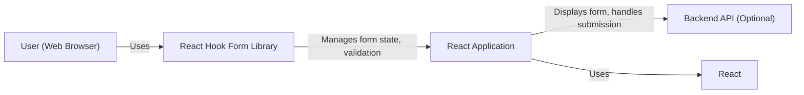
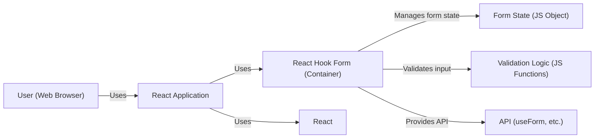
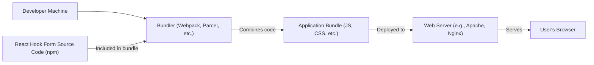
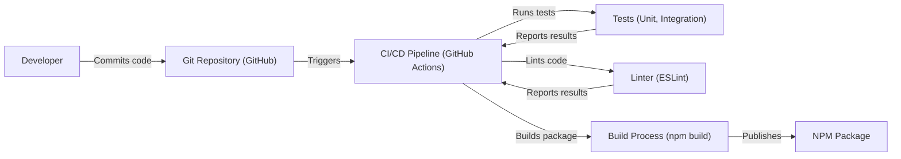

Okay, let's create a design document for the `react-hook-form` library, focusing on aspects relevant to threat modeling.

# BUSINESS POSTURE

Business Priorities and Goals:

*   Provide a performant and flexible form management solution for React developers.
*   Minimize the library's footprint to reduce impact on application bundle size.
*   Offer a developer-friendly API with good TypeScript support.
*   Maintain a high level of code quality and test coverage.
*   Ensure compatibility with a wide range of React versions and related tools.
*   Foster a strong community and provide good documentation.
*   Reduce boilerplate code required for form handling in React applications.

Most Important Business Risks:

*   Introduction of vulnerabilities (XSS, injection, etc.) that could compromise applications using the library.
*   Performance regressions that could negatively impact user experience.
*   Breaking changes that could disrupt existing applications.
*   Loss of community trust due to unaddressed security issues or poor maintenance.
*   Inability to keep up with changes in the React ecosystem.
*   Lack of adoption due to complexity or poor documentation.

# SECURITY POSTURE

Existing Security Controls:

*   security control: Input Validation: The library provides mechanisms for validating user input based on developer-defined rules (e.g., required fields, min/max length, patterns). Implemented in the core logic and exposed via the API.
*   security control: TypeScript Support: Strong typing helps prevent common errors and provides some level of protection against unexpected input types. Implemented throughout the codebase.
*   security control: Testing: Extensive test suite, including unit and integration tests, to catch regressions and potential vulnerabilities. Described in the repository's testing documentation and CI configuration.
*   security control: Code Reviews: All contributions are reviewed by maintainers before merging. Implemented through the GitHub pull request process.
*   security control: Dependency Management: Dependencies are carefully managed and monitored for updates and security vulnerabilities. Implemented using package.json and potentially tools like Dependabot.
*   security control: Sanitization: While the library itself doesn't directly handle rendering, it's designed to work with React's built-in XSS protection mechanisms. The library encourages safe handling of user input before rendering.
*   security control: Regular expression validation: The library uses regular expressions for validation.

Accepted Risks:

*   accepted risk: Reliance on React's Security: The library relies on React's built-in security features (e.g., XSS protection) for rendering user input. Any vulnerabilities in React itself could potentially impact applications using this library.
*   accepted risk: Third-Party Dependencies: While dependencies are managed, there's always a risk of vulnerabilities in third-party libraries.
*   accepted risk: Misconfiguration by Developers: The library provides tools for secure form handling, but it's ultimately the developer's responsibility to use them correctly. Incorrect configuration or misuse of the API could introduce vulnerabilities.
*   accepted risk: Regular expression denial of service (ReDoS): The library uses regular expressions, and poorly written regular expressions by developers can lead to ReDoS.

Recommended Security Controls:

*   security control: Content Security Policy (CSP) Guidance: Provide clear guidance in the documentation on how to configure CSP to mitigate XSS risks when using the library.
*   security control: Input Sanitization Recommendations: Offer specific recommendations and examples for sanitizing user input before storing or displaying it, even though the library doesn't directly handle rendering.
*   security control: Security Audits: Conduct regular security audits, both internal and external, to identify potential vulnerabilities.
*   security control: Vulnerability Disclosure Program: Establish a clear process for reporting and handling security vulnerabilities.

Security Requirements:

*   Authentication: Not directly applicable to the library itself, as it's a client-side form management tool. Authentication is the responsibility of the application using the library.
*   Authorization: Not directly applicable, similar to authentication. The library doesn't handle user roles or permissions.
*   Input Validation:
    *   All user-provided input MUST be validated against a defined schema.
    *   Validation rules MUST be configurable by the developer.
    *   The library SHOULD provide built-in validation rules for common data types and formats.
    *   Custom validation functions MUST be supported.
    *   Validation errors MUST be clearly communicated to the user.
*   Cryptography: Not directly applicable, as the library doesn't handle sensitive data encryption or storage. However, if developers use the library to collect sensitive data, they should use HTTPS and appropriate encryption mechanisms.
*   Regular expression:
    *   All regular expressions used for validation MUST be reviewed for potential ReDoS vulnerabilities.
    *   Developers SHOULD be encouraged to use well-tested and established regular expressions.
    *   The library SHOULD provide tools or documentation to help developers test their regular expressions for ReDoS vulnerabilities.

# DESIGN

## C4 CONTEXT

Element Descriptions:

*   Element:
    *   Name: User (Web Browser)
    *   Type: Person
    *   Description: The end-user interacting with the form.
    *   Responsibilities: Provides input data, submits the form.
    *   Security controls: Browser's built-in security features (e.g., same-origin policy, XSS protection).
*   Element:
    *   Name: React Hook Form Library
    *   Type: Software System
    *   Description: The library providing form management functionality.
    *   Responsibilities: Manages form state, handles validation, provides API for form interaction.
    *   Security controls: Input validation, TypeScript support, testing, code reviews, dependency management.
*   Element:
    *   Name: React Application
    *   Type: Software System
    *   Description: The React application that integrates the React Hook Form library.
    *   Responsibilities: Renders the form, handles form submission, interacts with the backend API (if applicable).
    *   Security controls: React's built-in XSS protection, application-specific security measures (e.g., authentication, authorization).
*   Element:
    *   Name: Backend API (Optional)
    *   Type: Software System
    *   Description: The backend API that receives form data (if applicable).
    *   Responsibilities: Processes form data, performs server-side validation, interacts with databases or other services.
    *   Security controls: API authentication, authorization, input validation, data sanitization, secure storage.
*   Element:
    *   Name: React
    *   Type: Software System
    *   Description: JavaScript library for building user interfaces.
    *   Responsibilities: Rendering UI.
    *   Security controls: React's built-in XSS protection.

## C4 CONTAINER

Element Descriptions:

*   Element:
    *   Name: User (Web Browser)
    *   Type: Person
    *   Description: The end-user interacting with the form.
    *   Responsibilities: Provides input data, submits the form.
    *   Security controls: Browser's built-in security features.
*   Element:
    *   Name: React Application
    *   Type: Software System
    *   Description: The React application that integrates the React Hook Form library.
    *   Responsibilities: Renders the form, handles form submission.
    *   Security controls: React's built-in XSS protection, application-specific security measures.
*   Element:
    *   Name: React Hook Form (Container)
    *   Type: Container (JavaScript Library)
    *   Description: The core container of the React Hook Form library.
    *   Responsibilities: Orchestrates form management, validation, and API exposure.
    *   Security controls: Input validation, TypeScript support, code reviews.
*   Element:
    *   Name: Form State (JS Object)
    *   Type: Container (Data)
    *   Description: In-memory representation of the form's state.
    *   Responsibilities: Stores form data, errors, and other relevant information.
    *   Security controls: Type checking (via TypeScript).
*   Element:
    *   Name: Validation Logic (JS Functions)
    *   Type: Container (Code)
    *   Description: Functions that perform input validation.
    *   Responsibilities: Executes validation rules, returns validation results.
    *   Security controls: Code reviews, testing, input sanitization (if applicable).
*   Element:
    *   Name: API (useForm, etc.)
    *   Type: Container (Interface)
    *   Description: The public API exposed by the library.
    *   Responsibilities: Provides methods for interacting with the form (e.g., registering inputs, handling submission, accessing state).
    *   Security controls: Type checking (via TypeScript), API design review.
*   Element:
    *   Name: React
    *   Type: Software System
    *   Description: JavaScript library for building user interfaces.
    *   Responsibilities: Rendering UI.
    *   Security controls: React's built-in XSS protection.

## DEPLOYMENT

Possible Deployment Solutions:

1.  Bundled with React Application: The most common scenario. The library is installed as an npm package and bundled with the React application using a bundler like Webpack, Parcel, or Rollup.
2.  Included via CDN: Less common, but possible. The library could be included directly in the HTML via a `<script>` tag pointing to a CDN.

Chosen Solution (Detailed Description): Bundled with React Application

Element Descriptions:

*   Element:
    *   Name: Developer Machine
    *   Type: Infrastructure Node
    *   Description: The developer's local machine where the code is written and built.
    *   Responsibilities: Code development, running build tools.
    *   Security controls: Local security measures (e.g., firewall, antivirus).
*   Element:
    *   Name: Bundler (Webpack, Parcel, etc.)
    *   Type: Software System
    *   Description: A tool that combines the application code and its dependencies into a single bundle.
    *   Responsibilities: Code bundling, optimization, minification.
    *   Security controls: Configuration to prevent inclusion of sensitive information in the bundle.
*   Element:
    *   Name: Application Bundle (JS, CSS, etc.)
    *   Type: Artifact
    *   Description: The final output of the build process, ready for deployment.
    *   Responsibilities: Contains the application code, including React Hook Form.
    *   Security controls: Code signing (optional), integrity checks (e.g., Subresource Integrity).
*   Element:
    *   Name: Web Server (e.g., Apache, Nginx)
    *   Type: Infrastructure Node
    *   Description: The server that hosts the application bundle.
    *   Responsibilities: Serves the application files to the user's browser.
    *   Security controls: Server-side security measures (e.g., firewall, intrusion detection).
*   Element:
    *   Name: User's Browser
    *   Type: Infrastructure Node
    *   Description: The user's web browser.
    *   Responsibilities: Executes the application code, renders the UI.
    *   Security controls: Browser's built-in security features.
*   Element:
    *   Name: React Hook Form Source Code (npm)
    *   Type: Software System
    *   Description: Source code of React Hook Form library.
    *   Responsibilities: Providing form management functionality.
    *   Security controls: Input validation, TypeScript support, testing, code reviews, dependency management.

## BUILD

Build Process Description:

1.  Developer commits code to the Git repository (GitHub).
2.  The commit triggers the CI/CD pipeline (GitHub Actions).
3.  The CI pipeline performs the following steps:
    *   Runs tests (unit and integration) to ensure code quality and prevent regressions.
    *   Lints the code using a linter (e.g., ESLint) to enforce coding standards and identify potential issues.
    *   Builds the package using the `npm build` command, which typically transpiles the code (e.g., using Babel) and creates a distributable package.
    *   Publishes the package to the npm registry.

Security Controls in Build Process:

*   security control: Automated Testing: Unit and integration tests are run automatically on every commit to catch bugs and vulnerabilities early.
*   security control: Code Linting: A linter is used to enforce coding standards and identify potential security issues (e.g., unused variables, potential injection points).
*   security control: Dependency Management: Dependencies are managed through npm and are checked for known vulnerabilities. Tools like Dependabot can be used to automate this process.
*   security control: CI/CD Pipeline: The build process is automated and reproducible, reducing the risk of manual errors.
*   security control: Code Reviews: All code changes are reviewed by maintainers before merging, providing an additional layer of security.

# RISK ASSESSMENT

Critical Business Processes to Protect:

*   Form submission and data handling within applications using the library.
*   User experience and application performance.
*   Reputation and trust of the library and its maintainers.

Data to Protect and Sensitivity:

*   The library itself doesn't directly handle or store sensitive data. However, it's used to *collect* user input, which *could* include sensitive data depending on the application. The sensitivity of the data depends entirely on the specific form and application.  Examples include:
    *   Personally Identifiable Information (PII): Names, addresses, email addresses, phone numbers (High sensitivity).
    *   Financial Information: Credit card numbers, bank account details (High sensitivity).
    *   Authentication Credentials: Usernames, passwords (High sensitivity).
    *   Health Information: Medical records, health conditions (High sensitivity).
    *   General User Input: Comments, feedback, preferences (Low to Medium sensitivity).

# QUESTIONS & ASSUMPTIONS

Questions:

*   Are there any specific compliance requirements (e.g., GDPR, CCPA) that need to be considered for applications using this library?
*   What is the expected threat model for typical applications using this library (e.g., public-facing web applications, internal enterprise applications)?
*   What level of security expertise is assumed for developers using this library?
*   Are there any plans to integrate with specific authentication or authorization systems?
*   What is the process for handling security vulnerabilities reported by external researchers?

Assumptions:

*   BUSINESS POSTURE: The primary goal is to provide a secure and reliable form management solution. Security is a high priority, but performance and developer experience are also important.
*   SECURITY POSTURE: Developers using the library have a basic understanding of web security principles. React's built-in security features are sufficient for basic XSS protection.
*   DESIGN: The library is primarily used in client-side React applications. The library does not directly interact with backend systems or databases. The build process is automated using GitHub Actions.