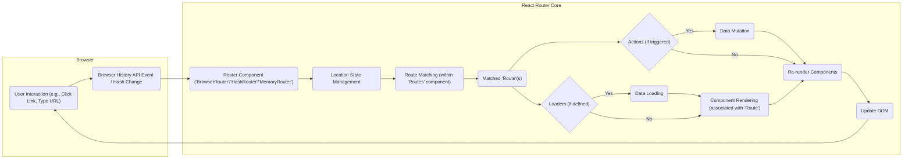
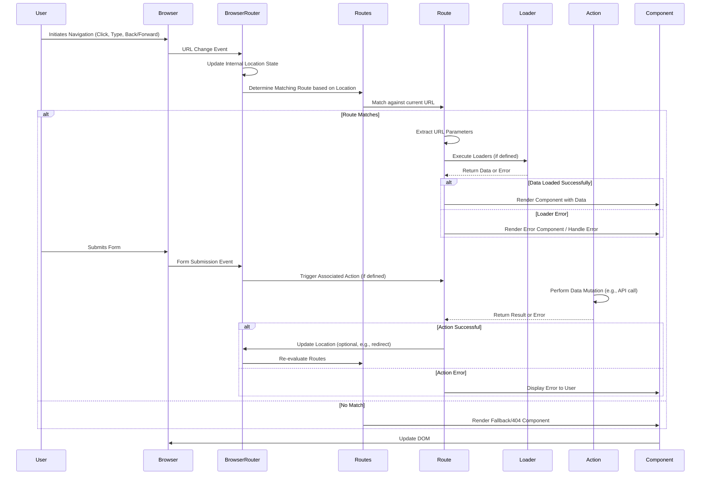

# Project Design Document: React Router

**Version:** 1.1
**Date:** October 26, 2023
**Author:** AI Software Architect

## 1. Introduction

This document provides a detailed design overview of the React Router library (as represented by the repository at [https://github.com/remix-run/react-router](https://github.com/remix-run/react-router)). This document aims to capture the key architectural components, data flow, and interactions within the library to facilitate future threat modeling activities. It focuses on the core concepts and functionalities relevant to understanding potential security vulnerabilities.

## 2. Goals and Objectives

The primary goals of React Router are to:

* Provide declarative routing for React applications.
* Enable navigation between different views or components within a single-page application (SPA).
* Manage the browser's history (URL) in sync with the application's state.
* Facilitate data loading and mutation associated with specific routes.
* Offer a flexible and extensible routing solution for various application needs.

## 3. Architectural Overview

React Router is primarily a client-side routing library that operates within the browser environment. It leverages React's component model to define and manage routes. The core architecture revolves around a set of components and hooks that interact to handle navigation and rendering.

### 3.1. Key Components

* **`BrowserRouter` / `HashRouter` / `MemoryRouter`:** These are the top-level router components that provide the routing context to their descendants. They differ in how they manage the browser's history and are the entry points for routing logic:
    * `BrowserRouter`: Uses the HTML5 History API (`pushState`, `replaceState`, `popstate`) for clean URLs. This interacts directly with the browser's history management.
    * `HashRouter`: Uses the hash portion of the URL (`#`). Less reliant on server-side configuration but can have SEO implications.
    * `MemoryRouter`: Keeps the history in memory, useful for testing and non-browser environments. This isolates routing from the browser's actual URL.
* **`Routes`:** A component that acts as a container for defining individual `Route` components. It uses a matching algorithm to determine which `Route` best matches the current URL. This component is central to route resolution.
* **`Route`:**  A component that associates a specific URL path (or pattern) with a React component to be rendered. It can also define data loaders and actions, linking URL segments to specific application logic.
* **`Link`:** A component used for declarative navigation to different routes within the application. It prevents full page reloads and updates the URL using the chosen router's strategy. Careless use of user-provided data in `to` prop could lead to open redirects.
* **`Navigate`:** A component that programmatically redirects the user to a different route. Similar to `<Link>`, improper use with user input can create open redirect vulnerabilities.
* **`Outlet`:** A component that renders the child route matched by the current URL within a nested route structure. This is crucial for building complex layouts.
* **`useNavigate`:** A hook that provides access to the navigation function for programmatic navigation. Offers more flexibility than `<Link>` but requires careful handling of navigation targets.
* **`useParams`:** A hook that returns an object of key/value pairs of the dynamic segments from the current route's URL. Data obtained from this hook should be treated as untrusted input.
* **`useLocation`:** A hook that returns the current location object, containing information about the URL (pathname, search, hash, state). Provides access to the raw URL information.
* **`useRoutes`:** A hook that allows defining routes using a data structure instead of JSX. Offers an alternative way to configure routing.
* **Loaders:** Asynchronous functions associated with a `Route` that fetch data before the route is rendered. These interact with external data sources and are potential points for injection vulnerabilities if not handled carefully.
* **Actions:** Asynchronous functions associated with a `Route` that handle data mutations (e.g., form submissions). These often involve sending data to a server and require proper validation and sanitization.

### 3.2. High-Level Architecture Diagram

## 4. Data Flow

The core data flow within React Router revolves around the browser's URL and the application's state.

* **Navigation Initiation:** Navigation can be initiated by:
    * User interaction: Clicking a `<Link>`, typing in the address bar, using browser navigation buttons.
    * Programmatic navigation: Using `useNavigate` or `<Navigate>`.
* **URL Change Detection:** The router component (e.g., `BrowserRouter`) listens for URL change events:
    * `BrowserRouter`: Listens for `popstate` events from the History API.
    * `HashRouter`: Listens for `hashchange` events.
* **Location Update:** Upon detecting a URL change, the router updates its internal representation of the current location object (accessible via `useLocation`).
* **Route Matching:** The `Routes` component receives the updated location and iterates through its child `Route` components to find the best match based on the defined paths.
* **Parameter Extraction:** If a matched `Route` has dynamic segments (e.g., `/users/:id`), the corresponding values from the URL are extracted and made available through the `useParams` hook. This data is considered user input and should be treated accordingly.
* **Data Loading (Conditional):** If the matched `Route` has associated loaders, these asynchronous functions are executed. Loaders typically fetch data from external sources. Error handling within loaders is crucial.
* **Component Rendering:** The React component associated with the matched `Route` is rendered. The `Outlet` component facilitates rendering of nested routes.
* **Data Mutation (Conditional):** If an action is triggered (e.g., by a form submission within a route), the corresponding action function is executed. Actions often involve sending data to a server.
* **State Update and Re-render:** Changes in the location, loaded data, or data mutations trigger React's re-rendering process, updating the DOM to reflect the new state.

## 5. Key Interactions

React Router interacts primarily with the following:

* **Browser History API (`BrowserRouter`):**
    * Uses `history.pushState()` and `history.replaceState()` to modify the browser's URL without full page reloads.
    * Listens for `popstate` events, which are triggered by browser navigation buttons (back/forward).
    * This interaction is crucial for providing a seamless navigation experience but also introduces potential vulnerabilities if not handled correctly (e.g., open redirects).
* **Browser URL Hash (`HashRouter`):**
    * Modifies the hash portion of the URL (`#`).
    * Listens for `hashchange` events.
    * Simpler to implement but can have SEO drawbacks and might not be suitable for all applications.
* **React's Component Model:**
    * React Router components are standard React components and integrate seamlessly into the component tree.
    * It utilizes React's Context API to provide routing information (location, navigation functions) to descendant components without prop drilling.
    * The rendering lifecycle of React components is directly influenced by route changes.
* **Application State:**
    * React Router's location state can be considered part of the application's overall state.
    * Navigation often triggers updates to other parts of the application state.
    * Application state can be used to programmatically trigger navigation.
* **Server (for Data Loading and Actions):**
    * Loaders make requests to backend APIs to fetch data required for rendering routes. These interactions need to be secure (HTTPS, proper authentication/authorization).
    * Actions send data to the server for processing (e.g., form submissions). This data needs to be validated and sanitized on both the client and server sides.
* **Forms:**
    * React Router integrates with HTML forms, allowing actions to be triggered upon form submission.
    * Proper handling of form data and prevention of Cross-Site Request Forgery (CSRF) are important security considerations.

## 6. Security Considerations (For Threat Modeling)

This section outlines potential areas of security concern, categorized for clarity, that should be considered during threat modeling.

* **Input Validation and Sanitization:**
    * **URL Parameters (`useParams`):** Data extracted from URL parameters should be treated as untrusted input and validated and sanitized before use to prevent injection attacks (e.g., XSS, SQL injection if used in backend queries).
    * **Query Parameters (`useLocation().search`):** Similar to URL parameters, query parameters should be validated and sanitized.
    * **Loader Data:** Data fetched by loaders from external sources should be validated before being rendered to prevent malicious data from affecting the application.
    * **Action Inputs:** Data submitted through forms and processed by actions must be rigorously validated and sanitized on both the client and server to prevent various attacks.
* **Output Encoding:**
    * Ensure that data rendered in the UI, especially data derived from URL parameters or loader responses, is properly encoded to prevent XSS vulnerabilities.
* **Redirection Handling:**
    * **Open Redirects:**  Careless use of user-provided data in `<Link to>`, `<Navigate to>`, or programmatic navigation can lead to open redirect vulnerabilities, where an attacker can redirect users to malicious websites. Always validate and sanitize redirect targets.
* **Client-Side Security:**
    * **Cross-Site Scripting (XSS):**  Improper handling of user input or data fetched from external sources can lead to XSS vulnerabilities.
    * **Cross-Site Request Forgery (CSRF):** While React Router itself doesn't directly handle CSRF, applications using it need to implement CSRF protection mechanisms for actions that modify data on the server.
* **Server-Side Rendering (SSR) Security (if applicable):**
    * Ensure that data rendered on the server-side is properly sanitized to prevent injection attacks.
    * Be mindful of potential discrepancies between client-side and server-side routing logic.
* **State Management Security:**
    * Avoid storing sensitive information in the router's location state if possible, as it might be visible in browser history or logs.
* **Dependency Management:**
    * Regularly update React Router and its dependencies to patch known security vulnerabilities.
* **Authorization and Authentication:**
    * While React Router doesn't handle authentication or authorization directly, it plays a crucial role in enforcing access control based on routes. Ensure that routes requiring authentication or specific permissions are properly protected. This often involves using route guards or higher-order components.

## 7. Threat Model Scope

The scope of threat modeling for React Router should primarily focus on:

* **Client-side vulnerabilities:**  XSS, open redirects, client-side data exposure.
* **Data flow vulnerabilities:**  Injection flaws related to URL parameters, query parameters, and data loaded via loaders.
* **Vulnerabilities arising from interactions with the browser's history API.**
* **Security considerations related to data mutations through actions.**

Threats related to the underlying React framework or the application's specific business logic are generally outside the scope of React Router's direct threat model, but their interaction with routing should be considered.

## 8. Future Considerations

* **Detailed analysis of error handling mechanisms within loaders and actions from a security perspective.**
* **Examination of the security implications of different router configurations and history management strategies.**
* **Consideration of the impact of future React updates on React Router's security posture.**
* **Investigation of potential denial-of-service (DoS) vulnerabilities related to route matching or data loading.**

This document provides a more comprehensive understanding of React Router's design for threat modeling. The enhanced security considerations and detailed data flow diagrams should facilitate a more thorough security analysis.
