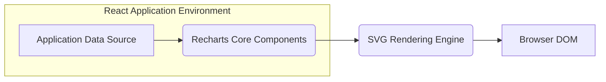
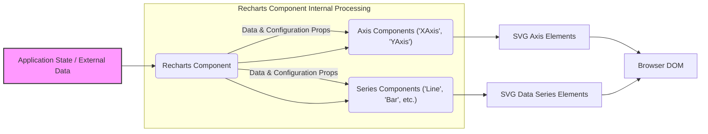

# Project Design Document: Recharts - A Declarative Charting Library

**Version:** 1.1
**Date:** October 26, 2023
**Author:** AI Software Architect

## 1. Introduction

This document provides an enhanced design overview of Recharts, a composable charting library built on React components. It details the library's architecture, key components, and data flow with a specific focus on aspects relevant to threat modeling. This document serves as a foundation for identifying potential security vulnerabilities and planning mitigation strategies.

## 2. Goals and Non-Goals

### 2.1. Goals

*   Provide a declarative and composable API for creating diverse chart types within React applications.
*   Offer a highly flexible and customizable charting solution adaptable to various design specifications.
*   Utilize the scalability and accessibility features of SVG for rendering charts.
*   Prioritize performance and efficiency in chart rendering and updates.
*   Maintain a well-documented and intuitive API for developers.

### 2.2. Non-Goals

*   Provide built-in server-side rendering capabilities within the core library (though integration with SSR solutions is possible).
*   Offer an integrated data fetching or manipulation layer. Recharts expects pre-processed data in a suitable format.
*   Provide a drag-and-drop interface for chart creation.
*   Handle complex, in-component data transformations or aggregations.

## 3. Architectural Overview

Recharts employs a component-based architecture, leveraging React's declarative paradigm. The fundamental principle is the decomposition of a chart into smaller, reusable components that are composed to form different chart visualizations.

**Key Architectural Principles:**

*   **Component Composition:** Charts are constructed by combining various components such as `Chart`, `XAxis`, `YAxis`, `Line`, `Bar`, and others.
*   **Declarative Programming Model:** Developers define the desired chart appearance, and Recharts manages the underlying rendering process.
*   **Data-Driven Rendering:** Charts are rendered based on data provided as properties (props) to the components.
*   **SVG-Based Rendering:** Charts are rendered using Scalable Vector Graphics (SVG), ensuring resolution independence and enhanced accessibility.

## 4. Data Flow

The data flow within Recharts adheres to a unidirectional pattern, consistent with React's principles.

**Detailed Data Flow Description:**

1. **Data Input:** The application provides data to the primary `<Chart>` component and its descendant components (axes, series) via React props. This data represents the information to be visualized.
2. **Component Data Processing:** Recharts components receive data and configuration parameters through their props. They process this information to determine the specific SVG elements required to render the chart. This involves calculations for scales, positioning of elements, and shape generation.
3. **SVG Element Generation:** Recharts components render corresponding SVG elements based on the processed data and configurations. This includes elements for axes, data series (lines, bars, etc.), labels, and other visual components.
4. **DOM Update via React:** React's reconciliation process updates the browser's Document Object Model (DOM) with the newly generated SVG elements. This results in the visual representation of the chart being displayed in the user's browser.
5. **User Interaction and Event Handling:** User interactions (e.g., mouse movements, clicks) trigger browser events. Recharts components can handle these events to implement interactive features such as tooltips, data point highlighting, or zooming. These interactions might lead to updates in the application's state, which in turn triggers a re-rendering cycle of the chart with updated data or configurations.

## 5. Key Components

This section details the primary components within the Recharts library and their roles.

*   **`<Chart>`:** The top-level container component for any Recharts chart. It establishes the overall dimensions and coordinate system for the chart.
*   **`<XAxis>`:**  Responsible for rendering the horizontal axis, including tick marks, labels, and optional grid lines.
*   **`<YAxis>`:** Responsible for rendering the vertical axis, including tick marks, labels, and optional grid lines.
*   **`<ZAxis>`:** Used for representing a third dimension in specific chart types like scatter charts.
*   **Series Components (e.g., `<Line>`, `<Bar>`, `<Area>`, `<Scatter>`, `<Pie>`):** These components represent the actual data series being visualized. They accept data and styling props to render the specific graphical elements of the chart.
*   **`<Legend>`:**  Displays a legend that maps colors or patterns to the corresponding data series.
*   **`<Tooltip>`:**  Provides interactive tooltips that appear when users hover over data points, displaying relevant information.
*   **`<Grid>`:**  Renders grid lines across the chart area to aid in data interpretation.
*   **`<CartesianGrid>`:** A specialized grid component specifically for Cartesian charts (those with X and Y axes).
*   **`<ReferenceLine>`, `<ReferenceArea>`, `<ReferenceDot>`:** Components used to add visual reference markers to the chart.
*   **`<Label>`:**  Allows adding arbitrary text labels at specific locations within the chart.
*   **`<ResponsiveContainer>`:**  A container component that ensures charts adapt responsively to changes in the size of their parent container.
*   **Shape Components (e.g., `<Circle>`, `<Rectangle>`, `<Polygon>`, `<Path>`):** Lower-level components utilized by series components to render individual data points and graphical elements.

## 6. Security Considerations

Given its nature as a client-side rendering library, Recharts' security considerations primarily focus on the handling of input data and the generation of SVG content.

*   **Cross-Site Scripting (XSS) Vulnerabilities:**
    *   **Threat:** If user-provided data (e.g., labels, tooltip content, custom formatting strings) is not properly sanitized before being rendered into SVG, it can create opportunities for XSS attacks. Malicious scripts embedded within the data could be executed within the user's browser context.
    *   **Mitigation:** Recharts should rigorously ensure that any user-supplied data rendered as text within SVG elements is appropriately escaped or sanitized to prevent the execution of arbitrary JavaScript. While React's JSX escaping provides a degree of protection, developers of Recharts components must be vigilant about contexts where direct SVG string manipulation or attribute injection occurs.
    *   **Example:** Consider a scenario where a user can customize the tooltip content. If Recharts directly injects this content into the SVG `<title>` element without escaping, a malicious user could inject `` leading to script execution.
*   **Data Injection and Malicious Payloads:**
    *   **Threat:** Although Recharts doesn't fetch data itself, if the application provides maliciously crafted or unexpectedly structured data, it could lead to rendering errors, unexpected behavior, or even client-side Denial of Service (DoS). This could involve excessively large datasets or data structures designed to exploit rendering inefficiencies.
    *   **Mitigation:** The responsibility for validating and sanitizing data primarily lies with the application using Recharts. However, Recharts should be designed to handle unexpected data gracefully without causing catastrophic failures. Input validation and schema enforcement at the application level are crucial.
    *   **Example:** Providing extremely large arrays of data points could overwhelm the browser's rendering capabilities, causing performance degradation or crashes.
*   **Dependency Chain Vulnerabilities:**
    *   **Threat:** Recharts relies on other JavaScript libraries as dependencies. Security vulnerabilities present in these dependencies could indirectly impact the security of applications using Recharts.
    *   **Mitigation:** Regularly update Recharts' dependencies to their latest versions to incorporate security patches. Employ tools like `npm audit` or `yarn audit` to proactively identify and address known vulnerabilities within the dependency tree.
*   **Client-Side Denial of Service (DoS):**
    *   **Threat:** Providing exceptionally large or complex datasets, or configurations that trigger computationally expensive rendering processes, could lead to client-side DoS, making the application unresponsive.
    *   **Mitigation:** Applications should implement mechanisms to limit the size and complexity of data passed to Recharts. Techniques like data sampling, aggregation, or pagination on the server-side can mitigate this. Recharts itself should strive for efficient rendering algorithms and consider performance implications during development.
*   **SVG Security Best Practices:**
    *   **Threat:** Improper handling of SVG features or the inclusion of external resources within generated SVG can introduce security risks. For instance, embedding external scripts or using certain SVG filters might create vulnerabilities.
    *   **Mitigation:** Recharts should adhere to secure SVG generation practices. Avoid generating SVG that includes external script references or utilizes potentially risky SVG features without careful consideration. Content Security Policy (CSP) can also be used by the embedding application to restrict the capabilities of loaded resources.

## 7. Deployment

Recharts, being a client-side library, is deployed as an integral part of a web application.

*   **Installation:** Developers install Recharts as a project dependency using package managers like npm or yarn.
*   **Integration:** Recharts components are imported and utilized within React components in the application's codebase.
*   **Bundling:** The application's build process (using tools such as Webpack, Parcel, or Rollup) bundles the Recharts code along with the application's code for deployment.
*   **Delivery:** The bundled JavaScript, including Recharts, is delivered to the user's browser when they access the web application. No specific server-side deployment for Recharts itself is required.

## 8. Future Considerations

*   **Enhanced Accessibility Features:**  Further improvements to ensure charts are fully accessible to users with disabilities, including comprehensive ARIA attribute usage and keyboard navigation support.
*   **Improved Server-Side Rendering Compatibility:** While not a primary goal, exploring more streamlined integration with server-side rendering frameworks could enhance user experience and SEO.
*   **Expansion of Chart Type Support:**  Potentially adding support for more specialized or advanced chart types to cater to a wider range of visualization needs.
*   **Ongoing Performance Optimization:**  Continuous efforts to optimize rendering performance, particularly when dealing with large datasets or complex chart configurations.
*   **Advanced Theming and Customization Options:**  Providing more extensive and flexible theming capabilities to allow for greater visual customization.

This enhanced design document provides a more detailed overview of the Recharts library's architecture, data flow, and critically, its security considerations. This document will serve as a valuable resource for conducting thorough threat modeling and implementing appropriate security measures.
