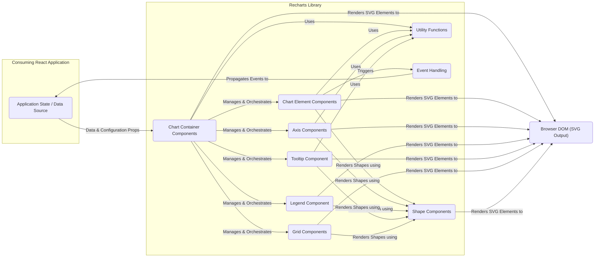
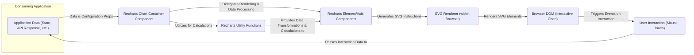

# Project Design Document: Recharts - A Composable Charting Library

**Version:** 1.1
**Date:** October 26, 2023
**Author:** AI Software Architect

## 1. Introduction

This document provides an enhanced and more detailed design overview of the Recharts project, a composable charting library built on React. This revised document aims to provide a more granular understanding of the system's architecture, components, and data flow, specifically tailored for effective threat modeling. It highlights potential attack surfaces and trust boundaries within the system.

## 2. Project Overview

Recharts is a widely adopted open-source library enabling developers to create declarative data visualizations within React applications. Its strength lies in its composable nature, allowing developers to assemble customized charts from a set of reusable components. The library leverages Scalable Vector Graphics (SVG) for rendering, offering resolution independence and styling flexibility.

**Key Features:**

*   Declarative API using React components for defining chart structure and appearance.
*   Composable architecture allowing for flexible chart creation by combining various components.
*   Comprehensive support for common chart types including line, bar, area, pie, scatter, and more.
*   Extensive customization options for visual styling and interactive behaviors.
*   Responsive design capabilities, adapting charts to different screen sizes.
*   Performance-focused rendering using SVG.
*   Active community and ongoing development.

## 3. System Architecture

Recharts operates entirely within the client-side environment of a web browser, within the context of a consuming React application. It does not involve any direct server-side processing or persistent data storage. The core function of Recharts is to transform data, provided by the embedding application, into visual representations rendered as SVG elements within the Document Object Model (DOM).

**3.1. Key Components:**

*   **Chart Container Components:** These are the primary entry points for defining a chart, such as `<LineChart>`, `<BarChart>`, `<PieChart>`, and `<ScatterChart>`. They establish the overall chart type and manage the layout of sub-components.
*   **Chart Element Components:** These represent the visual building blocks of a chart, including `<Line>`, `<Bar>`, `<Area>`, `<Scatter>`, `<Cell>` (for individual pie slices or bar segments), etc. They are responsible for rendering the actual data points.
*   **Axis Components:** Components like `<XAxis>`, `<YAxis>`, and `<ZAxis>` (for 3D scatter plots) handle the rendering of chart axes, including tick marks, labels, and axis lines.
*   **Legend Component:** The `<Legend>` component displays a key that maps visual elements (colors, shapes) to data series.
*   **Tooltip Component:** The `<Tooltip>` component provides interactive information popups when users hover over or interact with data points. It can display data values and other contextual information.
*   **Grid Components:** Components such as `<CartesianGrid>` and `<PolarGrid>` render background grid lines to improve data readability.
*   **Shape Components:** Reusable, low-level SVG shape components (e.g., `<Path>`, `<Rect>`, `<Circle>`) used internally by other components for drawing.
*   **Utility Functions:** A collection of helper functions for tasks such as data scaling, calculation of axis ticks, color generation, and other data processing operations.
*   **Event Handling Mechanisms:** Recharts provides mechanisms for handling user interactions with chart elements, such as `onClick`, `onMouseOver`, and `onMouseMove`. These events can trigger actions within the consuming application.

**3.2. Architectural Diagram:**

**3.3. Component Interaction and Trust Boundaries:**

The consuming React application holds the responsibility for providing data and configuration to the Recharts library. There's a trust boundary between the application's data and the Recharts library. Recharts trusts that the data it receives is in the expected format. The chart container components act as orchestrators, receiving props from the application and delegating rendering tasks to the various element, axis, and supporting components. Event handling within Recharts allows user interactions with the rendered chart to trigger callbacks within the consuming application, creating another interaction point.

## 4. Data Flow

The data flow in Recharts is primarily unidirectional, starting from the consuming application and moving through the Recharts components to the final SVG rendering in the browser.

**4.1. Data Input Sources:**

*   **Application State:** The most common source of data is the consuming application's state management (e.g., using React's `useState`, Redux, Zustand).
*   **Props Passed to Chart Components:** Data is passed to Recharts components as props, typically as an array of JavaScript objects.
*   **Configuration Props:**  Various configuration options, such as axis labels, colors, data keys, and chart types, are also passed as props.

**4.2. Data Processing within Recharts:**

*   **Data Mapping and Transformation:** Recharts components internally map the provided data to the visual elements they render. Utility functions handle data transformations, such as scaling values to fit the chart dimensions.
*   **Calculation of Visual Attributes:** Based on the data and configuration, Recharts calculates the position, size, color, and other visual attributes of the SVG elements.
*   **Event Handling Logic:** Recharts implements logic to detect user interactions with chart elements and trigger corresponding events.

**4.3. Rendering Process:**

*   **React's Reconciliation:** Recharts leverages React's rendering process to efficiently update the DOM. When data or props change, React re-renders the necessary components.
*   **SVG Element Creation:** Chart element components render specific SVG shapes (e.g., `<path>`, `<rect>`, `<circle>`, `<text>`) based on the processed data.
*   **Dynamic Styling:**  Styling of SVG elements can be controlled through props and CSS, allowing for customization of the chart's appearance.

**4.4. Data Flow Diagram (Detailed):**

## 5. Security Considerations and Potential Threats

As a client-side library, the primary security concerns for Recharts revolve around the data it receives from the consuming application and the potential for Cross-Site Scripting (XSS) vulnerabilities.

**5.1. Potential Security Threats:**

*   **Cross-Site Scripting (XSS):**
    *   **Threat:** If the data provided to Recharts contains malicious scripts, these scripts could be rendered within the SVG output, leading to XSS attacks. This is a significant concern if the application displays user-generated content within charts without proper sanitization.
    *   **Attack Vector:** Malicious data injected into the application's data sources or through URL parameters that are then used to populate chart data.
    *   **Mitigation Responsibility:** Primarily the responsibility of the consuming application to sanitize all user-provided or untrusted data before passing it to Recharts. Recharts itself does not perform input sanitization. Implementing a robust Content Security Policy (CSP) can also help mitigate the impact of XSS.
*   **Dependency Vulnerabilities:**
    *   **Threat:** Recharts relies on other JavaScript libraries (dependencies). Vulnerabilities in these dependencies could potentially be exploited in the consuming application.
    *   **Attack Vector:** Exploiting known vulnerabilities in transitive dependencies.
    *   **Mitigation Responsibility:** Regularly update Recharts and its dependencies to the latest versions to patch known vulnerabilities. Utilize dependency scanning tools to identify and address vulnerabilities.
*   **Data Sensitivity Exposure:**
    *   **Threat:** While Recharts doesn't store data, the data visualized might be sensitive. If the application doesn't implement proper access controls or uses insecure communication channels (HTTP instead of HTTPS), sensitive data displayed in charts could be exposed.
    *   **Attack Vector:** Man-in-the-middle attacks intercepting network traffic, unauthorized access to the application's data sources.
    *   **Mitigation Responsibility:** The consuming application must ensure secure data handling practices, including using HTTPS, implementing authentication and authorization, and protecting access to sensitive data sources.
*   **Client-Side Data Manipulation:**
    *   **Threat:** Since the charts are rendered client-side, technically savvy users can inspect and potentially manipulate the data and the rendered SVG in their browser's developer tools. This could lead to misrepresentation of data.
    *   **Attack Vector:** Direct manipulation of the DOM or network requests.
    *   **Mitigation Responsibility:** This is an inherent limitation of client-side rendering. For highly sensitive data where integrity is paramount, server-side rendering or more robust data validation and integrity checks might be necessary. Recharts itself cannot prevent this.
*   **Denial of Service (DoS) - Client-Side:**
    *   **Threat:** Providing excessively large or complex datasets to Recharts could lead to performance issues, making the application unresponsive or even crashing the user's browser.
    *   **Attack Vector:** Intentionally providing large datasets through API calls or other input methods.
    *   **Mitigation Responsibility:** The consuming application should implement data validation and limits on the size and complexity of data passed to Recharts. Consider techniques like data aggregation or pagination for large datasets.

**5.2. Security Best Practices for Consumers:**

*   **Strict Input Sanitization:** Sanitize all data received from untrusted sources before passing it to Recharts components to prevent XSS.
*   **Implement Content Security Policy (CSP):** Configure a strong CSP to limit the sources from which the browser can load resources, mitigating the impact of potential XSS vulnerabilities.
*   **Regular Dependency Updates:** Keep Recharts and its dependencies up-to-date to patch known security vulnerabilities.
*   **Ensure Secure Context (HTTPS):** Serve the application using Recharts over HTTPS to protect data in transit.
*   **Data Validation and Limits:** Implement validation on data inputs to prevent excessively large or malformed datasets from being processed by Recharts.
*   **Consider Server-Side Rendering for Sensitive Data:** If data integrity and preventing client-side manipulation are critical, explore server-side rendering options for the charts.

## 6. Assumptions and Constraints

*   Recharts operates exclusively within the client-side environment of a web browser.
*   It is tightly coupled with the React library and relies on its component model and rendering mechanisms.
*   The data visualized by Recharts is provided by the consuming React application.
*   Recharts does not handle data fetching from external sources or persistent data storage.
*   The primary output format of Recharts is SVG markup rendered within the browser's DOM.
*   Security regarding data sanitization and secure data handling is primarily the responsibility of the consuming application.

## 7. Future Considerations

*   Enhanced accessibility features and better ARIA attribute support for improved inclusivity.
*   Performance optimizations for handling very large datasets more efficiently.
*   Exploring advanced chart types and customization options.
*   Potential for server-side rendering capabilities to enhance SEO and initial load performance.

This detailed design document provides a more comprehensive understanding of the Recharts project's architecture, data flow, and security considerations. This information is essential for conducting a thorough threat model to identify potential vulnerabilities and implement appropriate security measures in applications utilizing the Recharts library.