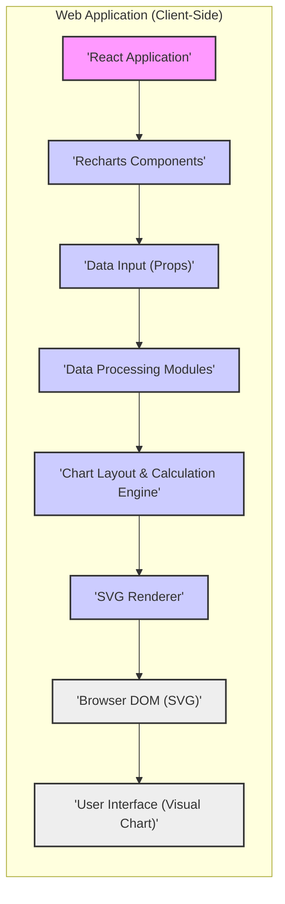

## Project Design Document: Recharts - A Composable Charting Library (Improved)

**1. Project Overview**

*   **Project Name:** Recharts
*   **Project Repository:** [https://github.com/recharts/recharts](https://github.com/recharts/recharts)
*   **Project Description:** Recharts is a highly composable and customizable charting library for React applications. It empowers developers to create diverse and interactive data visualizations using React components. Recharts is designed for client-side rendering, leveraging the power of SVG to produce visually rich and scalable charts directly within the browser.
*   **Primary Goal:** To provide a robust, flexible, and developer-friendly React charting library that simplifies the integration of sophisticated data visualizations into web applications. Key objectives include:
    *   **Ease of Use:**  Intuitive API and component structure for rapid chart creation.
    *   **Customizability:** Extensive options for styling, theming, and extending chart components.
    *   **Performance:** Efficient client-side rendering for smooth user experiences.
    *   **Composability:**  Modular component design allowing for complex chart structures to be built from smaller, reusable parts.
*   **Target Audience:** Web developers and frontend engineers using React who require a powerful and adaptable charting solution for their data visualization needs. This includes developers building dashboards, data analysis tools, reporting interfaces, and data-driven web applications.

**2. System Architecture**

Recharts adopts a client-centric architecture, operating entirely within the user's web browser. It is structured around React components that orchestrate data processing and SVG rendering to display charts.



**Architecture Components (Detailed):**

*   **React Application:** The encompassing React application that utilizes Recharts. It is responsible for:
    *   **Data Fetching/Generation:** Obtaining or creating the dataset to be visualized. This data could come from APIs, local storage, or be generated dynamically.
    *   **Component Integration:** Importing and embedding Recharts components within its JSX structure to define the chart.
    *   **State Management:** Managing application state, including data updates, user interactions, and chart configurations, which are passed down as props to Recharts components.
    *   **Event Handling:** Implementing custom event handlers for chart interactions (e.g., click events on chart elements) to trigger application-specific logic.
*   **Recharts Components:** The library's core, offering a rich set of React components for chart construction. Examples include:
    *   **Container Components:**
        *   `Chart`: The root component, establishing the chart's overall container and dimensions.
        *   `ResponsiveContainer`:  A container that automatically adjusts the chart's size to its parent element, enabling responsive chart design.
    *   **Axis Components:**
        *   `XAxis`: Defines and renders the horizontal axis, handling data scaling and tick generation.
        *   `YAxis`: Defines and renders the vertical axis, similar to `XAxis` but for the vertical dimension.
        *   `ZAxis`: For 3D charts or representing a third dimension in certain chart types.
    *   **Series Components (Chart Types):**
        *   `Line`: Renders line charts, connecting data points with lines.
        *   `Bar`: Renders bar charts, displaying data as rectangular bars.
        *   `Area`: Renders area charts, filling the area under a line.
        *   `Scatter`: Renders scatter plots, displaying data points as individual markers.
        *   `PieChart`, `RadarChart`, `Treemap`: Components for specific chart types.
    *   **Utility and Enhancement Components:**
        *   `Tooltip`: Provides interactive tooltips that appear on data point hover.
        *   `Legend`: Displays a legend to identify different data series.
        *   `Grid`: Adds grid lines to the chart background for better readability.
        *   `ReferenceLine`, `ReferenceArea`:  Draws reference lines or areas on the chart to highlight specific values or ranges.
        *   `Label`, `Text`: Components for adding text labels and annotations to chart elements.
        *   `CustomShape`, `Cell`:  Enable advanced customization of chart element appearance and behavior.
*   **Data Input (Props):** Data is passed to Recharts components as React props. The expected data format is typically an array of JavaScript objects. Each object represents a data point, with properties corresponding to the chart's dimensions (e.g., `x`, `y`, `value`, `name`). The structure and required properties depend on the specific chart type and component being used.
*   **Data Processing Modules:** Internal modules within Recharts that handle data manipulation and preparation for rendering. These modules perform tasks such as:
    *   **Data Validation:** Checking the input data for basic correctness, ensuring expected data types and structures are provided. For example, verifying that numerical data is indeed numeric.
    *   **Data Sanitization (Limited):**  While Recharts primarily deals with numerical data, some sanitization might be applied to string values used in labels or tooltips to prevent basic injection attempts. However, robust sanitization is generally the responsibility of the application providing the data.
    *   **Data Transformation and Formatting:**  Converting data into formats suitable for specific chart types or calculations. This might involve grouping data, calculating aggregates, or re-shaping the data structure.
    *   **Scale and Domain Calculation:** Determining the appropriate scales for axes based on the data range. This involves calculating minimum and maximum values for each axis to ensure all data points are displayed within the chart area.
*   **Chart Layout & Calculation Engine:** This module is responsible for the spatial arrangement of chart elements. It performs calculations to:
    *   **Determine Element Positions:** Calculate the pixel coordinates for axes, series, labels, tooltips, and other chart elements based on data values, scales, and chart dimensions.
    *   **Manage Chart Layout:**  Organize the overall chart structure, ensuring elements are positioned correctly relative to each other and within the chart container.
    *   **Handle Responsive Behavior:**  Adjust layout and element positions when the chart size changes (especially when using `ResponsiveContainer`).
*   **SVG Renderer:** The core rendering engine that translates the calculated layout and data into SVG code. This module:
    *   **Generates SVG Elements:** Creates SVG elements (e.g., `<path>`, `<rect>`, `<circle>`, `<text>`) corresponding to chart components and data points.
    *   **Applies Styles and Attributes:** Sets SVG attributes (e.g., `fill`, `stroke`, `d`, `x`, `y`) to define the visual appearance of chart elements based on component props, themes, and data.
    *   **Outputs SVG Markup:** Produces the final SVG code string that represents the complete chart.
*   **Browser DOM (SVG):** The browser's Document Object Model representation of the SVG chart. The SVG code generated by Recharts is injected into the DOM, becoming part of the web page. The browser's rendering engine then interprets and displays the SVG, making the chart visible to the user.
*   **User Interface (Visual Chart):** The interactive and visual representation of the chart displayed in the user's browser. Users can interact with the chart through:
    *   **Visual Inspection:** Observing data patterns and trends displayed in the chart.
    *   **Hover Interactions:** Triggering tooltips by hovering over data points to view detailed information.
    *   **Potential Interactions (Application-Specific):**  Applications using Recharts can implement custom event handlers to enable interactions like zooming, panning, data point selection, and drill-down functionality.

**3. Data Flow (Detailed)**

The data flow in Recharts is a linear process, starting with data input and culminating in the rendered chart.

```mermaid
graph LR
    A["'React Application'"] --> B["'Recharts Components'"]
    B --> C["'Data Input (Props)'"]
    C --> D["'Data Validation'"]
    D --> E["'Data Transformation & Formatting'"]
    E --> F["'Scale & Domain Calculation'"]
    F --> G["'Layout Engine & Positioning'"]
    G --> H["'SVG Code Generation'"]
    H --> I["'Browser DOM (SVG)'"]
    I --> J["'User Display & Interaction'"]

    style A fill:#f9f,stroke:#333,stroke-width:2px
    style B fill:#ccf,stroke:#333,stroke-width:2px
    style C fill:#ccf,stroke:#333,stroke-width:2px
    style D fill:#ccf,stroke:#333,stroke-width:2px
    style E fill:#ccf,stroke:#333,stroke-width:2px
    style F fill:#ccf,stroke:#333,stroke-width:2px
    style G fill:#ccf,stroke:#333,stroke-width:2px
    style H fill:#ccf,stroke:#333,stroke-width:2px
    style I fill:#eee,stroke:#333,stroke-width:2px
    style J fill:#eee,stroke:#333,stroke-width:2px

    classDef component fill:#f9f,stroke:#333,stroke-width:2px
    classDef module fill:#ccf,stroke:#333,stroke-width:2px
    classDef dom fill:#eee,stroke:#333,stroke-width:2px

    class A,B component;
    class C,D,E,F,G,H module;
    class I,J dom;
```



**Data Flow Steps (Detailed):**

1.  **Data Input (Props):** The React application provides data to Recharts components via React props. This data is typically structured as an array of objects. For example:
    ```javascript
    const data = [
      { name: 'Page A', uv: 4000, pv: 2400 },
      { name: 'Page B', uv: 3000, pv: 1398 },
      { name: 'Page C', uv: 2000, pv: 9800 },
    ];
    ```
    This `data` array would be passed as a prop to a Recharts component like `<LineChart data={data}>...</LineChart>`.
2.  **Data Validation:** Recharts components perform basic validation on the received data. This might include:
    *   **Type Checking:** Ensuring that expected data types are provided (e.g., numbers for numerical axes, strings for labels).
    *   **Structure Validation:** Checking if the data array and objects conform to the expected structure for the specific chart type.
    *   **Range Checks (Limited):**  Potentially checking for extreme values that might cause rendering issues, although this is less common in client-side charting libraries.
3.  **Data Transformation & Formatting:** Recharts may transform and format the input data to prepare it for rendering. Examples include:
    *   **Data Aggregation:**  Calculating sums, averages, or other aggregations if required for the chart type.
    *   **Data Reshaping:** Restructuring data into a format more convenient for internal processing.
    *   **Formatting for Display:** Formatting numerical values for axes, tooltips, and labels (e.g., adding commas, currency symbols, or adjusting decimal places).
4.  **Scale & Domain Calculation:** Based on the processed data, Recharts calculates the scales and domains for the chart axes. This involves:
    *   **Determining Data Range:** Finding the minimum and maximum values for each data dimension (e.g., x and y values).
    *   **Calculating Scales:** Creating linear, logarithmic, or other scales to map data values to pixel coordinates within the chart area. This ensures that the data is appropriately scaled to fit the chart dimensions.
    *   **Setting Axis Domains:** Defining the range of values displayed on each axis, based on the calculated scales and data range.
5.  **Layout Engine & Positioning:** The layout engine determines the position and size of all chart elements. This includes:
    *   **Axis Layout:** Positioning and sizing axes based on chart dimensions, scales, and labels.
    *   **Series Layout:** Calculating the positions of data points and drawing chart series (lines, bars, areas, etc.) based on the scales and data.
    *   **Tooltip and Legend Layout:** Positioning tooltips and legends to avoid overlapping with the chart and to be easily accessible to the user.
    *   **Grid and Label Layout:**  Positioning grid lines and labels for axes and data points.
6.  **SVG Code Generation:** The SVG renderer takes the layout information and data and generates the corresponding SVG code. This step involves:
    *   **Creating SVG Elements:** Generating SVG elements like `<svg>`, `<g>` (groups), `<path>`, `<rect>`, `<text>`, etc., to represent chart components and data visualizations.
    *   **Setting SVG Attributes:**  Dynamically setting SVG attributes (e.g., `d` for path data, `x`, `y`, `width`, `height`, `fill`, `stroke`, `style`) based on the calculated layout, data, and component properties.
    *   **Constructing SVG String:** Assembling the SVG elements and attributes into a complete SVG code string.
7.  **Browser DOM (SVG):** The generated SVG code string is injected into the browser's DOM, typically by React's rendering mechanism. The browser parses and renders the SVG as part of the web page.
8.  **User Display & Interaction:** The browser displays the rendered SVG chart to the user. Users can interact with the chart visually and through interactive elements like tooltips. Applications can further enhance interactivity by adding event handlers to Recharts components.

**4. Technology Stack**

*   **Core Language:** JavaScript (ES6+ and beyond)
*   **Primary Framework:** React (Leveraging React's component model and virtual DOM for efficient rendering and updates)
*   **Rendering Technology:** SVG (Scalable Vector Graphics) - for vector-based, resolution-independent chart rendering in the browser.
*   **Build and Tooling:**
    *   **Package Manager:** npm or yarn (for dependency management and build scripts)
    *   **Bundler:** Webpack (likely used for bundling modules and assets)
    *   **Transpiler:** Babel (for transpiling modern JavaScript to browser-compatible versions)
*   **Testing Infrastructure:**
    *   **Unit Testing:** Jest (A popular JavaScript testing framework, likely used for unit tests)
    *   **Component Testing:** React Testing Library (For testing React components in a user-centric way)
    *   **Visual Regression Testing:**  Potentially tools like Chromatic or Percy (to detect unintended visual changes in charts across updates).
*   **Key Dependencies (Illustrative - Refer to `package.json` for definitive list):**
    *   `react` and `react-dom`: Core React libraries.
    *   `prop-types`: For runtime type checking of React component props.
    *   Potentially utility libraries for:
        *   Data manipulation (e.g., Lodash, D3.js - though Recharts aims to be lightweight and minimize external dependencies).
        *   SVG path manipulation or geometry calculations (if not implemented natively).
*   **Runtime Environment:** Modern web browsers (Chrome, Firefox, Safari, Edge, and other browsers supporting SVG and modern JavaScript features).

**5. Security Considerations and Potential Threats**

Given Recharts' client-side nature and reliance on user-provided data, several security considerations are relevant for threat modeling:

*   **Input Data Handling and Validation:**
    *   **Threat:** Cross-Site Scripting (XSS) via Data Injection.
        *   **Vulnerability:** If Recharts directly renders user-provided string data (e.g., in labels, tooltips, custom shapes) into SVG text elements without proper encoding or sanitization, attackers could inject malicious JavaScript code.
        *   **Mitigation:** Recharts should ensure proper encoding of string data before rendering it in SVG, especially if the data originates from potentially untrusted sources. Applications using Recharts should also sanitize data before passing it to Recharts components.
    *   **Threat:** Client-Side Denial of Service (DoS) via Malformed Data.
        *   **Vulnerability:** Processing extremely large, deeply nested, or malformed datasets could potentially overwhelm the browser's JavaScript engine or rendering capabilities, leading to performance degradation or browser crashes.
        *   **Mitigation:** Recharts should implement reasonable limits on data size and complexity. Applications should also validate and sanitize data on the server-side (if applicable) and client-side before passing it to Recharts.
*   **SVG Generation and Rendering Logic:**
    *   **Threat:** SVG Injection and XSS via SVG Attributes.
        *   **Vulnerability:** If Recharts dynamically generates SVG attributes based on user-controlled data without proper escaping, attackers might be able to inject malicious SVG attributes that execute JavaScript or perform other harmful actions.
        *   **Mitigation:** Recharts should carefully control and validate SVG attribute values, especially when derived from user input. Avoid directly embedding user-provided strings into SVG attributes that can execute scripts (e.g., event handler attributes).
*   **Customization and Extensibility Points:**
    *   **Threat:** XSS and Logic Bugs in Custom Components and Shapes.
        *   **Vulnerability:** Recharts allows developers to create custom components, shapes, and event handlers. If developers introduce vulnerabilities in their custom code (e.g., by not properly sanitizing data or by creating insecure event handlers), it could compromise the security of applications using Recharts.
        *   **Mitigation:**  Developers using Recharts should follow secure coding practices when creating custom components and extensions. Recharts documentation should provide guidance on secure customization.
    *   **Threat:** Misconfiguration and Improper Use of API.
        *   **Vulnerability:** Incorrectly configuring Recharts components or misusing the API could lead to unexpected behavior or security issues. For example, unintentionally exposing sensitive data in tooltips or labels.
        *   **Mitigation:** Clear and comprehensive documentation, examples, and API design are crucial to minimize misconfiguration risks.
*   **Dependency Management:**
    *   **Threat:** Vulnerabilities in Dependencies.
        *   **Vulnerability:** Recharts relies on third-party libraries (React, potentially others). Vulnerabilities in these dependencies could indirectly affect Recharts and applications using it.
        *   **Mitigation:** Regularly update dependencies to the latest secure versions. Implement dependency scanning and vulnerability monitoring processes.
    *   **Threat:** Dependency Confusion Attacks.
        *   **Vulnerability:**  If Recharts' dependency management is not robust, it could be susceptible to dependency confusion attacks where malicious packages with the same name as internal dependencies are introduced into the build process.
        *   **Mitigation:** Use package lock files (e.g., `package-lock.json`, `yarn.lock`) to ensure consistent dependency versions. Implement security checks for dependencies during the build process.
*   **Client-Side Nature and Data Exposure:**
    *   **Threat:** Client-Side Data Tampering (in the context of the application using Recharts).
        *   **Vulnerability:** As a client-side library, Recharts operates within the user's browser. While Recharts itself doesn't store data persistently, applications using it might. Client-side vulnerabilities in the application or Recharts could potentially allow attackers to tamper with data displayed in charts or the underlying application data in the browser's memory or local storage.
        *   **Mitigation:** Secure the overall application architecture, including data handling, storage, and communication with backend services. Recharts itself should be designed to minimize potential attack surfaces.
    *   **Threat:** Information Disclosure via Client-Side Code.
        *   **Vulnerability:**  Client-side JavaScript code is inherently visible to users. Sensitive information or business logic embedded directly in the Recharts library or the application's client-side code could be exposed.
        *   **Mitigation:** Avoid embedding sensitive information directly in client-side code. Implement appropriate security measures on the server-side to protect sensitive data and logic.

This improved design document provides a more detailed and security-focused foundation for threat modeling Recharts. The next step is to use this document to conduct a structured threat modeling exercise, such as STRIDE, to systematically identify, categorize, and prioritize threats and vulnerabilities, and then develop appropriate mitigation strategies.