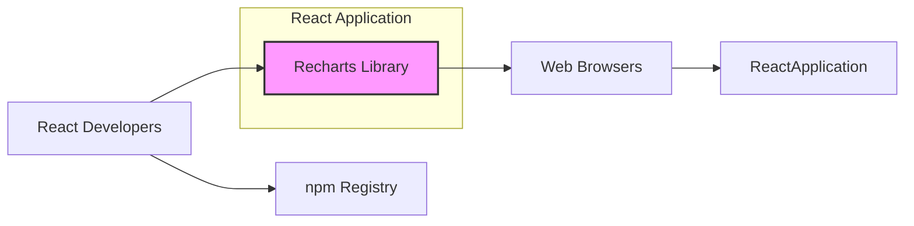
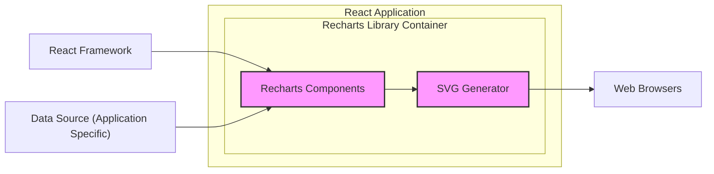
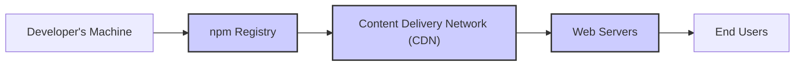

# BUSINESS POSTURE

This project, Recharts, aims to provide a composable charting library built on React and SVG. It is designed to be a flexible and reusable tool for developers to create various types of charts and graphs within React applications.

Business Priorities and Goals:
- Provide a user-friendly and intuitive API for creating charts in React.
- Offer a wide range of chart types and customization options to meet diverse visualization needs.
- Ensure good performance and responsiveness for smooth user experiences.
- Foster a strong community around the library for ongoing development and support.
- Maintain compatibility with modern React versions and web browsers.

Business Risks:
- Security vulnerabilities in Recharts could be exploited in applications that use it, potentially leading to data breaches or other security incidents.
- Poor performance or lack of features could lead developers to choose alternative charting libraries, reducing the adoption and value of Recharts.
- Lack of maintenance or community support could result in the library becoming outdated and unusable over time.
- Incompatibility with future React versions or browser updates could break existing applications using Recharts.
- Improper handling of user-provided data within applications using Recharts could lead to Cross-Site Scripting (XSS) vulnerabilities if not properly sanitized before being rendered in charts (e.g., in tooltips or labels).

# SECURITY POSTURE

Existing Security Controls:
- security control: Dependency Management - Recharts relies on npm for dependency management. This provides a standard mechanism for including and updating third-party libraries. (Implemented via `package.json` and `package-lock.json` in the repository)
- security control: Open Source - As an open-source project, the code is publicly accessible and can be reviewed by the community, potentially leading to the identification and resolution of security issues. (Implemented via GitHub repository)
- accepted risk: Reliance on third-party dependencies - Recharts depends on other npm packages, which may contain vulnerabilities.
- accepted risk: Community-driven development - Security vulnerabilities might be introduced by community contributions if not thoroughly reviewed.

Recommended Security Controls:
- security control: Dependency Scanning - Implement automated dependency scanning to identify known vulnerabilities in third-party libraries used by Recharts.
- security control: Static Application Security Testing (SAST) - Integrate SAST tools into the development process to automatically analyze the Recharts codebase for potential security flaws.
- security control: Software Composition Analysis (SCA) - Utilize SCA tools to gain visibility into the open source components used in Recharts and manage associated risks.
- security control: Regular Security Audits - Conduct periodic security audits of the Recharts codebase by security experts to identify and address potential vulnerabilities.

Security Requirements:
- Authentication: Not applicable to a charting library itself. Authentication is the responsibility of the applications that use Recharts.
- Authorization: Not applicable to a charting library itself. Authorization is the responsibility of the applications that use Recharts to control access to data being visualized.
- Input Validation: Recharts should be designed to handle various types of input data gracefully and prevent potential injection vulnerabilities. While Recharts primarily renders data, if user-provided strings are used in chart elements like labels or tooltips, proper sanitization should be considered in the consuming application to prevent XSS.
- Cryptography: Cryptography is not a core requirement for a charting library. However, if Recharts is used to visualize sensitive data that is encrypted, it should not interfere with the encryption or decryption processes handled by the consuming application. Recharts itself does not need to implement cryptographic functions.

# DESIGN

## C4 CONTEXT

Context Diagram Elements:

- Element:
    - Name: Recharts Library
    - Type: Software System
    - Description: A composable charting library built on React and SVG for creating data visualizations in React applications.
    - Responsibilities:
        - Provide React components for creating various chart types (line charts, bar charts, pie charts, etc.).
        - Offer an API for configuring chart appearance, data, and interactions.
        - Render charts using SVG in web browsers.
    - Security controls:
        - Input validation (within the library to handle data gracefully, but primary validation is application responsibility).
        - Reliance on secure SVG rendering by web browsers.

- Element:
    - Name: React Developers
    - Type: Person
    - Description: Software developers who use Recharts to create charts in their React applications.
    - Responsibilities:
        - Integrate Recharts into React applications.
        - Provide data to Recharts components for visualization.
        - Configure chart options and styling.
        - Ensure proper data handling and sanitization in their applications when using Recharts to prevent vulnerabilities like XSS.
    - Security controls:
        - Secure coding practices when using Recharts.
        - Input validation and sanitization in their applications.

- Element:
    - Name: Web Browsers
    - Type: Software System
    - Description: Web browsers used by end-users to access React applications that incorporate Recharts.
    - Responsibilities:
        - Render web pages and execute JavaScript code, including React applications and Recharts library.
        - Display SVG charts generated by Recharts.
        - Enforce browser security policies (e.g., Same-Origin Policy).
    - Security controls:
        - Browser security features (e.g., XSS protection, Content Security Policy).
        - Regular browser updates to patch vulnerabilities.

- Element:
    - Name: npm Registry
    - Type: Software System
    - Description: A public registry for JavaScript packages, used to distribute and manage Recharts and its dependencies.
    - Responsibilities:
        - Host and distribute Recharts package.
        - Provide package management tools (npm client).
        - Ensure the integrity and availability of packages.
    - Security controls:
        - Package signing and verification.
        - Vulnerability scanning of packages.
        - Access control for publishing packages.

## C4 CONTAINER

Container Diagram Elements:

- Element:
    - Name: Recharts Components
    - Type: Library Component
    - Description: React components that provide the high-level API for creating charts (e.g., LineChart, BarChart, PieChart). These components handle data input, configuration, and orchestrate the chart rendering process.
    - Responsibilities:
        - Provide a user-friendly React API for chart creation.
        - Manage chart data and configuration options.
        - Delegate SVG generation to the SVG Generator component.
    - Security controls:
        - Input validation within component logic to handle various data types and configurations.
        - Adherence to secure coding practices in React component development.

- Element:
    - Name: SVG Generator
    - Type: Library Component
    - Description:  This component is responsible for taking the chart configuration and data and generating the corresponding SVG markup. It handles the low-level details of drawing chart elements (axes, lines, bars, labels, etc.) in SVG.
    - Responsibilities:
        - Generate valid and efficient SVG markup for charts.
        - Implement chart rendering logic based on configuration.
        - Ensure SVG output is compatible with web browsers.
    - Security controls:
        - Secure SVG generation to prevent potential injection vulnerabilities if dynamic data is incorporated into SVG attributes (though this is less common in typical charting scenarios, it's a general SVG security consideration).
        - Output encoding of data rendered in SVG text elements to prevent XSS if user-provided data is used.

- Element:
    - Name: React Framework
    - Type: Platform
    - Description: The React JavaScript library, which provides the foundation for building user interfaces and upon which Recharts is built.
    - Responsibilities:
        - Provide the component model and lifecycle for Recharts components.
        - Handle DOM updates and rendering.
        - Provide a secure and stable platform for Recharts to run.
    - Security controls:
        - React framework's built-in security features and best practices.
        - Regular updates to React framework to patch vulnerabilities.

- Element:
    - Name: Data Source (Application Specific)
    - Type: Data Store
    - Description: Represents the source of data that is visualized by Recharts. This is application-specific and can be various sources like APIs, databases, or static data files.
    - Responsibilities:
        - Provide data to the React application.
        - Ensure data integrity and security.
        - Implement access control and authorization for data.
    - Security controls:
        - Data source specific security controls (e.g., database access controls, API authentication).
        - Data validation and sanitization at the data source level.

## DEPLOYMENT

Deployment Architecture: npm Package Distribution

Deployment Diagram Elements:

- Element:
    - Name: Developer's Machine
    - Type: Environment
    - Description: The local development environment of Recharts developers, used for coding, testing, and packaging the library.
    - Responsibilities:
        - Development and testing of Recharts code.
        - Packaging and publishing Recharts to npm registry.
        - Securely managing developer credentials and development tools.
    - Security controls:
        - Secure development practices.
        - Code review and testing.
        - Access control to development environment.

- Element:
    - Name: npm Registry
    - Type: Infrastructure
    - Description: The npm public registry, used to host and distribute the Recharts package.
    - Responsibilities:
        - Store and distribute Recharts package.
        - Provide package download services.
        - Ensure package integrity and availability.
    - Security controls:
        - Package signing and verification.
        - Infrastructure security of npm registry.
        - Access control for package publishing.

- Element:
    - Name: Content Delivery Network (CDN)
    - Type: Infrastructure
    - Description: CDNs are often used to host and serve npm packages for faster and more reliable distribution to end-users. While not strictly required, CDNs are commonly used in conjunction with npm.
    - Responsibilities:
        - Cache and serve Recharts package files.
        - Improve download speed and availability.
        - Reduce load on npm registry.
    - Security controls:
        - CDN infrastructure security.
        - Secure delivery of packages (HTTPS).

- Element:
    - Name: Web Servers
    - Type: Infrastructure
    - Description: Web servers hosting React applications that use Recharts. These servers deliver the application code, including Recharts, to end-users' browsers.
    - Responsibilities:
        - Host and serve React applications.
        - Deliver Recharts library to end-users' browsers.
        - Application server security.
    - Security controls:
        - Web server security hardening.
        - HTTPS for secure communication.
        - Application-level security controls.

- Element:
    - Name: End Users
    - Type: Environment
    - Description: End-users accessing React applications that utilize Recharts through their web browsers.
    - Responsibilities:
        - Access and interact with React applications and charts.
        - Use up-to-date and secure web browsers.
    - Security controls:
        - User-side security practices (e.g., browser security settings, avoiding malicious websites).
        - Browser security features.

## BUILD

Build Process Diagram:

```mermaid
flowchart LR
    subgraph "Developer Environment"
        Developer["Developer"]
        CodeChanges["Code Changes"]
    end
    GitHub["GitHub Repository"]
    subgraph "CI/CD Pipeline (GitHub Actions)"
        BuildAutomation["Build Automation (GitHub Actions Workflow)"]
        SecurityChecks["Security Checks (Linters, SAST, Dependency Scan)"]
        UnitTests["Unit Tests"]
        PackageBuild["Package Build (npm pack)"]
    end
    npmRegistryPublish["npm Registry Publish"]
    BuildArtifacts["Build Artifacts (npm package)"]

    Developer --> CodeChanges
    CodeChanges --> GitHub
    GitHub --> BuildAutomation
    BuildAutomation --> SecurityChecks
    SecurityChecks --> UnitTests
    UnitTests --> PackageBuild
    PackageBuild --> npmRegistryPublish
    npmRegistryPublish --> BuildArtifacts

    style BuildAutomation fill:#ccf,stroke:#333,stroke-width:2px
    style SecurityChecks fill:#ccf,stroke:#333,stroke-width:2px
    style UnitTests fill:#ccf,stroke:#333,stroke-width:2px
    style PackageBuild fill:#ccf,stroke:#333,stroke-width:2px
    style npmRegistryPublish fill:#ccf,stroke:#333,stroke-width:2px
    style BuildArtifacts fill:#ccf,stroke:#333,stroke-width:2px
```

Build Process Description:

1. Developer makes code changes in their local environment.
2. Code changes are pushed to the GitHub repository.
3. GitHub Actions workflow (CI/CD pipeline) is triggered upon code changes (e.g., push, pull request).
4. Build Automation step executes the build process defined in the workflow (e.g., using npm scripts).
5. Security Checks step performs automated security scans, including:
    - Linters: Code linters to enforce code quality and identify potential code style issues that could lead to vulnerabilities.
    - SAST: Static Application Security Testing tools to analyze the codebase for potential security flaws.
    - Dependency Scanning: Tools to scan dependencies for known vulnerabilities.
6. Unit Tests step executes unit tests to ensure code functionality and prevent regressions.
7. Package Build step packages the library into an npm package (e.g., using `npm pack`).
8. npm Registry Publish step publishes the built npm package to the npm registry. This step typically requires appropriate credentials and may be triggered manually or automatically based on the CI/CD workflow configuration.
9. Build Artifacts are the resulting npm package published to the npm registry, ready for consumption by React developers.

Build Process Security Controls:

- security control: Automated Build Process - Using GitHub Actions for automated builds ensures a consistent and repeatable build process, reducing the risk of manual errors and inconsistencies.
- security control: Source Code Version Control - GitHub provides version control, ensuring code integrity and traceability of changes.
- security control: Security Checks in CI/CD - Integrating security checks (linters, SAST, dependency scanning) into the CI/CD pipeline helps to identify and address security vulnerabilities early in the development lifecycle.
- security control: Unit Testing - Unit tests help ensure code quality and reduce the risk of introducing bugs, including security-related bugs.
- security control: Package Integrity - npm registry provides mechanisms for package signing and verification to ensure the integrity of published packages.
- security control: Access Control for Publishing - Access control to the npm registry publishing process should be restricted to authorized personnel to prevent unauthorized package releases.
- security control: Secret Management - Securely manage secrets (e.g., npm registry tokens) used in the CI/CD pipeline, using GitHub Secrets or similar secure secret management solutions.

# RISK ASSESSMENT

Critical Business Processes:
- Providing a reliable and secure charting library for React developers.
- Maintaining the reputation and trustworthiness of the Recharts project.
- Ensuring the continued usability and maintainability of the library.

Data to Protect:
- Source code of the Recharts library (low sensitivity, publicly available on GitHub, but integrity is important).
- npm package for distribution (medium sensitivity, integrity and availability are important to prevent supply chain attacks).
- Developer credentials and build pipeline secrets (high sensitivity, compromise could lead to unauthorized releases or malicious code injection).
- User data visualized by applications using Recharts (sensitivity depends on the application, Recharts itself does not store or process this data directly, but vulnerabilities could indirectly expose it).

Data Sensitivity:
- Source Code: Low to Medium (Publicly available, but modifications should be controlled).
- npm Package: Medium (Integrity is crucial for supply chain security).
- Developer Credentials/Secrets: High (Critical for maintaining control and security of the project).
- User Data Visualized by Applications: Variable (Depends on the application context, potentially high).

# QUESTIONS & ASSUMPTIONS

Questions:
- What is the intended scope of security responsibility for the Recharts project maintainers versus the developers using Recharts in their applications?
- Are there specific compliance requirements or industry standards that Recharts needs to adhere to?
- What is the process for reporting and handling security vulnerabilities in Recharts?
- What is the expected level of effort and resources that will be dedicated to security activities for Recharts?

Assumptions:
- BUSINESS POSTURE: The primary business goal is to provide a valuable and widely adopted open-source charting library for the React ecosystem. Security is important for maintaining trust and preventing negative impacts on users.
- SECURITY POSTURE: Recharts project follows standard open-source security practices. Security focus is on preventing vulnerabilities in the library itself and ensuring a secure supply chain for distribution. Security of applications using Recharts is primarily the responsibility of the application developers.
- DESIGN: Recharts is designed as a client-side library, primarily interacting with web browsers and the React framework. Security considerations are focused on code quality, dependency management, and preventing potential client-side vulnerabilities like XSS (though primarily the responsibility of the consuming application). The deployment model is based on npm package distribution.