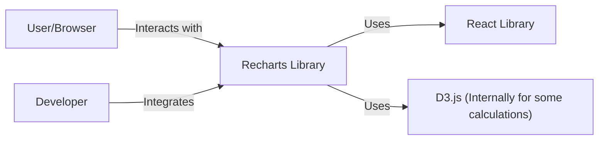
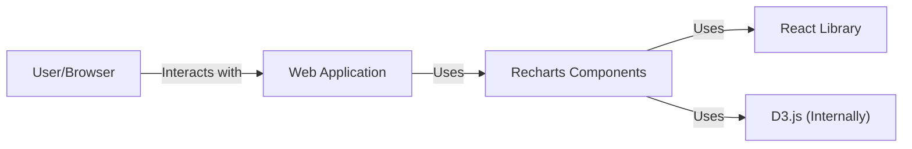
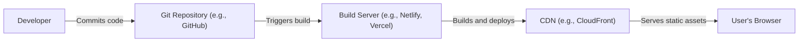
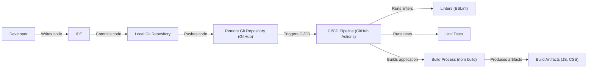

# BUSINESS POSTURE

Recharts is a composable charting library built on React components. It's designed to make it easy to integrate charts into React applications. Based on the GitHub repository, the following business priorities and goals can be inferred:

Priorities:

*   Provide a reliable and well-maintained charting library for React developers.
*   Offer a flexible and customizable solution for various charting needs.
*   Maintain a low barrier to entry for new users.
*   Foster a community around the project.
*   Ensure the library is performant and doesn't introduce bottlenecks.

Goals:

*   Become a widely adopted charting library within the React ecosystem.
*   Provide comprehensive documentation and examples.
*   Maintain a high level of code quality and test coverage.
*   Regularly release updates and new features.

Business Risks:

*   Security vulnerabilities in the library could expose applications using Recharts to attacks.
*   Bugs or performance issues could negatively impact the user experience of applications using Recharts.
*   Lack of maintenance or updates could lead to the library becoming obsolete.
*   Competition from other charting libraries could reduce adoption.
*   Inadequate documentation or support could hinder user adoption.

# SECURITY POSTURE

Existing Security Controls:

*   security control: The project uses `eslint` with `eslint-plugin-react` and `eslint-plugin-react-hooks` for code linting, which can help identify potential security issues and enforce coding best practices. Location: `.eslintrc.js`.
*   security control: The project has a `SECURITY.md` file, providing instructions for reporting security vulnerabilities. Location: `SECURITY.md`.
*   security control: The project uses React, which provides some built-in protection against Cross-Site Scripting (XSS) when used correctly. Location: Implicit in the use of React.
*   security control: The project has unit tests. Location: `test/`.

Accepted Risks:

*   accepted risk: The project does not appear to have dedicated security reviews or penetration testing.
*   accepted risk: The project's dependencies may introduce vulnerabilities.
*   accepted risk: The project does not implement any custom input sanitization, relying on React's built-in mechanisms.

Recommended Security Controls:

*   security control: Implement a dependency management system to automatically check for known vulnerabilities in dependencies (e.g., Dependabot, Snyk).
*   security control: Integrate static application security testing (SAST) tools into the build process to identify potential vulnerabilities early.
*   security control: Conduct regular security reviews and penetration testing.
*   security control: Implement a Content Security Policy (CSP) to mitigate the risk of XSS attacks.
*   security control: Implement input validation and sanitization where applicable, even if React provides some protection.

Security Requirements:

*   Authentication: Not applicable, as Recharts is a client-side library.
*   Authorization: Not applicable, as Recharts is a client-side library.
*   Input Validation:
    *   All data inputs to chart components should be validated to ensure they conform to expected types and formats.
    *   Special characters should be handled appropriately to prevent XSS vulnerabilities.
    *   Consider using a schema validation library to define and enforce data input schemas.
*   Cryptography: Not directly applicable, but if Recharts is used to display sensitive data, the data should be transmitted over secure channels (HTTPS).
*   Output Encoding:
    *   Ensure that any user-provided data rendered in tooltips or labels is properly encoded to prevent XSS.

# DESIGN

## C4 CONTEXT

Element Descriptions:

*   Element:
    *   Name: User/Browser
    *   Type: User
    *   Description: The end-user interacting with a web application that utilizes Recharts.
    *   Responsibilities: Viewing and interacting with charts rendered by Recharts.
    *   Security controls: Browser security features (e.g., same-origin policy, CSP).

*   Element:
    *   Name: Recharts Library
    *   Type: Software System
    *   Description: The Recharts charting library.
    *   Responsibilities: Providing components for rendering charts in React applications.
    *   Security controls: Input validation, output encoding, reliance on React's XSS protection.

*   Element:
    *   Name: React Library
    *   Type: Software System
    *   Description: The React JavaScript library.
    *   Responsibilities: Providing the framework for building user interfaces.
    *   Security controls: Built-in XSS protection (when used correctly).

*   Element:
    *   Name: D3.js
    *   Type: Software System
    *   Description: D3.js library, used internally by Recharts for some calculations.
    *   Responsibilities: Providing low-level utilities for data manipulation and visualization.
    *   Security controls: D3.js itself should be kept up-to-date to address any potential vulnerabilities.

*   Element:
    *   Name: Developer
    *   Type: User
    *   Description: A developer integrating Recharts into their React application.
    *   Responsibilities: Implementing and configuring Recharts components.
    *   Security controls: Following secure coding practices.

## C4 CONTAINER

Element Descriptions:

*   Element:
    *   Name: User/Browser
    *   Type: User
    *   Description: The end-user interacting with the web application.
    *   Responsibilities: Viewing and interacting with charts.
    *   Security controls: Browser security features.

*   Element:
    *   Name: Web Application
    *   Type: Container (Web Application)
    *   Description: The web application that integrates Recharts.
    *   Responsibilities: Hosting and displaying Recharts components.
    *   Security controls: Application-level security controls (e.g., authentication, authorization, input validation).

*   Element:
    *   Name: Recharts Components
    *   Type: Container (JavaScript Library)
    *   Description: The Recharts library components used within the web application.
    *   Responsibilities: Rendering charts based on provided data and configuration.
    *   Security controls: Input validation, output encoding, reliance on React's XSS protection.

*   Element:
    *   Name: React Library
    *   Type: Container (JavaScript Library)
    *   Description: The React library.
    *   Responsibilities: Rendering the UI and managing component lifecycle.
    *   Security controls: Built-in XSS protection.

*   Element:
    *   Name: D3.js
    *   Type: Container (JavaScript Library)
    *   Description: D3.js library, used internally by Recharts.
    *   Responsibilities: Providing low-level utilities.
    *   Security controls: Keep D3.js up-to-date.

## DEPLOYMENT

Possible deployment solutions:

1.  Bundled with a web application and deployed to a static hosting service (e.g., Netlify, Vercel, AWS S3 + CloudFront).
2.  Bundled with a web application and deployed to a server-side rendering environment (e.g., Node.js server).
3.  Included as a dependency in a component library, which is then deployed to a package registry (e.g., npm).

Chosen deployment solution (1. Static Hosting):

Element Descriptions:

*   Element:
    *   Name: Developer
    *   Type: Person
    *   Description: The developer working on the web application.
    *   Responsibilities: Writing code, committing changes.
    *   Security controls: Secure coding practices, access controls to the Git repository.

*   Element:
    *   Name: Git Repository
    *   Type: Software System
    *   Description: The repository storing the application's source code.
    *   Responsibilities: Version control, collaboration.
    *   Security controls: Access controls, branch protection rules.

*   Element:
    *   Name: Build Server
    *   Type: Software System
    *   Description: The service that builds and deploys the application.
    *   Responsibilities: Building the application, deploying to the CDN.
    *   Security controls: Secure build environment, dependency vulnerability scanning.

*   Element:
    *   Name: CDN
    *   Type: Software System
    *   Description: The content delivery network serving the static assets.
    *   Responsibilities: Caching and serving static assets to users.
    *   Security controls: HTTPS, DDoS protection.

*   Element:
    *   Name: User's Browser
    *   Type: Software System
    *   Description: The user's web browser.
    *   Responsibilities: Rendering the web application.
    *   Security controls: Browser security features.

## BUILD

Element Descriptions and Security Controls:

1.  Developer: Writes code using an IDE. Security controls: Secure coding practices.
2.  IDE: Integrated Development Environment. Security controls: IDE security settings, extensions.
3.  Local Git: Local Git repository. Security controls: Local file system security.
4.  Remote Git (GitHub): Remote repository hosting the code. Security controls: Access controls, branch protection, repository security settings.
5.  CI/CD Pipeline (GitHub Actions): Automated build and deployment pipeline. Security controls: Secure configuration, secrets management, least privilege access.
6.  Linters (ESLint): Static code analysis tools. Security controls: Enforces coding standards, identifies potential security issues.
7.  Tests: Unit tests. Security controls: Ensures code quality and functionality, can detect security regressions.
8.  Build Process (npm build): Builds the application. Security controls: Dependency management, secure build environment.
9.  Build Artifacts (JS, CSS): The output of the build process. Security controls: Integrity checks, secure storage.

# RISK ASSESSMENT

Critical Business Processes:

*   Providing a reliable and functional charting library for React developers.
*   Maintaining the reputation and trust of the Recharts project.

Data to Protect:

*   Source code: Sensitivity - Medium (public repository, but unauthorized modifications could introduce vulnerabilities).
*   User data (indirectly): Sensitivity - Depends on the application using Recharts. Recharts itself doesn't handle user data directly, but vulnerabilities in Recharts could be exploited to access or manipulate user data within the consuming application.
*   Documentation: Sensitivity - Low (publicly available).
*   Issue tracker and discussions: Sensitivity - Low (publicly available).

# QUESTIONS & ASSUMPTIONS

Questions:

*   Are there any specific compliance requirements (e.g., GDPR, HIPAA) that applications using Recharts typically need to adhere to? This would influence recommendations for data handling.
*   What is the expected scale of applications using Recharts (e.g., small internal tools vs. large-scale public-facing applications)? This impacts the severity of potential vulnerabilities.
*   Are there any plans to introduce features that might handle sensitive data directly within Recharts (e.g., user authentication, data input forms)?

Assumptions:

*   BUSINESS POSTURE: The primary goal is to provide a free, open-source charting library. There are no direct monetization or strict service-level agreements.
*   SECURITY POSTURE: The project relies primarily on community contributions and built-in React security features for security. There is no dedicated security team or budget.
*   DESIGN: The library is primarily used for client-side rendering of charts. Server-side rendering is possible but not the primary focus. The library is designed to be flexible and customizable, which can introduce complexity and potential security risks if not used carefully.