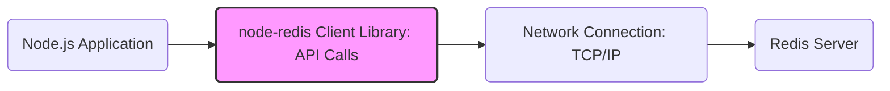
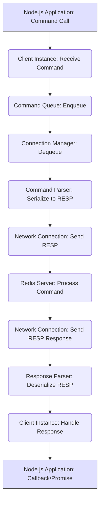
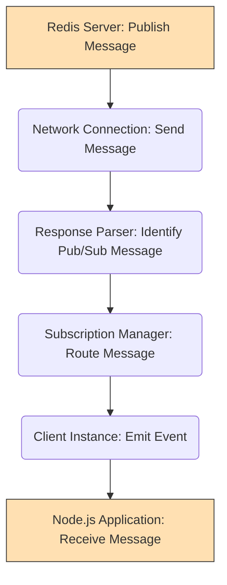

# Project Design Document: node-redis Client

**Version:** 1.1
**Date:** October 26, 2023
**Author:** Gemini (AI Language Model)

## 1. Introduction

This document provides an enhanced and more detailed design overview of the `node-redis` project, a widely used asynchronous Node.js client for interacting with Redis data stores. This document is intended to serve as a robust foundation for subsequent threat modeling activities, providing a comprehensive understanding of the client's architecture and internal workings.

## 2. Goals

*   Provide a comprehensive and in-depth architectural overview of the `node-redis` client library.
*   Clearly identify key components, their specific responsibilities, and their interactions.
*   Thoroughly describe the data flow within the client and between the client and the Redis server for various operations.
*   Highlight specific areas of interest and potential vulnerabilities for detailed security analysis and threat modeling, offering concrete examples.
*   Serve as a definitive reference for understanding the system's internal mechanisms and design choices.

## 3. Scope

This document focuses on the internal architecture and design of the `node-redis` client library itself, providing a granular view of its functionalities. It covers:

*   Core functionalities of the client, including connection management, command execution, and response handling.
*   Detailed mechanisms for establishing and maintaining communication with Redis servers, including error handling and reconnection logic.
*   In-depth analysis of command execution and response processing pipelines.
*   Detailed descriptions of key modules and their interactions, including data transformations and state management.
*   Comprehensive explanation of data serialization and deserialization processes using the Redis protocol.
*   Support for various Redis features, including but not limited to Pub/Sub, transactions, scripting (Lua), and connection to Redis clusters.

This document explicitly does not cover:

*   The internal implementation details and operational characteristics of the Redis server itself.
*   Specific application-level business logic implemented using the `node-redis` client.
*   Deployment configurations, operational procedures, and infrastructure considerations for applications utilizing `node-redis`.

## 4. Architectural Overview

The `node-redis` client acts as an intermediary, abstracting the complexities of the Redis communication protocol and providing a developer-friendly API for Node.js applications to interact with Redis servers. It manages connections, serializes commands, transmits them over the network, receives and parses responses, and handles potential errors.



The core interaction involves the Node.js application making calls to the `node-redis` client's API. The client then translates these calls into Redis commands conforming to the RESP protocol, manages the network communication with the Redis server, and processes the server's responses, returning the results to the application.

## 5. Detailed Design

The `node-redis` client is composed of several interconnected modules, each responsible for specific aspects of its functionality:

*   **Client Instance:**
    *   Serves as the primary interface for application interaction with Redis.
    *   Maintains the overall state of the client, including connection status (`connected`, `disconnected`, `connecting`).
    *   Stores client-specific configuration parameters such as server address (`host`, `port`), authentication details (`password`, `username`), and connection options.
    *   Provides the public API methods for executing various Redis commands (e.g., `get`, `set`, `hget`, `publish`).
    *   Implements connection pooling and reconnection mechanisms to ensure resilience and efficient resource utilization.
    *   Handles global error events and propagates them to the application.
*   **Connection Manager:**
    *   Manages the lifecycle of network connections to the Redis server.
    *   Creates and maintains persistent TCP/IP socket connections.
    *   Implements various reconnection strategies, including exponential backoff, to handle temporary network interruptions.
    *   Handles authentication handshakes with the Redis server upon establishing a connection.
    *   Supports secure connections using TLS/SSL, managing the encryption and decryption of data in transit.
    *   For Redis Cluster setups, it manages multiple connections to different cluster nodes.
    *   Monitors connection health and triggers reconnection attempts when necessary.
*   **Command Queue:**
    *   Acts as a buffer for Redis commands awaiting transmission to the server.
    *   Ensures commands are sent to the server in the order they were issued by the application, maintaining consistency.
    *   Implements mechanisms for handling backpressure if the connection to the server is slow or congested.
    *   May prioritize certain types of commands (though this is generally not a primary feature).
*   **Command Parser (Serializer):**
    *   Responsible for transforming JavaScript data and command names into the Redis Serialization Protocol (RESP) format.
    *   Accurately encodes command arguments into the byte stream expected by the Redis server.
    *   Handles the different data types supported by RESP (simple strings, errors, integers, bulk strings, arrays).
    *   Optimizes the serialization process for performance.
*   **Response Parser (Deserializer):**
    *   Parses the raw byte stream received from the Redis server over the network connection.
    *   Decodes the RESP-formatted response back into corresponding JavaScript data types.
    *   Identifies and handles different response types, including simple strings, errors, integers, bulk strings, and arrays.
    *   Triggers error callbacks for error responses received from the server.
*   **Subscription Manager (for Pub/Sub):**
    *   Manages the state of subscriptions to Redis channels and patterns.
    *   Keeps track of which channels the client is currently subscribed to.
    *   Handles incoming messages from subscribed channels, emitting corresponding events on the `Client Instance`.
    *   Provides methods for subscribing and unsubscribing from channels and patterns.
*   **Transaction Manager:**
    *   Facilitates the execution of atomic Redis transactions.
    *   Queues commands within a transaction block initiated by the `MULTI` command.
    *   Sends the `EXEC` command to the server to execute the queued commands atomically.
    *   Handles responses for transactional commands, including potential errors during transaction execution.
    *   Supports the `WATCH` command for optimistic locking.
*   **Scripting Engine (for EVAL and EVALSHA):**
    *   Enables the execution of Lua scripts on the Redis server.
    *   Handles the `EVAL` command, sending the script source to the server for execution.
    *   Implements the `EVALSHA` command, utilizing script caching on the server for improved performance.
    *   Manages the process of loading and caching scripts (if implemented client-side).
*   **Cluster Manager (for Redis Cluster):**
    *   Manages connections to multiple Redis nodes within a cluster.
    *   Implements logic for determining which cluster node is responsible for a given key using slot mapping.
    *   Routes commands to the appropriate cluster node.
    *   Handles redirection responses (`MOVED`, `ASK`) from the server, updating the client's view of the cluster topology.
    *   Manages cluster topology updates and failover scenarios.

```mermaid
graph TD
    subgraph "node-redis Client Library"
        A("Client Instance")
        B("Connection Manager")
        C("Command Queue")
        D("Command Parser")
        E("Response Parser")
        F("Subscription Manager")
        G("Transaction Manager")
        H("Scripting Engine")
        I("Cluster Manager")
    end

    A -- "Manages Connections" --> B
    A -- "Enqueues Commands" --> C
    B -- "Sends/Receives Data" --> "Network Connection"
    C -- "Serializes Commands" --> D
    D --> "Network Connection"
    "Network Connection" --> E
    E -- "Handles Responses" --> A
    A -- "Manages Subscriptions" --> F
    A -- "Manages Transactions" --> G
    A -- "Executes Scripts" --> H
    A -- "Manages Cluster Nodes" --> I
    I -- "Utilizes Connections" --> B
    style A fill:#ccf,stroke:#333,stroke-width:2px
    style B fill:#ccf,stroke:#333,stroke-width:2px
    style C fill:#ccf,stroke:#333,stroke-width:2px
    style D fill:#ccf,stroke:#333,stroke-width:2px
    style E fill:#ccf,stroke:#333,stroke-width:2px
    style F fill:#ccf,stroke:#333,stroke-width:2px
    style G fill:#ccf,stroke:#333,stroke-width:2px
    style H fill:#ccf,stroke:#333,stroke-width:2px
    style I fill:#ccf,stroke:#333,stroke-width:2px
```

## 6. Data Flow

The data flow within the `node-redis` client for executing a standard Redis command can be broken down into the following steps:

1. The Node.js application initiates a Redis operation by calling a method on the `Client Instance` (e.g., `client.set('mykey', 'myvalue')`).
2. The `Client Instance` receives the command and its arguments.
3. The command and its arguments are added to the `Command Queue`.
4. The `Connection Manager` retrieves the next command from the `Command Queue`.
5. The `Command Parser` serializes the command and its arguments into the RESP format.
6. The serialized RESP command is transmitted over the established `Network Connection` to the Redis server.
7. The Redis server processes the received command.
8. The Redis server sends a RESP-formatted response back over the `Network Connection`.
9. The `Response Parser` receives the raw byte stream from the network.
10. The `Response Parser` deserializes the RESP response back into JavaScript data.
11. The `Client Instance` receives the parsed response.
12. The `Client Instance` invokes the appropriate callback function or resolves the Promise associated with the original command, providing the response data or an error.



**Data Flow for Pub/Sub Message:**

1. The Redis server receives a `PUBLISH` command from another client.
2. The server identifies subscribers to the published channel.
3. The server sends the message to the `node-redis` client over the established `Network Connection`.
4. The `Response Parser` identifies the incoming data as a Pub/Sub message.
5. The message is passed to the `Subscription Manager`.
6. The `Subscription Manager` identifies the corresponding channel and emits an event on the `Client Instance`.
7. The Node.js application, which has registered a listener for this event, receives the published message.



## 7. Security Considerations (Detailed for Threat Modeling)

Considering the architecture and data flow, several potential security vulnerabilities warrant careful consideration during threat modeling:

*   **Connection Security:**
    *   **Man-in-the-Middle (MITM) Attacks:** Without TLS/SSL, attackers could intercept and potentially modify communication between the client and the Redis server, compromising data confidentiality and integrity. This includes sensitive data being transmitted and potentially Redis credentials if sent during authentication.
    *   **Insecure Credential Handling:** If Redis credentials (passwords, usernames) are hardcoded or stored insecurely within the application or client configuration, they could be exposed.
    *   **Vulnerabilities in TLS/SSL Implementation:** Exploits in the underlying TLS/SSL library used by Node.js could compromise the security of encrypted connections.
*   **Command Injection:**
    *   If user-supplied data is not properly sanitized or validated before being used as arguments in Redis commands, attackers could inject malicious commands. For example, using unsanitized input in a `SET` command could overwrite arbitrary keys, or in `EVAL` to execute arbitrary Lua code on the Redis server.
*   **Denial of Service (DoS):**
    *   **Malicious Command Flooding:** An attacker could send a large number of computationally expensive commands (e.g., `KEYS *` on a large database) to overload the Redis server.
    *   **Connection Exhaustion:** An attacker could attempt to open a large number of connections to the Redis server, potentially exhausting server resources and preventing legitimate clients from connecting.
    *   **Resource Exhaustion within the Client:**  Bugs or vulnerabilities in the `node-redis` client could be exploited to cause excessive memory consumption or CPU usage, impacting the application's performance or causing it to crash.
*   **Data Confidentiality and Integrity:**
    *   **Data Leakage:** If TLS/SSL is not used, sensitive data transmitted between the client and server is vulnerable to eavesdropping.
    *   **Data Tampering:** Without proper integrity checks (which are generally handled by TCP), an attacker could potentially modify data in transit.
*   **Authentication and Authorization:**
    *   **Authentication Bypass:** Vulnerabilities in the authentication process of the `node-redis` client or the Redis server could allow unauthorized access.
    *   **Weak Passwords:** The use of weak or default passwords for Redis authentication makes the system susceptible to brute-force attacks.
*   **Dependency Vulnerabilities:**
    *   Security flaws in the dependencies used by the `node-redis` client (e.g., networking libraries) could introduce vulnerabilities.
*   **Error Handling:**
    *   **Information Disclosure:** Improper error handling might reveal sensitive information about the application's internal state or the Redis server's configuration.
    *   **Unexpected Behavior:** Unhandled errors could lead to unexpected application behavior or crashes.
*   **Protocol Vulnerabilities:**
    *   While less likely to be directly exploitable through the client, vulnerabilities in the RESP protocol itself could potentially be leveraged in attacks.

## 8. Assumptions

*   The reader possesses a foundational understanding of Node.js, asynchronous programming, and the basic principles of the Redis data store.
*   The `node-redis` client is typically employed within a standard client-server architecture where the Node.js application acts as the client.
*   Reliable network connectivity exists between the `node-redis` client and the target Redis server.

## 9. Glossary

*   **RESP (REdis Serialization Protocol):** The standardized protocol used for communication between Redis clients and servers, defining the format of commands and responses.
*   **Pub/Sub:** A messaging paradigm implemented by Redis where publishers send messages to specific channels, and subscribers receive messages from those channels they have subscribed to.
*   **TLS/SSL (Transport Layer Security/Secure Sockets Layer):** Cryptographic protocols that provide secure communication over a network, ensuring confidentiality and integrity of data.
*   **Command Injection:** A security vulnerability where an attacker can inject arbitrary commands into an application, often by manipulating user input.
*   **DoS (Denial of Service):** A type of attack aimed at making a system or network resource unavailable to legitimate users, typically by overwhelming it with requests or consuming its resources.
*   **Redis Cluster:** A distributed implementation of Redis that provides automatic data sharding and high availability.
*   **Lua Scripting (EVAL/EVALSHA):**  Redis's capability to execute Lua scripts directly on the server, allowing for complex operations to be performed atomically.

This enhanced document provides a more granular and comprehensive understanding of the `node-redis` client's architecture, facilitating a more thorough and effective threat modeling process. By detailing the components, data flows, and potential security considerations, it empowers security professionals to identify and mitigate potential risks associated with the use of this client library.