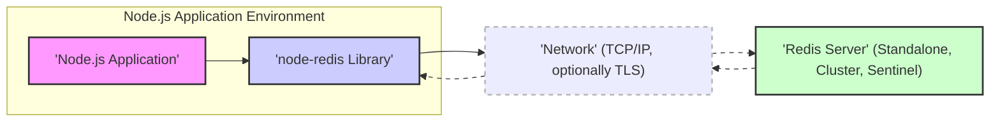

# Project Design Document: Improved node-redis Client Library

## 1. Project Overview

*   **Project Name:** node-redis
*   **Project Repository:** [https://github.com/redis/node-redis](https://github.com/redis/node-redis)
*   **Project Description:** `node-redis` is a high-performance, asynchronous Node.js Redis client library. It offers a comprehensive and idiomatic interface for interacting with Redis servers, supporting a wide array of Redis commands, features, and deployment topologies including standalone, cluster, and sentinel. The library is designed for efficiency, reliability, and ease of use within Node.js environments requiring Redis integration.
*   **Document Scope:** This design document outlines the architecture, components, data flow, and security considerations of the `node-redis` client library. It is intended to serve as a basis for threat modeling and security analysis of systems utilizing `node-redis`.
*   **Project Goals:**
    *   Maintain a leading high-performance Redis client for Node.js applications.
    *   Provide complete support for all Redis commands and new features as they are released.
    *   Offer a developer-friendly API with clear and comprehensive documentation.
    *   Ensure broad compatibility across different versions of Redis servers (from older stable releases to the latest).
    *   Uphold rigorous code quality, security best practices, and performance standards.
    *   Foster an active and supportive community around the library.
*   **Target Audience:** Node.js developers building applications that leverage Redis for various purposes, including caching, session management, real-time analytics, pub/sub messaging, job queues, and distributed data management.

## 2. Architecture Diagram

*   **Diagram Description:**
    *   This diagram illustrates the fundamental architecture of a system employing the `node-redis` library.
    *   A Node.js application initiates interactions with a Redis database through the `node-redis` library.
    *   Communication between `node-redis` and the Redis server occurs over a network, typically using TCP/IP. TLS encryption is optionally used for secure communication.
    *   The Redis server can be deployed in various configurations: standalone, clustered, or with Sentinel for high availability.
    *   Data exchange is bidirectional between the Node.js application and the Redis server to facilitate requests and responses.

## 3. Components Description

*   **Component: Node.js Application**
    *   **Description:** This represents the custom application logic developed using Node.js. It integrates the `node-redis` library to access and manipulate data within a Redis database.
    *   **Functionality:**
        *   Constructs and sends commands to Redis via the `node-redis` API (e.g., SET, GET, HSET, PUBLISH).
        *   Processes data retrieved from Redis, transforming and utilizing it within the application's context.
        *   Manages application-specific data handling, caching strategies, and business logic that relies on Redis.
        *   Handles user input and application data that is intended to be stored or processed by Redis.
    *   **Security Considerations:**
        *   Vulnerable application code, particularly concerning input handling, can lead to indirect Redis vulnerabilities (e.g., Redis command injection if user input is not properly sanitized before being used in Redis commands).
        *   Securely managing Redis connection credentials (passwords, ACL tokens) within the application's environment is critical to prevent unauthorized access.
        *   Proper implementation of authorization and access control within the application to ensure users only interact with Redis data they are permitted to access.

*   **Component: node-redis Library**
    *   **Description:** This is the core `node-redis` client library, acting as a crucial intermediary layer between the Node.js application and the Redis server infrastructure.
    *   **Functionality:**
        *   Exposes a comprehensive API for Node.js applications to execute the full spectrum of Redis commands.
        *   Manages the lifecycle of connections to Redis servers, including connection pooling, automatic reconnection attempts, and handling connection failures gracefully.
        *   Implements the Redis Serialization Protocol (RESP) for efficient encoding and decoding of commands and responses exchanged with the Redis server.
        *   Provides mechanisms for command queuing and pipelining to optimize performance by reducing network round trips.
        *   Supports advanced Redis features such as Pub/Sub channels, Redis Transactions, Lua scripting execution, and monitoring of Redis server events.
        *   Offers specialized support for Redis Cluster and Sentinel deployments, including automatic discovery of nodes and failover handling.
    *   **Security Considerations:**
        *   Security vulnerabilities within the `node-redis` library itself could be exploited to compromise the application or the Redis server. Regular security audits and updates are essential.
        *   Responsible for correctly implementing Redis authentication and authorization protocols to ensure secure access to Redis instances.
        *   Securely manages connection establishment, including handling TLS/SSL handshake and certificate verification to prevent man-in-the-middle attacks.
        *   Needs to be resilient against denial-of-service attacks, potentially through connection limits, request queue management, and resource consumption controls.
        *   Dependency management is crucial; vulnerabilities in underlying dependencies of `node-redis` could introduce security risks. Regular dependency scanning and updates are necessary.

*   **Component: Network (TCP/IP, optionally TLS)**
    *   **Description:** The network infrastructure that provides the communication pathway between the Node.js application environment and the Redis server. Typically utilizes TCP/IP as the base protocol, with optional TLS encryption for secure communication.
    *   **Functionality:**
        *   Establishes and maintains network connections for data transmission between `node-redis` and the Redis server.
        *   Handles the routing and delivery of data packets across the network.
        *   TLS/SSL provides encryption of network traffic when configured, protecting data confidentiality and integrity during transmission.
    *   **Security Considerations:**
        *   Unencrypted network traffic is susceptible to eavesdropping and interception, potentially exposing sensitive data transmitted to and from Redis.
        *   Network misconfigurations or vulnerabilities can be exploited to gain unauthorized access to the Redis server or launch network-based attacks.
        *   Man-in-the-middle attacks are possible if TLS is not properly implemented or if certificate validation is bypassed.
        *   Network segmentation and firewall rules are vital to restrict network access to the Redis server and limit the attack surface.

*   **Component: Redis Server (Standalone, Cluster, Sentinel)**
    *   **Description:** The backend Redis data store. It is an in-memory data structure server that can be deployed in various configurations: standalone for simple setups, clustered for scalability and data sharding, or with Sentinel for high availability and automatic failover.
    *   **Functionality:**
        *   Persistently stores and retrieves data based on commands received from clients like `node-redis`.
        *   Offers a rich set of data structures (strings, hashes, lists, sets, sorted sets, streams, HyperLogLogs, etc.) to suit diverse application needs.
        *   Manages data persistence to disk (RDB snapshots and/or AOF logs) to ensure data durability across restarts (configurable).
        *   Handles client authentication and authorization to control access to data and commands.
        *   Supports replication for data redundancy and read scalability. In cluster mode, data is automatically sharded across multiple nodes. Sentinel provides monitoring and automatic failover for high availability.
    *   **Security Considerations:**
        *   Redis server vulnerabilities can lead to critical data breaches, unauthorized data modification, or complete system compromise. Regular security patching and updates are paramount.
        *   Misconfigured or weak Redis authentication mechanisms (e.g., default password, easily guessable passwords, disabled authentication) are a major security risk. Strong passwords or ACLs must be enforced.
        *   Insecure network exposure of the Redis server (e.g., binding to a public IP address without proper firewalling) can allow unauthorized external access.
        *   Lack of proper access control lists (ACLs) in Redis versions 6+ can lead to overly permissive access for clients. ACLs should be configured to enforce least privilege.
        *   Denial-of-service attacks targeting the Redis server can disrupt application availability. Resource limits and rate limiting should be configured.
        *   Data at rest within Redis server memory and persistence files is generally not encrypted by default. Encryption at rest solutions should be considered for sensitive data.
        *   Insecure inter-node communication within Redis Cluster or Sentinel deployments can be a vulnerability point. TLS encryption for inter-node communication should be considered.

## 4. Data Flow

*   **Request Flow (Node.js Application to Redis Server):**
    1.  The Node.js application initiates a Redis operation by calling a method on the `node-redis` client object (e.g., `client.set('user:123', 'John Doe')`).
    2.  The `node-redis` library takes the command and its arguments and serializes them into the Redis Serialization Protocol (RESP) format. This involves encoding the command name and arguments into a byte stream according to RESP specifications.
    3.  The serialized RESP command is transmitted over the established TCP/IP network connection (or TLS-encrypted connection if configured) to the designated Redis server.
    4.  The Redis server receives the incoming byte stream, parses it according to the RESP protocol to reconstruct the command and its arguments.
    5.  The Redis server executes the requested command operation against its data store.

*   **Response Flow (Redis Server to Node.js Application):**
    1.  After executing the command, the Redis server generates a response. This response is also formatted according to the RESP protocol, indicating the outcome of the operation (e.g., success, error, or the requested data).
    2.  The RESP-formatted response is sent back over the network connection to the `node-redis` library.
    3.  The `node-redis` library receives the response byte stream and deserializes it from the RESP format. This involves parsing the byte stream to extract the response type and data.
    4.  The deserialized response is converted into corresponding JavaScript data types (e.g., strings, numbers, booleans, arrays, objects, or error objects).
    5.  The JavaScript representation of the Redis response is then passed back to the Node.js application, typically through a Promise resolution or a callback function, allowing the application to process the result of the Redis operation.

*   **Data Serialization and Deserialization Details:**
    *   `node-redis` is responsible for the crucial task of translating between JavaScript data types used in the Node.js application and the RESP format required for communication with Redis.
    *   Serialization involves converting JavaScript values (strings, numbers, Buffers, etc.) into RESP-compliant byte sequences for transmission to the Redis server. This includes handling different data types and encoding them appropriately within the RESP structure.
    *   Deserialization is the reverse process, where `node-redis` parses the RESP byte stream received from the Redis server and converts it back into usable JavaScript data types that the application can readily work with.
    *   Correct and efficient serialization and deserialization are critical for both performance and data integrity. Errors in this process could lead to data corruption or misinterpretation of Redis responses.

## 5. Security Considerations

*   **Authentication and Authorization:**
    *   `node-redis` supports Redis authentication through the `password` option in the client configuration, allowing clients to authenticate with a password set using the `requirepass` directive in Redis configuration.
    *   For Redis versions 6 and later, `node-redis` supports Redis ACLs (Access Control Lists) for more fine-grained permission management. ACLs allow defining specific permissions for different users or client connections, controlling access to commands and data keys.
    *   **Threat:** Weak or absent authentication mechanisms on the Redis server. Unauthorized access to Redis leading to data breaches, data manipulation, or denial of service.
    *   **Mitigation:**
        *   **Enforce strong authentication:** Always configure a strong password using `requirepass` or implement robust ACLs in Redis 6+ to control access.
        *   **Secure credential management:** Store Redis credentials securely, avoiding hardcoding them in application code. Utilize environment variables, secrets management systems (like HashiCorp Vault, AWS Secrets Manager), or configuration files with restricted access.
        *   **Principle of least privilege:** When using ACLs, grant only the necessary permissions to each application or user connecting to Redis, limiting their access to specific commands and keyspaces.

*   **Data Encryption in Transit:**
    *   `node-redis` provides support for TLS/SSL encryption to secure communication channels between the Node.js application and the Redis server. This is enabled using the `tls` option in the client configuration.
    *   When TLS is enabled, all data transmitted between `node-redis` and Redis is encrypted, protecting it from eavesdropping and tampering during network transit.
    *   **Threat:** Eavesdropping on network traffic between the application and Redis, potentially exposing sensitive data in transit. Man-in-the-middle attacks that could intercept or modify Redis commands and responses.
    *   **Mitigation:**
        *   **Enable TLS/SSL:** Always enable TLS encryption for `node-redis` connections, especially when communicating over untrusted networks or the public internet.
        *   **Proper TLS configuration:** Ensure that TLS is correctly configured on both the `node-redis` client and the Redis server. Verify certificate validity and use strong cipher suites.
        *   **Certificate management:** Manage TLS certificates properly. Use valid certificates signed by a trusted Certificate Authority (CA) or self-signed certificates with secure distribution and validation mechanisms.

*   **Input Validation and Sanitization:**
    *   While `node-redis` itself focuses on client-server communication, the Node.js application using `node-redis is responsible for validating and sanitizing all user inputs before using them in Redis commands.
    *   Failing to sanitize inputs can lead to Redis command injection vulnerabilities, where malicious user input is interpreted as Redis commands, potentially allowing attackers to execute arbitrary Redis commands.
    *   **Threat:** Redis command injection attacks. Attackers could manipulate Redis data, execute administrative commands, or potentially gain control over the Redis server if input is not properly sanitized. For example, constructing a key or value from unsanitized user input and using it in `client.eval()` could be dangerous.
    *   **Mitigation:**
        *   **Strict input validation:** Implement robust input validation on the Node.js application side to ensure that all user inputs conform to expected formats and constraints before being used in Redis commands.
        *   **Parameterization (where applicable):** While Redis commands are not strictly parameterized in the SQL sense, avoid directly concatenating user input into command strings. Use `node-redis` API methods that handle argument escaping and quoting correctly.
        *   **Principle of least privilege for commands:** If using ACLs in Redis 6+, restrict the set of commands that application users/connections are allowed to execute, minimizing the potential impact of command injection vulnerabilities.

*   **Connection Security:**
    *   Establishing and managing secure connections to the Redis server is crucial. This includes handling connection errors, reconnection logic, and preventing connection hijacking.
    *   **Threat:** Connection hijacking, where an attacker intercepts or takes over an established connection between `node-redis` and Redis. Denial-of-service attacks through connection exhaustion by rapidly opening and closing connections.
    *   **Mitigation:**
        *   **Connection pooling:** Utilize `node-redis`'s built-in connection pooling to efficiently manage and reuse connections, reducing the overhead of establishing new connections and improving performance.
        *   **Secure connection parameters:** Configure connection timeouts, keep-alive settings, and reconnection strategies appropriately to ensure connection stability and resilience without compromising security.
        *   **Limit connection concurrency:** Control the maximum number of concurrent connections to the Redis server to prevent resource exhaustion and potential DoS scenarios.
        *   **Monitor connection state:** Implement monitoring to detect unusual connection patterns or connection failures that might indicate security issues or attacks.

*   **Dependency Management:**
    *   `node-redis`, like most Node.js packages, relies on a set of dependencies. Security vulnerabilities in these dependencies can indirectly affect `node-redis` and applications using it.
    *   **Threat:** Vulnerabilities in transitive dependencies of `node-redis` could be exploited, leading to various security risks, including code execution, information disclosure, or denial of service.
    *   **Mitigation:**
        *   **Regular dependency audits:** Regularly audit `node-redis`'s dependencies using tools like `npm audit` or `yarn audit` to identify known vulnerabilities.
        *   **Keep dependencies updated:** Update `node-redis` and its dependencies to the latest versions to patch known security vulnerabilities. Use dependency management tools to automate updates and track dependency versions.
        *   **Dependency scanning in CI/CD:** Integrate dependency scanning into the CI/CD pipeline to automatically detect and flag vulnerabilities in dependencies before deployment.

*   **Error Handling and Logging:**
    *   Proper error handling and logging are essential for security monitoring, incident response, and debugging. However, insecure logging practices can inadvertently expose sensitive information.
    *   **Threat:** Information leakage through excessive or insecure logging. Sensitive data, such as Redis credentials, user data, or internal system details, might be logged, making it accessible to attackers who gain access to logs.
    *   **Mitigation:**
        *   **Secure logging practices:** Implement secure logging practices. Avoid logging sensitive information in plain text. Redact or mask sensitive data before logging.
        *   **Appropriate logging levels:** Use appropriate logging levels (e.g., error, warning, info, debug) to control the verbosity of logs and avoid excessive logging of non-essential information.
        *   **Log rotation and retention:** Implement log rotation and retention policies to manage log file size and storage. Securely store and access log files, restricting access to authorized personnel only.
        *   **Centralized logging:** Consider using a centralized logging system to aggregate logs from different components, facilitating security monitoring and analysis.

*   **Denial of Service (DoS) Attacks:**
    *   The Node.js application, `node-redis` library, network infrastructure, and the Redis server itself are all potential targets for DoS attacks.
    *   **Threat:** Application or Redis server unavailability due to resource exhaustion caused by malicious requests or traffic. DoS attacks can disrupt service availability and impact business operations.
    *   **Mitigation:**
        *   **Rate limiting:** Implement rate limiting at the application level to restrict the number of requests from a single source within a given time frame.
        *   **Connection limits:** Configure connection limits on both the `node-redis` client and the Redis server to prevent connection exhaustion attacks.
        *   **Resource quotas in Redis:** Utilize Redis configuration options to set limits on memory usage, number of clients, and other resources to prevent resource exhaustion on the Redis server.
        *   **Network-level DoS protection:** Employ network-level DoS protection mechanisms, such as firewalls, intrusion detection/prevention systems (IDS/IPS), and cloud-based DDoS mitigation services, to filter malicious traffic and protect against network-based DoS attacks.

## 6. Technologies Used

*   **Programming Languages:**
    *   JavaScript (Node.js) - Primary language for the application and the `node-redis` client library.
    *   C - Underlying implementation language of the Redis server itself.

*   **Libraries/Frameworks:**
    *   Node.js - JavaScript runtime environment providing the platform for the application and `node-redis`.
    *   `node-redis` - The core Redis client library facilitating communication with Redis servers.
    *   Dependencies of `node-redis`:  Internally, `node-redis` may depend on other Node.js packages for functionalities like network communication, data parsing, and utility functions. (Specific dependencies can be found in `package.json`).

*   **Protocols:**
    *   RESP (Redis Serialization Protocol) - The standard protocol used for communication between `node-redis` and the Redis server. It defines the format for commands and responses.
    *   TCP/IP - The fundamental network protocol suite used for reliable communication over networks.
    *   TLS/SSL (optional) - Protocol for establishing encrypted and authenticated communication channels, used when TLS encryption is enabled for `node-redis` connections.

## 7. Deployment Model

*   **Deployment Environments:**
    *   **Cloud Environments (AWS, Azure, GCP, etc.):** Cloud platforms are a common deployment environment. Managed Redis services (e.g., AWS ElastiCache, Azure Cache for Redis, Google Cloud Memorystore) simplify Redis deployment and management. Alternatively, self-managed Redis instances can be deployed on cloud virtual machines (VMs).
    *   **On-Premise Data Centers:** Traditional on-premise data centers remain a viable deployment option, with Redis servers running on physical servers or virtualized infrastructure within the organization's network.
    *   **Containerized Environments (Docker, Kubernetes):** Containerization using Docker and orchestration platforms like Kubernetes is increasingly popular. `node-redis` applications and Redis servers can be containerized and deployed as microservices within container orchestration platforms.

*   **Network Topology Considerations:**
    *   **Same Network/VPC:** For optimal performance and minimal latency, deploying the Node.js application and Redis server within the same network or Virtual Private Cloud (VPC) is often preferred. This reduces network hops and improves communication speed.
    *   **Separate Networks (DMZ/Backend Network):** In security-sensitive environments, the Redis server may be placed in a more restricted network zone, such as a Demilitarized Zone (DMZ) or a dedicated backend network. Firewall rules are then configured to strictly control network access to the Redis server, allowing only necessary traffic from the application tier.
    *   **Public Internet (Generally Discouraged):** Exposing the Redis server directly to the public internet is generally discouraged due to significant security risks. If absolutely necessary, extremely strong authentication, TLS encryption, strict firewall rules, and intrusion detection systems are essential to mitigate risks. Consider using a reverse proxy or API gateway to further protect Redis.

*   **Security Best Practices in Deployment:**
    *   **Principle of Least Privilege (Network Access):** Restrict network access to the Redis server to only the necessary sources. Use firewalls and network segmentation to limit the attack surface.
    *   **Network Segmentation and Firewalls:** Isolate Redis servers within secure network segments (e.g., private subnets in a VPC). Implement firewalls to control inbound and outbound traffic, allowing only authorized connections to the Redis port (default 6379) from application servers.
    *   **Regular Security Updates and Patching:** Establish a process for regularly applying security updates and patches to both the Node.js application environment, `node-redis` library, and the Redis server operating system and Redis software.
    *   **Monitoring and Logging (Deployment):** Implement comprehensive monitoring and logging for both the application and Redis server infrastructure. Monitor for security events, performance anomalies, and potential intrusions. Centralized logging and security information and event management (SIEM) systems can enhance security visibility.
    *   **Secure Credential Management (Deployment):** Utilize secure methods for managing and injecting Redis authentication credentials into the application deployment environment. Avoid hardcoding credentials in configuration files or container images. Leverage environment variables, secrets management services, or Kubernetes secrets for secure credential handling.
    *   **Immutable Infrastructure:** Consider deploying Redis and the application as part of an immutable infrastructure approach, where infrastructure components are replaced rather than updated in place. This can improve security and consistency.
    *   **Security Hardening of Redis Server:** Follow Redis security hardening guidelines, including disabling unnecessary commands, renaming dangerous commands, configuring appropriate resource limits, and regularly reviewing security configurations.