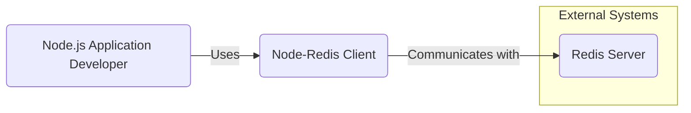
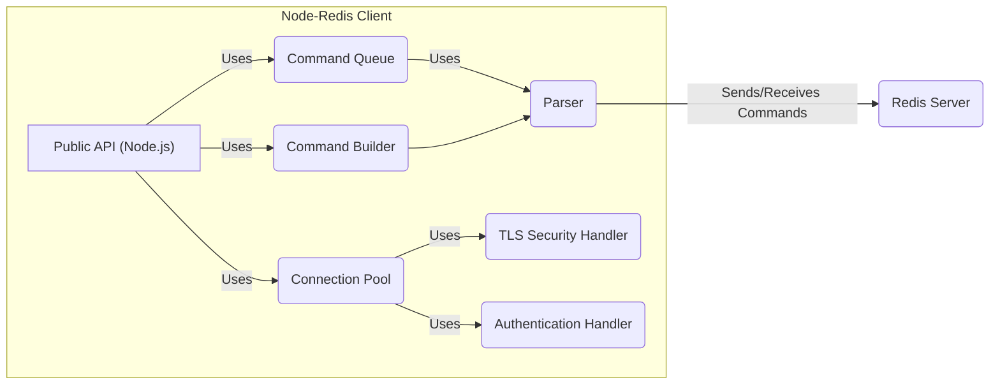
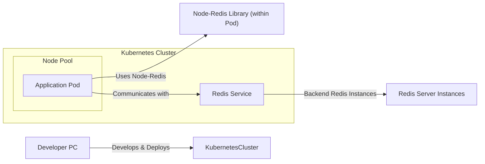
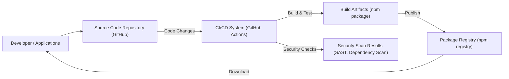

# BUSINESS POSTURE

- Business Priorities and Goals:
  - Provide a high-performance, reliable, and easy-to-use Redis client library for Node.js applications.
  - Ensure compatibility with a wide range of Redis server versions and features.
  - Maintain a stable and well-documented API for developers.
  - Foster a strong community around the library for contributions and support.
- Business Risks:
  - Security vulnerabilities in the client library could lead to data breaches or service disruptions in applications using `node-redis`.
  - Performance issues or instability in the client could negatively impact the performance and reliability of applications using `node-redis`.
  - Lack of compatibility with new Redis features or versions could limit the adoption and usefulness of `node-redis`.
  - Poor documentation or a difficult-to-use API could hinder developer adoption and satisfaction.
  - Supply chain attacks targeting dependencies of `node-redis` could introduce vulnerabilities.

# SECURITY POSTURE

- Existing Security Controls:
  - security control: TLS support for encrypted connections to Redis servers. Implemented within the connection logic of `node-redis`.
  - security control: Redis authentication support (AUTH command). Implemented within the authentication logic of `node-redis`.
  - security control: Input sanitization and command parameterization to prevent command injection vulnerabilities. Implemented within the command building and sending logic of `node-redis`.
  - security control: Regular updates and maintenance to address reported security vulnerabilities. Described in the project's release notes and changelog.
  - security control: Dependency management using `npm` and `package-lock.json` to track and manage dependencies. Managed in the project's repository.
- Accepted Risks:
  - accepted risk: Potential vulnerabilities in third-party dependencies used by `node-redis`. Mitigation is through regular dependency updates and security scanning.
  - accepted risk: Client-side vulnerabilities due to improper usage of the library by developers. Mitigation is through clear documentation and examples of secure usage.
  - accepted risk: Denial-of-service attacks targeting the client or the Redis server through excessive connection requests or command executions. Mitigation is through rate limiting and connection management on both client and server sides.
- Recommended Security Controls:
  - security control: Implement automated dependency scanning to identify and address vulnerabilities in third-party dependencies.
  - security control: Integrate Static Application Security Testing (SAST) tools into the CI/CD pipeline to detect potential code-level vulnerabilities.
  - security control: Provide secure configuration guidelines and best practices for developers using `node-redis`, including recommendations for TLS configuration, authentication, and input validation.
  - security control: Implement rate limiting or connection pooling mechanisms within the client to mitigate potential denial-of-service attacks.
  - security control: Conduct regular security audits and penetration testing to identify and address potential vulnerabilities in the library.
- Security Requirements:
  - Authentication:
    - Requirement: Support Redis authentication mechanisms, including password-based authentication and ACLs.
    - Requirement: Provide clear documentation and examples on how to configure and use authentication securely.
  - Authorization:
    - Requirement: Respect Redis server-side authorization configurations and ACLs.
    - Requirement: Do not implement client-side authorization logic, rely on Redis server for access control.
  - Input Validation:
    - Requirement: Sanitize and validate user-provided inputs before sending commands to the Redis server to prevent command injection vulnerabilities.
    - Requirement: Provide mechanisms for developers to safely pass user inputs as command parameters.
  - Cryptography:
    - Requirement: Support TLS/SSL encryption for secure communication with Redis servers.
    - Requirement: Ensure proper handling of cryptographic keys and certificates for TLS connections.
    - Requirement: Consider supporting client-side encryption for sensitive data before sending it to Redis (if applicable and performance-sensitive).

# DESIGN

## C4 CONTEXT

- Context Diagram Elements:
  - - Name: Node-Redis Client
    - Type: Software System
    - Description: A Node.js library that provides a client interface for interacting with Redis servers. It allows Node.js applications to connect to Redis, send commands, and receive responses.
    - Responsibilities:
      - Establishing and managing connections to Redis servers.
      - Serializing and deserializing commands and responses according to the Redis protocol.
      - Providing an API for Node.js applications to interact with Redis.
      - Handling connection errors and retries.
      - Supporting various Redis features and commands.
    - Security controls:
      - TLS encryption for connections.
      - Redis authentication mechanisms.
      - Input sanitization and command parameterization.
  - - Name: Redis Server
    - Type: Software System
    - Description: An in-memory data structure store, used as a database, cache, and message broker. It stores data and processes commands sent by clients like `node-redis`.
    - Responsibilities:
      - Storing and managing data in memory.
      - Processing commands received from clients.
      - Enforcing access control and authentication.
      - Providing data persistence (optional).
    - Security controls:
      - Authentication mechanisms (password, ACL).
      - TLS encryption for connections.
      - Access control lists (ACLs) for authorization.
      - Network security controls (firewalls, network segmentation).
  - - Name: Node.js Application Developer
    - Type: Person
    - Description: Software developers who use the `node-redis` library to build Node.js applications that interact with Redis.
    - Responsibilities:
      - Developing Node.js applications that utilize Redis for data storage, caching, or messaging.
      - Properly integrating and configuring the `node-redis` library in their applications.
      - Following secure coding practices when using `node-redis`.
    - Security controls:
      - Secure coding practices.
      - Input validation in their applications.
      - Proper configuration of `node-redis` and Redis connections.

## C4 CONTAINER

- Container Diagram Elements:
  - - Name: Public API (Node.js)
    - Type: Library Interface
    - Description: The public API exposed by the `node-redis` library for use by Node.js applications. This is the entry point for developers to interact with Redis.
    - Responsibilities:
      - Providing a user-friendly and well-documented interface for Redis commands.
      - Managing command execution and response handling.
      - Exposing configuration options for connection and security settings.
    - Security controls:
      - Input validation on API parameters.
      - Secure defaults for connection and security settings.
  - - Name: Connection Pool
    - Type: Component
    - Description: Manages a pool of connections to the Redis server. Reuses connections to improve performance and efficiency.
    - Responsibilities:
      - Establishing and maintaining connections to Redis servers.
      - Managing a pool of reusable connections.
      - Handling connection failures and retries.
      - Providing connections to other components as needed.
    - Security controls:
      - TLS connection establishment and management.
      - Authentication handling during connection establishment.
      - Connection timeout and idle connection management.
  - - Name: Command Queue
    - Type: Component
    - Description: Queues commands to be sent to the Redis server. Helps manage asynchronous command execution and flow control.
    - Responsibilities:
      - Queuing commands received from the API.
      - Managing the order of command execution.
      - Handling command timeouts and retries.
    - Security controls:
      - Rate limiting of command processing (if implemented).
      - Protection against command injection vulnerabilities by using parameterized commands.
  - - Name: Command Builder
    - Type: Component
    - Description: Constructs Redis commands according to the Redis protocol based on the API calls.
    - Responsibilities:
      - Translating API calls into valid Redis command strings.
      - Parameterizing commands to prevent command injection.
      - Ensuring correct command syntax and formatting.
    - Security controls:
      - Input validation and sanitization to prevent command injection.
      - Encoding command parameters correctly.
  - - Name: Parser
    - Type: Component
    - Description: Parses responses received from the Redis server according to the Redis protocol.
    - Responsibilities:
      - Deserializing Redis responses into usable data structures.
      - Handling different response types (strings, integers, arrays, errors).
      - Error handling and reporting.
    - Security controls:
      - Input validation on received responses to prevent injection or parsing vulnerabilities.
      - Error handling to prevent information leakage through error messages.
  - - Name: TLS Security Handler
    - Type: Component
    - Description: Handles TLS/SSL encryption for secure communication with the Redis server.
    - Responsibilities:
      - Establishing TLS encrypted connections.
      - Managing TLS certificates and keys.
      - Ensuring secure data transmission over TLS.
    - Security controls:
      - Proper TLS configuration and enforcement.
      - Certificate validation and management.
      - Secure key storage and handling.
  - - Name: Authentication Handler
    - Type: Component
    - Description: Handles authentication with the Redis server using configured authentication mechanisms.
    - Responsibilities:
      - Implementing Redis authentication protocols (AUTH command, ACLs).
      - Storing and managing authentication credentials securely (in memory or configuration).
      - Handling authentication failures and retries.
    - Security controls:
      - Secure storage and handling of authentication credentials (avoiding hardcoding).
      - Protection against brute-force authentication attempts (if implemented).
      - Support for strong authentication mechanisms.

## DEPLOYMENT

- Deployment Architecture:
  - `node-redis` is a client library, it is deployed as part of a Node.js application. The deployment architecture of `node-redis` is inherently tied to the deployment architecture of the Node.js application that uses it.
  - Common Deployment Scenarios for Node.js Applications (and thus `node-redis`):
    - Cloud Platforms (AWS, Azure, GCP): Deployed as containers or serverless functions.
    - Containerized Environments (Docker, Kubernetes): Deployed within Docker containers orchestrated by Kubernetes.
    - Virtual Machines: Deployed directly on virtual machines.
    - On-Premise Servers: Deployed on physical servers in a data center.
  - Detailed Deployment Diagram (Example: Containerized Deployment in Kubernetes):

- Deployment Diagram Elements (Containerized Deployment in Kubernetes):
  - - Name: Kubernetes Cluster
    - Type: Infrastructure
    - Description: A Kubernetes cluster providing container orchestration and management.
    - Responsibilities:
      - Orchestrating and managing containerized applications.
      - Providing networking and service discovery within the cluster.
      - Ensuring application availability and scalability.
    - Security controls:
      - Network policies to control traffic within the cluster.
      - Role-Based Access Control (RBAC) for cluster access.
      - Container security scanning and vulnerability management.
  - - Name: Node Pool
    - Type: Infrastructure
    - Description: A group of worker nodes within the Kubernetes cluster where application pods are deployed.
    - Responsibilities:
      - Running containerized application pods.
      - Providing compute resources for applications.
    - Security controls:
      - Operating system hardening on worker nodes.
      - Security patching and updates.
      - Network segmentation and isolation.
  - - Name: Application Pod
    - Type: Container
    - Description: A pod in Kubernetes containing the Node.js application and the `node-redis` library.
    - Responsibilities:
      - Running the Node.js application code.
      - Utilizing the `node-redis` library to interact with Redis.
    - Security controls:
      - Container image scanning for vulnerabilities.
      - Least privilege container configurations.
      - Application-level security controls (input validation, authentication, authorization).
  - - Name: Node-Redis Library (within Pod)
    - Type: Software Library
    - Description: The `node-redis` library running within the Node.js application container.
    - Responsibilities:
      - Providing Redis client functionality to the application.
    - Security controls:
      - Security controls inherited from the library design (TLS, authentication, input validation).
  - - Name: Redis Service
    - Type: Service
    - Description: A Kubernetes service that exposes the Redis server instances within the cluster.
    - Responsibilities:
      - Providing a stable endpoint for accessing Redis servers.
      - Load balancing traffic to Redis server instances.
    - Security controls:
      - Network policies to restrict access to the Redis service.
      - Service account based access control.
  - - Name: Redis Server Instances
    - Type: Software System
    - Description: Instances of the Redis server running within the Kubernetes cluster.
    - Responsibilities:
      - Storing and managing data.
      - Processing commands from `node-redis` clients.
    - Security controls:
      - Redis server security controls (authentication, ACLs, TLS).
      - Network policies to restrict access to Redis instances.

## BUILD

- Build Process Description:
  - Developer writes code and commits changes to the Source Code Repository (GitHub).
  - CI/CD System (GitHub Actions) is triggered on code changes (e.g., pull requests, merges to main branch).
  - CI/CD System performs the following steps:
    - Checkout code from the Source Code Repository.
    - Install dependencies using `npm install`.
    - Run linters and code formatters to enforce code quality.
    - Run unit and integration tests to ensure code functionality.
    - Perform Security Checks:
      - Static Application Security Testing (SAST) to identify potential code vulnerabilities.
      - Dependency scanning to identify vulnerabilities in third-party dependencies.
    - Build the npm package.
    - Publish Build Artifacts (npm package) to the Package Registry (npm registry).
    - Store Security Scan Results for review and remediation.
- Build Process Security Controls:
  - security control: Source Code Repository (GitHub) with access controls and audit logs.
  - security control: CI/CD System (GitHub Actions) with secure workflow definitions and secrets management.
  - security control: Automated build process to ensure consistency and repeatability.
  - security control: Dependency management using `npm` and `package-lock.json` to ensure reproducible builds and track dependencies.
  - security control: Static Application Security Testing (SAST) integrated into the CI/CD pipeline to detect code-level vulnerabilities.
  - security control: Dependency scanning integrated into the CI/CD pipeline to identify vulnerabilities in third-party dependencies.
  - security control: Code linters and formatters to enforce code quality and consistency.
  - security control: Unit and integration tests to ensure code functionality and prevent regressions.
  - security control: Secure publishing of build artifacts to the Package Registry using appropriate authentication and authorization.
  - security control: Review and remediation process for Security Scan Results to address identified vulnerabilities.

# RISK ASSESSMENT

- Critical Business Processes:
  - Applications relying on `node-redis` for data caching, session management, real-time data processing, and other critical functionalities. Disruption or compromise of `node-redis` could impact these processes.
- Data Sensitivity:
  - The sensitivity of data handled by `node-redis` depends entirely on the applications using it and the data stored in Redis. `node-redis` itself does not store data, but facilitates access to data in Redis.
  - Potential data sensitivity levels could range from public information to highly confidential data, depending on the application's use case.
  - If applications use `node-redis` to store sensitive data in Redis, then the confidentiality, integrity, and availability of `node-redis` become critical for protecting that sensitive data.

# QUESTIONS & ASSUMPTIONS

- BUSINESS POSTURE:
  - Assumption: The primary business goal is to provide a widely adopted, reliable, and secure Redis client for the Node.js ecosystem.
  - Question: Are there specific target industries or use cases for `node-redis` that might influence business priorities or risk tolerance?
  - Question: What are the key performance indicators (KPIs) for the success of `node-redis` (e.g., download numbers, community contributions, bug reports)?
- SECURITY POSTURE:
  - Assumption: Security is a high priority for the `node-redis` project, and secure development practices are followed.
  - Question: Are there specific security compliance requirements or certifications that `node-redis` needs to adhere to?
  - Question: Is there a dedicated security team or individual responsible for security aspects of the `node-redis` project?
  - Question: What is the process for handling and disclosing security vulnerabilities in `node-redis`?
- DESIGN:
  - Assumption: The design of `node-redis` is based on standard client-server architecture principles and best practices for Node.js libraries.
  - Question: Are there any specific design considerations related to performance, scalability, or resource consumption that are critical for `node-redis`?
  - Question: Are there any plans for future architectural changes or feature additions that might impact the design or security of `node-redis`?
  - Question: What are the key dependencies of `node-redis`, and are there any known security concerns or risks associated with these dependencies?