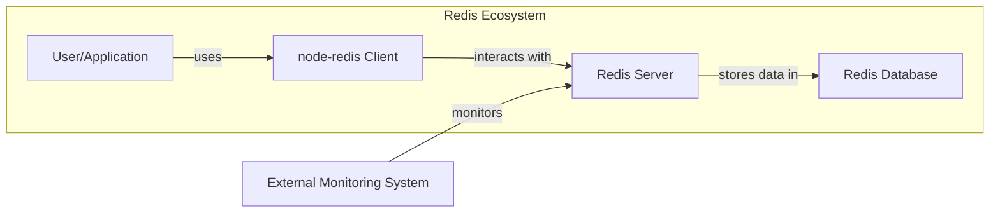
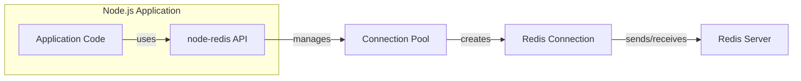
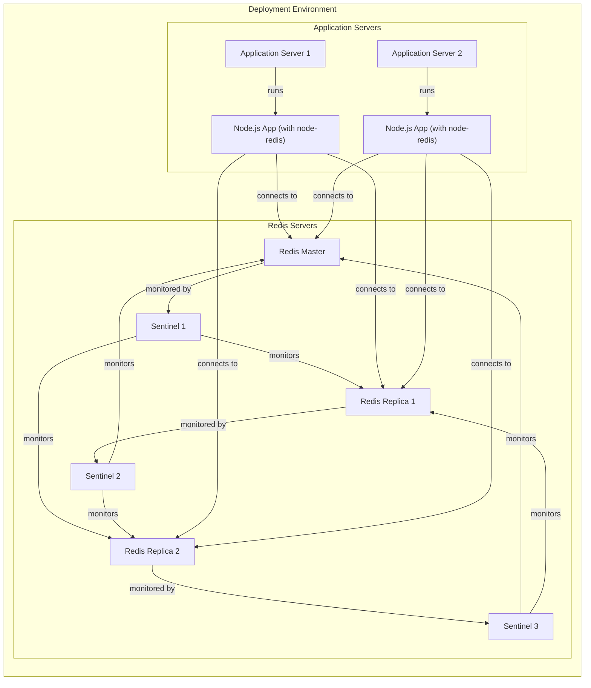
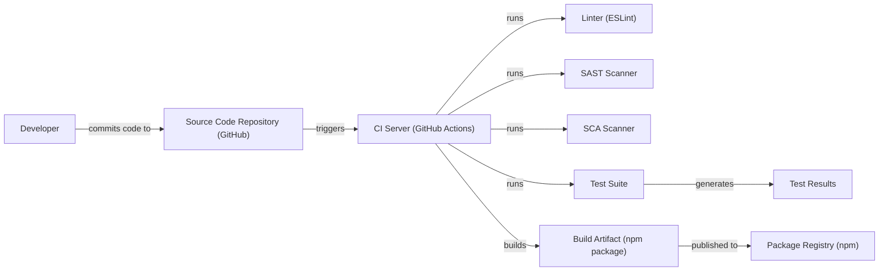

Okay, let's create a design document for the `node-redis` project, focusing on aspects relevant to threat modeling.

# BUSINESS POSTURE

Business Priorities and Goals:

*   Provide a high-performance, reliable, and easy-to-use Node.js client for Redis.
*   Maintain broad compatibility with Redis features and versions.
*   Foster a strong open-source community and encourage contributions.
*   Ensure the library is well-documented and easy to adopt.
*   Minimize dependencies to reduce potential security and maintenance overhead.
*   Provide fast response for security issues.

Most Important Business Risks:

*   Data breaches or data loss due to vulnerabilities in the client library or its interaction with Redis.
*   Denial-of-service attacks exploiting vulnerabilities in the client or server.
*   Supply chain attacks compromising the library's dependencies or build process.
*   Reputational damage due to security incidents or slow response to vulnerabilities.
*   Loss of community trust and contributions due to perceived security negligence.
*   Compatibility issues with new Redis features or versions, leading to user frustration and migration challenges.

# SECURITY POSTURE

Existing Security Controls:

*   security control: Regular dependency updates to address known vulnerabilities (evident from the project's `package.json` and dependency management practices).
*   security control: Code linting and static analysis (implied by the use of tools like ESLint, visible in the repository).
*   security control: Test suite to ensure functionality and prevent regressions (extensive test suite in the `test/` directory).
*   security control: Community contributions and code reviews (open-source nature and pull request process on GitHub).
*   security control: Documentation on secure usage patterns (present in the project's README and documentation).
*   security control: Support for secure connections (TLS/SSL) (mentioned in the documentation and supported by the code).
*   security control: Input sanitization (where applicable, to prevent injection attacks; needs to be verified in the code).

Accepted Risks:

*   accepted risk: Reliance on the security of the underlying Redis server and network infrastructure.
*   accepted risk: Potential for user misconfiguration leading to security issues (e.g., exposing Redis without authentication).
*   accepted risk: The inherent risks of using an open-source library, including the possibility of undiscovered vulnerabilities.

Recommended Security Controls:

*   security control: Implement a formal security vulnerability disclosure policy.
*   security control: Conduct regular security audits and penetration testing.
*   security control: Integrate Static Application Security Testing (SAST) and Dynamic Application Security Testing (DAST) tools into the CI/CD pipeline.
*   security control: Implement Software Composition Analysis (SCA) to identify and manage vulnerabilities in third-party dependencies.
*   security control: Consider using a fuzzing framework to test the library's robustness against unexpected inputs.
*   security control: Provide clear guidelines on secure coding practices for contributors.

Security Requirements:

*   Authentication:
    *   The library MUST support secure authentication mechanisms provided by Redis (e.g., passwords, ACLs, client certificates).
    *   The library SHOULD provide clear guidance on securely storing and managing credentials.
    *   The library SHOULD NOT store credentials in plain text.

*   Authorization:
    *   The library SHOULD support Redis's Access Control Lists (ACLs) to restrict client permissions.
    *   The library SHOULD provide mechanisms to configure and manage ACLs programmatically.

*   Input Validation:
    *   The library MUST validate and sanitize all user-provided inputs to prevent injection attacks (e.g., Redis command injection).
    *   The library SHOULD use parameterized commands or escaping mechanisms to prevent injection vulnerabilities.

*   Cryptography:
    *   The library MUST support secure communication with Redis using TLS/SSL.
    *   The library SHOULD use strong cryptographic algorithms and protocols.
    *   The library SHOULD provide options for configuring TLS/SSL settings (e.g., certificate validation, cipher suites).
    *   The library SHOULD NOT use deprecated or insecure cryptographic algorithms.

# DESIGN

## C4 CONTEXT

Element Descriptions:

*   Element:
    1.  Name: User/Application
    2.  Type: User
    3.  Description: A Node.js application or service that utilizes the `node-redis` client library to interact with Redis.
    4.  Responsibilities: Initiates requests to Redis, processes responses, handles errors, and manages application logic.
    5.  Security controls: Implements application-level security controls, such as authentication, authorization, and input validation.

*   Element:
    1.  Name: `node-redis` Client
    2.  Type: Software System
    3.  Description: The `node-redis` library, a Node.js client for interacting with Redis.
    4.  Responsibilities: Provides an API for connecting to Redis, sending commands, receiving responses, and managing connections.  Handles serialization/deserialization of data.
    5.  Security controls: Supports TLS/SSL for secure connections, provides mechanisms for authentication and authorization (using Redis features), performs input validation (where applicable).

*   Element:
    1.  Name: Redis Server
    2.  Type: Software System
    3.  Description: The Redis server instance(s) that the `node-redis` client connects to.
    4.  Responsibilities: Stores data, processes commands, manages data persistence, and handles client connections.
    5.  Security controls: Implements Redis security features, such as authentication (passwords, ACLs), TLS/SSL, and access control.

*   Element:
    1.  Name: Redis Database
    2.  Type: Data Store
    3.  Description: The data stored within the Redis server.
    4.  Responsibilities: Persists data in memory (and optionally to disk).
    5.  Security controls: Relies on the Redis Server's security controls for data protection.

*   Element:
    1.  Name: External Monitoring System
    2.  Type: External System
    3.  Description: A system that monitors the health and performance of the Redis Server.
    4.  Responsibilities: Collects metrics, logs, and alerts on Redis server status.
    5.  Security controls: Secure communication with the Redis server, authentication, and authorization for monitoring access.

## C4 CONTAINER

Element Descriptions:

*   Element:
    1.  Name: Application Code
    2.  Type: Container
    3.  Description: The user's Node.js application code that utilizes the `node-redis` library.
    4.  Responsibilities: Implements business logic, interacts with the `node-redis` API, and handles data.
    5.  Security controls: Application-level security controls, input validation, and secure coding practices.

*   Element:
    1.  Name: `node-redis` API
    2.  Type: Container
    3.  Description: The public API exposed by the `node-redis` library.
    4.  Responsibilities: Provides functions for interacting with Redis (e.g., `connect`, `set`, `get`, `publish`, `subscribe`).
    5.  Security controls: Input validation, parameterization, and secure handling of user-provided data.

*   Element:
    1.  Name: Connection Pool
    2.  Type: Container
    3.  Description: Manages a pool of connections to the Redis server.
    4.  Responsibilities: Creates, reuses, and closes connections to optimize performance and resource usage.
    5.  Security controls: Enforces connection limits, handles connection errors securely, and supports secure connection configurations (TLS/SSL).

*   Element:
    1.  Name: Redis Connection
    2.  Type: Container
    3.  Description: A single connection to the Redis server.
    4.  Responsibilities: Sends commands to Redis and receives responses.
    5.  Security controls: Uses TLS/SSL for secure communication, authenticates with the server, and handles network-level security.

*   Element:
    1.  Name: Redis Server
    2.  Type: Container
    3.  Description: The Redis server instance. (Same as in the Context diagram).
    4.  Responsibilities: Stores data, processes commands, manages data persistence, and handles client connections.
    5.  Security controls: Implements Redis security features, such as authentication (passwords, ACLs), TLS/SSL, and access control.

## DEPLOYMENT

Possible Deployment Solutions:

1.  Standalone Redis Server: A single Redis server instance running on a dedicated machine or virtual machine.
2.  Redis Sentinel: A distributed system for high availability, providing automatic failover if the primary Redis server fails.
3.  Redis Cluster: A distributed system for sharding data across multiple Redis nodes, providing scalability and high availability.
4.  Cloud-Based Redis Service: Managed Redis services offered by cloud providers (e.g., AWS ElastiCache, Azure Cache for Redis, Google Cloud Memorystore).

Chosen Deployment Solution (Example: Redis Sentinel):

Element Descriptions:

*   Element:
    1.  Name: Application Server 1 & 2
    2.  Type: Infrastructure Node
    3.  Description: Servers hosting the Node.js application instances.
    4.  Responsibilities: Running the application code and handling user requests.
    5.  Security controls: Operating system security, network security, and application-level security controls.

*   Element:
    1.  Name: Node.js App (with `node-redis`) 1 & 2
    2.  Type: Software System Instance
    3.  Description: Instances of the Node.js application using the `node-redis` client.
    4.  Responsibilities: Interacting with Redis and performing application logic.
    5.  Security controls: Application-level security, secure connection to Redis (TLS/SSL), and authentication.

*   Element:
    1.  Name: Redis Master
    2.  Type: Software System Instance
    3.  Description: The primary Redis server instance.
    4.  Responsibilities: Handling write operations and replicating data to replicas.
    5.  Security controls: Redis security features (authentication, TLS/SSL, ACLs), network security, and operating system security.

*   Element:
    1.  Name: Redis Replica 1 & 2
    2.  Type: Software System Instance
    3.  Description: Redis replica servers for read scaling and failover.
    4.  Responsibilities: Handling read operations and replicating data from the master.
    5.  Security controls: Redis security features (authentication, TLS/SSL, ACLs), network security, and operating system security.

*   Element:
    1.  Name: Sentinel 1, 2 & 3
    2.  Type: Software System Instance
    3.  Description: Redis Sentinel instances for monitoring and automatic failover.
    4.  Responsibilities: Monitoring Redis servers, detecting failures, and promoting replicas to master if necessary.
    5.  Security controls: Secure communication with Redis servers, authentication, and network security.

## BUILD

Build Process Description:

1.  Developers commit code changes to the source code repository (GitHub).
2.  The CI server (GitHub Actions, based on the `.github/workflows` directory) is triggered by the commit.
3.  The CI server runs a series of checks:
    *   Linter (ESLint): Checks for code style and potential errors.
    *   SAST Scanner: Scans the code for security vulnerabilities.
    *   SCA Scanner: Analyzes dependencies for known vulnerabilities.
    *   Test Suite: Executes the test suite to ensure functionality and prevent regressions.
4.  If all checks pass, the CI server builds the project, creating a build artifact (npm package).
5.  The build artifact is published to the package registry (npm).

Security Controls in Build Process:

*   security control: Code review process on GitHub (pull requests).
*   security control: Linting with ESLint to enforce code style and identify potential issues.
*   security control: Static Application Security Testing (SAST) to detect vulnerabilities in the code.
*   security control: Software Composition Analysis (SCA) to identify vulnerabilities in dependencies.
*   security control: Automated test suite to ensure code quality and prevent regressions.
*   security control: Secure publishing to the npm registry (using access tokens and potentially two-factor authentication).

# RISK ASSESSMENT

Critical Business Processes:

*   Data storage and retrieval: Redis is often used for caching, session management, and real-time data processing.  Compromise of these processes could lead to data breaches, service disruptions, and performance degradation.
*   Application functionality: Many applications rely on Redis for core functionality.  Vulnerabilities in `node-redis` or the Redis server could disrupt these applications.

Data Sensitivity:

*   The sensitivity of data stored in Redis varies greatly depending on the application.  It can range from:
    *   Low sensitivity: Cached website content.
    *   Medium sensitivity: User session data (without personally identifiable information).
    *   High sensitivity: Personally identifiable information (PII), financial data, or authentication tokens.

The `node-redis` client itself does not store data persistently, but it handles data in transit and interacts with the Redis server, which stores the data. Therefore, the client must be designed to handle data of all sensitivity levels securely.

# QUESTIONS & ASSUMPTIONS

Questions:

*   What specific SAST and SCA tools are being used (or planned to be used) in the CI/CD pipeline?
*   What is the formal vulnerability disclosure policy for `node-redis`?
*   Are there any specific performance or scalability requirements that might impact security considerations?
*   Are there any specific compliance requirements (e.g., GDPR, PCI DSS) that need to be considered?
*   What level of access do maintainers have to the production Redis instances used by users of `node-redis`? (Assumption: Maintainers do not have access to user's production Redis instances.)

Assumptions:

*   BUSINESS POSTURE: The project prioritizes security and is willing to invest in security measures.
*   SECURITY POSTURE: The project follows secure coding practices, but there may be areas for improvement.  The existing test suite provides good coverage, but security-focused testing could be enhanced.
*   DESIGN: Users are responsible for securing their own Redis server instances and network infrastructure.  The `node-redis` library provides the necessary tools for secure communication, but it's up to the user to configure them correctly. The deployment environment is assumed to be secure, with appropriate network segmentation and access controls. The build process is automated and includes security checks, but there may be opportunities to further enhance it with more advanced security tools.