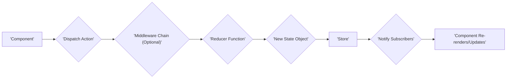

# Project Design Document: Redux

**Version:** 1.1
**Date:** October 26, 2023
**Author:** AI Software Architect

## 1. Introduction

This document provides an enhanced architectural design of the Redux library, specifically tailored for threat modeling. Redux is a predictable state container for JavaScript applications, centralizing and managing application state for improved understanding, debugging, and maintenance. This document aims to provide a comprehensive overview of Redux's architecture and potential security considerations to facilitate thorough threat modeling activities.

## 2. Goals and Objectives

*   Clearly define the architecture and components of the Redux library with a focus on security-relevant aspects.
*   Illustrate the data flow within the Redux ecosystem, highlighting potential points of interaction and manipulation.
*   Identify key areas and interactions that represent potential attack surfaces and security vulnerabilities.
*   Provide a detailed and structured overview for security analysts to effectively perform threat modeling and risk assessment.

## 3. Architectural Overview

Redux employs a strict unidirectional data flow architecture, which is fundamental to its predictability and also has implications for security. Key principles include:

*   **Single and Centralized State:** The entire application state resides within a single *store*, creating a single source of truth. This centralization, while beneficial for management, also means a single point of potential exposure if not secured.
*   **Immutable State Updates:** State changes are triggered by emitting *actions*, which are descriptive objects. Reducers then produce new state based on these actions, ensuring the original state remains immutable. This immutability can aid in tracking state changes and identifying anomalies.
*   **Pure Function Reducers:** State transformations are handled by pure *reducers*, which guarantee predictable outputs for given inputs and lack side effects. This predictability is crucial for reasoning about state changes and identifying unexpected behavior that might indicate a security issue.

This architecture, while promoting predictability, necessitates careful consideration of data handling and potential manipulation at each stage of the data flow.

## 4. Components

The Redux library comprises several key components, each with its own security considerations:

*   **Store:**
    *   Holds the complete application state in memory on the client-side.
    *   Provides methods for accessing the state (`getState`), dispatching actions (`dispatch`), and subscribing to changes (`subscribe`).
    *   **Security Consideration:** The entire application state is accessible if the client-side environment is compromised (e.g., through XSS). Sensitive data should be carefully managed and potentially encrypted before being stored in the state.
*   **Actions:**
    *   Plain JavaScript objects that describe events or intentions to modify the state.
    *   Must have a `type` property (typically a string constant) to identify the action.
    *   May contain a `payload` carrying data related to the action.
    *   **Security Consideration:**  Malicious or crafted actions with unexpected types or payloads could be dispatched, potentially leading to unintended state changes or triggering vulnerabilities in reducers or middleware. Input validation and sanitization before dispatching actions are crucial.
*   **Reducers:**
    *   Pure functions that receive the current state and an action, returning the new state.
    *   Determine how the application state evolves in response to dispatched actions.
    *   Often combined using `combineReducers` to manage different parts of the state.
    *   **Security Consideration:**  Vulnerabilities in reducer logic could allow attackers to manipulate the state in arbitrary ways by crafting specific actions. Reducers should be carefully reviewed to prevent unintended state transitions or the introduction of malicious data into the state. Ensuring reducers are truly pure prevents unexpected side effects that could have security implications.
*   **Dispatch:**
    *   The mechanism for sending actions to the store, triggering the state update process.
    *   The `dispatch()` method of the store is the primary entry point for state changes.
    *   **Security Consideration:**  If an attacker can control the dispatch mechanism (e.g., through a compromised component or script), they can inject arbitrary actions and potentially compromise the application state.
*   **Subscribers:**
    *   Functions (often UI components) that are notified whenever the store's state changes.
    *   Update the user interface or perform other side effects based on state changes.
    *   **Security Consideration:** While subscribers themselves don't directly modify the state, vulnerabilities in how they handle state updates could lead to security issues (e.g., displaying sensitive data insecurely).
*   **Middleware:**
    *   Functions that intercept actions dispatched to the store, providing a point for custom logic.
    *   Can be used for logging, asynchronous operations, analytics, and more.
    *   Applied using `applyMiddleware` during store creation, forming a chain of processing.
    *   **Security Consideration:** Middleware represents a significant attack surface. Malicious or vulnerable middleware could:
        *   Log sensitive action data.
        *   Modify actions or state in unauthorized ways.
        *   Make unintended API calls.
        *   Introduce vulnerabilities like Cross-Site Scripting (XSS) if they manipulate DOM elements based on action data without proper sanitization.
        *   Expose sensitive information through logging or analytics.
        Careful review and vetting of middleware are essential.
*   **Selectors:**
    *   Functions that extract specific pieces of data from the application state.
    *   Help optimize performance by preventing unnecessary re-renders in UI frameworks.
    *   Can range from simple property access to complex data transformations.
    *   **Security Consideration:** While generally read-only, vulnerabilities in selector logic could inadvertently expose more data than intended or perform unintended computations based on potentially malicious state data.

## 5. Data Flow

The data flow in a Redux application is strictly unidirectional, providing clear points for potential inspection and security analysis:

Detailed steps of the data flow with security considerations:

*   A user interaction or internal event in a **Component** triggers the dispatch of an **Action**. **Threat:** If the component is compromised or user input is not sanitized, malicious actions could be dispatched.
*   The dispatched action passes through the **Middleware Chain** (if any is configured). **Threat:** Malicious or vulnerable middleware can intercept and manipulate the action or perform unauthorized operations.
*   The action reaches the **Reducer Function**. **Threat:**  A compromised or poorly written reducer could lead to arbitrary state manipulation based on the action.
*   The **Reducer Function** produces a **New State Object**. **Threat:** If the reducer logic is flawed, it might introduce vulnerabilities or expose sensitive information in the new state.
*   The **Store** updates its internal state with the **New State Object**. **Threat:** The entire application state is now potentially vulnerable if the new state contains malicious or exposed data.
*   The **Store** notifies all registered **Subscribers** about the state change. **Threat:** Subscribers might handle the new state insecurely, leading to vulnerabilities in the UI or other parts of the application.
*   **Component Re-renders/Updates** occur based on the new state. **Threat:** If the state contains malicious data, it could be rendered in a way that leads to XSS or other client-side vulnerabilities.

## 6. Security Considerations (Detailed)

Building upon the component-level considerations, here's a more detailed look at potential security threats:

*   **Client-Side State Exposure:**
    *   **Threat:**  Since the entire application state resides in the client's browser memory, it's susceptible to inspection via browser developer tools or malicious browser extensions.
    *   **Mitigation:** Avoid storing highly sensitive information directly in the Redux store. If necessary, encrypt sensitive data before storing it and decrypt it only when needed. Implement proper authorization and access controls on the server-side to limit the data fetched and stored in the client-side state.
*   **Malicious Action Injection:**
    *   **Threat:** If an attacker can inject arbitrary actions (e.g., through a Cross-Site Scripting vulnerability), they can potentially manipulate the application state in unintended ways, leading to data corruption, unauthorized actions, or denial of service.
    *   **Mitigation:** Implement robust input validation and sanitization on all user inputs that could influence dispatched actions. Use well-defined action types and validate them in reducers. Employ Content Security Policy (CSP) to mitigate XSS vulnerabilities.
*   **Reducer Vulnerabilities:**
    *   **Threat:**  Bugs or vulnerabilities in reducer logic could allow attackers to craft specific actions that cause unintended state changes or introduce malicious data into the state.
    *   **Mitigation:**  Thoroughly test reducers with various inputs, including edge cases and potentially malicious payloads. Adhere to the principle of pure functions to avoid unexpected side effects. Consider using static analysis tools to identify potential vulnerabilities in reducer code.
*   **Middleware Exploitation:**
    *   **Threat:** Malicious or vulnerable middleware can intercept and modify actions, log sensitive data, make unauthorized API calls, or introduce client-side vulnerabilities.
    *   **Mitigation:**  Carefully vet and review all middleware used in the application. Avoid using untrusted or poorly maintained middleware. Implement security best practices within custom middleware, such as avoiding the storage of sensitive information in local storage or cookies without proper protection.
*   **State Injection via Server-Side Rendering (SSR):**
    *   **Threat:** If using SSR, the initial Redux state is often serialized and sent to the client. If not handled carefully, this could expose sensitive server-side data or allow attackers to manipulate the initial state.
    *   **Mitigation:**  Ensure that only necessary data is included in the initial state during SSR. Sanitize and validate any data included in the initial state. Avoid including sensitive server-side configurations or secrets in the initial state.
*   **Vulnerabilities in Dependencies:**
    *   **Threat:**  Redux applications often rely on other libraries (e.g., `react-redux`, middleware libraries). Vulnerabilities in these dependencies can indirectly impact the security of the Redux-managed state.
    *   **Mitigation:** Regularly scan dependencies for known vulnerabilities using tools like `npm audit` or `yarn audit`. Keep dependencies up-to-date with security patches.
*   **Browser Storage of State (e.g., Redux Persist):**
    *   **Threat:** If the Redux store is persisted to local storage or session storage, the security of this storage mechanism becomes critical. Unencrypted sensitive data stored in browser storage is vulnerable to access by malicious scripts or users with access to the device.
    *   **Mitigation:** Encrypt sensitive data before persisting it to browser storage. Consider the security implications of the chosen storage mechanism (local storage vs. session storage).

## 7. Dependencies

Redux has minimal core dependencies, but typical applications using Redux rely on:

*   **`react-redux`:** (If used with React) Facilitates connecting React components to the Redux store. **Security Consideration:** Vulnerabilities in `react-redux` could potentially impact how components interact with the state.
*   **Middleware Libraries:** (e.g., `redux-thunk`, `redux-saga`, `redux-logger`) Extend Redux functionality. **Security Consideration:** As highlighted earlier, middleware represents a significant attack surface.
*   **Utility Libraries:** (e.g., Immer, Reselect) Used for immutable updates or selector creation. **Security Consideration:** Vulnerabilities in these utilities could indirectly affect state management or data access.

It is crucial to regularly audit and update these dependencies to mitigate potential security risks.

## 8. Deployment Considerations

Deployment of Redux applications involves bundling the client-side code, including the Redux library. Security considerations during deployment include:

*   **Secure Bundling Process:** Ensure the build process is secure and free from malware that could inject malicious code into the bundle.
*   **Content Security Policy (CSP):** Implement a strong CSP to mitigate XSS attacks, which could be used to manipulate the Redux store.
*   **HTTPS:** Serve the application over HTTPS to protect data in transit, including the Redux state if it contains sensitive information.
*   **Subresource Integrity (SRI):** Use SRI to ensure that the bundled JavaScript files are not tampered with if served from a CDN.

## 9. Future Considerations

*   **Improved Type Safety:** Further leveraging TypeScript can enhance the type safety of actions and reducers, potentially reducing the risk of unintended state manipulations.
*   **Formal Verification:** Exploring formal verification techniques for critical reducers could provide stronger guarantees about their behavior and security properties.
*   **Security Audits:** Regular security audits of Redux applications and their middleware are essential to identify and address potential vulnerabilities.
*   **Community Security Best Practices:**  Developing and promoting community-driven security best practices for Redux usage can help developers build more secure applications.

This enhanced design document provides a more detailed and security-focused overview of the Redux architecture, intended to be a valuable resource for threat modeling and security analysis.