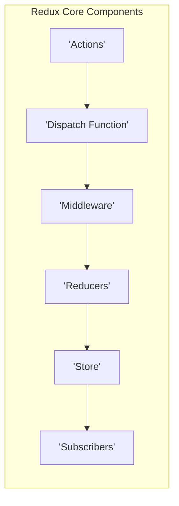
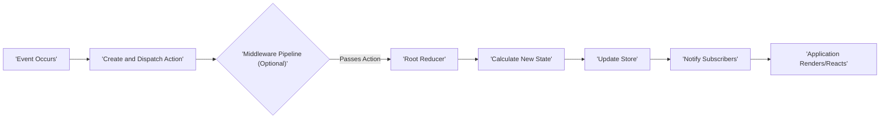

## Project Design Document: Redux State Management Library (Improved)

**1. Project Overview**

Redux is a predictable state container for JavaScript applications, designed to help manage application state in a consistent and maintainable way. It's inspired by the principles of Flux but simplifies the architecture through a strict unidirectional data flow and the concept of a single, immutable state tree. This document details the architectural components and data flow within the core Redux library, specifically for the purpose of informing threat modeling activities.

**2. Goals**

*   To provide a precise and easily understandable description of the Redux architecture.
*   To clearly delineate the responsibilities and interactions of Redux's core components.
*   To visualize the flow of data through the Redux system.
*   To establish a solid foundation for conducting thorough threat modeling.
*   To serve as a reference for developers and security professionals seeking to understand Redux internals.

**3. Target Audience**

*   Security Engineers tasked with identifying and mitigating potential security risks.
*   Software Architects and Developers integrating Redux into their applications or building extensions.
*   Technical personnel requiring a comprehensive understanding of Redux's internal mechanisms.

**4. System Architecture**

Redux's architecture is centered around a single, immutable state container and a well-defined flow for updating that state. The primary components are:

*   **Store:** The central repository holding the entire application state as a single JavaScript object. It's the single source of truth for the application's data.
*   **Actions:** Plain JavaScript objects that describe events or intentions to change the state. They are the *only* way to trigger a state change and must have a `type` property (typically a string constant).
*   **Reducers:** Pure functions that take the current state and an action as input and return a *new* state. They dictate how the state changes in response to dispatched actions.
*   **Dispatch Function:** A method provided by the Store, used to send Actions to the Reducers. This is the sole mechanism for initiating state updates.
*   **Subscribers:** Functions or components that are notified whenever the Store's state changes. They allow parts of the application to react to state updates.
*   **Middleware:**  Functions that sit between the dispatch of an Action and the moment it reaches the Reducer. They provide a point to intercept and interact with Actions, enabling side effects, logging, or conditional dispatching.

Here's a Mermaid diagram illustrating the architectural components and their relationships:

**5. Data Flow**

The data flow within Redux is strictly unidirectional and predictable:

1. **Initiation of Change:** Something happens in the application (e.g., user interaction, API response).
2. **Action Creation and Dispatch:** An Action is created, representing the event that occurred, and is dispatched using the `dispatch()` function provided by the Store.
3. **Middleware Processing (Optional):** If Middleware is configured, the dispatched Action passes through it. Middleware can perform asynchronous operations (like API calls), log Actions, modify Actions, or even prevent Actions from reaching the Reducer.
4. **Reducer Execution:** The `dispatch()` function triggers the Root Reducer (or a combination of Reducers). The Reducer examines the Action's `type` and, based on that, calculates the new application state.
5. **State Update:** The Reducer returns a new state object. Reducers *must* be pure functions and should not mutate the previous state directly.
6. **Notification of Subscribers:** The Store notifies all registered Subscribers that the state has changed.
7. **Application Reaction:** Subscribers (typically UI components) retrieve the updated state from the Store and update themselves accordingly.

Here's a Mermaid diagram visualizing the data flow:

**6. Key Components in Detail**

*   **Store:**
    *   A single JavaScript object instantiated using `createStore(reducer, [preloadedState], [enhancer])`.
    *   Provides the core API:
        *   `getState()`: Returns the current state of the application.
        *   `dispatch(action)`: Sends an Action to the Reducers, triggering a state update.
        *   `subscribe(listener)`: Registers a listener function that will be called whenever the state changes. Returns an unsubscribe function.
        *   `replaceReducer(nextReducer)`: Replaces the currently used Reducer.
    *   Acts as the central hub for managing and providing access to the application state.

*   **Actions:**
    *   Plain JavaScript objects with a `type` property indicating the type of Action being performed.
    *   Should be serializable.
    *   Conventionally, Action types are defined as string constants to avoid typos.
    *   Can include additional data (payload) relevant to the Action. Example: `{ type: 'ADD_TODO', payload: { text: 'Buy groceries' } }`.
    *   Represent the intention to change the state, not the implementation of how the change occurs.

*   **Reducers:**
    *   Pure functions with the signature `(state, action) => newState`.
    *   Must be deterministic: given the same `state` and `action`, they should always return the same `newState`.
    *   Should be free of side effects (e.g., API calls, logging directly).
    *   Immutability is key: Reducers should return a *new* state object instead of modifying the existing `state`. This can be achieved using techniques like the spread operator or `Object.assign()`.
    *   Often composed using `combineReducers()` to manage different parts of the application state.

*   **Dispatch Function:**
    *   The function used to initiate state changes. It's the only way to update the Store's state.
    *   When called with an Action, it triggers the entire Redux data flow.
    *   If Middleware is applied, the Action will pass through the Middleware pipeline before reaching the Reducer.

*   **Subscribers:**
    *   Functions that are notified when the Store's state has changed.
    *   Registered using `store.subscribe(listener)`. The `listener` function will be executed after a state change has occurred.
    *   Typically used by UI components to trigger re-renders based on state updates.
    *   The `subscribe()` method returns an unsubscribe function, allowing listeners to be removed when they are no longer needed to prevent memory leaks.

*   **Middleware:**
    *   Functions that provide a third-party extension point between dispatching an Action and the Action reaching the Reducer.
    *   Have the signature `({ getState, dispatch }) => next => action => { /* ... */ next(action); }`.
    *   `getState` allows access to the current state.
    *   `dispatch` allows dispatching new Actions.
    *   `next` is a function to call the next Middleware in the chain (or the Reducer if it's the last Middleware).
    *   Common use cases:
        *   Logging Actions and state changes.
        *   Handling asynchronous operations (e.g., making API calls using libraries like Redux Thunk or Redux Saga).
        *   Modifying or filtering Actions.
        *   Implementing analytics or crash reporting.

**7. Security Considerations**

While Redux primarily focuses on state management and doesn't inherently implement security features like authentication or authorization, its design and usage introduce several security considerations:

*   **Exposure of Sensitive Data in State:**  The entire application state resides in a single object. Care must be taken to avoid storing sensitive information (e.g., passwords, API keys) directly in the Redux store, especially in client-side applications where it could be accessible through browser developer tools.
*   **Malicious Actions:** If an attacker can dispatch arbitrary Actions (e.g., through compromised input fields or vulnerabilities in other parts of the application), they could potentially manipulate the application state in unintended ways, leading to security breaches or data corruption. Input validation before dispatching Actions is crucial.
*   **Vulnerabilities in Middleware:**  Middleware has significant power to intercept and modify Actions. Malicious or poorly written Middleware could introduce vulnerabilities, bypass security checks, leak data, or perform unauthorized actions. Only trusted and well-vetted Middleware should be used.
*   **State Injection/Manipulation:** If the initial state is not properly controlled or if there are vulnerabilities allowing external modification of the state (e.g., through browser extensions or compromised dependencies), the application's behavior can be compromised.
*   **Serialization and Deserialization Risks:** If the Redux state is serialized and persisted (e.g., for features like "remember me" or time-travel debugging), vulnerabilities in the serialization or deserialization process could lead to code execution or data corruption. Ensure secure serialization methods are used.
*   **Developer Errors Leading to Security Issues:**  Incorrect reducer logic, unintended state mutations, or misuse of the Redux API can inadvertently create security vulnerabilities. Thorough testing and code reviews are essential.
*   **Side Effects in Reducers (Anti-Pattern):** While Reducers should be pure, if side effects are mistakenly introduced (e.g., making API calls directly within a Reducer), it can lead to unpredictable behavior and potential security risks if these side effects are not handled securely.

**8. Dependencies**

Redux has very few core dependencies, relying primarily on standard JavaScript features. However, in practical application development, it's often used with:

*   **React:** A popular JavaScript library for building user interfaces, frequently used with Redux for managing application state in complex UIs.
*   **Redux Thunk:** A popular Middleware for handling asynchronous Actions.
*   **Redux Saga:** Another Middleware for managing asynchronous operations with more advanced features.
*   **Reselect:** A library for efficiently deriving data from the Redux store using memoization.

**9. Deployment Considerations**

Redux is a client-side library primarily used in web applications, but it can also be used in other JavaScript environments like Node.js for server-side rendering or in React Native for mobile applications. Deployment considerations largely depend on the specific application and the environment it's deployed to. Secure coding practices and secure configuration of the deployment environment are crucial.

**10. Future Considerations**

*   Further exploration of specific threat vectors related to Redux usage in different application contexts.
*   Analysis of the security implications of various Redux extension libraries and patterns.
*   Development of best practices and guidelines for secure Redux implementation.
*   Investigation of tools and techniques for static analysis and security testing of Redux-based applications.

This improved design document provides a more detailed and nuanced understanding of the Redux library's architecture and data flow, with a stronger emphasis on security considerations relevant for threat modeling.
