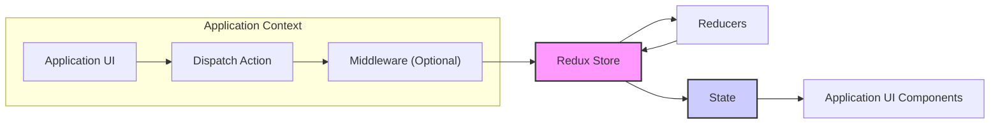

Okay, I will improve the Redux design document based on your feedback. Here is the improved version:

# Project Design Document: Redux State Management Library (Improved)

## 1. Introduction

This document provides an enhanced design overview of the Redux state management library, based on the project at [https://github.com/reduxjs/redux](https://github.com/reduxjs/redux).  This revised document aims to provide a more detailed and actionable foundation for threat modeling and security analysis. It expands on the architecture, component descriptions, data flow, and security considerations to offer a more comprehensive understanding of Redux from a security perspective.

Redux remains a predictable state container for JavaScript applications, emphasizing consistent behavior across environments and ease of testing. While often used with UI frameworks like React, its framework-agnostic nature allows for broader application.

This document continues to focus on the core Redux library and its architecture, rather than specific integrations. The security discussion is refined to be more targeted and practical within the typical client-side web application context where Redux is commonly deployed.

## 2. System Architecture

### 2.1. Architecture Diagram

### 2.2. Component Description (Enhanced)

This section provides more detailed descriptions of each Redux component, emphasizing their roles and interactions within the system.

*   **Application UI**:
    *   **Purpose**:  The visual interface through which users interact with the application. It's responsible for presenting data to the user and capturing user inputs.
    *   **Functionality**: Renders UI elements, handles user events (clicks, form submissions, etc.), and displays data retrieved from the Redux state. Triggers state changes by dispatching actions based on user interactions or application logic.
    *   **Security Relevance**:  Vulnerable to client-side attacks like XSS.  The UI must be designed to prevent injection vulnerabilities and handle data securely. It's the entry point for user-initiated actions that can affect the application state.

*   **Dispatch Action**:
    *   **Purpose**: To signal an intent to modify the application state. Actions are the *only* mechanism to trigger state updates in Redux.
    *   **Functionality**:  Packages user intents or system events into plain JavaScript objects. These objects typically include a `type` (identifying the action) and an optional `payload` (carrying data related to the action).
    *   **Security Relevance**: Actions carry data that will be processed by reducers and potentially stored in the application state. Malicious or improperly constructed actions could be used to inject harmful data or trigger unintended state changes. Action payloads should be validated and sanitized.

*   **Middleware (Optional)**:
    *   **Purpose**: To provide a customizable interception layer for actions between the point of dispatch and reaching the reducer. Enables cross-cutting concerns like logging, asynchronous operations, and conditional action processing.
    *   **Functionality**: Functions that receive each dispatched action and can perform operations before passing the action to the next middleware in the chain or to the reducer. Middleware can:
        *   Log actions for debugging and auditing.
        *   Perform asynchronous operations (e.g., API calls) based on actions.
        *   Modify actions before they reach reducers.
        *   Halt action propagation.
    *   **Security Relevance**: Middleware operates with elevated privileges in the Redux flow. Malicious or poorly designed middleware can:
        *   Log sensitive data insecurely.
        *   Modify actions to bypass security checks or introduce vulnerabilities.
        *   Introduce new vulnerabilities if they interact with external systems insecurely.
        *   Create denial-of-service conditions by blocking action processing.

*   **Redux Store**:
    *   **Purpose**: The single source of truth for the application's state. Manages the state lifecycle and provides controlled access to state and state updates.
    *   **Functionality**: Holds the entire application state tree. Provides APIs:
        *   `getState()`:  Returns the current application state.
        *   `dispatch(action)`:  Sends an action through the middleware pipeline and to the reducers.
        *   `subscribe(listener)`:  Allows components to register listeners to be notified of state changes.
        *   `replaceReducer(nextReducer)`:  Dynamically swaps the reducer function (advanced feature).
    *   **Security Relevance**: The store holds the application's state, which may contain sensitive data. Access to the store and its data should be implicitly controlled by the application's client-side context. However, vulnerabilities in other parts of the application (like XSS) can lead to unauthorized access to the store's data.  The integrity of the store is crucial; any corruption could lead to unpredictable application behavior.

*   **Reducers**:
    *   **Purpose**: To define how the application state transitions in response to actions. Reducers are pure functions, ensuring predictable state updates.
    *   **Functionality**:  Take the current state and an action as input and return a *new* state based on the action's type and payload. Reducers must be pure functions – no side effects, deterministic output for the same input. Often composed using `combineReducers` to manage complex state structures.
    *   **Security Relevance**: Reducers are responsible for processing action payloads and updating the state. Vulnerabilities in reducers can arise from:
        *   Improper handling of action payloads, leading to injection vulnerabilities if payloads are not validated or sanitized.
        *   Logic errors in state updates that could lead to data corruption or unintended application behavior.
        *   Accidental exposure or logging of sensitive data during state updates.

*   **State**:
    *   **Purpose**: Represents the application's data at a specific point in time. It's the model of the application's current condition.
    *   **Functionality**: A plain JavaScript object (or immutable data structure) that stores all the data needed by the application.  Immutable in Redux – state is never mutated directly; reducers always return new state objects.
    *   **Security Relevance**: The state may contain sensitive user data, application configuration, or operational data. Protecting the confidentiality and integrity of the state is paramount.  While Redux itself enforces immutability, the data within the state still needs to be handled securely by the application.

*   **Application UI Components**:
    *   **Purpose**: To display data from the Redux state and allow users to interact with the application, reflecting the current application state.
    *   **Functionality**: Connect to the Redux store to access relevant parts of the state using mechanisms like `connect` (in React Redux). Re-render automatically when subscribed state portions change. Dispatch actions to trigger state updates based on user interactions.
    *   **Security Relevance**: UI components display data from the state. If the state contains sensitive data, the UI must handle it securely to prevent information disclosure.  UI components are also the source of actions, so they must be designed to dispatch valid and safe actions.

## 3. Data Flow (Enhanced)

The unidirectional data flow in Redux is critical for predictability and security. This section elaborates on each step.

1.  **Action Dispatch (Initiation)**:
    *   **Trigger**: User interaction in the UI, application logic execution, or external events (e.g., WebSocket message).
    *   **Process**: UI component or application code calls `store.dispatch(action)`. The `action` object is created, encapsulating the intent to change the state.
    *   **Security Note**: This is the entry point for state modifications. Ensure actions are constructed securely and payloads are validated at the source if possible.

2.  **Middleware Interception (Pre-processing)**:
    *   **Process**: Dispatched action passes through the configured middleware pipeline in order. Each middleware function is invoked with the `action` and store's `dispatch` and `getState` methods.
    *   **Functionality**: Middleware can perform side effects, modify the action, delay it, log it, or stop its propagation.
    *   **Security Note**: Middleware has significant power. Secure middleware design and vetting are crucial.  Middleware should not introduce vulnerabilities or leak sensitive information.

3.  **Reducer Execution (State Transformation)**:
    *   **Process**: After middleware processing (or directly from dispatch if no middleware), the action reaches the store's reducer function. The reducer is called with the current `state` and the `action`.
    *   **Functionality**: The reducer determines the next state based on the action type and payload. It returns a *new* state object.
    *   **Security Note**: Reducers must handle action payloads securely. Input validation and sanitization should occur within reducers to prevent injection attacks and data corruption. Reducer logic should be robust and avoid introducing vulnerabilities during state updates.

4.  **State Update (Persistence)**:
    *   **Process**: The Redux store receives the new state returned by the reducer. It replaces the previous state with the new state.
    *   **Functionality**: The store manages the state lifecycle and ensures that the state is updated immutably.
    *   **Security Note**: The store is the container for the application state. Its integrity is vital. While Redux ensures immutability, the security of the data within the state depends on how it's handled in reducers and middleware.

5.  **Subscription Notification (Propagation)**:
    *   **Process**: After the state is updated, the store iterates through its subscribers (components that have called `store.subscribe`). Each subscriber's listener function is executed.
    *   **Functionality**: Notifies UI components and other parts of the application that the state has changed, triggering re-renders or other reactions.
    *   **Security Note**:  Subscription mechanisms themselves are not direct security threats, but inefficient or poorly managed subscriptions can lead to performance issues, which can indirectly impact security (e.g., denial of service).

6.  **UI Update (Reflection)**:
    *   **Process**: UI components that are connected to the store and subscribed to relevant state portions receive notifications and re-render.
    *   **Functionality**: UI components update to reflect the new application state, providing users with the latest data and application status.
    *   **Security Note**: UI components must render data securely, especially sensitive data from the state. Prevent XSS vulnerabilities when displaying state data in the UI.

## 4. Security Considerations (Enhanced and Categorized)

This section provides a more structured and detailed breakdown of security considerations, categorized by threat types and components.

*   **4.1. Input Validation and Sanitization (Injection Prevention)**:
    *   **Threat**: Injection attacks (e.g., Cross-Site Scripting (XSS), potentially less direct forms of injection depending on state usage).
    *   **Vulnerable Components**:
        *   **Reducers**:  If action payloads are directly incorporated into the state without validation or sanitization, reducers become injection points.
        *   **Middleware**: If middleware modifies actions based on external input without validation, it can also introduce injection risks.
        *   **Application UI**: While not directly Redux, the UI is the source of actions and must sanitize user inputs before dispatching actions.
    *   **Mitigation**:
        *   **Validate all action payloads** within reducers and middleware before using them to update the state.
        *   **Sanitize data** before storing it in the state if there's a risk of it being rendered in the UI without proper escaping.
        *   **Use secure coding practices** in reducers and middleware to avoid introducing vulnerabilities.

*   **4.2. Data Confidentiality and Information Disclosure**:
    *   **Threat**: Unauthorized access to sensitive data stored in the Redux state, information leakage.
    *   **Vulnerable Components**:
        *   **Redux Store**: Holds all application state, making it a target for information disclosure if client-side vulnerabilities exist.
        *   **Middleware (Logging)**: Middleware that logs actions or state changes might unintentionally log sensitive data insecurely.
        *   **Application UI Components**:  Improper handling of sensitive data when rendering it in the UI can lead to information disclosure.
    *   **Mitigation**:
        *   **Minimize storage of sensitive data in the Redux state** if it's not absolutely necessary for client-side logic.
        *   **Encrypt or obfuscate sensitive data** in the state if it must be stored client-side (consider the limitations of client-side encryption).
        *   **Review middleware logging practices** to ensure sensitive data is not logged insecurely.
        *   **Implement proper access control and data handling** in UI components to prevent unauthorized disclosure of sensitive information.

*   **4.3. Middleware Security and Integrity**:
    *   **Threat**: Malicious or compromised middleware introducing vulnerabilities, modifying application behavior in unintended ways, or exfiltrating data.
    *   **Vulnerable Components**:
        *   **Middleware**:  Third-party or custom middleware is a potential attack vector if not properly vetted.
    *   **Mitigation**:
        *   **Use only trusted and well-maintained middleware libraries**.
        *   **Thoroughly review the code of custom middleware** for security vulnerabilities.
        *   **Implement code integrity checks** for middleware if possible to detect tampering.
        *   **Principle of least privilege**: Middleware should only have the necessary permissions and access to data.

*   **4.4. Dependency Vulnerabilities**:
    *   **Threat**: Vulnerabilities in Redux itself or its ecosystem libraries (React Redux, Redux Thunk, etc.).
    *   **Vulnerable Components**:
        *   **Redux Core and Ecosystem Libraries**:  Dependencies can contain known vulnerabilities.
    *   **Mitigation**:
        *   **Regularly update Redux and all related dependencies** to patch known vulnerabilities.
        *   **Use dependency scanning tools** to identify and address vulnerabilities in project dependencies.
        *   **Monitor security advisories** for Redux and its ecosystem.

*   **4.5. State Integrity and Data Corruption**:
    *   **Threat**: Actions or reducers causing unintended state modifications or data corruption, leading to application malfunction or security issues.
    *   **Vulnerable Components**:
        *   **Reducers**: Logic errors in reducers can lead to state corruption.
        *   **Middleware**:  Middleware that modifies actions incorrectly can also contribute to state corruption.
    *   **Mitigation**:
        *   **Thoroughly test reducers and middleware** to ensure they function as expected and do not introduce data corruption.
        *   **Use immutability best practices** in reducers to prevent accidental state mutations.
        *   **Implement state validation mechanisms** if necessary to detect and handle state corruption.

## 5. Threat Modeling Context (Enhanced and Actionable)

This design document serves as the initial step for a comprehensive threat model.  Here's how to proceed with threat modeling in the context of Redux:

*   **5.1. Asset Identification**:
    *   **Examples**:
        *   **User Data in State**: Personally Identifiable Information (PII), user preferences, application-specific user data.
        *   **Application State Integrity**: Ensuring the application state is consistent and not corrupted.
        *   **Application Functionality**:  Availability and correct operation of application features that rely on Redux state.
        *   **Confidential Application Logic in Reducers/Middleware**:  Proprietary algorithms or business logic implemented in reducers or middleware.

*   **5.2. Threat Identification (STRIDE per Component)**:
    *   Apply the STRIDE model (Spoofing, Tampering, Repudiation, Information Disclosure, Denial of Service, Elevation of Privilege) to each Redux component:
        *   **Application UI**:  Spoofing (fake UI elements), Tampering (DOM manipulation), Information Disclosure (displaying sensitive data), Denial of Service (client-side resource exhaustion).
        *   **Dispatch Action**: Tampering (modifying actions in transit - less direct in client-side Redux, but consider browser extensions), Repudiation (action origin not easily traceable).
        *   **Middleware**: Tampering (malicious middleware modifying actions/state), Information Disclosure (middleware logging sensitive data), Denial of Service (middleware blocking action processing), Elevation of Privilege (middleware gaining access to more data than needed).
        *   **Redux Store**: Tampering (state corruption if vulnerabilities exist elsewhere), Information Disclosure (unauthorized access to state data via XSS).
        *   **Reducers**: Tampering (reducer logic errors leading to state corruption), Information Disclosure (reducers accidentally logging sensitive data), Denial of Service (complex reducer logic causing performance issues).
        *   **State**: Information Disclosure (sensitive data in state exposed via client-side vulnerabilities), Tampering (state corruption).
        *   **Application UI Components**: Information Disclosure (UI components displaying sensitive state data insecurely), Denial of Service (inefficient rendering logic).

*   **5.3. Vulnerability Analysis (Component-Specific)**:
    *   For each identified threat, analyze potential vulnerabilities in the Redux architecture and its implementation within the application.
    *   **Examples**:
        *   **Threat: XSS leading to Information Disclosure of State Data.**
            *   **Vulnerability**: Lack of output encoding in UI components when rendering data from the Redux state.
        *   **Threat: Malicious Middleware Logging Sensitive Data.**
            *   **Vulnerability**: Middleware configured to log entire actions or state objects without filtering sensitive information.
        *   **Threat: Reducer Logic Error Causing State Corruption.**
            *   **Vulnerability**:  Reducer logic that incorrectly updates state based on certain action types, leading to inconsistent or invalid state.

*   **5.4. Risk Assessment and Mitigation**:
    *   Evaluate the likelihood and impact of each threat and vulnerability.
    *   Prioritize risks based on severity.
    *   Define and implement security controls (mitigations) as outlined in section 4.
    *   Examples of controls: Input validation in reducers, secure coding practices in middleware, regular dependency updates, security testing (static and dynamic analysis).

By following these steps, and using this design document as a reference, you can conduct a more effective and targeted threat model for applications utilizing Redux, leading to improved security posture.