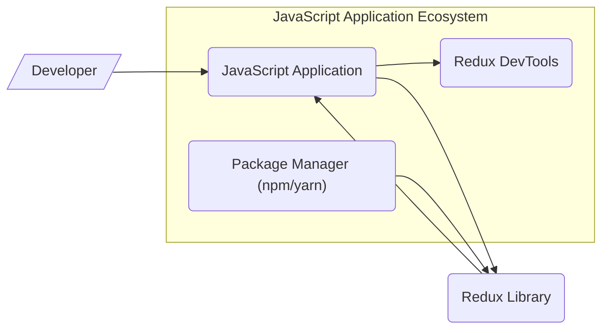
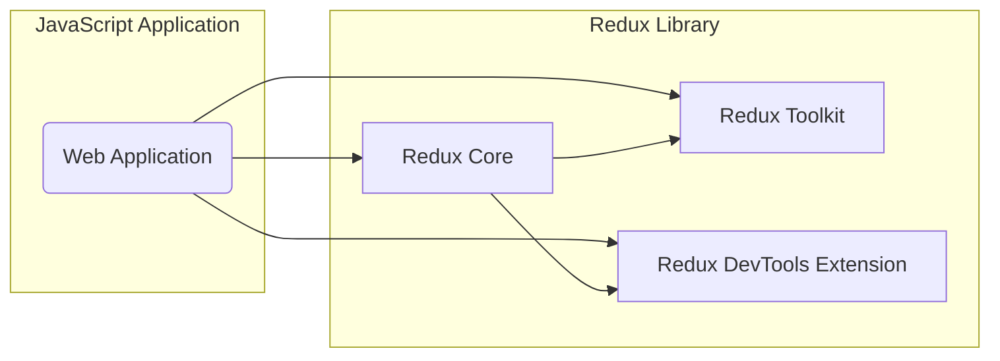
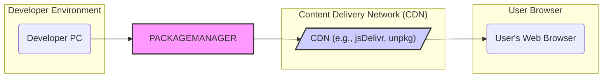

# BUSINESS POSTURE

Redux is a predictable state container for JavaScript applications. It helps developers write applications that behave consistently, run in different environments (client, server, and native), and are easy to test. Redux is primarily focused on solving the complexity of state management in front-end applications, making it easier to reason about application data flow and enabling features like time-travel debugging.

Business priorities and goals:
- Provide a stable and reliable state management solution for JavaScript developers.
- Maintain a performant library that doesn't introduce significant overhead to applications.
- Ensure ease of use and integration with various JavaScript frameworks and environments.
- Foster a strong community around the library for support and contributions.
- Continuously improve the library with new features and bug fixes based on community feedback and evolving web development practices.

Most important business risks:
- Security vulnerabilities in Redux could be exploited in applications using it, leading to data breaches or application malfunctions.
- Performance issues in Redux could negatively impact the performance of applications, leading to poor user experience.
- Instability or breaking changes in Redux could disrupt development workflows and require significant application updates.
- Lack of community support or maintainership could lead to stagnation and eventual obsolescence of the library.

# SECURITY POSTURE

Existing security controls:
- security control: Code hosted on GitHub, leveraging GitHub's security features for repository management and access control. (Implemented: GitHub repository settings)
- security control: Publicly accessible issue tracker on GitHub for reporting bugs and security vulnerabilities. (Implemented: GitHub Issues)
- security control: Community contributions are reviewed through pull requests. (Implemented: GitHub Pull Request workflow)
- security control: Usage of linters and code formatters to maintain code quality and consistency. (Likely implemented: within development and CI scripts, details not explicitly in README)
- security control: Unit tests to ensure code functionality and prevent regressions. (Likely implemented: within development and CI scripts, details not explicitly in README)

Accepted risks:
- accepted risk: Reliance on community for identifying and reporting security vulnerabilities.
- accepted risk: Potential for vulnerabilities to be introduced through community contributions if reviews are not thorough enough.
- accepted risk: Open source nature implies public availability of code, potentially making it easier for attackers to find vulnerabilities.

Recommended security controls:
- recommended security control: Implement automated dependency scanning to detect known vulnerabilities in third-party dependencies.
- recommended security control: Integrate static application security testing (SAST) tools into the CI/CD pipeline to automatically identify potential security flaws in the code.
- recommended security control: Conduct periodic security audits or penetration testing, especially before major releases.
- recommended security control: Establish a clear process for handling security vulnerability reports, including responsible disclosure and timely patching.
- recommended security control: Publish security advisories for any identified vulnerabilities and their fixes.

Security requirements:
- Authentication: Not directly applicable as Redux is a client-side library and does not handle user authentication itself. Applications using Redux will handle authentication independently.
- Authorization: Not directly applicable as Redux is a state management library. Authorization logic resides within the application using Redux, based on the application's requirements and state managed by Redux.
- Input validation: Redux reducers and action creators should perform input validation to ensure data integrity and prevent unexpected behavior. This is crucial to avoid issues in applications using Redux. Validation should be implemented within the library's API where user-provided data is processed.
- Cryptography: Cryptography is generally not a core requirement for Redux itself. However, applications using Redux might need to store sensitive data in the state. In such cases, the application is responsible for implementing encryption and secure storage mechanisms, potentially leveraging browser or environment-specific APIs. Redux should not introduce any cryptographic vulnerabilities.

# DESIGN

## C4 CONTEXT



Context Diagram Elements:

- Element:
    - Name: Developer
    - Type: Person
    - Description: Software developers who use Redux to build JavaScript applications.
    - Responsibilities: Develop and maintain JavaScript applications using Redux, integrate Redux into their projects, and contribute to the Redux community.
    - Security controls: Secure development practices, code reviews, and adherence to security guidelines when using Redux in their applications.

- Element:
    - Name: JavaScript Application
    - Type: Software System
    - Description: Applications built using JavaScript frameworks or libraries (like React, Angular, Vue) that utilize Redux for state management.
    - Responsibilities: Implement application logic, manage user interactions, display data, and interact with backend services. Uses Redux to manage application state predictably.
    - Security controls: Application-level security controls, including authentication, authorization, input validation, output encoding, and secure communication with backend services. These are the responsibility of the application developers, not Redux itself.

- Element:
    - Name: Redux Library
    - Type: Software System
    - Description: The Redux JavaScript library, providing core state management functionalities.
    - Responsibilities: Provide a predictable state container, manage state updates through reducers, enable state access and modification through actions, and facilitate integration with UI frameworks.
    - Security controls: Input validation within Redux APIs, secure coding practices during development, and vulnerability management for the library itself.

- Element:
    - Name: Redux DevTools
    - Type: Software System
    - Description: Browser extension and standalone application for debugging Redux applications, allowing developers to inspect state changes and time-travel debug.
    - Responsibilities: Provide debugging capabilities for Redux applications, allow inspection of application state and actions, and facilitate time-travel debugging.
    - Security controls: DevTools should not introduce security vulnerabilities into the application. Access to DevTools is typically limited to developers during development and debugging phases.

- Element:
    - Name: Package Manager (npm/yarn)
    - Type: Software System
    - Description: Package managers used to distribute and install Redux library and its related packages.
    - Responsibilities: Host and distribute Redux packages, manage dependencies, and facilitate installation of Redux into JavaScript projects.
    - Security controls: Package managers should have security measures to prevent malware injection and ensure package integrity. Developers should use trusted package managers and verify package integrity.

## C4 CONTAINER



Container Diagram Elements:

- Element:
    - Name: Web Application
    - Type: Container
    - Description: Represents the JavaScript application that is built using Redux. This could be a single-page application, a web component, or part of a larger web application.
    - Responsibilities: Implements the user interface, application logic, interacts with backend services, and uses Redux for state management.
    - Security controls: Application-level security controls, including input validation, output encoding, authentication, authorization, and secure communication.

- Element:
    - Name: Redux Core
    - Type: Container
    - Description: The core Redux library, providing the fundamental state management functionalities: store, reducers, actions, and middleware.
    - Responsibilities: Manages the application state, handles state updates based on actions and reducers, and provides APIs for accessing and modifying the state.
    - Security controls: Input validation within Redux APIs, secure coding practices, and vulnerability management.

- Element:
    - Name: Redux Toolkit
    - Type: Container
    - Description: A set of utilities and functions to simplify common Redux patterns and reduce boilerplate code, built on top of Redux Core.
    - Responsibilities: Provides simplified APIs for common Redux tasks like creating stores, reducers, and actions, and includes utilities for common use cases like asynchronous actions.
    - Security controls: Inherits security controls from Redux Core, plus secure coding practices in Toolkit-specific utilities.

- Element:
    - Name: Redux DevTools Extension
    - Type: Container
    - Description: Browser extension that integrates with Redux applications to provide debugging and time-travel debugging capabilities.
    - Responsibilities: Intercepts Redux actions and state changes, provides a UI for inspecting state and actions, and allows time-travel debugging.
    - Security controls: DevTools extension should be designed to not introduce security vulnerabilities into the application. Access is limited to development environments.

## DEPLOYMENT

Redux library itself is not "deployed" in the traditional sense of a server application. It is distributed as packages via package managers (npm, yarn) and included directly into JavaScript applications. The deployment context is therefore the deployment of the JavaScript applications that use Redux.

Deployment Architecture: Client-Side Web Application (Common Scenario)



Deployment Diagram Elements (Client-Side Web Application):

- Element:
    - Name: Developer PC
    - Type: Environment
    - Description: The local development machine used by developers to write and test JavaScript applications using Redux.
    - Responsibilities: Development, testing, and building of the JavaScript application.
    - Security controls: Developer workstation security practices, including operating system security, software updates, and protection against malware.

- Element:
    - Name: Package Manager (npm/yarn)
    - Type: Infrastructure
    - Description: Package managers used by developers to download and manage dependencies, including Redux, during development and build processes.
    - Responsibilities: Package management, dependency resolution, and downloading packages from registries.
    - Security controls: Package managers should use secure connections (HTTPS) to download packages and verify package integrity using checksums.

- Element:
    - Name: Content Delivery Network (CDN)
    - Type: Infrastructure
    - Description: CDNs are often used to host and serve JavaScript libraries like Redux to end-users' browsers.
    - Responsibilities: Hosting and delivering Redux library files to users' browsers with low latency and high availability.
    - Security controls: CDN providers implement security measures to protect hosted files and ensure secure delivery (HTTPS). Integrity checks (e.g., SRI - Subresource Integrity) can be used to verify file integrity in browsers.

- Element:
    - Name: User's Web Browser
    - Type: Environment
    - Description: The web browser used by end-users to access and run the JavaScript application that includes Redux.
    - Responsibilities: Executing the JavaScript application, rendering the user interface, and interacting with the user.
    - Security controls: Browser security features, including sandboxing, Content Security Policy (CSP), and protection against cross-site scripting (XSS) and other web-based attacks.

## BUILD

```mermaid
graph LR
    subgraph "Developer"
        DEV[/"Developer PC"/]
    end

    subgraph "Version Control"
        GIT[/"GitHub Repository"/]
    end

    subgraph "CI/CD System"
        CI[/"GitHub Actions"/]
    end

    subgraph "Package Registry"
        NPM[/"npm Registry"/]
    end

    DEV --> GIT: Code Commit
    GIT --> CI: Trigger Build
    CI --> BUILD[/"Build Process (Node.js, npm)"/]
    CI --> TEST[/"Automated Tests (Unit, Linting)"/]
    CI --> SCAN[/"Security Scans (Dependency, SAST)"/]
    CI --> NPM: Publish Package
    BUILD --> TEST
    TEST --> SCAN
    SCAN --> NPM

    style GIT fill:#f9f,stroke:#333,stroke-width:2px
    style CI fill:#ccf,stroke:#333,stroke-width:2px
    style NPM fill:#f9f,stroke:#333,stroke-width:2px
```

Build Process Description:

1. Developer writes code on their local machine (Developer PC).
2. Developer commits and pushes code changes to the GitHub Repository (Version Control).
3. GitHub Actions (CI/CD System) is triggered by code changes.
4. CI system executes the Build Process, which typically involves:
    - Installing dependencies (using npm).
    - Compiling or transpiling code (if necessary).
    - Bundling the library.
5. CI system runs Automated Tests, including:
    - Unit tests to verify functionality.
    - Linting to enforce code style and quality.
6. CI system performs Security Scans:
    - Dependency scanning to check for known vulnerabilities in dependencies.
    - Static Application Security Testing (SAST) to identify potential security flaws in the code.
7. If tests and scans pass, the CI system publishes the built package to the npm Registry (Package Registry).

Build Process Security Controls:

- security control: Version Control (GitHub): Code is stored and managed in a version control system, providing traceability and history of changes. Access control to the repository is managed by GitHub.
- security control: Automated Build Process (GitHub Actions): Build process is automated, reducing manual steps and potential for human error. Build scripts are version-controlled.
- security control: Automated Testing (Unit Tests, Linting): Automated tests ensure code quality and prevent regressions. Linting helps maintain code consistency and identify potential code quality issues.
- security control: Security Scans (Dependency Scanning, SAST): Automated security scans are integrated into the build process to identify potential vulnerabilities early in the development lifecycle.
- security control: Package Registry (npm Registry): npm Registry provides a platform for distributing and managing JavaScript packages. npm has security measures in place to protect against malware and ensure package integrity. Developers should use npm's security features like 2FA for publishing.
- security control: Code Review: Although not explicitly shown in the diagram, code review is a crucial security control in the development process, typically happening before code is merged into the main branch and triggers the CI/CD pipeline.

# RISK ASSESSMENT

Critical business process: Providing a reliable and secure state management library for JavaScript developers. The library's core function is to manage application state predictably and efficiently.

Data we are trying to protect:
- Redux library code itself: Protecting against unauthorized modifications and ensuring code integrity. Sensitivity: High (compromise could affect many applications).
- User data within applications using Redux: Redux itself does not store user data directly, but applications use Redux to manage their state, which may include sensitive user data. Sensitivity: Varies depending on the application (can be high, medium, or low).
- Build and release pipeline: Protecting the integrity of the build and release process to prevent supply chain attacks. Sensitivity: High (compromise could lead to distribution of malicious code).

Data sensitivity:
- Redux library code: Publicly available, but integrity and authenticity are critical.
- Application state managed by Redux: Sensitivity depends entirely on the application using Redux. Could range from non-sensitive UI state to highly sensitive personal or financial data.
- Build and release artifacts: Integrity is critical to ensure users receive genuine and safe library versions.

# QUESTIONS & ASSUMPTIONS

Questions:
- What specific SAST and dependency scanning tools are used in the Redux build process? (Assumption: Some form of automated security scanning is in place).
- Is there a documented process for handling security vulnerability reports for Redux? (Assumption: A standard open-source security reporting process is followed).
- Are there regular security audits or penetration testing performed on Redux? (Assumption: Security audits are performed periodically, especially before major releases, but frequency is unknown).
- What input validation mechanisms are implemented within Redux APIs? (Assumption: Basic input validation is performed, but details need to be verified).

Assumptions:
- BUSINESS POSTURE: Redux project prioritizes stability, performance, and ease of use for developers. Security is considered important for the library's reliability and trustworthiness.
- SECURITY POSTURE: Standard open-source security practices are followed, including code reviews, public issue tracking, and community contributions. GitHub's security features are leveraged for repository management.
- DESIGN: The design is modular, with core functionalities separated from utilities and developer tools. Deployment primarily involves distribution via package managers and CDNs for client-side web applications. Build process is automated using CI/CD and includes basic security checks.