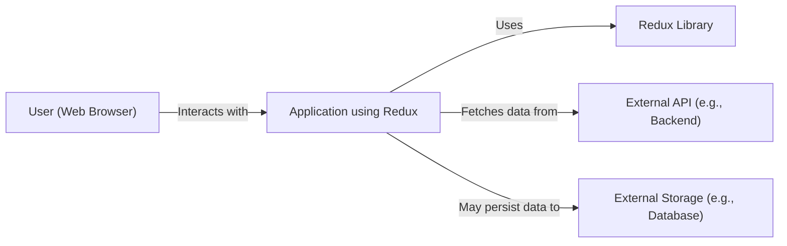
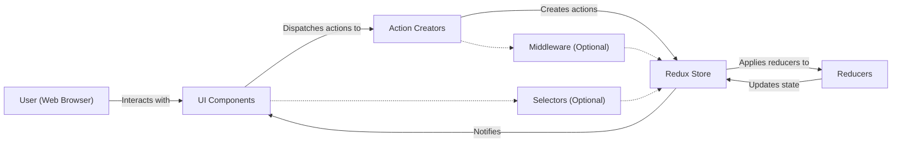
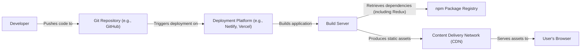
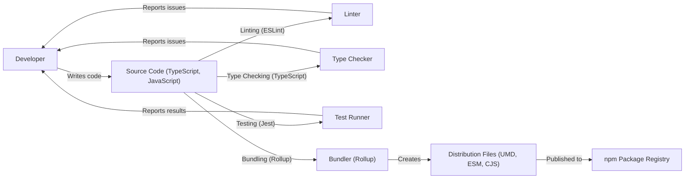

Okay, let's create a design document for the Redux project, focusing on aspects relevant for threat modeling.

# BUSINESS POSTURE

Redux is a predictable state container for JavaScript apps. It helps developers manage application state in a consistent and reliable way, especially in complex applications.  It's not a standalone application but a library incorporated into other applications.  Therefore, the business posture is largely defined by the applications *using* Redux, rather than Redux itself. However, we can define a general posture for Redux as a widely-used open-source library.

Priorities and Goals:

*   Maintainability:  Ensure the library is easy to maintain, update, and debug.  This includes clear code, good documentation, and a strong test suite.
*   Performance:  Minimize performance overhead.  State management should be efficient and not introduce bottlenecks.
*   Predictability:  Guarantee that state changes are predictable and deterministic.  This is the core value proposition of Redux.
*   Extensibility:  Allow developers to extend Redux's functionality through middleware and other mechanisms.
*   Community Trust:  Maintain the trust of the large JavaScript community that relies on Redux. This involves promptly addressing security vulnerabilities and maintaining backward compatibility where possible.
*   Adoption: Encourage continued and widespread adoption by providing a stable, reliable, and well-documented library.

Business Risks:

*   Security Vulnerabilities:  Vulnerabilities in Redux could be exploited in a wide range of applications, leading to data breaches, unauthorized access, or application instability. The impact is magnified by Redux's widespread use.
*   Supply Chain Attacks:  Compromise of the Redux build process, distribution channels (like npm), or dependencies could inject malicious code into applications using Redux.
*   Performance Degradation:  Poorly implemented changes or undiscovered performance issues could negatively impact the performance of applications using Redux.
*   Loss of Community Trust:  Failure to address security issues, introduce breaking changes without proper communication, or a general decline in code quality could lead to developers abandoning Redux for alternatives.
*   Incorrect Implementation by Users: While not a direct risk to Redux itself, incorrect usage of the library by developers can introduce security and stability issues in *their* applications. This highlights the importance of clear documentation and examples.

# SECURITY POSTURE

Existing Security Controls:

*   security control: Code Reviews: All changes to the Redux codebase go through a pull request process with review by maintainers. (Visible on GitHub).
*   security control: Static Analysis: The project uses linters (ESLint) and type checking (TypeScript) to identify potential code quality and security issues. (Visible in the repository configuration files).
*   security control: Testing: A comprehensive test suite helps ensure the correctness and stability of the library, reducing the likelihood of introducing vulnerabilities. (Visible in the `test` directory).
*   security control: Dependency Management: Dependencies are managed using npm and are regularly updated to address security vulnerabilities. (Visible in `package.json` and `package-lock.json`).
*   security control: Security Policy: The project has a `SECURITY.md` file that outlines how to report security vulnerabilities.
*   security control: Immutable state updates: Redux encourages immutable state updates, which helps prevent accidental data corruption and some classes of vulnerabilities.

Accepted Risks:

*   accepted risk: Reliance on Third-Party Dependencies: Redux, like all npm packages, relies on third-party dependencies. While efforts are made to keep these updated, there's an inherent risk of vulnerabilities in these dependencies.
*   accepted risk: User Implementation Errors: Redux provides a framework, but developers can still misuse it in ways that introduce security vulnerabilities in their applications. Redux cannot directly control how it's used.
*   accepted risk: Zero-Day Vulnerabilities:  Like all software, Redux is susceptible to zero-day vulnerabilities that are unknown and unpatched.

Recommended Security Controls:

*   security control: Regular Security Audits: Conduct periodic, independent security audits of the Redux codebase.
*   security control: Fuzz Testing: Implement fuzz testing to identify unexpected behavior and potential vulnerabilities.
*   security control: Supply Chain Security Measures: Explore and implement stronger supply chain security measures, such as signing releases and using tools to verify the integrity of dependencies.
*   security control: Content Security Policy (CSP) Guidance: Provide guidance to developers on how to use Redux in conjunction with CSP to mitigate XSS risks in applications using Redux.

Security Requirements:

*   Authentication: Not directly applicable to Redux itself, as it's a state management library, not an authentication system. Authentication is the responsibility of the application using Redux.
*   Authorization:  Not directly applicable to Redux itself. Authorization logic should be handled within the application using Redux, potentially within reducers or middleware.
*   Input Validation:  Redux itself doesn't handle user input directly. However, actions (which trigger state changes) *should* be treated as untrusted input. Applications using Redux *must* validate data within their action creators or reducers before updating the state.
*   Cryptography: Not directly applicable to Redux in most cases. If sensitive data is stored in the Redux state, the application using Redux is responsible for encrypting and decrypting that data. Redux itself does not provide cryptographic functionality.

# DESIGN

## C4 CONTEXT

Elements Description:

*   Element:
    *   Name: User (Web Browser)
    *   Type: Person
    *   Description: A user interacting with a web application that uses Redux.
    *   Responsibilities: Initiates actions, views the application state.
    *   Security controls: Browser security mechanisms (e.g., same-origin policy, CSP).

*   Element:
    *   Name: Application using Redux
    *   Type: Software System
    *   Description: A web application that utilizes Redux for state management.
    *   Responsibilities: Handles user interactions, dispatches actions to Redux, renders the UI based on the Redux state.
    *   Security controls: Input validation, authentication, authorization, output encoding, secure communication with external systems.

*   Element:
    *   Name: Redux Library
    *   Type: Software System
    *   Description: The Redux library itself, providing a predictable state container.
    *   Responsibilities: Manages application state, processes actions through reducers, provides mechanisms for subscribing to state changes.
    *   Security controls: Code reviews, static analysis, testing, secure dependency management.

*   Element:
    *   Name: External API (e.g., Backend)
    *   Type: Software System
    *   Description: An external API that the application interacts with to fetch or send data.
    *   Responsibilities: Provides data to the application, handles requests from the application.
    *   Security controls: API authentication, authorization, input validation, rate limiting, secure communication (HTTPS).

*   Element:
    *   Name: External Storage (e.g., Database)
    *   Type: Software System
    *   Description: An external storage system where the application may persist data.
    *   Responsibilities: Stores and retrieves data for the application.
    *   Security controls: Database security mechanisms (e.g., access control, encryption), secure communication (e.g., TLS).

## C4 CONTAINER

Elements Description:

*   Element:
    *   Name: User (Web Browser)
    *   Type: Person
    *   Description: A user interacting with the web application.
    *   Responsibilities: Initiates actions, views the application state.
    *   Security controls: Browser security mechanisms.

*   Element:
    *   Name: UI Components
    *   Type: Container: JavaScript
    *   Description: The user interface components of the application.
    *   Responsibilities: Render the UI, handle user input, dispatch actions.
    *   Security controls: Output encoding, XSS prevention.

*   Element:
    *   Name: Action Creators
    *   Type: Container: JavaScript
    *   Description: Functions that create and return Redux action objects.
    *   Responsibilities: Create actions that represent user interactions or other events.
    *   Security controls: Input validation (validate data before including it in actions).

*   Element:
    *   Name: Redux Store
    *   Type: Container: JavaScript
    *   Description: The central store that holds the application state.
    *   Responsibilities: Holds the state, dispatches actions to reducers, notifies subscribers of state changes.
    *   Security controls: Immutable state updates.

*   Element:
    *   Name: Reducers
    *   Type: Container: JavaScript
    *   Description: Pure functions that take the current state and an action, and return the new state.
    *   Responsibilities: Update the state based on actions.
    *   Security controls: Input validation (validate action data), immutable state updates.

*   Element:
    *   Name: Middleware (Optional)
    *   Type: Container: JavaScript
    *   Description: Functions that intercept actions before they reach the reducers.
    *   Responsibilities: Can be used for logging, asynchronous operations, authentication, etc.
    *   Security controls: Depends on the specific middleware; may handle authentication, authorization, input validation.

*   Element:
    *   Name: Selectors (Optional)
    *   Type: Container: JavaScript
    *   Description: Functions that extract specific parts of the state from the Redux store.
    *   Responsibilities: Efficiently retrieve data from the store.
    *   Security controls: None specific, as they only read data.

## DEPLOYMENT

Redux is a JavaScript library, not a standalone application. Therefore, its "deployment" is as a dependency within other applications.  There are several ways applications using Redux can be deployed:

Possible Deployment Solutions:

1.  Traditional Web Server: The application (including Redux) is built into static files (HTML, CSS, JavaScript) and served from a web server like Apache, Nginx, or IIS.
2.  Cloud Platforms (PaaS): Platforms like Heroku, Netlify, Vercel, or AWS Amplify manage the deployment and scaling of the application.
3.  Containerized Deployment (Docker, Kubernetes): The application (and its dependencies, including Redux) is packaged into a Docker container and deployed to a container orchestration platform like Kubernetes.
4.  Serverless Functions: Parts of the application logic (potentially including interactions with the Redux store) can be deployed as serverless functions (e.g., AWS Lambda, Azure Functions, Google Cloud Functions).

Chosen Deployment Solution (Cloud Platforms - PaaS):

We'll describe deployment using a PaaS like Netlify or Vercel, as this is a common and straightforward approach for deploying modern JavaScript applications.

Elements Description:

*   Element:
    *   Name: Developer
    *   Type: Person
    *   Description: The developer writing and deploying the application.
    *   Responsibilities: Writes code, commits to Git, configures deployment.
    *   Security controls: Strong passwords, multi-factor authentication, secure development environment.

*   Element:
    *   Name: Git Repository (e.g., GitHub)
    *   Type: Software System
    *   Description: The source code repository for the application.
    *   Responsibilities: Stores code, tracks changes, triggers deployments.
    *   Security controls: Access control, branch protection rules, code review policies.

*   Element:
    *   Name: Deployment Platform (e.g., Netlify, Vercel)
    *   Type: Software System
    *   Description: The platform that automates the build and deployment process.
    *   Responsibilities: Manages deployments, builds the application, deploys to CDN.
    *   Security controls: Platform-specific security features, access control, secure build environment.

*   Element:
    *   Name: Build Server
    *   Type: Node
    *   Description: The server that executes the build process.
    *   Responsibilities: Retrieves dependencies, runs build scripts, produces static assets.
    *   Security controls: Secure build environment, dependency vulnerability scanning.

*   Element:
    *   Name: npm Package Registry
    *   Type: Software System
    *   Description: The registry where Redux and other dependencies are hosted.
    *   Responsibilities: Provides access to npm packages.
    *   Security controls: npm's security measures, package signing (if used).

*   Element:
    *   Name: Content Delivery Network (CDN)
    *   Type: Node
    *   Description: A network of servers that deliver the application's static assets to users.
    *   Responsibilities: Caches and serves static assets, improves performance and availability.
    *   Security controls: DDoS protection, HTTPS, access control.

*   Element:
    *   Name: User's Browser
    *   Type: Node
    *   Description: The user's web browser.
    *   Responsibilities: Renders the application, executes JavaScript code.
    *   Security controls: Browser security mechanisms (e.g., same-origin policy, CSP).

## BUILD

The Redux library itself has a build process that transforms the source code (written in modern JavaScript with TypeScript) into a distributable package published to npm.

Security Controls in Build Process:

*   security control: Linting (ESLint): Enforces code style and identifies potential errors, including some security-related issues.
*   security control: Type Checking (TypeScript): Provides static type checking, which can help prevent certain types of vulnerabilities.
*   security control: Testing (Jest): Runs a comprehensive test suite to ensure code correctness and prevent regressions.
*   security control: Dependency Management: Uses npm to manage dependencies, and `package-lock.json` to ensure consistent builds.  Dependencies should be regularly audited and updated.
*   security control: Automated Build: The build process is automated using npm scripts (visible in `package.json`). This ensures consistency and reduces the risk of manual errors.
*   security control: CI/CD (GitHub Actions): The project uses GitHub Actions for continuous integration and continuous delivery. This automates the build, test, and publishing process, and provides a clear audit trail.

# RISK ASSESSMENT

Critical Business Processes:

*   State Management: The core process is managing application state predictably and reliably.  Failure of this process leads to application instability and incorrect behavior.
*   Library Distribution:  The process of building and distributing the Redux library via npm is critical.  Compromise of this process could lead to widespread distribution of malicious code.

Data Sensitivity:

Redux itself does not handle or store sensitive data *directly*.  It's a state container. The *sensitivity of the data* managed by Redux is entirely dependent on the *application* using Redux.

*   If an application uses Redux to store user authentication tokens, personal information, or financial data, then that data within the Redux store is highly sensitive.
*   If an application uses Redux to store UI state (e.g., whether a modal is open), that data is generally not sensitive.

Therefore, the *application* using Redux is responsible for:

1.  Determining the sensitivity of the data stored in the Redux state.
2.  Implementing appropriate security measures (e.g., encryption, access control) to protect that data.

# QUESTIONS & ASSUMPTIONS

Questions:

*   Are there any specific performance benchmarks or targets that Redux must meet?
*   What is the expected frequency of updates and releases for Redux?
*   What level of support is provided for older versions of Redux?
*   Are there any plans to integrate Redux with specific frameworks or libraries in a way that might introduce new security considerations?
*   What is the process for handling breaking changes in Redux?

Assumptions:

*   BUSINESS POSTURE: We assume a moderate risk appetite, balancing the need for rapid development and community contributions with the need for security and stability.
*   SECURITY POSTURE: We assume that the existing security controls (code reviews, testing, etc.) are consistently applied. We also assume that developers using Redux are responsible for securing their own applications.
*   DESIGN: We assume that the typical use case for Redux is within a web application, interacting with a backend API and potentially persisting data to external storage. We also assume that developers will use the provided tools (action creators, reducers, middleware) as intended. We assume that the build process described is accurate and complete.