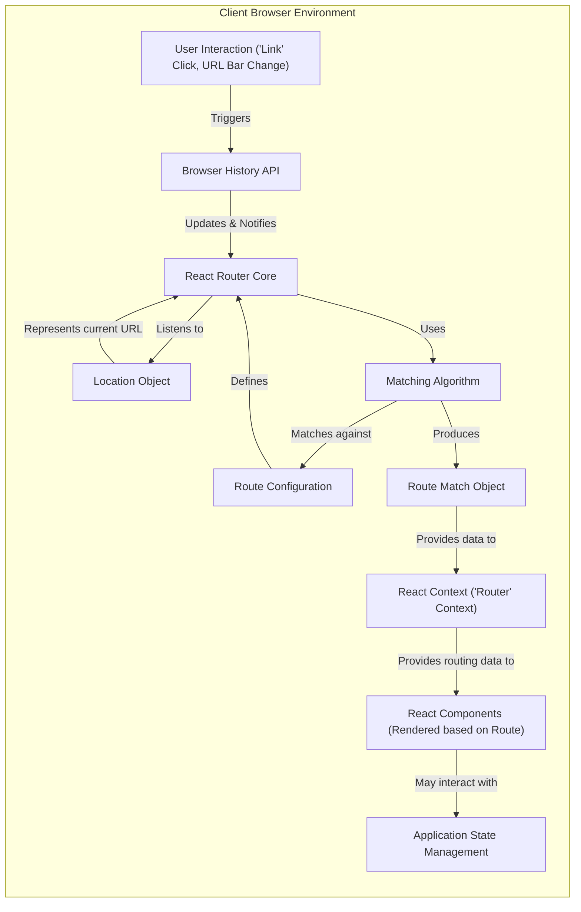
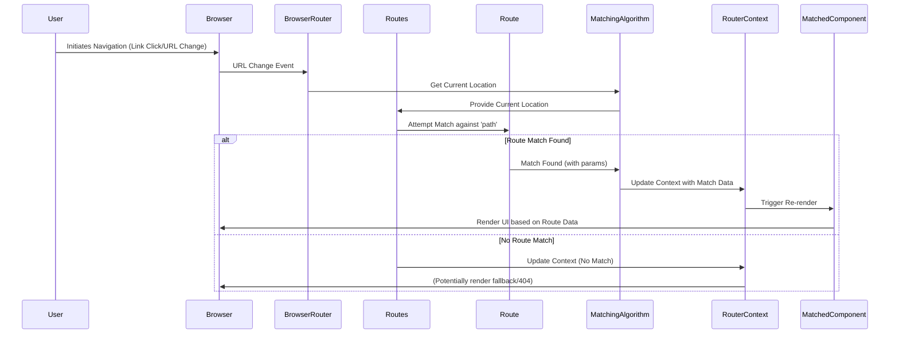

# Project Design Document: React Router

**Version:** 1.1
**Date:** October 26, 2023
**Author:** AI Software Architect

## 1. Introduction

This document provides an enhanced design overview of the React Router project, focusing on version 6 and later as represented by the GitHub repository: [https://github.com/remix-run/react-router](https://github.com/remix-run/react-router). The primary goal is to offer a detailed understanding of the project's architecture, key components, and data flow, specifically tailored for subsequent threat modeling activities. This revision aims to improve clarity and add more security-relevant details.

## 2. Goals

*   Provide a comprehensive and clear overview of the React Router architecture.
*   Identify and describe the responsibilities of key components, with a focus on their security implications.
*   Detail the data flow within the routing process, highlighting potential security-sensitive data transformations.
*   Explicitly identify trust boundaries within the system.
*   Serve as a robust and detailed foundation for identifying potential threats and vulnerabilities.

## 3. Non-Goals

*   In-depth, code-level implementation specifics beyond what is necessary for architectural understanding.
*   Detailed performance analysis or optimization strategies.
*   Specific intricacies of older React Router versions (pre-v6).
*   Direct comparison with alternative client-side routing libraries.
*   Detailed explanation of React's rendering lifecycle.

## 4. High-Level Architecture

React Router facilitates client-side navigation in React applications by mapping URL paths to specific UI components, eliminating full page reloads. The core mechanism involves intercepting navigation events and updating the UI based on defined routes.

**Key Architectural Elements:**

*   **Declarative Route Configuration:** Routes are defined as JSX elements (`<Route>`) nested within a router provider (`BrowserRouter` or `HashRouter`). This declarative approach makes the routing structure explicit and manageable.
*   **Component-Driven Navigation:**  Navigation actions trigger the rendering or unmounting of specific React components associated with the matched route.
*   **Client-Side State Management:** React Router manages the application's location state (the current URL) and makes it accessible to components through React Context.
*   **History Management:**  `BrowserRouter` leverages the browser's History API (`pushState`, `replaceState`), while `HashRouter` uses the URL hash (`#`). This enables navigation without full page reloads.

## 5. Component Breakdown

This section details the key components of React Router, focusing on their responsibilities and potential security implications.

*   **`BrowserRouter`:**
    *   **Responsibility:** Provides routing functionality using the browser's history API, enabling clean URLs. Listens for changes to the browser's URL and updates the application's location state.
    *   **Security Relevance:**  Relies on the browser's security mechanisms for handling history manipulation. Potential vulnerabilities could arise if browser security is compromised.
*   **`HashRouter`:**
    *   **Responsibility:** Provides routing using the URL hash. Useful for scenarios where server-side configuration for arbitrary paths is not feasible.
    *   **Security Relevance:**  Data within the URL hash is visible client-side and might be logged by servers. Avoid storing sensitive information in the hash.
*   **`Routes`:**
    *   **Responsibility:** Acts as a container for defining individual `Route` components. It orchestrates the route matching process, selecting the best matching route based on the current location.
    *   **Security Relevance:** The order and specificity of routes defined within `<Routes>` are crucial for proper access control. Misconfigurations can lead to unintended access.
*   **`Route`:**
    *   **Responsibility:** Defines a mapping between a URL path pattern and a React component to be rendered when the path matches. Can define nested routes for complex application structures.
    *   **Security Relevance:** The `path` prop defines the entry points to different parts of the application. Ensure path patterns are secure and do not inadvertently expose functionality.
*   **`Link`:**
    *   **Responsibility:** A component used for declarative navigation. Renders an `<a>` tag and prevents full page reloads by intercepting clicks and updating the browser history via React Router.
    *   **Security Relevance:** The `to` prop specifies the target URL. Ensure this is constructed safely to prevent open redirects or injection vulnerabilities if derived from user input.
*   **`NavLink`:**
    *   **Responsibility:**  Extends `Link` by providing styling attributes (e.g., active class) when the link's target matches the current route.
    *   **Security Relevance:**  Similar to `Link`, ensure the `to` prop is handled securely. The styling itself doesn't introduce direct security risks.
*   **`Navigate`:**
    *   **Responsibility:** A component that programmatically redirects the user to a different route.
    *   **Security Relevance:** The `to` prop determines the redirection target. Ensure this is validated to prevent open redirects. The `state` prop allows passing data, which should not contain sensitive information.
*   **`useNavigate` Hook:**
    *   **Responsibility:** Provides access to the `navigate` function for programmatic navigation within components.
    *   **Security Relevance:**  The argument passed to `navigate` determines the target URL. Input validation is crucial to prevent open redirects or other malicious navigation.
*   **`useParams` Hook:**
    *   **Responsibility:** Returns an object containing the dynamic parameters extracted from the matched route's URL.
    *   **Security Relevance:**  Data obtained from `useParams` originates from the URL. It should be treated as untrusted input and sanitized before use to prevent XSS or other injection attacks.
*   **`useLocation` Hook:**
    *   **Responsibility:** Returns the current location object, containing information about the URL (`pathname`, `search`, `hash`, `state`).
    *   **Security Relevance:** Provides access to the full URL and associated state. Be cautious when using data from `location.search` or `location.hash` as it originates from the user and can be manipulated. Avoid storing sensitive data in `location.state`.
*   **`useRoutes` Hook:**
    *   **Responsibility:** Allows defining routes using a JavaScript data structure instead of JSX elements.
    *   **Security Relevance:** The security implications are similar to using `<Routes>` and `<Route>` components. Ensure the route configuration data is defined securely.
*   **`Outlet`:**
    *   **Responsibility:**  A placeholder component used in layout routes to render the content of the currently matched child route.
    *   **Security Relevance:**  Does not introduce direct security vulnerabilities but plays a role in how components are rendered based on routing decisions.
*   **Route Matching Algorithm:**
    *   **Responsibility:**  The core logic that determines which `Route` component matches the current URL. It considers path specificity and the order of route definitions.
    *   **Security Relevance:**  Flaws in the matching algorithm could potentially lead to incorrect route resolution and unintended access to components.

## 6. Data Flow

This section details the data flow during a typical navigation event within a React Router application, highlighting potential security-relevant data transformations.

1. **User Initiates Navigation:** The user interacts with the application, either by clicking a `<Link>` component or by manually changing the URL in the browser's address bar.
2. **Browser History Update & Notification:** The browser's History API is updated, and `BrowserRouter` (or `HashRouter`) is notified of the URL change.
3. **Location Object Update:** React Router updates its internal representation of the current location (the `Location` object), which includes `pathname`, `search parameters`, and `hash`.
4. **Route Matching Process:** The `Routes` component receives the updated `Location` object. The route matching algorithm compares the `location.pathname` against the `path` prop of each defined `Route` component.
5. **Route Match Determination:** The algorithm identifies the best matching `Route`. Dynamic segments within the URL are extracted and stored as parameters.
6. **Context Update with Match Data:** React Router updates the `Router` Context with information about the matched route, including parameters and the `Location` object.
7. **Component Re-rendering:** React triggers a re-render of the component tree. Components that subscribe to the `Router` Context (e.g., those using `useParams`, `useLocation`) receive the updated routing information.
8. **Component Rendering based on Route:** The `element` prop of the matched `Route` (the corresponding React component) is rendered within the appropriate `<Outlet>` if nested routes are used.
9. **Data Access and Interaction:** Rendered components can access route parameters using `useParams` and the current location using `useLocation`. This data might be used to fetch data, update application state, or conditionally render UI elements.

## 7. Trust Boundaries

Understanding the trust boundaries within the React Router system is crucial for threat modeling.

*   **Boundary 1: Browser Environment vs. Application Code:** The browser environment is generally considered a less trusted environment. React Router code running within the browser must be resilient to potentially malicious input from the URL or browser APIs.
*   **Boundary 2: URL vs. Application Logic:** The URL itself is an untrusted input. Data derived from the URL (via `useParams`, `useLocation`) should be treated as potentially malicious and sanitized before use within application logic.
*   **Boundary 3: Route Configuration vs. Application Logic:** The route configuration defines the structure and access points of the application. Incorrectly configured routes can create security vulnerabilities. The logic within the components rendered by these routes forms another boundary where data handling needs careful consideration.

## 8. Security Considerations (Detailed)

This section expands on the security considerations relevant to React Router, providing more specific examples and potential threats.

*   **Cross-Site Scripting (XSS) via URL Manipulation:**
    *   **Threat:** Malicious actors could craft URLs containing JavaScript code and trick users into clicking them. If the application directly renders parts of the URL (e.g., query parameters) without sanitization, this code could be executed in the user's browser.
    *   **Example:** A URL like `https://example.com/search?q=` could be used to inject a script if the search query is displayed without proper encoding.
    *   **Mitigation:** Sanitize or escape URL parameters before rendering them in the UI. Use browser APIs like `URLSearchParams` for parsing and avoid directly manipulating the URL string.
*   **Open Redirects via Unvalidated Navigation Targets:**
    *   **Threat:** If the target of a `Link` component or the argument passed to `useNavigate` is derived from user input without validation, an attacker could redirect users to a malicious website.
    *   **Example:** A form with a redirect URL parameter that is directly used in `navigate(userInput)`.
    *   **Mitigation:** Validate and sanitize navigation targets against a whitelist of allowed URLs or paths.
*   **Information Disclosure via URL Parameters:**
    *   **Threat:** Sensitive information should not be included in URL parameters, as these are often logged by servers and visible in browser history.
    *   **Example:** Passing user IDs or API keys directly in the URL.
    *   **Mitigation:** Use alternative methods for passing sensitive data, such as request bodies (for POST requests) or secure session management.
*   **Authorization Bypass due to Route Misconfiguration:**
    *   **Threat:** Incorrectly defined route patterns or a lack of specific route guards could allow unauthorized users to access protected parts of the application.
    *   **Example:** Defining a catch-all route (`/*`) before more specific protected routes.
    *   **Mitigation:** Ensure route paths are specific and ordered correctly. Implement route guards or middleware to enforce authentication and authorization checks before rendering protected components.
*   **Client-Side State Injection via `location.state`:**
    *   **Threat:** While React Router manages `location.state`, be cautious about the data stored here. Malicious scripts or browser extensions could potentially modify this state.
    *   **Mitigation:** Avoid storing highly sensitive information in `location.state`. Treat data retrieved from `location.state` with caution.
*   **Security Implications in Server-Side Rendering (SSR):**
    *   **Threat:** When using SSR, the initial routing decision happens on the server. Vulnerabilities in the SSR setup could allow attackers to manipulate the initial rendering process.
    *   **Mitigation:** Implement proper security measures for the SSR environment, including input validation and protection against injection attacks during server-side rendering.

## 9. Deployment Considerations

Security considerations during the deployment of a React Router application include:

*   **Content Security Policy (CSP):** Implement a strict CSP to mitigate XSS attacks by controlling the sources from which the browser is allowed to load resources.
*   **HTTPS:**  Ensure the application is served over HTTPS to encrypt communication and protect against man-in-the-middle attacks.
*   **Regular Updates:** Keep React Router and all other dependencies updated to patch known security vulnerabilities.
*   **Secure Server Configuration:** If using `BrowserRouter`, ensure the server is configured to correctly handle all application routes and serve the main application entry point for all non-static asset requests. This prevents 404 errors on client-side navigation.

## 10. Future Considerations

*   Detailed analysis of the security implications of future React Router features and API changes.
*   Further investigation into potential vulnerabilities arising from complex nested route configurations.
*   Exploration of integration patterns with authentication and authorization libraries and their security implications.

This enhanced design document provides a more detailed and security-focused overview of React Router, serving as a valuable resource for subsequent threat modeling activities.