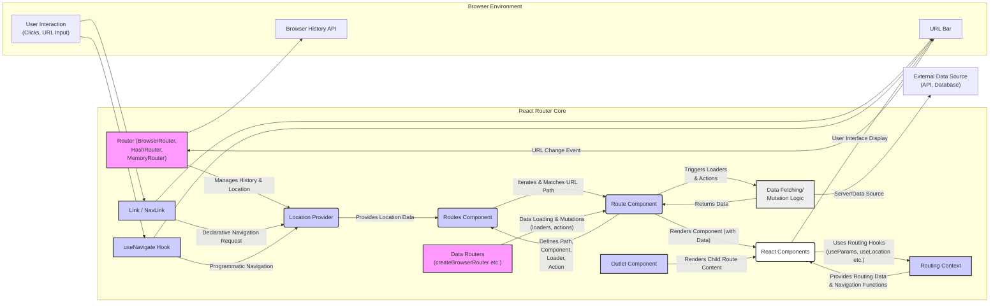

# Project Design Document: React Router for Threat Modeling (Improved)

## 1. Project Overview

React Router is a declarative routing library for React applications, enabling the creation of dynamic, client-side routing within single-page applications (SPAs). It manages the application's URL and renders components based on the current route, providing a smooth navigation experience without full page reloads. This design document details the architecture and key components of React Router to facilitate a comprehensive threat modeling exercise, focusing on security considerations relevant to its client-side nature and integration within web applications.

## 2. Project Goals

The primary goals of React Router are to:

- Provide a declarative and intuitive API for defining application routes using React components.
- Enable flexible and dynamic route matching based on URL patterns, including parameters and wildcards.
- Support nested routes and layout components for structuring complex application UIs and navigation flows.
- Facilitate seamless navigation between routes using declarative `<Link>` components and programmatic navigation APIs.
- Manage browser history and URL updates consistently across different browsers and environments.
- Offer advanced data handling capabilities within the routing context through Data Routers, including data loading (`loader` functions) and mutation (`action` functions).
- Integrate seamlessly with the React component lifecycle, state management, and rendering mechanisms.
- Optimize for performance and efficiency in client-side routing, minimizing overhead and ensuring a responsive user experience.
- Maintain a modular and extensible architecture to accommodate various routing needs and future enhancements.

## 3. System Architecture

React Router's architecture revolves around managing application state based on the URL and rendering corresponding React components. The core components and their interactions are detailed below and visualized in the Mermaid flowchart.

### 3.1. Components (Detailed)

- **Router Components (History Management):**
    - `BrowserRouter`: Utilizes the HTML5 History API (`pushState`, `replaceState`) for clean, standard URLs (e.g., `/path/to/resource`). It's the recommended choice for most modern browser environments, providing proper URL structure and browser history management. It requires server-side configuration to correctly serve the application for all defined routes.
    - `HashRouter`: Employs the hash portion of the URL (e.g., `/#/path/to/resource`) for routing. This is beneficial in environments where server-side configuration for `BrowserRouter` is not feasible, such as static file servers or client-side rendered applications deployed without server-side routing capabilities. It's less preferred for user experience due to the hash in the URL.
    - `MemoryRouter`: Maintains the routing history in memory as an array of URLs. This is primarily used for testing, non-browser environments like React Native, or scenarios where URL persistence or browser history integration is not required. It's useful for isolated component testing and server-side rendering scenarios where browser history is irrelevant.

- **Route Definition Components (Route Matching & Rendering):**
    - `Route`: The fundamental building block for defining a route. It associates a URL path pattern with a React component. When the current URL matches the `Route`'s path, the associated component is rendered. `Route` components can be nested to create hierarchical route structures, enabling layout routes and nested UI segments. Path matching algorithms (like path-to-regexp) are used to determine if a URL matches a route's path, supporting exact matches, parameterized segments, and wildcards.
    - `Routes`: Acts as a container for multiple `Route` components. It iterates through its child `Route` components and renders the *first* `Route` that matches the current location. This ensures that only one route is rendered at a time within a `Routes` block. The order of `Route` components within `Routes` is significant as the first match wins.

- **Navigation Components (User-Initiated & Programmatic Navigation):**
    - `Link`: Renders an accessible `<a>` (anchor) tag. When clicked, it intercepts the default link behavior, prevents a full page reload, and uses the Router's history API to update the URL. This triggers a route transition within the React Router context, re-rendering components based on the new route.
    - `NavLink`: A specialized `Link` component that extends `Link` by adding styling attributes (e.g., `activeClassName`, `activeStyle`) when the link's `to` prop matches the current URL. This is useful for visually highlighting the currently active navigation item in menus or navigation bars.
    - `Navigate`: A component used for programmatic redirection. When rendered, it immediately navigates to a new location, replacing the current history entry by default. It's useful for redirects after form submissions, authentication checks, or conditional routing logic.

- **Outlet Component (Nested Route Rendering):**
    - `Outlet`: A placeholder component used within layout routes. When a parent route with an `Outlet` matches, and a nested child route also matches, the `Outlet` renders the component associated with the *child* route. This enables the creation of reusable layouts that wrap different content based on the current nested route.

- **Hooks (Accessing Routing Context & Functionality):**
    - `useNavigate`: Returns a function that allows programmatic navigation to different routes. This function can be used within components to trigger navigation events based on user interactions or application logic.
    - `useParams`: Returns an object containing key-value pairs of URL parameters matched by the current route. This allows components to access dynamic segments of the URL path.
    - `useLocation`: Returns the current location object, which contains information about the current URL, including pathname, search query, and hash. Components can use this hook to access and react to changes in the URL.
    - `useSearchParams`: Provides utilities for working with the query string part of the URL. It returns functions to read and update query parameters.
    - `useOutletContext`: Enables child routes to access context values provided by their parent layout routes. This facilitates data sharing and communication between parent and child routes within a nested routing structure.

- **Data Router Components (Data Loading & Mutations - Server Interaction):**
    - `createBrowserRouter`, `createHashRouter`, `createMemoryRouter`: These functions create router instances specifically designed for data loading and mutations. They extend the core router functionality to handle server-side interactions within the routing lifecycle.
    - `RouterProvider`:  Provides the router instance created by `createBrowserRouter`, `createHashRouter`, or `createMemoryRouter` to the React component tree. It makes the router's functionality and data context available to all components within its scope.
    - **`loader` functions:**  Route definitions in Data Routers can include `loader` functions. These asynchronous functions are executed *before* a route component is rendered, typically to fetch data required by the component from a server or data source. The data returned by a `loader` is made available to the route component.
    - **`action` functions:** Route definitions can also include `action` functions. These asynchronous functions are executed when a form is submitted within a route or when a mutation is triggered. They are used to handle data modifications, such as creating, updating, or deleting data on the server.

### 3.2. Data Flow and Interactions (Detailed)

1. **Initial Load/Navigation Event:** When the application is initially loaded or a navigation event occurs (user clicks a `<Link>`, programmatic navigation via `useNavigate`, browser back/forward buttons, or direct URL entry), the Router component (e.g., `BrowserRouter`) intercepts the URL change. Browser history events or hash changes are detected and processed.
2. **Location Update:** The Router component updates its internal representation of the current "location" based on the URL change. This location object contains information about the pathname, search query, and hash.
3. **Route Matching Process:** The `Routes` component receives the updated location. It then iterates through its child `Route` components in the order they are defined. For each `Route`, it uses path-matching algorithms to compare the `Route`'s path pattern against the current location's pathname.
4. **Route Match and Component Selection:** The first `Route` component whose path matches the current location is considered the "matched route." The component associated with this matched `Route` is selected for rendering. If no `Route` matches, a fallback component (like a 404 Not Found page, often defined as a `Route` with a path of `*` or no path) might be rendered.
5. **Component Rendering and Outlet Population:** The matched route's component is rendered. If the matched `Route` is a layout route containing an `Outlet`, React Router proceeds to evaluate nested routes within that layout. If a nested route matches, its component is rendered *inside* the `Outlet` of the parent layout component. This process continues recursively for deeply nested routes.
6. **Data Loading (Data Routers - Server Interaction):** If the matched route in a Data Router configuration has a `loader` function defined, this function is executed *before* the route component is rendered. The `loader` typically fetches data from an API or data source. Once the `loader` resolves with data, this data is made available to the route component (and potentially to child routes via `useOutletContext`). The component rendering is then triggered, using the loaded data.
7. **History Management Update:** The Router component updates the browser's history API (or hash/memory history) to reflect the current URL. For `BrowserRouter`, this uses `pushState` or `replaceState` to update the URL in the address bar and browser history. This ensures that browser navigation buttons (back/forward) and history management work correctly.
8. **Hook Access and Component Logic:** Components rendered by routes can use hooks like `useParams`, `useLocation`, `useNavigate`, and `useSearchParams` to access routing information and programmatically interact with the router. These hooks provide access to the current location, URL parameters, and navigation functions, enabling dynamic behavior within route components.

### 3.3. Architecture Diagram (Mermaid Flowchart)

## 4. Technology Stack

React Router is developed using the following technologies:

- **JavaScript (ES6+):** The primary programming language for the library's logic and implementation.
- **React:**  The core UI library that React Router is built upon and deeply integrated with. React's component model and lifecycle are fundamental to React Router's design.
- **Path-to-regexp:**  A library used internally for path matching, converting route path patterns into regular expressions for efficient URL matching.
- **Browser History API (for `BrowserRouter`):**  Standard browser API (`pushState`, `replaceState`, `popstate` event) for managing browser history and URLs in `BrowserRouter`.
- **URL Hash (for `HashRouter`):**  Utilizes the URL hash (`window.location.hash`, `hashchange` event) for routing in `HashRouter`.

## 5. Security Considerations (In-Depth)

Given React Router's client-side nature, security considerations are paramount and extend beyond the library itself to encompass how it's used within an application.

- **Client-Side Routing and Inherent Security Limitations:**
    - **Client-Side Logic Exposure:** All routing logic, component rendering, and client-side authorization checks are executed in the user's browser. This means any security logic implemented solely on the client-side can be inspected and potentially bypassed by a determined attacker. Sensitive logic or data protection *must not* rely exclusively on client-side routing.
    - **Server-Side Authorization Imperative:** Client-side routing should primarily be viewed as a user experience enhancement and navigation mechanism. Security-critical operations, data access, and resource protection *must* be enforced on the server-side. Client-side checks can provide a preliminary UI-level restriction but are not a substitute for robust server-side authorization and validation.

- **Route Definition Security and Access Control:**
    - **Overly Permissive Route Paths:**  Carelessly defined route paths, especially those using broad wildcards (e.g., `/:id*`), can unintentionally expose more application functionality than intended. Thoroughly review route paths to ensure they strictly define the intended access scope.
    - **Accidental Route Overlap:**  Incorrectly ordered or overlapping route definitions within `<Routes>` can lead to unintended route matching. Ensure route paths are distinct and ordered logically to prevent unintended component rendering for specific URLs.
    - **Public Exposure of Internal Routes:** Avoid exposing internal or administrative routes through client-side routing if they are not intended for general user access. Implement proper authentication and authorization to protect such routes, even if they are defined in the client-side routing configuration.

- **Data Handling in Routes and URL Security:**
    - **Sensitive Data in URL Parameters/Query Strings:** Passing sensitive information (e.g., user IDs, API keys, session tokens) directly in URL parameters or query strings is a significant security risk. URLs are often logged in browser history, server logs, and potentially shared or cached insecurely. Avoid passing sensitive data in URLs. Use secure methods like HTTP headers, request bodies (for POST/PUT requests), or secure client-side storage (with caution and encryption if necessary) for sensitive data.
    - **URL Manipulation and Parameter Tampering:** Users can easily manipulate URL parameters and query strings. Route components that rely on URL parameters for critical logic or data retrieval must implement robust validation and sanitization to prevent parameter tampering attacks. Never trust data received solely from URL parameters without server-side verification.
    - **Logging and Caching of URLs:** Be mindful that URLs, including parameters, are often logged by web servers, proxies, and browsers. Avoid including sensitive data in URLs to prevent unintended exposure through logs or caching mechanisms.

- **Cross-Site Scripting (XSS) Vulnerability Context in Route Components:**
    - **Rendering Unsanitized User Input:** Route components that render user-supplied data (e.g., from URL parameters, query strings, or data fetched from APIs) without proper sanitization are vulnerable to XSS attacks. Always sanitize user input before rendering it in route components to prevent malicious scripts from being injected and executed in the user's browser.
    - **Server-Side Rendering and XSS:** Even in server-side rendered React applications using React Router, XSS vulnerabilities can arise if data is not properly sanitized before being rendered on the server. Server-side sanitization is crucial to prevent XSS regardless of the rendering environment.

- **Authorization and Authentication Integration with React Router:**
    - **Client-Side Route Guards (Conditional Rendering):** React Router can be used to implement client-side route guards by conditionally rendering components based on authentication status or user roles. However, these client-side guards are *not* a security mechanism on their own. They are primarily for UI/UX purposes, preventing unauthorized users from *seeing* certain parts of the application, but they do not prevent access to backend resources.
    - **Server-Side Authorization Enforcement:** True security must be enforced on the server-side. When a route component needs to access protected resources or perform sensitive operations, the server-side API endpoints must perform robust authentication and authorization checks to verify the user's identity and permissions before granting access.
    - **Token-Based Authentication and Route Integration:** In token-based authentication (e.g., JWT), route components might need to check for the presence and validity of authentication tokens. However, token validation should ideally be performed on the server for critical operations. Client-side token checks can be used for UI adjustments and preliminary route access control, but server-side validation is essential for security.

- **Denial of Service (DoS) Considerations:**
    - **Complex Route Matching Logic:** While React Router's path matching is generally efficient, extremely complex route configurations with numerous nested routes and intricate path patterns *could* potentially introduce some client-side performance overhead. However, this is rarely a significant DoS risk in typical applications.
    - **Resource-Intensive Route Components:**  A more relevant DoS concern is route components that perform computationally expensive operations or trigger large data fetches on the client-side. If a publicly accessible route renders a component that consumes excessive client-side resources (CPU, memory), it could be exploited for client-side DoS. Optimize component rendering logic and data fetching to minimize client-side resource consumption, especially for routes accessible to unauthenticated users.

- **Dependency Vulnerabilities and Supply Chain Security:**
    - **React Router and React Dependencies:** React Router depends on React and potentially other libraries. Vulnerabilities in these dependencies could indirectly affect applications using React Router. Regularly update React Router and its dependencies to the latest versions to patch known vulnerabilities.
    - **Dependency Scanning and Management:** Employ dependency scanning tools and practices to identify and mitigate known vulnerabilities in React Router's dependencies and the overall project's dependency tree. Use tools like `npm audit`, `yarn audit`, or dedicated security scanning platforms to monitor and manage dependency vulnerabilities.

## 6. Potential Threats (Specific and Actionable)

Based on the architecture and security considerations, here are more specific and actionable potential threats for applications using React Router:

- **Threat 1: Unauthorized Access due to Route Misconfiguration**
    - **Vulnerability:** Overly broad or incorrectly defined route paths (e.g., using `/:admin/*` unintentionally exposing admin routes).
    - **Exploitation:** Attackers could guess or discover these overly permissive routes and access unintended parts of the application, potentially gaining access to sensitive data or administrative functionalities.
    - **Impact:** Data breach, unauthorized modification of data, privilege escalation.
    - **Mitigation:** Rigorously review and test route definitions. Use specific and restrictive path patterns. Implement server-side authorization checks for all sensitive routes, regardless of client-side routing configuration.

- **Threat 2: Client-Side Data Exposure via URL Query Parameters**
    - **Vulnerability:** Passing sensitive data (e.g., user IDs, session-related information) in URL query parameters.
    - **Exploitation:** Sensitive data in URLs can be logged, cached, and easily shared, potentially exposing it to unauthorized parties. Attackers could also manipulate these parameters to attempt to access data belonging to other users.
    - **Impact:** Data breach, privacy violation, session hijacking (in some scenarios).
    - **Mitigation:** Avoid passing sensitive data in URLs. Use secure methods for transmitting sensitive information (e.g., HTTP headers, request bodies, secure cookies). Implement server-side validation and authorization for any data retrieved based on URL parameters.

- **Threat 3: XSS Vulnerabilities in Route Components Rendering User Input**
    - **Vulnerability:** Route components rendering unsanitized user input from URL parameters, query strings, or API responses.
    - **Exploitation:** Attackers could inject malicious scripts into user input, which, when rendered by a route component, would execute in other users' browsers, potentially stealing cookies, session tokens, or performing actions on behalf of the victim.
    - **Impact:** Account compromise, data theft, defacement of the application, malware distribution.
    - **Mitigation:** Sanitize all user input before rendering it in route components. Use React's built-in sanitization mechanisms or trusted sanitization libraries. Implement Content Security Policy (CSP) to further mitigate XSS risks.

- **Threat 4: Client-Side Authorization Bypass Leading to Backend Access**
    - **Vulnerability:** Relying solely on client-side route guards for authorization without server-side enforcement.
    - **Exploitation:** Attackers could bypass client-side route guards by directly making requests to backend API endpoints, even if the client-side UI prevents them from navigating to certain routes.
    - **Impact:** Unauthorized access to backend resources, data manipulation, privilege escalation.
    - **Mitigation:** Implement robust server-side authorization checks for all API endpoints and backend operations. Client-side route guards should only be considered a UI/UX enhancement, not a security control.

- **Threat 5: Client-Side DoS through Resource-Intensive Route Components**
    - **Vulnerability:** Routes rendering components that consume excessive client-side resources (CPU, memory) due to complex computations or large data processing.
    - **Exploitation:** Attackers could repeatedly access these resource-intensive routes, causing performance degradation or crashes in users' browsers, effectively leading to a client-side denial of service.
    - **Impact:** Application unavailability, degraded user experience, potential for wider system instability if client-side DoS impacts server-side resources indirectly.
    - **Mitigation:** Optimize component rendering logic and data processing within route components. Implement client-side performance monitoring and throttling if necessary. Consider server-side rendering for computationally intensive routes.

- **Threat 6: Exploitation of Dependency Vulnerabilities**
    - **Vulnerability:** Known security vulnerabilities in React Router's dependencies (including React itself) or transitive dependencies.
    - **Exploitation:** Attackers could exploit these vulnerabilities to compromise the application or user browsers, depending on the nature of the vulnerability.
    - **Impact:** Wide range of impacts depending on the vulnerability, including XSS, remote code execution, data breaches, and DoS.
    - **Mitigation:** Regularly update React Router and all its dependencies to the latest versions. Use dependency scanning tools to identify and remediate known vulnerabilities. Implement a robust dependency management strategy and monitor security advisories for React Router and its ecosystem.

This improved design document provides a more detailed and security-focused foundation for threat modeling React Router within the context of a web application. The next step would be to use these potential threats as starting points for more granular threat scenario analysis and to develop specific mitigation strategies for each identified threat.