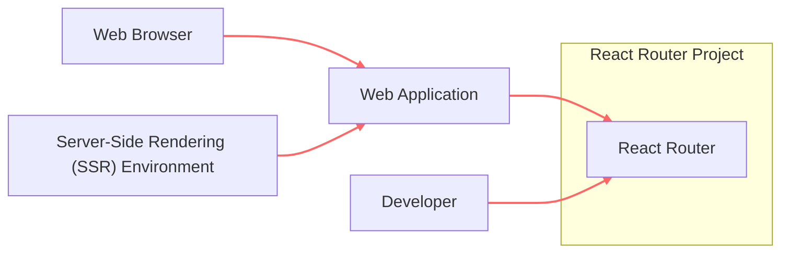
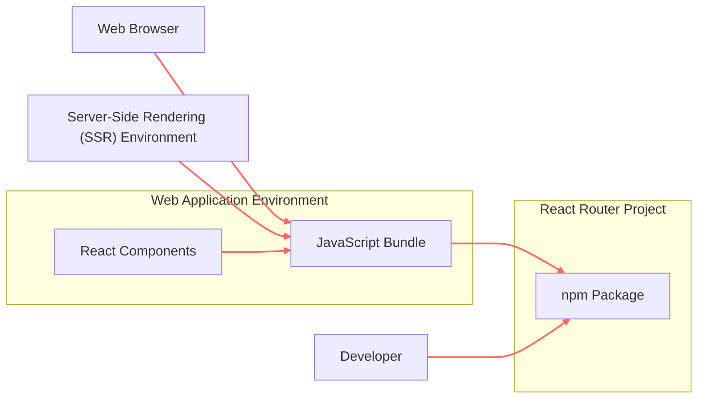
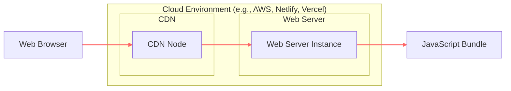
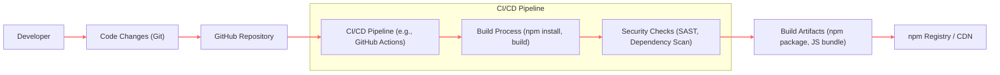

# BUSINESS POSTURE

- Business Priorities and Goals:
  - Provide a declarative routing library for React applications.
  - Simplify navigation and URL management in React applications.
  - Enable developers to build complex user interfaces with clear and maintainable routing logic.
  - Foster a large and active community around the library for continuous improvement and support.
  - Ensure compatibility with various React environments and browser versions.
- Business Risks:
  - Security vulnerabilities in `react-router` could be exploited in applications that depend on it, leading to potential data breaches or application unavailability.
  - Poor performance or bugs in `react-router` could negatively impact the user experience of applications using it.
  - Lack of maintenance or timely updates could lead to the library becoming outdated and insecure.
  - Supply chain attacks targeting `react-router` or its dependencies could introduce malicious code into applications using it.
  - Changes in React or browser standards could break compatibility and require significant rework.

# SECURITY POSTURE

- Existing Security Controls:
  - security control: Open Source Development - The project is hosted on GitHub, allowing for public code review and community contributions, increasing the likelihood of identifying and addressing security issues. Implemented in: GitHub repository.
  - security control: Dependency Management - The project uses `npm` for dependency management, which includes mechanisms for verifying package integrity and provenance. Implemented in: `package.json`, `package-lock.json`, npm registry.
  - security control: Version Control - Git is used for version control, providing a history of changes and enabling rollback in case of issues. Implemented in: Git repository.
- Accepted Risks:
  - accepted risk: Reliance on Community Security Contributions - While open source allows for community review, the project's security posture relies on the vigilance and expertise of community members to identify and report vulnerabilities.
  - accepted risk: Dependency Vulnerabilities - The project depends on third-party libraries, which may contain vulnerabilities that could indirectly affect `react-router`.
  - accepted risk: Time to Patch -  The time it takes to identify, patch, and release fixes for security vulnerabilities depends on the project maintainers and contributors.
- Recommended Security Controls:
  - security control: Automated Security Scanning - Implement automated Static Application Security Testing (SAST) and Dependency Scanning in the CI/CD pipeline to detect potential vulnerabilities in the code and dependencies.
  - security control: Security Audits - Conduct periodic security audits by external security experts to identify and address potential weaknesses in the library's design and implementation.
  - security control: Vulnerability Disclosure Policy - Establish a clear vulnerability disclosure policy to guide security researchers on how to report vulnerabilities responsibly.
  - security control: Security Champions - Designate security champions within the development team to promote security awareness and best practices.
- Security Requirements:
  - Authentication: Not directly applicable to `react-router` itself, as it is a client-side routing library. Authentication is typically handled by the application using `react-router`.
  - Authorization: `react-router` plays a role in client-side authorization by controlling access to different routes based on application logic. Applications using `react-router` should implement authorization checks within route components or higher-order components.
  - Input Validation: `react-router` processes URL paths and parameters. Input validation is important to prevent issues like Cross-Site Scripting (XSS) if route parameters are dynamically rendered into the DOM without proper sanitization in the application using `react-router`. Applications should ensure proper encoding and sanitization of route parameters.
  - Cryptography: Cryptography is not a core requirement for `react-router` itself. However, applications using `react-router` will likely use cryptography for secure communication (HTTPS) and potentially for client-side data encryption, which is outside the scope of `react-router`.

# DESIGN

## C4 CONTEXT

- Context Diagram Elements:
  - - Name: React Router
    - Type: Software System
    - Description: A declarative routing library for React applications, responsible for managing navigation and URL changes within web applications.
    - Responsibilities:
      - Defining and matching routes based on URL paths.
      - Providing components and hooks for navigation and route parameter access.
      - Managing browser history and URL updates.
    - Security controls:
      - Security control: Input validation (URL parsing and parameter handling).
  - - Name: Web Application
    - Type: Software System
    - Description: A web application built using React and utilizing `react-router` for routing. This is the system that directly uses `react-router`.
    - Responsibilities:
      - Implementing application-specific logic and features.
      - Handling user authentication and authorization.
      - Rendering UI components based on routes provided by `react-router`.
      - Interacting with backend services and APIs.
    - Security controls:
      - Security control: Authentication and Authorization mechanisms.
      - Security control: Input validation for application data.
      - Security control: Output encoding to prevent XSS.
  - - Name: Web Browser
    - Type: Person / System
    - Description: The web browser used by end-users to access and interact with the web application.
    - Responsibilities:
      - Rendering web pages and executing JavaScript code.
      - Handling user interactions (clicks, form submissions, etc.).
      - Managing browser history and navigation.
    - Security controls:
      - Security control: Browser security features (e.g., Content Security Policy, Same-Origin Policy).
  - - Name: Server-Side Rendering (SSR) Environment
    - Type: Software System
    - Description: An environment where React applications are rendered on the server before being sent to the browser. This could be a Node.js server or a similar environment.
    - Responsibilities:
      - Pre-rendering React components on the server.
      - Providing initial HTML content to the browser for faster loading and SEO.
      - Potentially handling routing on the server-side as well.
    - Security controls:
      - Security control: Server-side security configurations.
      - Security control: Input validation and output encoding on the server.
  - - Name: Developer
    - Type: Person
    - Description: Software developers who use `react-router` to build web applications.
    - Responsibilities:
      - Integrating `react-router` into React applications.
      - Defining routes and navigation logic.
      - Ensuring secure usage of `react-router` within their applications.
    - Security controls:
      - Security control: Secure coding practices.
      - Security control: Code review.

## C4 CONTAINER

- Container Diagram Elements:
  - - Name: npm Package
    - Type: Container
    - Description: The `react-router` library distributed as an npm package. This is the distributable unit of the library.
    - Responsibilities:
      - Packaging and distributing the `react-router` library.
      - Providing different build artifacts (e.g., CommonJS, ES modules).
      - Managing dependencies of the library.
    - Security controls:
      - Security control: npm package signing.
      - Security control: Dependency vulnerability scanning during development.
  - - Name: JavaScript Bundle
    - Type: Container
    - Description: The bundled JavaScript code of the web application, including `react-router` and application-specific code, ready to be executed in the browser or SSR environment.
    - Responsibilities:
      - Executing routing logic provided by `react-router`.
      - Rendering React components based on the current route.
      - Handling user interactions and updating the UI.
    - Security controls:
      - Security control: Client-side input validation and output encoding.
      - Security control: Browser security features.
  - - Name: React Components
    - Type: Container
    - Description: React components within the web application that utilize `react-router` components and hooks for navigation and routing.
    - Responsibilities:
      - Defining the UI structure and behavior for different routes.
      - Using `react-router` components like `BrowserRouter`, `Route`, `Link`, etc.
      - Implementing route-specific logic and data fetching.
    - Security controls:
      - Security control: Secure coding practices in component development.
      - Security control: Authorization checks within components.

## DEPLOYMENT

- Deployment Diagram Elements:
  - - Name: CDN Node
    - Type: Infrastructure
    - Description: Content Delivery Network (CDN) node that caches and serves static assets, including the JavaScript bundle of the web application.
    - Responsibilities:
      - Caching and delivering static content to users globally.
      - Reducing latency and improving website performance.
      - Potentially providing DDoS protection and other security features.
    - Security controls:
      - Security control: CDN security configurations (e.g., HTTPS, DDoS protection).
      - Security control: Access control to CDN management interface.
  - - Name: Web Server Instance
    - Type: Infrastructure
    - Description: A web server instance (e.g., running Nginx or Apache) that hosts the web application and serves the initial HTML and potentially the JavaScript bundle if not fully served by CDN.
    - Responsibilities:
      - Serving the web application's files.
      - Handling HTTP requests and responses.
      - Potentially running server-side rendering (SSR) processes.
    - Security controls:
      - Security control: Web server hardening and security configurations.
      - Security control: Firewall and intrusion detection systems.
      - Security control: Access control to server instances.
  - - Name: JavaScript Bundle
    - Type: Software Deployment Unit
    - Description: The packaged JavaScript bundle containing the web application code and `react-router`, deployed to the web server and CDN.
    - Responsibilities:
      - Executing in the browser to provide routing and application functionality.
      - Being served to the browser via CDN or web server.
    - Security controls:
      - Security control: Integrity checks (e.g., subresource integrity) when loaded by the browser.
      - Security control: Secure build process to minimize vulnerabilities in the bundle.

## BUILD

- Build Process Elements:
  - - Name: Developer
    - Type: Person
    - Description: Software developer making changes to the `react-router` codebase.
    - Responsibilities:
      - Writing and modifying code.
      - Running local tests and linters.
      - Committing and pushing code changes to the repository.
    - Security controls:
      - Security control: Secure development environment.
      - Security control: Code review before committing changes.
  - - Name: Code Changes (Git)
    - Type: Data
    - Description: Code modifications tracked using Git version control.
    - Responsibilities:
      - Representing changes to the codebase.
      - Providing a history of modifications.
    - Security controls:
      - Security control: Git commit signing.
      - Security control: Branch protection policies.
  - - Name: GitHub Repository
    - Type: System
    - Description: The GitHub repository hosting the `react-router` source code.
    - Responsibilities:
      - Storing and managing the codebase.
      - Triggering CI/CD pipelines on code changes.
      - Providing a platform for collaboration and code review.
    - Security controls:
      - Security control: GitHub access controls and permissions.
      - Security control: GitHub security features (e.g., Dependabot).
  - - Name: CI/CD Pipeline (e.g., GitHub Actions)
    - Type: System
    - Description: Automated CI/CD pipeline triggered by code changes in GitHub, responsible for building, testing, and publishing the library.
    - Responsibilities:
      - Automating the build, test, and release process.
      - Enforcing code quality and security checks.
      - Publishing build artifacts to npm registry or CDN.
    - Security controls:
      - Security control: Secure CI/CD pipeline configuration.
      - Security control: Access control to CI/CD system.
  - - Name: Build Process (npm install, build)
    - Type: Process
    - Description: Steps involved in building the `react-router` library, including installing dependencies and compiling the code.
    - Responsibilities:
      - Compiling source code into distributable formats.
      - Packaging the library into an npm package.
    - Security controls:
      - Security control: Using trusted build tools and dependencies.
      - Security control: Verifying integrity of downloaded dependencies.
  - - Name: Security Checks (SAST, Dependency Scan)
    - Type: Process
    - Description: Automated security checks performed during the build process, including Static Application Security Testing (SAST) and dependency vulnerability scanning.
    - Responsibilities:
      - Identifying potential security vulnerabilities in the code and dependencies.
      - Generating reports of security findings.
      - Failing the build if critical vulnerabilities are found.
    - Security controls:
      - Security control: Regularly updated security scanning tools and rulesets.
      - Security control: Configuration of security thresholds and policies.
  - - Name: Build Artifacts (npm package, JS bundle)
    - Type: Data
    - Description: The output of the build process, including the npm package and JavaScript bundles of `react-router`.
    - Responsibilities:
      - Being the distributable units of the library.
      - Being published to npm registry or CDN.
    - Security controls:
      - Security control: Signing of npm packages.
      - Security control: Integrity checks (e.g., checksums) for build artifacts.
  - - Name: npm Registry / CDN
    - Type: System
    - Description: The npm registry where the `react-router` package is published and distributed, or a CDN for distributing JavaScript bundles.
    - Responsibilities:
      - Hosting and distributing the `react-router` package.
      - Making the library available to developers for installation.
    - Security controls:
      - Security control: npm registry security measures.
      - Security control: CDN security configurations.

# RISK ASSESSMENT

- Critical Business Processes:
  - Ensuring the availability and integrity of the `react-router` library for developers to build and maintain React applications.
  - Maintaining the reputation and trust in `react-router` as a reliable and secure routing solution.
  - Preventing vulnerabilities in `react-router` from being exploited in downstream applications.
- Data Sensitivity:
  - The `react-router` library itself does not directly handle sensitive data. However, vulnerabilities in the library could indirectly lead to the exposure of sensitive data in applications that use it. The sensitivity of data depends on the applications built using `react-router`, which can range from publicly accessible information to highly confidential user data. The primary concern is the potential impact on applications using `react-router` if a vulnerability is exploited.

# QUESTIONS & ASSUMPTIONS

- Questions:
  - What is the process for reporting and handling security vulnerabilities in `react-router`? Is there a dedicated security team or contact?
  - Are there any specific security testing practices currently in place for `react-router` beyond community contributions and standard open-source development practices?
  - What is the policy regarding dependency updates and vulnerability patching for third-party libraries used by `react-router`?
  - Are there any known past security vulnerabilities in `react-router`, and if so, what lessons were learned and what improvements were implemented?
  - Are there specific guidelines or recommendations for developers using `react-router` to ensure secure routing practices in their applications?
- Assumptions:
  - `react-router` is primarily used in web browser environments and server-side rendering environments for web applications.
  - The main security concerns are related to potential vulnerabilities within the `react-router` library code and its dependencies, which could be exploited by malicious actors targeting applications using the library.
  - Security responsibility is shared between the `react-router` maintainers (for the library itself) and the developers using `react-router` (for the security of their applications).
  - The project benefits from the security review and contributions of the open-source community.
  - The npm registry and CDN are considered generally secure platforms for distributing JavaScript packages and static assets.