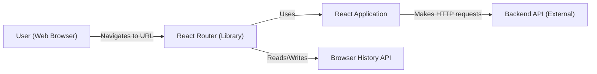
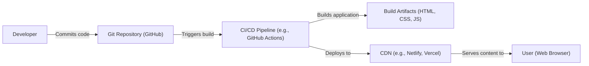
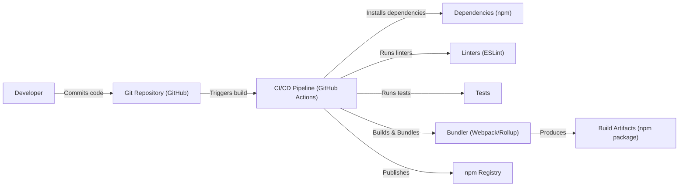

Okay, let's create a design document for the React Router project, focusing on aspects relevant to threat modeling.

# BUSINESS POSTURE

React Router is a critical component for many React-based web applications, providing the fundamental navigation and routing capabilities.  It's an open-source project, widely adopted, and maintained by Remix.

Priorities:

*   Maintainability:  The project must be easy to maintain and evolve, given its widespread use and the constant evolution of the React ecosystem.
*   Backward Compatibility:  Changes should strive to maintain backward compatibility to avoid breaking existing applications.  Major version bumps should be infrequent and well-justified.
*   Performance:  Routing should be fast and efficient, minimizing any performance overhead on applications using it.
*   Security:  The library should be secure and not introduce vulnerabilities into applications that use it.  This is paramount, as routing logic can be a target for attacks.
*   Community Trust:  Maintaining the trust of the large React community is crucial.  This involves responsiveness to issues, clear communication, and a commitment to quality.

Goals:

*   Provide a robust and flexible routing solution for React applications.
*   Enable developers to build complex, single-page applications (SPAs) with ease.
*   Support various routing scenarios, including nested routes, dynamic segments, and programmatic navigation.
*   Integrate seamlessly with the React ecosystem.

Business Risks:

*   Security Vulnerabilities:  A vulnerability in React Router could impact a vast number of applications, leading to significant reputational damage and potential liability.  This is the most significant risk.
*   Breaking Changes:  Introducing breaking changes without sufficient warning or migration paths could alienate users and damage the project's reputation.
*   Performance Degradation:  Performance regressions could negatively impact the user experience of applications using React Router.
*   Loss of Community Trust:  Failure to address community concerns or maintain the project effectively could lead to a decline in adoption and the rise of competing solutions.
*   Lack of Adoption of New Features: New features that are not adopted by the community represent wasted development effort and can indicate a disconnect with user needs.

# SECURITY POSTURE

Existing Security Controls:

*   security control: Code Reviews: All changes go through a code review process on GitHub. (Visible in the pull request process on the repository).
*   security control: Testing: The project has a comprehensive test suite, including unit and integration tests. (Visible in the `tests` directory and CI configuration).
*   security control: Dependency Management: Dependencies are managed using a package manager (likely npm or yarn), allowing for tracking and updates. (Visible in `package.json`).
*   security control: Static Analysis: Likely use of linters (e.g., ESLint) to enforce code style and identify potential issues. (Visible in configuration files like `.eslintrc.js`).
*   security control: Community Scrutiny: Being an open-source project, the code is subject to scrutiny by the wider community, increasing the chances of identifying vulnerabilities.

Accepted Risks:

*   accepted risk: Reliance on Third-Party Dependencies:  Like all projects, React Router relies on third-party dependencies, which could introduce vulnerabilities.  This risk is mitigated by dependency management and monitoring, but not eliminated.
*   accepted risk: Complexity of Routing Logic:  Routing logic can be inherently complex, increasing the risk of subtle bugs that could lead to security vulnerabilities. This is mitigated by thorough testing and code reviews.
*   accepted risk: User-Controlled Input in Routing:  React Router handles user-controlled input (e.g., URL paths), which requires careful handling to prevent vulnerabilities like XSS or injection attacks.

Recommended Security Controls:

*   security control: Regular Security Audits: Conduct regular security audits, both internal and external (e.g., by a third-party security firm).
*   security control: Vulnerability Disclosure Program: Implement a formal vulnerability disclosure program to encourage responsible reporting of security issues.
*   security control: Content Security Policy (CSP) Guidance: Provide clear guidance to developers on how to use React Router securely in conjunction with CSP to mitigate XSS risks.
*   security control: Input Validation and Sanitization Documentation:  Emphasize the importance of validating and sanitizing user-controlled input used in routing (e.g., dynamic segments) in the documentation.
*   security control: SAST (Static Application Security Testing): Integrate SAST tools into the CI/CD pipeline to automatically scan for potential vulnerabilities.
*   security control: DAST (Dynamic Application Security Testing): Consider using DAST tools to test the running application for vulnerabilities, particularly those related to routing.
*   security control: Supply Chain Security: Implement measures to secure the software supply chain, such as signing releases and verifying the integrity of dependencies.

Security Requirements:

*   Authentication: React Router itself does not handle authentication. It's the responsibility of the application using React Router to implement authentication mechanisms. However, React Router should provide mechanisms (e.g., route guards) to protect routes based on authentication status.
*   Authorization: Similar to authentication, authorization is the responsibility of the application. React Router should provide hooks and APIs to allow developers to implement authorization logic based on user roles or permissions.
*   Input Validation: React Router should clearly document how to handle user-provided input in routes (e.g., URL parameters) and emphasize the importance of validating and sanitizing this input to prevent vulnerabilities.  Any built-in handling of user input should be carefully scrutinized for potential vulnerabilities.
*   Cryptography: React Router does not directly handle cryptographic operations.  If any cryptographic operations are needed (e.g., for secure token handling in route parameters), they should be handled by dedicated libraries and follow best practices.

# DESIGN

## C4 CONTEXT

Element Descriptions:

*   Element:
    *   Name: User
    *   Type: Person
    *   Description: A person interacting with a web application that uses React Router.
    *   Responsibilities: Initiates navigation by entering URLs or clicking links.
    *   Security controls: None (client-side, untrusted).

*   Element:
    *   Name: React Router
    *   Type: Software Library
    *   Description: The React Router library, providing routing functionality.
    *   Responsibilities: Manages application navigation, matches URLs to components, updates the UI.
    *   Security controls: Code Reviews, Testing, Static Analysis, Community Scrutiny.

*   Element:
    *   Name: React Application
    *   Type: Software System
    *   Description: The web application built using React that utilizes React Router.
    *   Responsibilities: Renders the UI, handles user interactions, communicates with backend services.
    *   Security controls: Implements application-specific security controls (authentication, authorization, input validation, etc.).

*   Element:
    *   Name: Backend API
    *   Type: Software System
    *   Description: External backend services that the React application interacts with.
    *   Responsibilities: Provides data and business logic to the React application.
    *   Security controls: Implements API security controls (authentication, authorization, input validation, rate limiting, etc.).

*   Element:
    *   Name: Browser History API
    *   Type: API
    *   Description: The browser's built-in History API, used by React Router to manage navigation history.
    *   Responsibilities: Provides methods for manipulating the browser's session history.
    *   Security controls: Browser-provided security mechanisms.

## C4 CONTAINER

In this case, React Router is a library, so the container diagram is essentially the same as the context diagram. It's a single component within the larger React application.

Element Descriptions:

*   (Same as C4 Context diagram)

## DEPLOYMENT

React Router is a library, not a standalone application. Therefore, it's deployed as part of a React application. There are several deployment options:

1.  Static Site Hosting (e.g., Netlify, Vercel, AWS S3 + CloudFront, GitHub Pages): This is the most common deployment model for SPAs built with React. The application is built into static HTML, CSS, and JavaScript files, which are then served from a CDN.
2.  Traditional Web Server (e.g., Apache, Nginx): The built application files can also be served from a traditional web server.
3.  Containerized Deployment (e.g., Docker, Kubernetes): The application can be containerized using Docker and deployed to a container orchestration platform like Kubernetes.

We'll describe the Static Site Hosting model in detail:

Element Descriptions:

*   Element:
    *   Name: Developer
    *   Type: Person
    *   Description: A developer working on the React application.
    *   Responsibilities: Writes code, commits changes to the Git repository.
    *   Security controls: Code Reviews, secure coding practices.

*   Element:
    *   Name: Git Repository
    *   Type: System
    *   Description: The Git repository hosting the application's source code (e.g., GitHub).
    *   Responsibilities: Stores the code, tracks changes, triggers CI/CD pipelines.
    *   Security controls: Access controls, branch protection rules.

*   Element:
    *   Name: CI/CD Pipeline
    *   Type: System
    *   Description: The CI/CD pipeline that automates the build and deployment process (e.g., GitHub Actions).
    *   Responsibilities: Builds the application, runs tests, deploys the artifacts.
    *   Security controls: Secure configuration, access controls, SAST, dependency scanning.

*   Element:
    *   Name: Build Artifacts
    *   Type: Artifacts
    *   Description: The static files (HTML, CSS, JavaScript) produced by the build process.
    *   Responsibilities: Represent the deployable application.
    *   Security controls: Integrity checks (e.g., Subresource Integrity).

*   Element:
    *   Name: CDN
    *   Type: System
    *   Description: The Content Delivery Network that serves the application to users (e.g., Netlify, Vercel).
    *   Responsibilities: Caches and distributes the application's static assets.
    *   Security controls: HTTPS, DDoS protection, WAF (Web Application Firewall).

*   Element:
    *   Name: User
    *   Type: Person
    *   Description: A user accessing the application in their web browser.
    *   Responsibilities: Interacts with the application.
    *   Security controls: Browser security mechanisms.

## BUILD

The build process for React Router typically involves the following steps:

1.  Developer commits code to the GitHub repository.
2.  A CI/CD pipeline (e.g., GitHub Actions) is triggered.
3.  The pipeline checks out the code.
4.  Dependencies are installed (using npm or yarn).
5.  Linters (e.g., ESLint) are run to check code style and identify potential issues.
6.  Unit and integration tests are executed.
7.  The code is transpiled (using Babel) and bundled (using a bundler like Webpack or Rollup) into production-ready JavaScript files.
8.  The build artifacts are published (e.g., to npm).

Security Controls in Build Process:

*   security control: Dependency Management:  Using a package manager (npm or yarn) with lock files to ensure consistent and reproducible builds. Regularly updating dependencies to address known vulnerabilities.
*   security control: Static Analysis:  Using linters (e.g., ESLint) to enforce code style and identify potential security issues.
*   security control: Testing:  Running a comprehensive test suite to catch bugs and regressions.
*   security control: CI/CD Pipeline Security:  Securing the CI/CD pipeline itself (e.g., access controls, secure configuration).
*   security control: Supply Chain Security:  Potentially using tools to scan for vulnerabilities in dependencies (e.g., `npm audit`, Snyk).  Consider signing releases.

# RISK ASSESSMENT

Critical Business Processes:

*   Application Navigation:  React Router is fundamental to the navigation of applications that use it.  A failure in React Router can render an application unusable.
*   User Experience:  Smooth and reliable routing is crucial for a positive user experience.

Data to Protect:

*   React Router itself does not directly handle sensitive data. However, it *indirectly* handles data that is part of the URL, which *could* contain sensitive information if developers misuse it (e.g., putting API keys or tokens in the URL). This is a crucial point for the documentation and security guidance.
*   URL parameters and path segments: These could potentially contain sensitive information if misused by developers.  React Router should not store or process this data itself, but it should provide guidance on how to handle it securely.
*   Data Sensitivity: The sensitivity of the data handled indirectly by React Router depends entirely on the application using it.  If developers misuse React Router to expose sensitive data in URLs, that data would be considered highly sensitive.

# QUESTIONS & ASSUMPTIONS

Questions:

*   Are there any specific security certifications or compliance requirements that React Router needs to meet (e.g., for use in specific industries)?
*   What is the current process for handling security vulnerabilities reported by the community?
*   Are there any plans to integrate more advanced security features directly into React Router (e.g., built-in protection against common web vulnerabilities)?
*   What is the tolerance for performance overhead introduced by security measures?
*   What level of detail is required in the threat model that will be built based on this design document?

Assumptions:

*   BUSINESS POSTURE: The primary business goal is to provide a stable, reliable, and secure routing solution for the React community.  The project prioritizes long-term maintainability and community trust over rapid feature development.
*   SECURITY POSTURE: The project has a basic level of security awareness, with code reviews and testing in place.  However, there is room for improvement in terms of formal security processes and tooling.
*   DESIGN: The design is relatively simple, as React Router is a library, not a complex system.  The main security concerns revolve around how developers use the library and the potential for vulnerabilities in the library's handling of user-controlled input (URLs). The deployment model is assumed to be static site hosting, but other models are possible. The build process is assumed to be automated using a CI/CD pipeline.