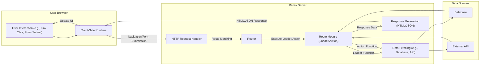

# Project Design Document: Remix Framework

**Version:** 1.1
**Date:** October 26, 2023
**Author:** AI Software Architect

## 1. Introduction

This document provides a detailed architectural overview of the Remix web framework, designed to serve as a foundation for subsequent threat modeling. It offers a comprehensive understanding of the system's components, data flow, and deployment considerations. Remix is a full-stack web framework that embraces web standards, providing server-side rendering with progressive enhancement for a fast, resilient, and accessible user experience. This document emphasizes the core architectural principles and common deployment patterns of Remix applications, focusing on aspects relevant to security analysis.

## 2. System Overview

Remix applications operate on a server-first philosophy, where the server handles the initial rendering and data fetching, ensuring a fast first contentful paint. The client-side runtime then progressively enhances the user experience, enabling dynamic interactions and seamless transitions. Key aspects of the Remix architecture include:

*   **Server-Side Rendering (SSR):** The Remix server handles initial requests, fetches data via loaders, and renders the initial HTML markup. This improves SEO and perceived performance.
*   **Progressive Enhancement & Client-Side Hydration:**  The client-side JavaScript runtime hydrates the server-rendered HTML, adding interactivity and handling subsequent navigation and data updates without full page reloads.
*   **Nested Routing & Layouts:** Remix leverages a file-system-based router that automatically creates routes based on the directory structure. Nested layouts allow for shared UI elements across multiple routes.
*   **Data Loaders:** Server-side functions defined within route modules responsible for fetching data required for rendering a specific route segment. Loaders execute on the server.
*   **Action Functions:** Server-side functions within route modules that handle form submissions and other data mutations initiated from the client. Actions execute on the server.
*   **Client-Side Data Cache & Revalidation:** Remix manages a client-side cache of loader data, optimizing subsequent requests. It provides mechanisms for revalidating this data to ensure freshness.
*   **Built-in Error Handling & Boundary Components:** Remix offers robust error handling capabilities on both the server and client, including error boundary components for graceful error display.
*   **Web Standards Focus:** Remix builds upon fundamental web standards like HTTP forms and request/response cycles, simplifying development and improving resilience.

## 3. Data Flow

The following diagram illustrates the typical data flow within a Remix application, highlighting the interaction between the client and server:

**Detailed Data Flow Steps:**

*   The user initiates an interaction in their browser, such as clicking a link or submitting a form.
*   The **Client-Side Runtime** intercepts the interaction. For navigation, it might prefetch data. For form submissions, it prepares the request.
*   An HTTP request is sent to the **Remix Server**.
*   The **HTTP Request Handler** receives the request.
*   The **Router** on the server matches the incoming request URL to a specific **Route Module**.
*   The corresponding **Loader** function (for navigation) or **Action** function (for form submissions) within the **Route Module** is executed.
*   The **Loader/Action** function fetches necessary data from **Data Sources** like databases or external APIs.
*   The fetched data is used to generate a **Response**. For initial page loads, this is typically HTML. For subsequent data updates, it might be JSON.
*   The server sends the **HTML/JSON Response** back to the user's browser.
*   The **Client-Side Runtime** updates the UI based on the received response. For HTML, it hydrates the page. For JSON, it updates the relevant components.

## 4. Key Components

This section details the key components of a Remix application and their functionalities:

*   **Remix Router:**
    *   Function: Matches incoming HTTP requests to specific route modules based on the URL path. Manages the navigation lifecycle, including data fetching and transitions.
    *   Security Relevance: Misconfigured routes or insufficient authorization checks within the router can lead to unauthorized access to data or functionality.
*   **Route Modules:**
    *   Function: JavaScript files that define the UI and data handling logic for specific URL paths. Export `loader` and `action` functions.
    *   Security Relevance: Vulnerabilities in loader or action functions (e.g., SQL injection, command injection) can compromise the application's security. Improper handling of user input within these modules is a significant risk.
*   **Loaders:**
    *   Function: Server-side functions within route modules responsible for fetching data required to render a route segment. Executed on the server for each request.
    *   Security Relevance: Loaders often interact with databases or external APIs. Secure data fetching practices, including proper authorization and input validation, are crucial. Leaking sensitive information through loader responses is a potential threat.
*   **Actions:**
    *   Function: Server-side functions within route modules that handle form submissions and other data mutations. Executed on the server.
    *   Security Relevance: Actions handle user-provided data and often perform write operations. They are prime targets for attacks like mass assignment, insecure direct object references, and insufficient validation leading to data corruption or unauthorized modifications.
*   **Data Hooks (e.g., `useLoaderData`, `useActionData`):**
    *   Function: Client-side React hooks provided by Remix to access data returned by `loader` and `action` functions within UI components. Manage data revalidation and updates.
    *   Security Relevance: While primarily a client-side component, improper handling of data received through these hooks could lead to client-side vulnerabilities like XSS if not rendered safely.
*   **Form Component (`<Form>`):**
    *   Function: A React component provided by Remix for handling form submissions. Automatically handles form encoding and submission to the corresponding route's `action` function.
    *   Security Relevance: Ensures proper form submission handling, but developers must still implement server-side validation and security measures in the associated action function.
*   **Link Component (`<Link>`):**
    *   Function: A React component provided by Remix for navigating between routes. Optimizes navigation by prefetching data for linked routes.
    *   Security Relevance: Generally secure, but developers should ensure that links point to valid and authorized resources.
*   **Entry Points (Server & Client):**
    *   `entry.server.tsx`: The main entry point for the server-side rendering process. Handles incoming requests and orchestrates the rendering pipeline.
    *   `entry.client.tsx`: The main entry point for client-side hydration and application bootstrapping.
    *   Security Relevance: These files are critical for the application's initialization. Vulnerabilities here could have widespread impact. Secure handling of environment variables and initialization logic is important.

## 5. Deployment Model

Remix applications offer flexibility in deployment. Common patterns and their security considerations include:

*   **Node.js Servers (e.g., AWS EC2, Heroku):**
    *   Description: Deploying the Remix application to a traditional Node.js server environment.
    *   Security Considerations: Requires managing server infrastructure security, including OS patching, firewall configuration, and secure access controls. Ensure secure handling of environment variables containing sensitive information.
*   **Serverless Functions (e.g., AWS Lambda, Netlify Functions, Vercel Functions):**
    *   Description: Deploying the server-side rendering logic as serverless functions.
    *   Security Considerations: Leverage the security features provided by the serverless platform. Follow the principle of least privilege when configuring function permissions. Be mindful of cold starts and potential timing attacks. Securely manage secrets using platform-provided mechanisms.
*   **Edge Functions (e.g., Cloudflare Workers, Vercel Edge Functions):**
    *   Description: Deploying server-side rendering logic to edge locations closer to users.
    *   Security Considerations: Similar to serverless functions, rely on the platform's security features. Be aware of regional data residency requirements. Ensure secure communication between edge functions and backend services. Pay attention to request size limits and potential denial-of-service vulnerabilities.

The choice of deployment model significantly impacts the security posture of the application. Understanding the security responsibilities associated with each model is crucial.

## 6. Security Considerations

This section outlines key security considerations relevant to Remix applications, providing a starting point for threat modeling:

*   **Server-Side Vulnerabilities:**
    *   **Injection Attacks:**  SQL injection, NoSQL injection, command injection, and LDAP injection can occur if user input is not properly sanitized and validated in loaders and actions.
    *   **Authentication and Authorization:** Implement robust authentication mechanisms to verify user identity and authorization checks to control access to resources and functionalities. Ensure that loaders and actions only return data that the authenticated user is authorized to access.
    *   **Insecure Direct Object References (IDOR):** Prevent users from accessing resources by directly manipulating IDs or keys without proper authorization checks in loaders and actions.
    *   **Mass Assignment:**  Protect against unintended data modification by carefully controlling which request parameters are used to update database records in actions.
    *   **Cross-Site Request Forgery (CSRF):** Implement CSRF protection mechanisms, especially for form submissions handled by actions. Remix provides utilities to assist with this.
*   **Client-Side Vulnerabilities:**
    *   **Cross-Site Scripting (XSS):** Sanitize user-generated content before rendering it on the client-side to prevent malicious scripts from being injected. Be cautious when using `dangerouslySetInnerHTML`.
    *   **Client-Side Data Security:** Avoid storing sensitive information in client-side storage (e.g., localStorage, sessionStorage) if possible. If necessary, encrypt the data.
    *   **Content Security Policy (CSP):** Implement a strong CSP to mitigate the risk of XSS attacks by controlling the sources from which the browser is allowed to load resources.
    *   **Dependency Vulnerabilities:** Regularly audit and update dependencies to patch known security vulnerabilities in third-party libraries.
*   **Data Security:**
    *   **Data in Transit:** Enforce HTTPS to encrypt communication between the client and the server.
    *   **Data at Rest:** Securely store sensitive data in databases or other storage mechanisms, using encryption where appropriate.
    *   **Data Validation:** Implement robust data validation on both the client and server to ensure data integrity and prevent unexpected behavior.
*   **Deployment Security:**
    *   **Secure Configuration:** Follow security best practices for configuring the chosen deployment environment.
    *   **Secrets Management:** Securely manage API keys, database credentials, and other sensitive information using environment variables or dedicated secrets management services.
    *   **Regular Security Audits:** Conduct regular security audits and penetration testing to identify potential vulnerabilities.

This document provides a foundational understanding of the Remix framework's architecture, which is essential for effective threat modeling. The identified components, data flow, and security considerations will serve as key inputs for subsequent security analysis activities.
