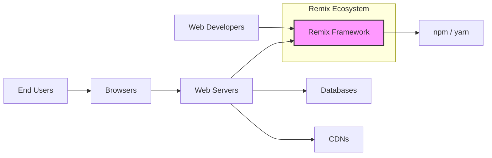
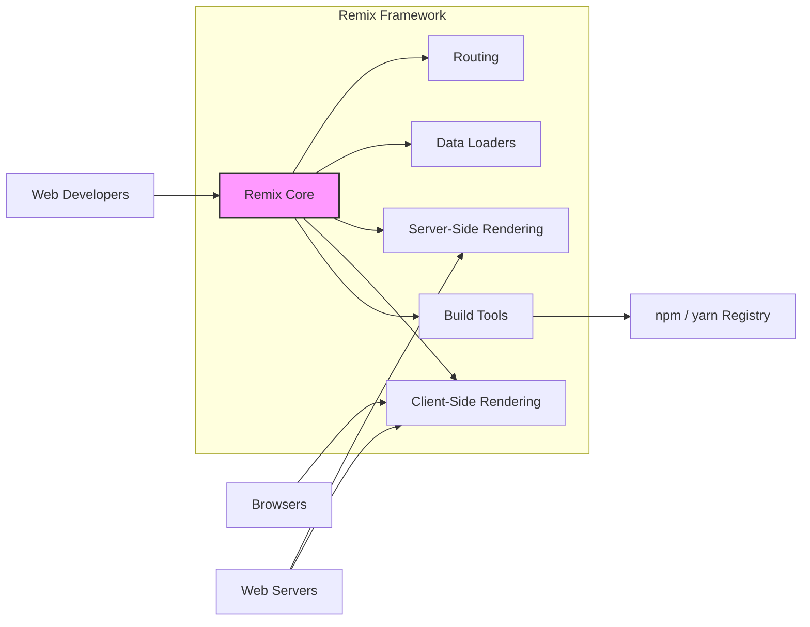
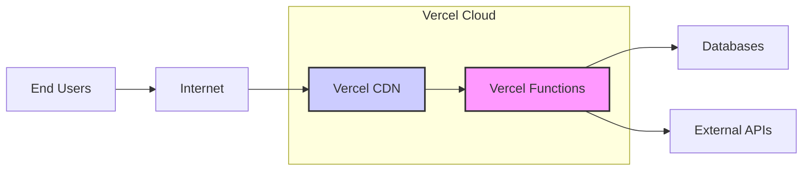
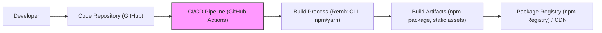

# BUSINESS POSTURE

- Business Priorities and Goals:
  - Simplify and enhance the development of modern web applications.
  - Improve web application performance and user experience through server-side rendering and progressive enhancement.
  - Provide a robust and flexible framework for building full-stack web applications.
  - Foster a strong developer community and ecosystem around the framework.
- Business Risks:
  - Adoption risk: Developers may prefer other established frameworks or find Remix too complex.
  - Security vulnerabilities in the framework could damage reputation and user trust.
  - Performance issues or scalability limitations could hinder adoption for large-scale applications.
  - Dependency on open-source community for maintenance and feature development.
  - Competition from other web frameworks and evolving web technologies.

# SECURITY POSTURE

- Existing Security Controls:
  - security control: Open-source project with community review (location: GitHub repository - public visibility and contributions).
  - security control: Dependency management using npm/yarn (location: package.json, yarn.lock/package-lock.json).
  - security control: Standard web security practices applicable to any web application framework are expected to be followed by developers using Remix.
- Accepted Risks:
  - accepted risk: Reliance on community contributions for identifying and fixing security vulnerabilities.
  - accepted risk: Security of applications built with Remix is ultimately the responsibility of the developers using the framework.
  - accepted risk: Potential vulnerabilities in third-party dependencies used by Remix.
- Recommended Security Controls:
  - security control: Implement automated security scanning (SAST/DAST) in the Remix development and release pipeline.
  - security control: Conduct regular security audits and penetration testing of the Remix framework.
  - security control: Establish a clear vulnerability disclosure and response process for Remix.
  - security control: Provide security guidance and best practices documentation for developers using Remix.
  - security control: Implement dependency vulnerability scanning and automated updates for Remix dependencies.
- Security Requirements:
  - Authentication: Remix itself does not enforce specific authentication mechanisms, but applications built with Remix will require authentication to protect resources and user data. Developers need to implement authentication within their Remix applications.
  - Authorization: Similar to authentication, authorization is application-specific. Remix applications will need robust authorization mechanisms to control access to different parts of the application and data.
  - Input Validation: Remix applications must implement thorough input validation to prevent injection attacks (e.g., XSS, SQL injection). This should be applied to all user inputs, both on the client and server side.
  - Cryptography: Remix applications will likely need to use cryptography for securing sensitive data in transit and at rest. This includes HTTPS for communication and encryption for storing sensitive information. Remix should encourage and facilitate the use of secure cryptographic practices.

# DESIGN

## C4 CONTEXT

- Context Diagram Elements:
  - - Name: Remix Framework
    - Type: Software System
    - Description: The Remix web framework itself, providing the core functionalities for building web applications.
    - Responsibilities: Provides routing, data loading, rendering, and build tools for web applications.
    - Security controls: Code review, vulnerability scanning, secure development practices.
  - - Name: Web Developers
    - Type: Person
    - Description: Developers who use the Remix framework to build web applications.
    - Responsibilities: Develop, deploy, and maintain web applications using Remix. Implement application-level security controls.
    - Security controls: Secure coding practices, access control to development environments.
  - - Name: End Users
    - Type: Person
    - Description: Users who interact with web applications built using Remix through their web browsers.
    - Responsibilities: Use web applications to access information and perform actions.
    - Security controls: Browser security features, user awareness of phishing and other web threats.
  - - Name: Browsers
    - Type: Software System
    - Description: Web browsers used by end users to access Remix applications.
    - Responsibilities: Render web pages, execute JavaScript, communicate with web servers.
    - Security controls: Browser security features (CSP, XSS protection, etc.), regular browser updates.
  - - Name: Web Servers
    - Type: Software System
    - Description: Servers that host and serve Remix applications.
    - Responsibilities: Serve static assets, handle server-side rendering, route requests, interact with databases and CDNs.
    - Security controls: Server hardening, access control, network security, web application firewalls (WAFs).
  - - Name: Databases
    - Type: Software System
    - Description: Databases used by Remix applications to store and retrieve data.
    - Responsibilities: Persist application data, provide data access and management.
    - Security controls: Database access control, encryption at rest, data backups, vulnerability management.
  - - Name: CDNs
    - Type: Software System
    - Description: Content Delivery Networks used to serve static assets of Remix applications.
    - Responsibilities: Cache and deliver static assets to improve performance and reduce server load.
    - Security controls: CDN security configurations, access control, protection against DDoS attacks.
  - - Name: npm / yarn
    - Type: Software System
    - Description: Package managers used to manage Remix dependencies.
    - Responsibilities: Provide access to Remix packages and its dependencies.
    - Security controls: Dependency vulnerability scanning, integrity checks of packages.

## C4 CONTAINER

- Container Diagram Elements:
  - - Name: Remix Core
    - Type: Software Library/Framework
    - Description: The core library of the Remix framework, providing fundamental functionalities and APIs.
    - Responsibilities: Core framework logic, API definitions, coordination of different components.
    - Security controls: Code review, vulnerability scanning, secure coding practices.
  - - Name: Routing
    - Type: Software Library
    - Description: Handles URL routing and navigation within Remix applications.
    - Responsibilities: Mapping URLs to application components, managing navigation.
    - Security controls: Protection against route injection vulnerabilities, proper URL handling.
  - - Name: Data Loaders
    - Type: Software Library
    - Description: Provides mechanisms for loading data required by routes and components.
    - Responsibilities: Data fetching, caching, and management for efficient data access.
    - Security controls: Secure data fetching practices, protection against data injection through data loaders.
  - - Name: Server-Side Rendering (SSR)
    - Type: Software Component
    - Description: Handles rendering of Remix components on the server.
    - Responsibilities: Generating HTML on the server, improving initial page load performance and SEO.
    - Security controls: Protection against server-side rendering vulnerabilities, secure handling of server-side data.
  - - Name: Client-Side Rendering (CSR)
    - Type: Software Component
    - Description: Handles rendering of Remix components in the browser.
    - Responsibilities: Enhancing user experience with dynamic updates and interactions after initial page load.
    - Security controls: Protection against client-side vulnerabilities (XSS), secure handling of client-side data.
  - - Name: Build Tools
    - Type: Software Application
    - Description: Command-line tools and scripts for building, bundling, and optimizing Remix applications.
    - Responsibilities: Compiling code, bundling assets, optimizing for production deployment.
    - Security controls: Secure build process, dependency vulnerability scanning, integrity checks of build artifacts.
  - - Name: npm / yarn Registry
    - Type: Software System
    - Description: Package registry where Remix packages and dependencies are hosted.
    - Responsibilities: Providing access to Remix packages and dependencies.
    - Security controls: Package integrity checks, vulnerability scanning of packages in the registry.

## DEPLOYMENT

- Deployment Options:
  - Serverless Functions (e.g., AWS Lambda, Vercel Functions, Netlify Functions)
  - Virtual Machines (e.g., AWS EC2, Google Compute Engine, Azure VMs)
  - Containers (e.g., Docker, Kubernetes)
  - PaaS (Platform as a Service) providers (e.g., Heroku, Render)

- Detailed Deployment Architecture (Serverless Functions - Vercel Example):

- Deployment Diagram Elements (Vercel Serverless Deployment):
  - - Name: Vercel Functions
    - Type: Serverless Compute
    - Description: Serverless functions provided by Vercel, used to run the server-side Remix application logic.
    - Responsibilities: Handle server-side rendering, API endpoints, and application logic.
    - Security controls: Vercel platform security, function-level access control, secure environment configuration.
  - - Name: Vercel CDN
    - Type: Content Delivery Network
    - Description: Vercel's CDN for serving static assets and caching responses.
    - Responsibilities: Caching and delivering static assets, improving performance and availability.
    - Security controls: CDN security configurations, DDoS protection, TLS/SSL encryption.
  - - Name: End Users
    - Type: Person
    - Description: Users accessing the Remix application.
    - Responsibilities: Accessing the application through web browsers.
    - Security controls: Browser security features.
  - - Name: Internet
    - Type: Network
    - Description: Public internet network.
    - Responsibilities: Public network for communication.
    - Security controls: Network security best practices, TLS/SSL encryption for communication.
  - - Name: Databases
    - Type: Data Storage
    - Description: External databases used by the Remix application.
    - Responsibilities: Persistent data storage.
    - Security controls: Database access control, encryption at rest and in transit, database security hardening.
  - - Name: External APIs
    - Type: External System
    - Description: External APIs that the Remix application might interact with.
    - Responsibilities: Providing external services and data.
    - Security controls: API authentication and authorization, secure API communication.

## BUILD

- Build Process Elements:
  - - Name: Developer
    - Type: Person
    - Description: Software developer working on the Remix project.
    - Responsibilities: Writing code, committing changes, initiating build process.
    - Security controls: Secure development environment, access control to code repository.
  - - Name: Code Repository (GitHub)
    - Type: Version Control System
    - Description: GitHub repository hosting the Remix source code.
    - Responsibilities: Source code management, version control, collaboration.
    - Security controls: Access control, branch protection, audit logs.
  - - Name: CI/CD Pipeline (GitHub Actions)
    - Type: Automation System
    - Description: GitHub Actions workflows for automated build, test, and deployment processes.
    - Responsibilities: Automating build, testing, and deployment, running security checks.
    - Security controls: Secure pipeline configuration, access control to pipeline secrets, vulnerability scanning in pipeline.
  - - Name: Build Process (Remix CLI, npm/yarn)
    - Type: Build System
    - Description: Remix CLI and npm/yarn tools used to build and bundle the application.
    - Responsibilities: Compiling code, bundling assets, dependency management, running linters and tests.
    - Security controls: Dependency vulnerability scanning, SAST/DAST tools integration, build process integrity checks.
  - - Name: Build Artifacts (npm package, static assets)
    - Type: Software Artifacts
    - Description: Output of the build process, including npm packages and static assets.
    - Responsibilities: Deployable artifacts of the Remix framework.
    - Security controls: Integrity checks (e.g., checksums), signing of artifacts.
  - - Name: Package Registry (npm Registry) / CDN
    - Type: Distribution System
    - Description: npm Registry for publishing npm packages and CDN for distributing static assets.
    - Responsibilities: Hosting and distributing Remix packages and assets.
    - Security controls: Registry security, CDN security, integrity checks during distribution.

# RISK ASSESSMENT

- Critical Business Processes:
  - Development and maintenance of the Remix framework itself.
  - Building and deployment of web applications by developers using Remix.
  - End-user access and interaction with web applications built with Remix.
- Data Sensitivity:
  - Remix framework code: High sensitivity - compromise could lead to widespread vulnerabilities in applications built with Remix.
  - Developer code using Remix: Sensitivity depends on the application, can range from low to high depending on the data handled.
  - User data in applications built with Remix: Sensitivity depends on the application, can range from low to high (PII, financial data, etc.).

# QUESTIONS & ASSUMPTIONS

- Questions:
  - What are the specific security testing practices currently employed by the Remix core team?
  - Is there a formal vulnerability disclosure process in place for Remix?
  - What kind of security guidance and documentation is provided to developers using Remix?
  - Are there any specific compliance requirements that Remix aims to meet (e.g., OWASP ASVS)?
- Assumptions:
  - BUSINESS POSTURE: The primary business goal is to promote the adoption and usage of the Remix framework by web developers.
  - SECURITY POSTURE: Security is considered important, but as an open-source project, resources for dedicated security efforts might be limited. Security relies heavily on community contributions and standard open-source security practices.
  - DESIGN: Remix follows modern web development best practices and is designed to be deployed in various cloud environments. The build process is automated and leverages standard JavaScript ecosystem tools.