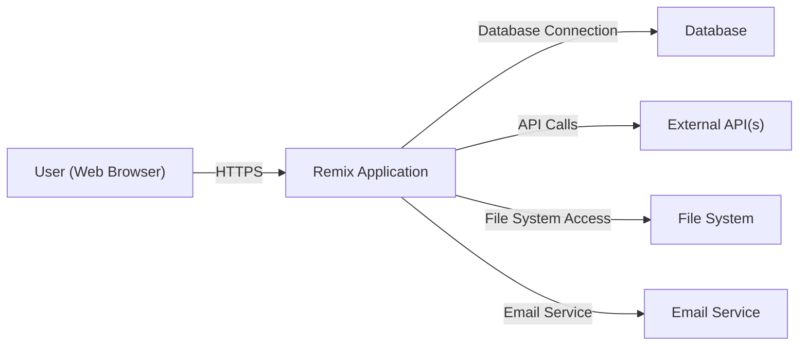
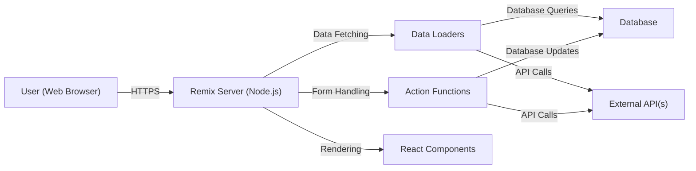
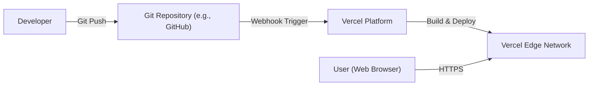
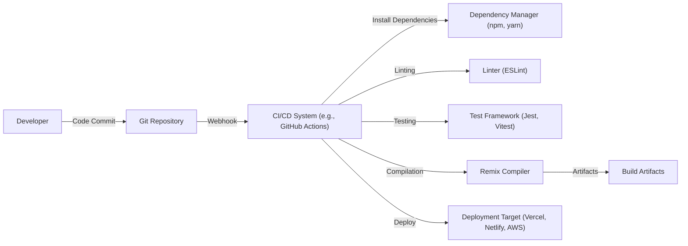

Okay, let's create a design document for the Remix framework, focusing on aspects relevant for threat modeling.

# BUSINESS POSTURE

Remix is a full-stack web framework that lets developers build better websites. It focuses on web standards and modern web app architecture.  It's used by a variety of companies, from startups to established enterprises.  The business priorities and goals can be summarized as:

*   Enable developers to build high-quality, performant web applications quickly.
*   Provide a robust and reliable framework that handles server-side rendering (SSR) and client-side hydration seamlessly.
*   Improve developer experience (DX) through intuitive APIs and tooling.
*   Maintain a strong community and ecosystem around the framework.
*   Ensure the framework is adaptable to different deployment environments (serverless, traditional servers, edge networks).
*   Attract and retain users by offering a compelling alternative to other web frameworks.

Based on these, the most important business risks are:

*   Security vulnerabilities in the framework that could lead to data breaches or application compromise for Remix users.
*   Performance bottlenecks that degrade the user experience of applications built with Remix.
*   Lack of adoption due to competition from other frameworks or perceived complexity.
*   Inability to scale to meet the demands of large, complex applications.
*   Negative impact on developer productivity due to bugs or poor documentation.
*   Reputational damage due to security incidents or performance issues.

# SECURITY POSTURE

Remix, being a framework, provides building blocks and encourages certain patterns, but the ultimate security posture depends heavily on how developers *use* it.  Here's a breakdown:

*   security control: Remix promotes the use of HTTP security headers through its `headers` function in loaders and actions. (Described in Remix documentation)
*   security control: Remix encourages the use of secure-by-default approaches, such as escaping HTML output to prevent Cross-Site Scripting (XSS). (Described in Remix documentation)
*   security control: Remix handles server-side rendering (SSR), which can mitigate some client-side security risks if implemented correctly. (Core framework feature)
*   security control: Remix's routing and data loading mechanisms can be used to implement authorization checks, although this is largely left to the developer. (Described in Remix documentation)
*   security control: Remix supports environment variables for managing secrets, encouraging separation of configuration from code. (Described in Remix documentation)
*   security control: Remix's documentation includes sections on security best practices.
*   accepted risk: The framework itself doesn't enforce a specific authentication or authorization mechanism; developers are responsible for choosing and implementing these.
*   accepted risk: While Remix encourages secure coding practices, it's possible for developers to introduce vulnerabilities in their application code.
*   accepted risk: Remix relies on a large number of third-party dependencies (visible in the `package.json` file), each of which represents a potential supply chain risk.
*   accepted risk: Deployment security is largely outside the scope of the framework itself and depends on the chosen deployment environment (e.g., AWS, Vercel, Netlify).

Recommended Security Controls (High Priority):

*   Implement robust input validation and sanitization on both the client and server sides, even if Remix provides some built-in protections.
*   Enforce a strong Content Security Policy (CSP) to mitigate XSS and other code injection attacks.
*   Regularly audit and update dependencies to address known vulnerabilities.
*   Implement a comprehensive logging and monitoring strategy to detect and respond to security incidents.
*   Consider using a Web Application Firewall (WAF) to protect against common web attacks.
*   Implement rate limiting and other anti-abuse measures to prevent denial-of-service attacks.

Security Requirements:

*   Authentication:
    *   The framework should provide guidance and examples for integrating with common authentication providers (e.g., OAuth, JWT).
    *   Support for multi-factor authentication (MFA) should be easily implementable.
    *   Session management should be secure, using HttpOnly and Secure cookies.
*   Authorization:
    *   The framework should facilitate role-based access control (RBAC) or attribute-based access control (ABAC).
    *   Developers should be able to easily define and enforce authorization rules for different routes and resources.
*   Input Validation:
    *   All user input, including form data, URL parameters, and headers, must be validated and sanitized.
    *   Validation should occur on both the client and server sides.
    *   The framework should provide utilities or guidance for input validation.
*   Cryptography:
    *   Sensitive data, such as passwords, should be hashed using a strong, one-way hashing algorithm (e.g., bcrypt, Argon2).
    *   Encryption should be used for data at rest and in transit.
    *   The framework should provide guidance on secure key management.

# DESIGN

## C4 CONTEXT

Element Descriptions:

*   Element:
    *   Name: User (Web Browser)
    *   Type: Person
    *   Description: A user interacting with the Remix application through a web browser.
    *   Responsibilities: Initiates requests, views responses, interacts with the UI.
    *   Security controls: Browser-based security controls (e.g., same-origin policy, CSP).

*   Element:
    *   Name: Remix Application
    *   Type: Software System
    *   Description: The web application built using the Remix framework.
    *   Responsibilities: Handles user requests, processes data, renders UI, interacts with backend systems.
    *   Security controls: Input validation, output encoding, authentication, authorization, session management, secure configuration.

*   Element:
    *   Name: Database
    *   Type: Software System
    *   Description: The database used by the Remix application to store data.
    *   Responsibilities: Stores and retrieves data.
    *   Security controls: Access control, encryption at rest, encryption in transit, auditing.

*   Element:
    *   Name: External API(s)
    *   Type: Software System
    *   Description: Any external APIs that the Remix application interacts with.
    *   Responsibilities: Provides specific services or data to the Remix application.
    *   Security controls: API keys, authentication, authorization, rate limiting, input validation.

*   Element:
    *   Name: File System
    *   Type: Software System
    *   Description: The file system used by the Remix application, potentially for storing assets or temporary files.
    *   Responsibilities: Stores and retrieves files.
    *   Security controls: Access control, file permissions.

*   Element:
    *   Name: Email Service
    *   Type: Software System
    *   Description: An external service used for sending emails.
    *   Responsibilities: Sends transactional or marketing emails.
    *   Security controls: API keys, authentication, encryption in transit.

## C4 CONTAINER

Element Descriptions:

*   Element:
    *   Name: User (Web Browser)
    *   Type: Person
    *   Description: A user interacting with the Remix application.
    *   Responsibilities: Sends HTTP requests, receives and renders responses.
    *   Security controls: Browser security mechanisms.

*   Element:
    *   Name: Remix Server (Node.js)
    *   Type: Container: Node.js Runtime
    *   Description: The server-side runtime environment for the Remix application.
    *   Responsibilities: Handles HTTP requests, executes server-side logic, renders HTML.
    *   Security controls: Server-side security configurations, input validation, output encoding.

*   Element:
    *   Name: Data Loaders
    *   Type: Container: Remix Loader Functions
    *   Description: Functions that fetch data required for rendering a route.
    *   Responsibilities: Retrieves data from databases, APIs, or other sources.
    *   Security controls: Input validation, authorization checks.

*   Element:
    *   Name: Action Functions
    *   Type: Container: Remix Action Functions
    *   Description: Functions that handle form submissions and data mutations.
    *   Responsibilities: Processes form data, updates databases, interacts with APIs.
    *   Security controls: Input validation, authorization checks, CSRF protection.

*   Element:
    *   Name: React Components
    *   Type: Container: React Components
    *   Description: UI components that render the user interface.
    *   Responsibilities: Displays data, handles user interactions.
    *   Security controls: Output encoding, XSS prevention.

*   Element:
    *   Name: Database
    *   Type: Container: Database
    *   Description: The database used by the application.
    *   Responsibilities: Stores and retrieves data.
    *   Security controls: Database security configurations, access control.

*   Element:
    *   Name: External API(s)
    *   Type: Container: External API
    *   Description: External APIs used by the application.
    *   Responsibilities: Provides external services or data.
    *   Security controls: API authentication, authorization, rate limiting.

## DEPLOYMENT

Remix applications can be deployed to various environments, including:

1.  Serverless platforms (e.g., Vercel, Netlify, AWS Lambda).
2.  Traditional server environments (e.g., Node.js server running on a VM).
3.  Containerized environments (e.g., Docker, Kubernetes).
4.  Edge networks (e.g., Cloudflare Workers).

We'll describe deployment to a serverless platform like Vercel, as it's a common and recommended approach for Remix applications.

Element Descriptions:

*   Element:
    *   Name: Developer
    *   Type: Person
    *   Description: The developer writing and deploying the Remix application.
    *   Responsibilities: Writes code, commits changes, pushes to the repository.
    *   Security controls: Code review, secure coding practices.

*   Element:
    *   Name: Git Repository (e.g., GitHub)
    *   Type: Software System
    *   Description: The source code repository for the Remix application.
    *   Responsibilities: Stores code, tracks changes, triggers deployments.
    *   Security controls: Access control, branch protection rules.

*   Element:
    *   Name: Vercel Platform
    *   Type: Software System
    *   Description: The serverless platform that builds and deploys the Remix application.
    *   Responsibilities: Builds the application, deploys it to the edge network, manages scaling.
    *   Security controls: Platform-level security controls, DDoS protection, WAF (optional).

*   Element:
    *   Name: Vercel Edge Network
    *   Type: Infrastructure Node
    *   Description: The globally distributed network of servers that host the Remix application.
    *   Responsibilities: Serves user requests, caches content, provides low latency.
    *   Security controls: Network-level security controls, DDoS protection.

*   Element:
    *   Name: User (Web Browser)
    *   Type: Person
    *   Description: The user accessing the deployed Remix application.
    *   Responsibilities: Sends requests, receives responses.
    *   Security controls: Browser security mechanisms.

## BUILD

The build process for a Remix application typically involves the following steps:

1.  **Code Commit:** Developer commits code changes to a Git repository (e.g., GitHub, GitLab, Bitbucket).
2.  **CI/CD Trigger:** A CI/CD system (e.g., GitHub Actions, Vercel, Netlify) is triggered by the code commit.
3.  **Dependency Installation:** The CI/CD system installs project dependencies using a package manager (e.g., npm, yarn, pnpm).
4.  **Linting and Testing:** Linters (e.g., ESLint) and testing frameworks (e.g., Jest, Vitest) are run to check code quality and identify potential issues.
5.  **Compilation:** The Remix compiler transforms the code into optimized server and client bundles.
6.  **Artifact Creation:** The build process generates the necessary artifacts for deployment (e.g., serverless functions, static assets).
7.  **Deployment:** The artifacts are deployed to the target environment (e.g., Vercel, Netlify, AWS).

Security Controls in the Build Process:

*   security control: **Dependency Management:** Regularly audit and update dependencies to address known vulnerabilities. Use tools like `npm audit` or `yarn audit` to identify vulnerable packages. Consider using Dependabot or similar tools for automated dependency updates.
*   security control: **Linting:** Enforce coding standards and identify potential security issues using linters like ESLint with security-focused plugins.
*   security control: **Static Analysis Security Testing (SAST):** Integrate SAST tools into the CI/CD pipeline to scan the codebase for vulnerabilities.
*   security control: **Software Composition Analysis (SCA):** Use SCA tools to identify and manage open-source components and their associated licenses and vulnerabilities.
*   security control: **Secret Scanning:** Use tools to scan the codebase for accidentally committed secrets (e.g., API keys, passwords).
*   security control: **Build Automation:** Automate the build process to ensure consistency and reduce the risk of manual errors.
*   security control: **Immutable Builds:** Ensure that build artifacts are immutable and cannot be modified after creation.

# RISK ASSESSMENT

*   Critical Business Processes:
    *   User authentication and authorization.
    *   Data loading and processing.
    *   Form handling and data mutation.
    *   Rendering of user interfaces.
    *   Interaction with external APIs and services.

*   Data We Are Trying to Protect:
    *   User data (PII, credentials, preferences). Sensitivity: High
    *   Application data (content, configuration). Sensitivity: Varies
    *   Session data. Sensitivity: High
    *   API keys and secrets. Sensitivity: High

# QUESTIONS & ASSUMPTIONS

*   Questions:
    *   What specific database(s) are commonly used with Remix applications? (Assumption: PostgreSQL, MySQL, MongoDB are common choices)
    *   What are the most common external APIs integrated with Remix applications? (Assumption: Payment gateways, authentication providers, content management systems)
    *   What is the typical team size and development workflow for Remix projects? (Assumption: Small to medium-sized teams, agile development methodologies)
    *   What level of security expertise is expected from developers using Remix? (Assumption: Developers should have a basic understanding of web security principles)
    *   Are there any specific compliance requirements (e.g., GDPR, HIPAA, PCI DSS) that Remix applications typically need to meet? (Assumption: Compliance requirements vary depending on the application's purpose and data)

*   Assumptions:
    *   Business Posture: The primary goal is to build performant and secure web applications. The risk appetite is moderate, balancing innovation with security.
    *   Security Posture: Developers are expected to follow security best practices, but the framework itself provides some built-in protections.
    *   Design: The application architecture follows typical Remix patterns, with data loaders, action functions, and React components. The deployment environment is likely to be a serverless platform like Vercel. The build process is automated using a CI/CD system.