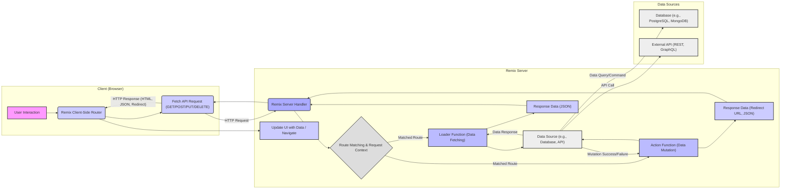
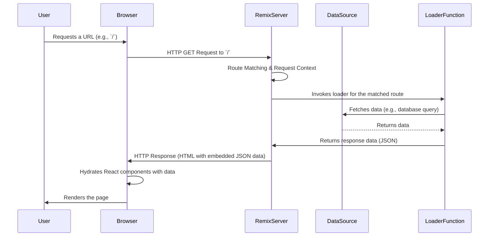
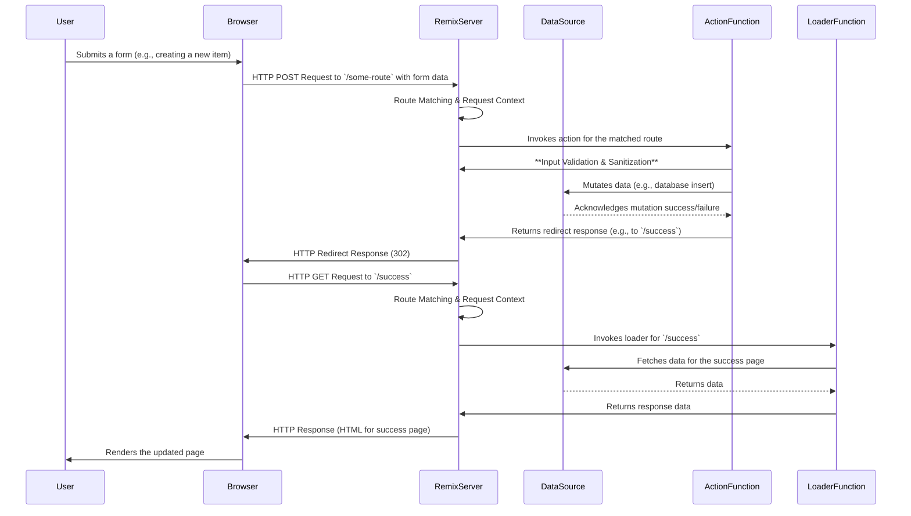

# Project Design Document: Remix Framework

**Version:** 1.1
**Date:** October 26, 2023
**Author:** Gemini (AI Language Model)

## 1. Introduction

This document provides a detailed architectural design of the Remix web framework, focusing on aspects relevant to security threat modeling. It outlines the key components, their interactions, and data flows within a typical Remix application. This document serves as a foundation for identifying potential security vulnerabilities and assessing the system's attack surface.

## 2. System Overview

Remix is a full-stack JavaScript framework built upon web standards, enabling developers to create performant and resilient web applications. It leverages React for the user interface and provides a server-side environment for data loading and mutations, tightly integrated with the browser's request/response cycle. Remix applications are designed for deployment across various environments, including Node.js servers and serverless platforms. The framework's core strength lies in its ability to handle data fetching and mutations efficiently, often within the same route modules that define the UI.

## 3. Architectural Diagram

## 4. Component Breakdown

This section provides a detailed breakdown of the key components within a Remix application, highlighting their responsibilities and potential security considerations.

*   **Client (Browser):**
    *   **User Interface (React Components):**  Responsible for rendering the application's UI and handling user interactions. Security considerations include protection against XSS vulnerabilities when displaying dynamic content.
    *   **Remix Client-Side Router:** Manages client-side navigation and intercepts link clicks and form submissions. It uses the Fetch API to communicate with the Remix server. Potential vulnerabilities include open redirects if not handled carefully.
    *   **Fetch API:** The standard web API used for making HTTP requests to the server. Security considerations involve ensuring requests are made securely (HTTPS) and handling responses appropriately.

*   **Remix Server:**
    *   **Remix Server Handler:** The entry point for all incoming HTTP requests. It initializes the Remix request context and dispatches requests to the appropriate route handlers. This component is crucial for implementing security middleware and handling global security policies.
    *   **Route Matching & Request Context:**  Analyzes the incoming request URL and matches it to a defined route. It also creates a request context containing information about the request, such as parameters, headers, and cookies. This is a critical point for enforcing authorization and authentication.
    *   **Loader Functions (Data Fetching):** Server-side functions within route modules responsible for fetching data required by the corresponding UI components. Loaders have access to the request context and can interact with data sources. Security considerations include preventing data leaks and ensuring proper authorization for data access.
    *   **Action Functions (Data Mutation):** Server-side functions within route modules responsible for handling data modifications (e.g., form submissions). Actions receive the request object, including form data, and can interact with data sources. Input validation and protection against CSRF are crucial here.
    *   **Response Handling:** Constructs HTTP responses, including data (typically JSON), redirects, and error messages, to be sent back to the client. Proper handling of error responses is important to avoid leaking sensitive information.

*   **Data Sources:**
    *   **Database (e.g., PostgreSQL, MongoDB):** Persistent storage for application data. Security considerations include protecting against SQL injection or NoSQL injection vulnerabilities and ensuring data at rest is encrypted.
    *   **External API (REST, GraphQL):** Third-party services that the application interacts with. Security considerations involve securely storing API keys and tokens, and validating data received from external sources.

*   **Build Process:**
    *   **Remix Compiler:** Transforms the application code into optimized bundles for both the client and server. Security considerations include ensuring the build process itself is secure and that dependencies are free from vulnerabilities.

*   **Deployment Environment:**
    *   **Node.js Server:** A runtime environment for executing the Remix server-side code. Security considerations include securing the server operating system and network configurations.
    *   **Serverless Functions (e.g., AWS Lambda, Vercel Functions):** A deployment model where the Remix server runs as stateless functions. Security considerations involve understanding the security model of the serverless platform and properly configuring function permissions.

## 5. Data Flow Diagrams

This section illustrates the flow of data during common user interactions, highlighting potential security checkpoints.

### 5.1. Initial Page Load (GET Request)

### 5.2. Form Submission (POST Request - Data Mutation)

## 6. Security Considerations

This section details security considerations relevant to the Remix framework, categorized for clarity.

*   **Input Handling and Validation:**
    *   **Server-Side Validation:**  Crucial for preventing injection attacks (SQL, NoSQL, command injection) and ensuring data integrity. Validate all data received in Loader and Action functions.
    *   **Sanitization:** Sanitize user-provided input before rendering it in the UI to prevent XSS vulnerabilities.
    *   **Request Forgery (CSRF):** Implement CSRF protection mechanisms for all state-changing requests (POST, PUT, DELETE). Remix provides utilities for this.

*   **Authentication and Authorization:**
    *   **Authentication:** Implement secure mechanisms to verify user identity. This can involve session management, JWTs, or other authentication protocols.
    *   **Authorization:** Control access to resources and functionalities based on user roles and permissions. Enforce authorization checks in Loader and Action functions before accessing or modifying data.
    *   **Secure Session Management:**  Use secure cookies (HttpOnly, Secure, SameSite) for session management and protect against session fixation attacks.

*   **Data Security:**
    *   **Data in Transit:** Enforce HTTPS to encrypt communication between the client and the server.
    *   **Data at Rest:** Encrypt sensitive data stored in databases or other persistent storage.
    *   **Secrets Management:** Securely store and manage API keys, database credentials, and other sensitive information. Avoid hardcoding secrets in the codebase.

*   **Dependency Management:**
    *   **Vulnerability Scanning:** Regularly scan project dependencies for known vulnerabilities and update them promptly.
    *   **Supply Chain Security:** Be mindful of the security of third-party libraries and their potential impact.

*   **Server-Side Security:**
    *   **Protection Against Common Web Attacks:** Implement measures to prevent common web application vulnerabilities such as SQL injection, command injection, and path traversal.
    *   **Error Handling:**  Avoid leaking sensitive information in error messages. Implement proper error logging and monitoring.
    *   **Rate Limiting:** Implement rate limiting to protect against brute-force attacks and denial-of-service attempts.

*   **Client-Side Security:**
    *   **Cross-Site Scripting (XSS) Prevention:**  Properly escape user-generated content and use security headers (e.g., Content-Security-Policy).
    *   **Secure Third-Party Libraries:**  Carefully evaluate the security of any third-party libraries used on the client-side.

*   **Deployment Security:**
    *   **Secure Configuration:**  Properly configure the deployment environment (web server, operating system) to minimize security risks.
    *   **Regular Updates:** Keep the server operating system and software up to date with security patches.

## 7. Assumptions and Constraints

*   This document describes a general architecture of a Remix application. Specific implementations and security measures may vary depending on the project requirements.
*   The focus is on the core Remix framework and its inherent security considerations. Specific security implementations (e.g., authentication libraries) are considered external components.
*   The data flow diagrams represent common scenarios and may not cover all possible interactions.

## 8. Future Considerations

*   Detailed design of specific security features, such as a comprehensive authentication and authorization module.
*   Integration with specific security tools and services (e.g., web application firewalls, security information and event management systems).
*   Best practices for securing Remix applications deployed on different platforms (e.g., serverless environments).
*   Exploration of advanced security features provided by Remix or its ecosystem.
