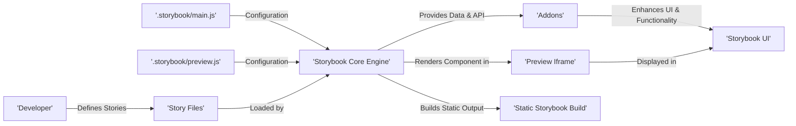

## Project Design Document: Storybook

**Version:** 1.1
**Date:** October 26, 2023
**Author:** AI Software Architect

### 1. Project Overview

Storybook is an open-source, component-driven development environment. It enables developers to build UI components in isolation, fostering better organization, reusability, and testability. Storybook supports a wide array of frontend frameworks, including React, Vue, and Angular, making it a versatile tool for modern web development. This document details the architectural design and key components of Storybook to facilitate comprehensive threat modeling activities.

### 2. Goals and Objectives

*   **Isolated Component Development:** Provide a sandboxed environment for building and iterating on UI components without the complexities of the main application.
*   **Visual Component Documentation:**  Serve as a living style guide, showcasing components with different states and props for clear documentation.
*   **Enhanced Collaboration:** Facilitate communication and collaboration between developers, designers, and testers through a shared component library.
*   **Framework Agnostic Support:** Offer a consistent development experience across various frontend frameworks and technologies.
*   **Extensible Functionality:**  Enable customization and extension through a robust addon ecosystem.

### 3. Target Audience

*   Frontend Engineers responsible for building and maintaining UI components.
*   UI/UX Designers involved in the visual design and interaction of components.
*   Quality Assurance Engineers tasked with testing the functionality and visual appearance of components.
*   Technical Writers who document the usage and behavior of UI components.

### 4. System Architecture

Storybook's architecture is modular, centered around a core engine and an extensible addon system. The key components interact to provide the development and documentation environment.

*   **Core Engine:** The foundational part of Storybook, responsible for managing stories, the UI framework, and the addon lifecycle.
*   **Addon System:** A plugin architecture that allows developers to extend Storybook's capabilities with custom tools and integrations.
*   **User Interface (UI):** The browser-based interface where developers interact with stories and addons.
*   **Command Line Interface (CLI):**  Tools for initializing, developing, building, and managing Storybook projects.
*   **Configuration Layer:** Files and settings that customize Storybook's behavior for specific projects.
*   **Integration Points:** Mechanisms for connecting Storybook with external tools and systems.

```mermaid
graph LR
    subgraph "Storybook Instance"
        direction LR
        A["'Core Engine'"]
        B["'Addon System'"]
        C["'User Interface (UI)'"]
        D["'Configuration Layer'"]
    end
    E["'Command Line Interface (CLI)'"] --> A
    A --> C
    A -- "Loads & Manages" --> F["'Component Stories'"]
    A -- "Provides Extension Points" --> B
    B -- "Enhances Functionality & UI" --> C
    D -- "Defines Project Behavior" --> A
    subgraph "External Entities"
        direction TB
        G["'Developers'"]
        H["'CI/CD Pipeline'"]
        I["'Design Tools'"]
    end
    G -- "Writes Stories & Config" --> F
    G -- "Interacts with" --> C
    G -- "Uses" --> E
    H -- "Builds & Deploys" --> Storybook Instance
    I -- "Integrates via Addons" --> B
```

### 5. Key Components

*   **Core Engine:**
    *   **Story Loader:** Discovers and loads story definitions from project files based on configuration.
    *   **Manager Application:** The central application that orchestrates the UI, addon interactions, and overall Storybook lifecycle.
    *   **Preview Iframe:** An isolated iframe environment where individual component stories are rendered, ensuring component isolation.
    *   **API Layer:** Provides programmatic access to Storybook's functionalities for addons and external integrations.

*   **Addon System:**
    *   **Panel Addons:** Display supplementary information or controls alongside the component preview in dedicated panels.
    *   **Toolbar Addons:** Add interactive elements and controls to the Storybook toolbar for global actions.
    *   **Decorator Addons:** Wrap stories with additional rendering logic, such as theming providers or data mocking.
    *   **Register API:** Allows developers to create and register custom addons, extending Storybook's functionality.

*   **User Interface (UI):**
    *   **Story Navigation:** A sidebar or similar element displaying a hierarchical list of available stories.
    *   **Canvas/Preview Area:** The main area where the selected component story is rendered and interacted with.
    *   **Addon Panels:**  Sections within the UI displaying the user interfaces provided by active addons.
    *   **Toolbar:**  Provides global controls and actions, potentially including addon-specific buttons or menus.

*   **Command Line Interface (CLI):**
    *   `storybook init`: Initializes a new Storybook project or adds Storybook to an existing project.
    *   `storybook dev`: Starts the Storybook development server, enabling hot reloading and interactive development.
    *   `storybook build`: Builds a static version of Storybook, suitable for deployment as documentation or a component library.

*   **Configuration Layer:**
    *   `.storybook/main.js` (`main.ts`): The primary configuration file for specifying addons, framework, and core Storybook settings.
    *   `.storybook/preview.js` (`preview.ts`): Configuration for how stories are rendered, including global decorators, parameters, and environment settings.
    *   Story Files (`.stories.js`, `.stories.jsx`, `.stories.ts`, `.stories.tsx`, `.mdx`): Files containing the definitions of individual component stories, showcasing different states and use cases.

### 6. Data Flow

The data flow within Storybook involves the loading of story definitions, configuration settings, and the rendering of components within the isolated preview. Addons can interact with this data flow to enhance the development experience.

*   **Story Definition and Loading:** Developers create story files that define how components should be rendered with various inputs (props, args). Storybook's core engine loads these definitions based on the project's configuration.
*   **Configuration Processing:** Storybook reads and processes configuration files (`main.js`, `preview.js`) to understand the project setup, including active addons and global settings.
*   **Component Rendering in Preview:** When a story is selected, Storybook utilizes the configured frontend framework to render the corresponding component within the isolated preview iframe. This ensures that component rendering is independent of the main application.
*   **Addon Data Interaction:** Addons can access story metadata, component instances (in some cases), and interact with the Storybook UI to display additional information, provide controls for manipulating component props, or perform other actions.
*   **Static Build Generation:** The build process compiles the story definitions, component code, and Storybook UI into static HTML, CSS, and JavaScript files, creating a deployable version of the component library.



### 7. Security Considerations

Storybook, while primarily a development tool, requires security considerations, especially when deployed or integrated into development workflows.

*   **Dependency Vulnerabilities:** Storybook and its addons rely on numerous third-party npm packages. Vulnerabilities in these dependencies could introduce security risks. Regular dependency audits and updates are crucial.
*   **Addon Security Risks:** Malicious or poorly developed addons could potentially compromise the Storybook environment, access sensitive data within the project, or introduce cross-site scripting (XSS) vulnerabilities if they manipulate the DOM without proper sanitization.
*   **Content Security Policy (CSP) Evasion:** If Storybook is deployed, a misconfigured CSP could allow for XSS attacks. The CSP should be carefully configured to restrict the sources from which resources can be loaded.
*   **Authentication and Authorization (for Deployed Storybooks):** When deployed to shared environments, especially those accessible outside the development team, implementing authentication and authorization mechanisms is essential to control access to the component library and prevent unauthorized viewing of potentially sensitive UI elements or design patterns.
*   **Information Disclosure in Stories:** Stories might inadvertently contain sensitive information, API keys, or internal implementation details if not carefully reviewed.
*   **Build Process Integrity:**  Compromising the build process could allow attackers to inject malicious code into the static Storybook build. Secure build pipelines and artifact verification are important.
*   **Injection Attacks (Indirect):** While less direct, vulnerabilities in the components themselves, as showcased in Storybook, could be exploited in the main application. Storybook can help identify these, but it's not a preventative measure in itself.
*   **Exposure of Development Secrets:** Configuration files or story files might inadvertently contain development secrets or API keys if not managed securely (e.g., using environment variables).

### 8. Deployment Model

Storybook is commonly deployed in several ways, each with its own security implications:

*   **Local Development Environment:** Developers run Storybook locally. Security risks are generally lower but still include potential dependency vulnerabilities.
*   **Static Hosting (e.g., Netlify, Vercel, AWS S3):** The built static version is hosted. Security focuses on the hosting platform's security and controlling access to the hosted files. Authentication can be added at the hosting level.
*   **Integration within CI/CD Pipelines:** Storybook builds are often part of CI/CD. Security considerations include securing the CI/CD pipeline itself to prevent tampering with the build process.
*   **Internal Network Deployment:**  Deployed on an internal network, access control is crucial to limit who can view the Storybook instance. Network segmentation and authentication are important.

### 9. Technologies Used

*   **JavaScript/TypeScript:** The primary languages for Storybook's core and many addons.
*   **Node.js:** The runtime environment for running Storybook and its CLI.
*   **npm, yarn, or pnpm:** Package managers for managing dependencies.
*   **Webpack or Vite:** Module bundlers used for building Storybook.
*   **Frontend Frameworks (React, Vue, Angular, Svelte, etc.):** The UI frameworks that Storybook supports and renders components from.
*   **HTML, CSS:** For rendering the Storybook UI and the component previews.
*   **Various UI Libraries:** Storybook utilizes UI libraries for its own interface components (e.g., for the navigation and toolbar).

### 10. Future Considerations

*   **Enhanced Security Audits and Tooling:**  Potentially integrating security scanning tools or providing better guidance for developers on secure addon development.
*   **Improved Addon Sandboxing:** Exploring more robust mechanisms to isolate addons and limit their access to Storybook's core and project resources.
*   **Standardized Security Best Practices Documentation:** Providing clearer and more comprehensive documentation on security best practices for Storybook usage and deployment.

This improved design document provides a more detailed and structured overview of Storybook's architecture, components, and data flow, with a stronger emphasis on security considerations relevant for threat modeling. The outlined components and potential vulnerabilities serve as a solid foundation for identifying and mitigating security risks associated with Storybook.