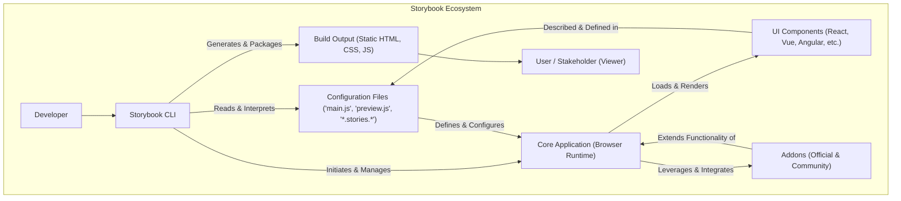
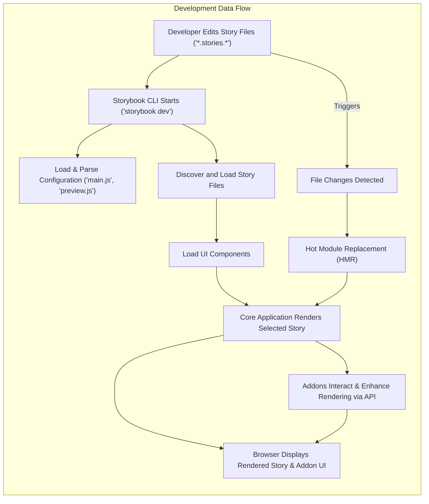
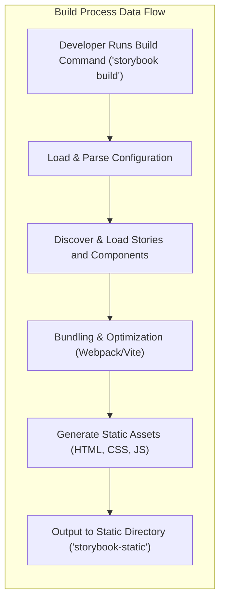

# Project Design Document: Storybook

**Version:** 1.1
**Date:** October 26, 2023
**Prepared By:** AI Architecture Expert

## 1. Introduction

This document provides an enhanced and more detailed design overview of Storybook, a widely adopted open-source tool for developing and showcasing UI components in isolation. It aims to comprehensively capture the key architectural elements, core components, intricate data flows, and crucial interactions within the Storybook ecosystem. This refined document serves as a robust and informative foundation for subsequent threat modeling activities, enabling a thorough security assessment of the project.

## 2. System Overview

Storybook functions as an isolated development environment and an interactive UI component explorer. It empowers developers to construct and visualize UI components independently, eliminating the need to run the entire encompassing application. This approach fosters component-driven development methodologies, significantly enhances component reusability, and streamlines the testing process. Storybook boasts broad compatibility, supporting a diverse range of frontend frameworks, including React, Vue, Angular, and Svelte, through specialized framework-specific implementations. It facilitates a clear separation of concerns, allowing developers to focus on individual component logic and presentation.

## 3. Goals and Objectives

*   Present a comprehensive and in-depth architectural depiction of Storybook.
*   Clearly identify and describe the core components and their interdependencies.
*   Thoroughly illustrate the data flow within the Storybook application during both development and build processes.
*   Outline various deployment scenarios for Storybook and their potential implications.
*   Establish a robust and detailed foundation for conducting thorough and effective threat modeling exercises.

## 4. Target Audience

This document is primarily intended for:

*   Security engineers tasked with performing threat modeling and security vulnerability assessments.
*   Development teams actively working on projects utilizing or integrating with Storybook.
*   Software architects seeking a granular understanding of Storybook's internal design and workings.

## 5. Architectural Overview

Storybook's architecture is logically organized into the following fundamental areas:

*   **Core Application (Runtime):** The primary Storybook application that executes within a web browser.
*   **Configuration System:** The mechanisms through which Storybook is configured, encompassing the definition of stories, addons, and global settings.
*   **Addon Ecosystem:**  An extensible plugin architecture that allows for the addition of new features and functionalities to Storybook.
*   **CLI (Command Line Interface) Tools:** A suite of command-line utilities for managing, running, and building Storybook projects.
*   **Build and Packaging Process:** The procedures involved in generating static assets for deployment and distribution.

## 6. Detailed Design

### 6.1. Core Application (Browser Runtime)

*   **Story Rendering Engine:**
    *   The central component responsible for dynamically rendering UI components based on their associated story definitions.
    *   Employs framework-specific renderers (e.g., `react-dom`, `vue-server-renderer`) to handle the unique rendering requirements of each supported framework.
    *   Implements hot-module replacement (HMR) to enable real-time updates of components and stories during development without full page reloads.
*   **UI Framework Abstraction Layer:**
    *   Provides a set of abstract interfaces and utilities to facilitate seamless integration with various UI frameworks (React, Vue, Angular, etc.).
    *   Manages the lifecycle events, component instantiation, and rendering specifics inherent to each framework.
*   **Addon Management and API:**
    *   Defines and exposes a robust API that allows addons to interact with the core application's functionalities and data.
    *   Enables addons to register custom UI elements (panels, toolbars, tabs), inject decorators into the rendering pipeline, and subscribe to application events.
    *   Provides mechanisms for secure communication and data exchange between the core application and individual addons.
*   **Navigation and User Interface:**
    *   Delivers the primary user interface for navigating and interacting with defined stories and components.
    *   Features a hierarchical sidebar for browsing components and their respective stories.
    *   Offers interactive controls for manipulating component properties (through addons like `Controls`) and toggling addon functionalities.

### 6.2. Configuration System

*   **`main.js` (or `main.ts`):**
    *   The principal configuration file that serves as the central point for configuring Storybook's behavior.
    *   Specifies the file paths and patterns used to locate story files within the project.
    *   Registers the addons that should be included and activated within the Storybook environment.
    *   Configures global Storybook options, such as the selected framework, enabled features, and default preview settings.
*   **`preview.js` (or `preview.ts`):**
    *   Used to apply global decorators that wrap all stories, providing consistent styling or context.
    *   Allows the definition of global parameters that can be accessed by stories and addons.
    *   Facilitates customization of the story rendering environment, including global CSS imports and custom preview templates.
*   **Story Files (`*.stories.js`, `*.stories.ts`, `*.stories.jsx`, `*.stories.tsx`, `*.mdx`):**
    *   Files that contain the actual definitions of individual stories, showcasing different states and variations of UI components.
    *   Utilize a declarative syntax to describe how a component should be rendered with specific props and context.
    *   Support the MDX format, enabling the embedding of interactive examples, documentation, and narrative content alongside component stories.
*   **Addon-Specific Configuration:**
    *   Certain addons may require their own dedicated configuration files or expose configuration options within `main.js`.

### 6.3. Addon Ecosystem

*   **Purpose:** To extend Storybook's core functionality with a wide array of features, including:
    *   Automated documentation generation and prop table display (e.g., `@storybook/addon-docs`).
    *   Accessibility testing and validation (e.g., `@storybook/addon-a11y`).
    *   Visual regression testing integration.
    *   Interaction testing and state management visualization (e.g., `@storybook/addon-interactions`).
    *   Theming and style customization controls.
    *   Integration with other development tools and platforms.
*   **Types of Addons:**
    *   **Official Addons:** Developed and actively maintained by the Storybook core team.
    *   **Community Addons:** Created and shared by the broader Storybook community, offering diverse functionalities.
    *   **Custom Addons:** Developed internally by project teams to address specific project requirements.
*   **Addon Architecture:**
    *   Typically comprise UI components (panels, toolbars, tabs) that integrate into the Storybook UI.
    *   Interact with the Storybook API to access story data, control rendering, and subscribe to events.
    *   May have their own configuration options and dependencies.

### 6.4. CLI (Command Line Interface) Tools

*   **`storybook dev` (or `yarn storybook` / `npm run storybook`):**
    *   Initiates the Storybook development server, providing a hot-reloading environment for component development.
    *   Parses configuration files, discovers story files, and launches the Storybook application in the browser.
*   **`storybook build` (or `yarn build-storybook` / `npm run build-storybook`):**
    *   Generates a static HTML, CSS, and JavaScript bundle of the Storybook, suitable for deployment.
    *   Optimizes the build output for performance and reduced file size.
*   **`storybook init`:**
    *   Helps initialize Storybook within an existing project, automatically detecting the project's framework and installing necessary dependencies.
*   **`storybook upgrade`:**
    *   Facilitates the upgrading of Storybook and its dependencies to the latest versions.
*   **`storybook codegen`:**
    *   Generates TypeScript definition files for stories, improving type safety.

### 6.5. Build and Packaging Process

*   **Bundling:** Leverages a module bundler, typically Webpack or Vite, to package the Storybook application, stories, and registered addons into optimized bundles.
*   **Static Asset Generation:**  Produces static HTML files, CSS stylesheets, JavaScript bundles, and other necessary assets required to run Storybook in a web browser without a backend server.
*   **Optimization Techniques:**  Applies various optimization techniques, such as code minification, tree-shaking (removing unused code), and asset optimization, to minimize the size of the build output and improve loading performance.
*   **Deployment Preparation:** The generated static assets are typically placed in a designated output directory (e.g., `storybook-static`), ready for deployment to a web server or hosting platform.

## 7. Data Flow

The following details the data flow within Storybook during the development lifecycle:

1. **Developer Defines Stories:** Developers create or modify story files (`*.stories.*`) that define the different states and variations of their UI components.
2. **Storybook CLI Invocation:** The developer executes the `storybook dev` command, initiating the development server.
3. **Configuration Loading and Parsing:** The Storybook CLI reads and parses `main.js` and `preview.js` to load configuration settings, registered addons, and global parameters.
4. **Story File Discovery:** Storybook scans the directories specified in the configuration to locate all relevant story files.
5. **Component and Story Loading:** The core application loads the defined UI components and their associated story definitions into memory.
6. **Rendering Process:** When a specific story is selected in the Storybook UI, the Story Rendering Engine utilizes the appropriate framework-specific renderer to dynamically render the component within the browser.
7. **Addon Interaction and Augmentation:** Active addons interact with the core application and the currently rendered story through the Addon API, providing supplementary features, controls, and information.
8. **Hot Module Replacement (HMR):** When changes are made to story files or related components, Storybook automatically rebuilds and updates the affected modules in the browser without requiring a full page reload, providing a seamless development experience.

The following outlines the data flow during the build process:

1. **Developer Initiates Build:** The developer executes the `storybook build` command.
2. **Configuration Loading:** Similar to the development process, Storybook loads and parses the configuration files (`main.js`, `preview.js`).
3. **Story Discovery and Loading:** Storybook identifies and loads all defined story files and their associated components.
4. **Bundling and Optimization:** The configured module bundler (Webpack or Vite) packages the application code, stories, and addons into optimized bundles.
5. **Static Asset Generation:**  HTML files, CSS stylesheets, JavaScript bundles, and other static assets are generated based on the bundled code and configurations.
6. **Output to Static Directory:** The generated static assets are written to the specified output directory (typically `storybook-static`).

## 8. Deployment Scenarios

Storybook deployments can vary significantly, each presenting unique security considerations:

*   **Local Development Environment:** Running Storybook on a developer's local machine. This is the most common scenario during active development and typically poses the least security risk due to its isolated nature.
*   **Internal Network Hosting:** Deploying the static build output to an internal web server accessible only within an organization's private network. This enables teams to share and review components internally, requiring appropriate access controls and authentication mechanisms.
*   **Public Internet Hosting:** Deploying the static build output to a public web server, making the component library accessible to anyone on the internet. This scenario demands careful consideration of data exposure and potential security vulnerabilities.
*   **Integration within Documentation Platforms:** Embedding Storybook within other documentation platforms or design system portals. This requires ensuring secure integration and preventing cross-frame scripting vulnerabilities.

## 9. Security Considerations (Pre-Threat Modeling)

Prior to conducting a detailed threat model, several key security aspects warrant consideration:

*   **Dependency Vulnerabilities:** Storybook relies on a significant number of npm packages. Vulnerabilities within these dependencies can introduce security risks. Regular dependency audits and updates are crucial.
*   **Third-Party Addon Security:** Community and custom addons may contain vulnerabilities or malicious code if not developed and maintained securely. Thorough vetting and security reviews of addons are recommended.
*   **Content Security Policy (CSP):**  Properly configuring the CSP of the environment hosting the Storybook is essential to mitigate cross-site scripting (XSS) attacks.
*   **Authentication and Authorization (for Internal Deployments):** For internally hosted Storybooks, implementing robust authentication and authorization mechanisms is vital to restrict access to authorized personnel only.
*   **Sensitive Data Exposure:**  Care must be taken to avoid inadvertently exposing sensitive data within story definitions, component code, or configuration files, particularly in public deployments.
*   **Build Pipeline Security:** Ensuring the integrity and security of the build pipeline is critical to prevent supply chain attacks or the introduction of malicious code during the build process.
*   **Input Sanitization in Addons:** Addons that accept user input should implement proper input sanitization to prevent injection vulnerabilities.

## 10. Glossary

*   **Story:** A specific rendered state or example of a UI component, showcasing its behavior and appearance under different conditions.
*   **Component:** A reusable and independent building block of a user interface.
*   **Addon:** A plugin that extends Storybook's core functionality, providing additional features and integrations.
*   **Decorator:** A higher-order function that wraps a story, allowing for the addition of context, styling, or behavior.
*   **Parameter:** Configuration options that can be applied to stories, components, or globally within Storybook.
*   **MDX (Markdown + JSX):** A file format that allows developers to write JSX code directly within Markdown documents, enabling rich documentation and interactive examples within stories.
*   **Hot Module Replacement (HMR):** A feature that allows modules to be updated at runtime without requiring a full page reload, significantly improving the development experience.

## 11. Future Considerations

This document represents the current design of Storybook. As the project continues to evolve with new features and architectural refinements, this document will require periodic updates to accurately reflect those changes. Future iterations may include more detailed sequence diagrams for specific interactions and a more granular breakdown of security controls implemented within the Storybook core and popular addons.