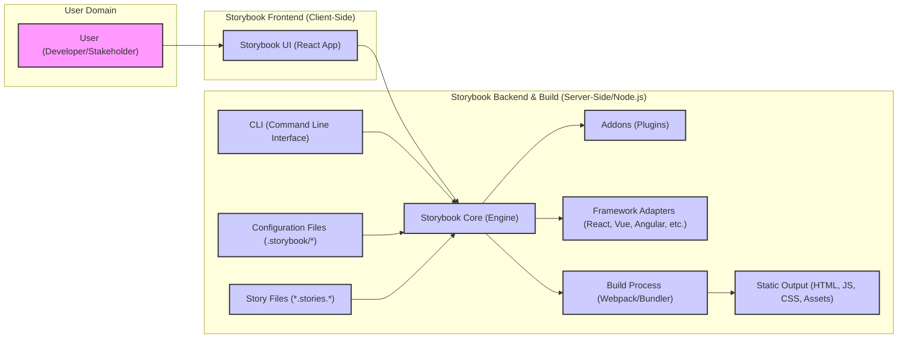

# Project Design Document: Storybook

**Project Name:** Storybook

**Project Repository:** [https://github.com/storybookjs/storybook](https://github.com/storybookjs/storybook)

**Document Version:** 1.1
**Date:** 2023-10-27
**Author:** AI Software Architect

## 1. Introduction

This document provides an enhanced and detailed design overview of Storybook, an open-source tool for developing UI components in isolation. It serves as a comprehensive guide to understand Storybook's architecture, components, data flow, and technology stack, with a stronger focus on security considerations for threat modeling. This document is intended to be used as a basis for threat modeling and security analysis of the Storybook project, aiding in identifying potential vulnerabilities and informing security mitigation strategies.

## 2. Project Overview

Storybook is a widely adopted open-source tool that empowers developers to build and showcase UI components in isolation from the main application context. It offers a dedicated development environment and an interactive user interface for browsing component libraries, visualizing different states of components (stories), and facilitating interaction with them. Storybook's framework-agnostic nature allows it to support a broad spectrum of UI frameworks, including React, Vue, Angular, Svelte, and more, making it a versatile choice for diverse frontend development workflows. Its extensibility through a rich ecosystem of addons enables deep customization and seamless integration with various development tools and processes.

**Target Audience:**

*   Frontend Developers: Primary users for component development and testing.
*   UI/UX Designers: To review and validate component designs and interactions.
*   Product Managers: To understand and approve UI component libraries.
*   Stakeholders: For visual regression testing and UI documentation review.
*   QA Engineers: For visual and interaction testing of UI components in isolation.

**Key Use Cases:**

*   **Isolated Component Development:** Building and testing components without application dependencies.
*   **Component Library Documentation:** Creating interactive and visual documentation for UI components.
*   **Visual Regression Testing:** Comparing component renderings across code changes.
*   **UI Kit Development:** Building and maintaining reusable UI component libraries for design systems.
*   **Collaboration and Communication:** Facilitating communication between developers, designers, and stakeholders about UI components.
*   **Rapid Prototyping:** Quickly creating and iterating on UI component designs.

**Key Features:**

*   Component Isolation: Develop and test UI components independently, reducing dependencies and complexity.
*   Story-Based Development: Define various states and scenarios of components as stories, enabling comprehensive coverage.
*   Interactive UI: Browse, inspect, and interact with components in a dedicated, user-friendly web interface.
*   Addon Ecosystem: Extend core functionality with a vast library of addons for documentation, controls, testing, and more.
*   Framework Agnostic: Supports multiple UI frameworks, ensuring broad applicability across projects.
*   Documentation Generation: Automatically generate living documentation from stories, keeping documentation synchronized with code.
*   Testing Integration: Integrate with testing tools for visual, accessibility, and interaction testing, improving component quality.
*   Static Deployment: Deploy Storybook as a static website for easy sharing and accessibility of component libraries.
*   Theming and Styling: Support for theming and styling components within the Storybook environment.
*   Accessibility Testing: Addons for automated accessibility checks and improvements.
*   Responsiveness Testing: Tools and addons to test component responsiveness across different screen sizes.

## 3. System Architecture

Storybook's architecture is designed around modularity and extensibility, with a central core engine interacting with plugins in the form of addons and framework adapters. This architecture promotes flexibility and allows for customization to suit diverse project needs. The following diagram illustrates the high-level architecture of Storybook, emphasizing the interactions between key components:

**Detailed Component Description and Interactions:**

*   **"User (Developer/Stakeholder)"**: Interacts with Storybook primarily through the "Storybook UI". Users trigger actions like browsing stories, interacting with controls, and viewing documentation.
*   **"Storybook UI (React App)"**:  A client-side React application that serves as the user interface.
    *   **Interaction:** Sends requests to "Storybook Core" for story data, component information, and addon functionalities.
    *   **Rendering:** Renders stories and UI elements based on data received from the "Storybook Core".
    *   **Addon Integration:** Provides UI elements and interaction points for installed "Addons".
*   **"Storybook Core (Engine)"**: The central server-side component (Node.js based) that orchestrates Storybook's functionality.
    *   **Configuration Management:** Loads and manages settings from "Configuration Files" (`.storybook/*`).
    *   **Story Discovery & Processing:** Discovers and parses "Story Files" to extract story definitions and metadata.
    *   **Addon & Framework Orchestration:** Manages and coordinates "Addons" and "Framework Adapters".
    *   **Data Serving:** Serves story data, component information, and addon assets to the "Storybook UI".
    *   **Build Orchestration:** Manages the "Build Process" using Webpack or other bundlers.
    *   **Development Server:** In development mode, it runs a local server to serve the "Storybook UI" and story data.
*   **"Addons (Plugins)"**: Extend Storybook's capabilities. They can be client-side, server-side, or both.
    *   **Functionality Extension:** Add features like documentation panels (`addon-docs`), interactive controls (`addon-controls`), theming, accessibility checks, etc.
    *   **Interaction with Core & UI:** Communicate with "Storybook Core" to access data and modify behavior, and integrate UI elements into the "Storybook UI".
    *   **Examples:** `addon-docs`, `addon-controls`, `addon-actions`, `addon-links`, `addon-viewport`, `addon-a11y`, `addon-themes`.
*   **"Framework Adapters (React, Vue, Angular, etc.)"**:  Bridge the gap between Storybook Core and specific UI frameworks.
    *   **Component Rendering:** Handle the rendering of components built with the target framework within the Storybook environment.
    *   **Framework-Specific Logic:** Implement framework-specific logic for story rendering and interaction.
    *   **Examples:** `@storybook/react`, `@storybook/vue`, `@storybook/angular`, `@storybook/web-components`.
*   **"CLI (Command Line Interface)"**: Provides command-line tools for interacting with Storybook.
    *   **Initialization:** `sb init` or `storybook init` to set up Storybook in a project.
    *   **Development Mode:** `sb dev` or `storybook dev` to start the development server.
    *   **Build Mode:** `sb build` or `storybook build` to generate static output.
    *   **Addon Management:** Commands for installing and managing addons.
    *   **Configuration Management:** Potentially commands for configuration tasks.
*   **"Configuration Files (.storybook/*)"**: JavaScript files that configure Storybook's behavior.
    *   **`main.js`**: Core configuration, including addons to use, framework selection, and story file patterns.
    *   **`preview.js`**: Configuration for story rendering, decorators, parameters, and global styles applied to stories.
    *   **`manager.js`**: Customization of the Storybook UI manager itself, less commonly used.
    *   **`tsconfig.json` (optional):** TypeScript configuration for Storybook's internal build and type checking.
*   **"Story Files (*.stories.*)"**: Files where UI components and their stories are defined.
    *   **Story Definition:** Contain code that defines components and their different states (stories).
    *   **Format:** Typically written in JavaScript or TypeScript, and can also use MDX for richer documentation.
    *   **Examples:** `Button.stories.js`, `Input.stories.tsx`, `Card.story.mdx`.
*   **"Build Process (Webpack/Bundler)"**:  Uses a bundler (primarily Webpack) to package Storybook and story code for deployment.
    *   **Bundling:** Bundles JavaScript, CSS, assets, and Storybook UI code.
    *   **Optimization:** Optimizes code for production (minification, tree-shaking, etc.).
    *   **Static File Generation:** Generates static HTML, JavaScript, and CSS files for the deployed Storybook instance.
*   **"Static Output (HTML, JS, CSS, Assets)"**: The result of the build process, a directory containing static files ready for deployment.
    *   **Deployment Ready:** Can be deployed to any static web server or hosting platform.
    *   **Self-Contained:** Contains all necessary assets to run Storybook in a browser without server-side processing (after initial build).

## 4. Data Flow

The data flow in Storybook involves several stages, from initialization to user interaction and static build generation.

1.  **Initialization Phase:**
    *   The user executes a Storybook CLI command (e.g., `sb dev`, `sb build`).
    *   The "CLI" invokes the "Storybook Core".
    *   "Storybook Core" starts the initialization process.

2.  **Configuration and Story Discovery:**
    *   "Storybook Core" loads configuration from "Configuration Files" (`.storybook/*`).
    *   It parses `main.js` to identify addons, framework, and story file patterns.
    *   "Storybook Core" scans the project directory based on configured patterns to discover "Story Files".

3.  **Story Processing and Data Extraction:**
    *   "Storybook Core" reads and processes each "Story File".
    *   It extracts story definitions, component metadata, and any associated documentation from the story files.
    *   This processed story data is held in memory by the "Storybook Core".

4.  **Development Server Mode (`sb dev`):**
    *   "Storybook Core" starts a development server (typically using Webpack Dev Server).
    *   The "Storybook UI" (React application) is served by the development server.
    *   When a "User" accesses Storybook in a browser, the "Storybook UI" is loaded.
    *   The "Storybook UI" makes requests to the "Storybook Core" (via API endpoints exposed by the development server) to fetch:
        *   Story list and hierarchy.
        *   Component metadata and props information.
        *   Story definitions and rendering instructions.
        *   Addon configurations and assets.
    *   "Storybook Core" responds with JSON data containing the requested information.
    *   "Storybook UI" uses the received data and "Framework Adapters" to render stories and the UI.
    *   "Addons" can intercept and modify data flow or UI rendering through APIs provided by "Storybook Core".

5.  **Build Mode (`sb build`):**
    *   The "CLI" initiates the "Build Process" through "Storybook Core".
    *   "Storybook Core" instructs the "Build Process" (Webpack) to bundle the "Storybook UI", story data, and necessary assets.
    *   The "Build Process" reads processed story data from "Storybook Core".
    *   Webpack bundles all JavaScript, CSS, and assets, and generates static HTML files.
    *   The output is the "Static Output" directory containing all files needed to run Storybook statically.

6.  **User Interaction with Deployed Storybook (Static Output):**
    *   A "User" accesses the deployed "Static Output" via a web browser.
    *   The "Storybook UI" (static files) is loaded and runs entirely in the browser.
    *   Story data is embedded within the static JavaScript files generated during the build process.
    *   The "Storybook UI" renders stories and UI elements using the embedded data.
    *   Interactions are handled client-side within the browser, without further server-side communication (for core Storybook functionality). Addons might introduce client-side or external server-side interactions depending on their features.

**Data Formats:**

*   **Configuration Files:** JavaScript objects and modules.
*   **Story Files:** JavaScript/TypeScript code defining components and stories, often using Component Story Format (CSF). MDX files contain Markdown and JSX.
*   **Data Exchange between UI and Core (Development Mode):** Primarily JSON over HTTP for API requests and responses.
*   **Static Output:** HTML, JavaScript, CSS, and asset files. Story data is serialized and embedded within JavaScript bundles.

## 5. Technology Stack

Storybook leverages a modern JavaScript and Node.js ecosystem. Key technologies include:

*   **Programming Languages:**
    *   JavaScript (ES6+): Core language for Storybook Core, UI, Addons, Framework Adapters, and CLI.
    *   TypeScript: Increasingly used within the Storybook codebase and for addon development, providing static typing.
*   **Runtime Environment:**
    *   Node.js (Version >= 16 recommended, check Storybook documentation for specific version compatibility): Server-side runtime for Storybook Core, CLI, and build processes.
*   **UI Framework (for Storybook UI):**
    *   React (Version >= 18 recommended, check Storybook documentation for specific version compatibility): Primarily used for building the Storybook UI itself.
*   **Bundler:**
    *   Webpack (Version 5 or later is common): Main bundler for bundling and optimizing Storybook and story code.
    *   Vite (Experimental support and growing adoption):  Alternative bundler offering faster development builds.
*   **Package Manager:**
    *   npm (Node Package Manager): Default package manager for dependency management.
    *   yarn (Yet Another Resource Negotiator): Alternative package manager, also widely used.
    *   pnpm (Performant npm): Another alternative package manager focused on speed and efficiency.
*   **Configuration Format:**
    *   JavaScript files (`.js`) for configuration (`main.js`, `preview.js`, `manager.js`).
*   **Story File Formats:**
    *   JavaScript (`.stories.js`, `.stories.jsx`, `.story.js`, `.story.jsx`).
    *   TypeScript (`.stories.ts`, `.stories.tsx`, `.story.ts`, `.story.tsx`).
    *   MDX (`.stories.mdx`, `.story.mdx`).
*   **UI Framework Support (via Framework Adapters):**
    *   React
    *   Vue
    *   Angular
    *   Web Components
    *   HTML
    *   Svelte
    *   Ember
    *   Preact
    *   SolidJS
    *   and potentially others through community frameworks or custom implementations.
*   **Testing Libraries (Integration via Addons):**
    *   Jest
    *   Cypress
    *   Playwright
    *   Testing Library
    *   and others.

## 6. Deployment Model

Storybook is designed for static deployment, making it highly portable and easy to host. The typical deployment process involves building Storybook into static files and then serving these files from a static hosting service.

**Deployment Steps:**

1.  **Build Storybook:** Run the Storybook build command (`sb build` or `storybook build`) in the project directory. This command generates the `storybook-static` directory (default output directory).
2.  **Choose a Static Hosting Platform:** Select a platform for hosting static websites.
3.  **Upload Static Files:** Upload the contents of the `storybook-static` directory to the chosen hosting platform.
4.  **Configure Hosting (if needed):** Configure the hosting platform to serve the files, typically setting the root directory to the uploaded folder and ensuring proper MIME types are configured for JavaScript, CSS, and HTML files.
5.  **Access Deployed Storybook:** Access the deployed Storybook instance through the URL provided by the hosting platform.

**Common Deployment Platforms:**

*   **Cloud Storage (for simple hosting):**
    *   AWS S3 (Amazon Simple Storage Service)
    *   Google Cloud Storage
    *   Azure Blob Storage
    *   Object Storage services from other cloud providers.
*   **Static Site Hosting Platforms (optimized for static sites):**
    *   Netlify
    *   Vercel
    *   GitHub Pages
    *   GitLab Pages
    *   Render Static Sites
    *   Firebase Hosting
*   **Traditional Web Servers (for more control):**
    *   Apache HTTP Server
    *   NGINX
    *   IIS (Internet Information Services)

**Deployment Scenarios:**

*   **Public Deployment:** Deploying Storybook publicly accessible for sharing component libraries with external stakeholders, designers, or the wider development community. Requires careful consideration of data sensitivity in stories and configurations.
*   **Private/Internal Deployment:** Deploying Storybook within an organization's internal network for internal development teams, design systems, and documentation. May require access control and authentication mechanisms.
*   **Versioned Deployments:** Deploying different versions of Storybook corresponding to different versions of the component library or application. Useful for maintaining documentation consistency across versions.

## 7. Security Considerations (For Threat Modeling)

Threat modeling for Storybook should consider vulnerabilities across its components, data flow, and deployment scenarios. Below are key security considerations categorized by component and potential threat types:

**7.1. Dependency Vulnerabilities (Storybook Core, Addons, Build Process):**

*   **Threat:**  Vulnerabilities in npm packages used by Storybook Core, Addons, Framework Adapters, or the build process (Webpack, etc.). These vulnerabilities could be exploited to achieve Remote Code Execution (RCE), Cross-Site Scripting (XSS), or Denial of Service (DoS).
*   **Examples:** Outdated versions of dependencies with known security flaws, vulnerable transitive dependencies.
*   **Mitigation:**
    *   Regularly audit and update dependencies using tools like `npm audit`, `yarn audit`, or dedicated dependency scanning tools.
    *   Implement a Software Bill of Materials (SBOM) to track dependencies.
    *   Use dependency vulnerability scanning in CI/CD pipelines.
    *   Consider using a private npm registry to control and curate dependencies.

**7.2. Addon Security (Addons):**

*   **Threat:** Malicious or poorly written addons can introduce various vulnerabilities, including XSS, RCE, or data breaches. Addons have significant access to Storybook's internal APIs and the browser environment.
*   **Examples:**
    *   XSS vulnerabilities in addon UI components.
    *   Addons that make insecure API calls or expose sensitive data.
    *   Backdoored or compromised addons from third-party sources.
*   **Mitigation:**
    *   Carefully vet and select addons from trusted sources.
    *   Review addon code for security vulnerabilities before installation, especially for custom or less popular addons.
    *   Implement a Content Security Policy (CSP) to mitigate XSS risks, but be aware that addons might require specific CSP configurations.
    *   Consider a process for security review and approval of addons within an organization.

**7.3. Configuration Security (Configuration Files - `.storybook/*`):**

*   **Threat:** Misconfigurations in `main.js`, `preview.js`, or `manager.js` can lead to security issues.
*   **Examples:**
    *   Accidentally exposing sensitive information in configuration files (e.g., API keys, internal URLs).
    *   Overly permissive configurations that weaken security controls.
    *   Incorrect CSP configurations that fail to protect against XSS.
*   **Mitigation:**
    *   Store sensitive configuration data securely (e.g., using environment variables or secrets management). Avoid hardcoding secrets in configuration files.
    *   Follow security best practices when configuring CSP and other security-related settings.
    *   Regularly review and audit Storybook configuration files for potential security weaknesses.

**7.4. Story File Security (Story Files - `*.stories.*`):**

*   **Threat:** Story files might inadvertently contain sensitive data, insecure code, or logic that could be exploited.
*   **Examples:**
    *   Embedding API keys or secrets directly in story code (though discouraged, it's a potential risk).
    *   Including vulnerable or insecure component code within stories.
    *   Stories that demonstrate or expose vulnerabilities in the components themselves.
*   **Mitigation:**
    *   Treat story files as code and apply secure coding practices.
    *   Avoid embedding sensitive data in story files.
    *   Regularly review story files for potential security issues.
    *   Use linters and static analysis tools to detect potential vulnerabilities in story code.

**7.5. Build Process Security (Build Process - Webpack/Bundler):**

*   **Threat:**  Compromising the build process could allow attackers to inject malicious code into the static output, leading to widespread attacks on users accessing the deployed Storybook.
*   **Examples:**
    *   Supply chain attacks targeting build dependencies or build tools.
    *   Compromised CI/CD pipelines used for building and deploying Storybook.
    *   Vulnerabilities in Webpack or other bundlers that could be exploited during the build.
*   **Mitigation:**
    *   Secure the CI/CD pipeline used for building and deploying Storybook.
    *   Implement integrity checks for build tools and dependencies.
    *   Regularly update build tools and dependencies.
    *   Consider using containerization and immutable build environments to enhance build process security.

**7.6. Static Output Security (Static Output - HTML, JS, CSS, Assets):**

*   **Threat:**  Vulnerabilities in the static output itself or insecure serving of the static files can lead to attacks.
*   **Examples:**
    *   XSS vulnerabilities in the generated JavaScript code.
    *   Serving static files over insecure HTTP instead of HTTPS.
    *   Missing security headers in the HTTP responses.
    *   Exposing the static output to unauthorized users if intended for private use.
*   **Mitigation:**
    *   Enforce HTTPS for serving the static output.
    *   Configure appropriate HTTP security headers:
        *   `Content-Security-Policy` (CSP) to mitigate XSS.
        *   `X-Frame-Options` to prevent clickjacking.
        *   `X-Content-Type-Options` to prevent MIME-sniffing attacks.
        *   `Strict-Transport-Security` (HSTS) to enforce HTTPS.
    *   Implement access control mechanisms if the Storybook instance is intended for private use (e.g., authentication at the web server level).
    *   Regularly scan the deployed static output for vulnerabilities.

**7.7. User Access Control (For Private Deployments):**

*   **Threat:** Unauthorized access to private Storybook instances could expose sensitive component designs, documentation, or internal development processes.
*   **Examples:**
    *   Lack of authentication allowing anyone to access a private Storybook.
    *   Weak or default authentication mechanisms.
    *   Authorization bypass vulnerabilities.
*   **Mitigation:**
    *   Implement robust authentication mechanisms for private Storybook deployments (e.g., password-based authentication, SSO, OAuth 2.0).
    *   Enforce authorization to control access to specific features or stories if needed.
    *   Regularly review and audit user access controls.

**7.8. Input Validation and Sanitization (Primarily relevant for Addons):**

*   **Threat:** Addons that process user input (e.g., through controls or forms) might be vulnerable to injection attacks if input is not properly validated and sanitized.
*   **Examples:**
    *   XSS vulnerabilities in addons that render user-provided text without sanitization.
    *   Code injection vulnerabilities if addons dynamically execute user-provided code (highly discouraged but theoretically possible).
*   **Mitigation:**
    *   Apply strict input validation and sanitization for any user input processed by addons.
    *   Use secure coding practices to prevent injection vulnerabilities in addon code.
    *   Regularly security test addons that handle user input.

By considering these security aspects during threat modeling, developers and security teams can proactively identify and mitigate potential vulnerabilities in Storybook deployments, ensuring a more secure and reliable component development and documentation environment.