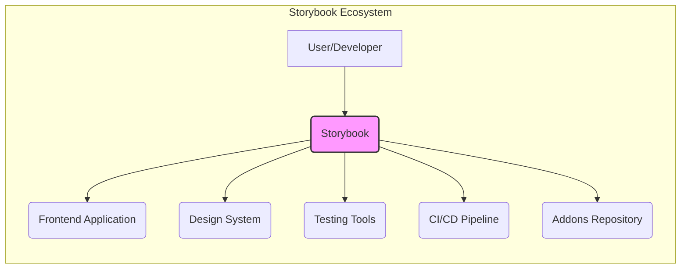
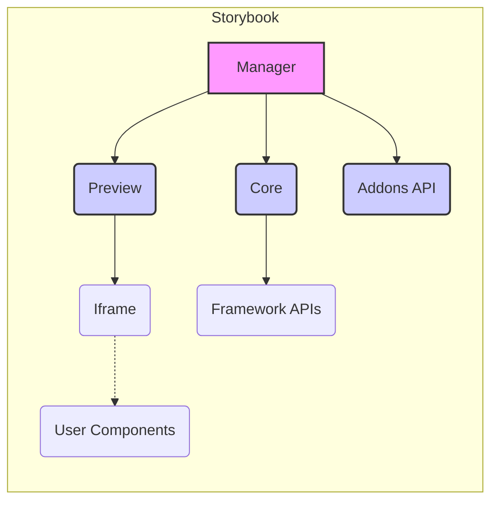
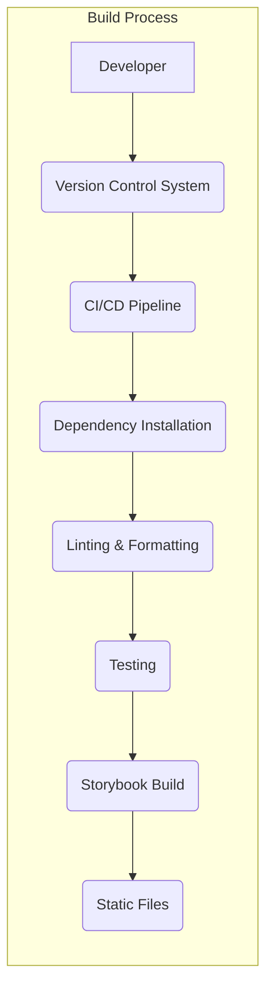

Okay, let's create a design document for the Storybook project, focusing on aspects relevant for threat modeling.

# BUSINESS POSTURE

Storybook is a widely-used open-source tool for developing UI components in isolation.  It's used by numerous organizations, from small startups to large enterprises.  Given its nature, the business priorities and goals revolve around:

*   Developer Productivity:  Enable faster and more efficient UI development by providing a sandbox for isolated component creation and testing.
*   UI Consistency:  Promote consistent UI design and behavior across applications and teams by providing a central, shareable component library.
*   Collaboration: Facilitate collaboration between designers, developers, and other stakeholders through a visual and interactive UI development environment.
*   Quality Assurance:  Improve UI quality by enabling visual testing, accessibility testing, and interaction testing of components.
*   Community Growth: Maintain and grow a vibrant open-source community around Storybook, ensuring its continued development and adoption.
*   Integration: Seamlessly integrate with various front-end frameworks (React, Vue, Angular, etc.) and testing tools.

Based on these priorities, the most important business risks are:

*   Compromise of the Storybook build process, leading to malicious code injection into user applications. (Supply Chain Risk)
*   Vulnerabilities within Storybook itself that could be exploited to gain access to sensitive information (e.g., API keys, design system details) displayed within Storybook instances.
*   Inability to support new versions of popular front-end frameworks, leading to decreased adoption and relevance.
*   Lack of security awareness among Storybook users, leading to insecure configurations and deployments.
*   Damage to reputation due to security incidents, impacting community trust and adoption.

# SECURITY POSTURE

Storybook, being a development tool, has a unique security posture. It's not typically deployed in a production environment facing end-users directly. However, it often interacts with sensitive data (design tokens, API mocks, etc.) and is a critical part of the software development lifecycle.

Existing Security Controls (based on the repository and common practices):

*   security control: Dependency Management: Storybook uses package managers (npm, yarn) to manage dependencies.  This includes mechanisms for checking for known vulnerabilities (e.g., `npm audit`). (Implemented in package.json and related lock files)
*   security control: Code Quality Tools: The repository shows evidence of linters (ESLint), code formatters (Prettier), and static analysis tools. These help prevent common coding errors that could lead to vulnerabilities. (Implemented in configuration files like .eslintrc.js, .prettierrc.js)
*   security control: Testing: Storybook itself has extensive unit and integration tests. This helps ensure the stability and reliability of the core codebase. (Implemented in test files throughout the repository)
*   security control: Community Reporting: As an open-source project, Storybook benefits from community scrutiny and vulnerability reporting. (Documented on the project's website and GitHub issues)
*   security control: Documentation: Security considerations are documented, guiding users on secure configurations. (Found in Storybook's official documentation)
*   security control: Sandboxing: Storybook's core functionality of isolating components provides a degree of inherent sandboxing, limiting the impact of potential vulnerabilities within individual components.

Accepted Risks:

*   accepted risk: Reliance on Third-Party Addons: Storybook's extensibility through addons introduces a risk of vulnerabilities in third-party code. Users are responsible for vetting the addons they choose to install.
*   accepted risk: Local Development Environment Security: Storybook is primarily used in local development environments, which are often less strictly controlled than production environments. The security of the development environment is largely the user's responsibility.
*   accepted risk: Data Exposure in Development: Storybook instances may display sensitive data (mocked or real) during development. Users are responsible for managing access to their Storybook instances.

Recommended Security Controls:

*   Software Composition Analysis (SCA): Integrate a dedicated SCA tool to continuously monitor dependencies for known vulnerabilities and provide more detailed reporting and remediation guidance.
*   Static Application Security Testing (SAST): Incorporate SAST tools into the build process to identify potential vulnerabilities in Storybook's own codebase.
*   Content Security Policy (CSP): Provide guidance and examples for configuring CSP headers within Storybook instances to mitigate XSS risks.
*   Addon Security Guidelines: Develop clear security guidelines and best practices for addon developers to promote secure addon development.
*   Signed Releases: Digitally sign Storybook releases to ensure their integrity and authenticity.

Security Requirements:

*   Authentication:
    *   While Storybook itself doesn't typically require authentication for local development, documentation should cover integration with authentication systems for shared or publicly accessible Storybook instances.
    *   If authentication is implemented, it should follow best practices for secure password management, session management, and protection against common attacks (e.g., brute-force, session hijacking).

*   Authorization:
    *   For shared Storybook instances, consider role-based access control (RBAC) to restrict access to sensitive information or features based on user roles.

*   Input Validation:
    *   Storybook's core functionality should properly sanitize and validate user inputs to prevent XSS and other injection vulnerabilities. This is particularly important for features that allow user-provided content (e.g., addon configurations, custom documentation).

*   Cryptography:
    *   If Storybook handles sensitive data (e.g., API keys, secrets), it should use appropriate cryptographic techniques to protect this data at rest and in transit.
    *   Any cryptographic operations should use strong, well-vetted libraries and algorithms.

# DESIGN

## C4 CONTEXT



Context Diagram Element List:

*   1.  Name: User/Developer
    *   Type: Person
    *   Description: The primary user of Storybook, typically a front-end developer or designer.
    *   Responsibilities: Interacts with Storybook to develop, test, and document UI components.
    *   Security controls: Secure development environment, strong passwords (if authentication is used).

*   2.  Name: Storybook
    *   Type: Software System
    *   Description: The core Storybook application, providing the UI development environment.
    *   Responsibilities: Rendering components, managing addons, providing interactive controls, integrating with testing tools.
    *   Security controls: Input validation, sandboxing, dependency management, code quality checks.

*   3.  Name: Frontend Application
    *   Type: Software System
    *   Description: The application that consumes the UI components developed in Storybook.
    *   Responsibilities: Rendering the user interface, handling user interactions, communicating with backend services.
    *   Security controls: Standard web application security controls (e.g., XSS protection, CSRF protection, input validation).

*   4.  Name: Design System
    *   Type: External System
    *   Description: A collection of design principles, guidelines, and reusable assets (e.g., design tokens, style guides).
    *   Responsibilities: Providing the foundation for consistent UI design.
    *   Security controls: Access controls to prevent unauthorized modification of design system assets.

*   5.  Name: Testing Tools
    *   Type: External System
    *   Description: Tools used for testing UI components within Storybook (e.g., Jest, Cypress, Playwright).
    *   Responsibilities: Running automated tests, reporting test results.
    *   Security controls: Secure configuration of testing tools, isolation of test environments.

*   6.  Name: CI/CD Pipeline
    *   Type: External System
    *   Description: The automated pipeline for building, testing, and deploying the frontend application and potentially Storybook itself.
    *   Responsibilities: Automating the software delivery process.
    *   Security controls: Secure configuration of the pipeline, access controls, vulnerability scanning.

*   7.  Name: Addons Repository
    *   Type: External System
    *   Description: A repository of third-party addons that extend Storybook's functionality.
    *   Responsibilities: Providing a platform for discovering and installing addons.
    *   Security controls: Addon vetting process (ideally), user reviews and ratings.

## C4 CONTAINER



Container Diagram Element List:

*   1.  Name: Manager
    *   Type: Container
    *   Description: The main Storybook UI, providing navigation, addon panels, and overall control.
    *   Responsibilities: Managing the Storybook interface, loading and displaying stories, interacting with addons.
    *   Security controls: Input validation, XSS protection.

*   2.  Name: Preview
    *   Type: Container
    *   Description: The area where components are rendered in isolation.
    *   Responsibilities: Rendering components within an iframe, handling user interactions, communicating with the Manager.
    *   Security controls: Sandboxing (via iframe), CSP (Content Security Policy).

*   3.  Name: Core
    *   Type: Container
    *   Description: The core logic of Storybook, responsible for managing stories, configurations, and framework integrations.
    *   Responsibilities: Loading and parsing story files, managing addons, providing APIs for framework-specific rendering.
    *   Security controls: Dependency management, code quality checks, regular security audits.

*   4.  Name: Addons API
    *   Type: Container
    *   Description: The API that allows addons to extend Storybook's functionality.
    *   Responsibilities: Providing a standardized way for addons to interact with Storybook.
    *   Security controls: API input validation, access control to prevent unauthorized actions.

*   5.  Name: Iframe
    *   Type: Container
    *   Description: An HTML iframe used to isolate the rendered components from the main Storybook UI.
    *   Responsibilities: Providing a sandboxed environment for component rendering.
    *   Security controls: Inherent browser sandboxing, CSP.

*   6.  Name: User Components
    *   Type: Component
    *   Description: The UI components developed by the user.
    *   Responsibilities: Rendering the UI elements defined by the user.
    *   Security controls: Dependent on the user's implementation; Storybook provides a sandboxed environment.

*   7.  Name: Framework APIs
    *   Type: API
    *   Description: Adapters and utilities for integrating with specific front-end frameworks (React, Vue, Angular, etc.).
    *   Responsibilities: Providing framework-specific rendering logic and utilities.
    *   Security controls: Regular updates to support the latest framework versions and security patches.

## DEPLOYMENT

Storybook is typically deployed in one of the following ways:

1.  Local Development: Running Storybook on a developer's machine during development.
2.  Shared Development Server: Deploying Storybook to a shared server accessible to a team.
3.  Static Site Hosting: Building Storybook as a static site and deploying it to a hosting service (e.g., Netlify, Vercel, GitHub Pages).
4.  Embedded within another application: In rare cases, Storybook might be embedded within another application.

We'll describe the Static Site Hosting deployment model in detail, as it's a common and relatively secure approach.

```mermaid
graph LR
    subgraph Deployment Environment (Static Site Hosting)
        A[CDN] --> B(Static Files);
        B --> C(index.html);
        B --> D(JavaScript Files);
        B --> E(CSS Files);
        B --> F(Assets);
    end
    A -.-> G(User Browser);
```

Deployment Diagram Element List:

*   1.  Name: CDN
    *   Type: Infrastructure
    *   Description: Content Delivery Network, used to distribute the static files globally.
    *   Responsibilities: Caching and serving static files, improving performance and reducing latency.
    *   Security controls: HTTPS, DDoS protection, WAF (Web Application Firewall).

*   2.  Name: Static Files
    *   Type: Files
    *   Description: The compiled output of the Storybook build process.
    *   Responsibilities: Providing the HTML, JavaScript, CSS, and other assets needed to render Storybook.
    *   Security controls: File integrity checks (e.g., Subresource Integrity), secure headers (e.g., CSP).

*   3.  Name: index.html
    *   Type: File
    *   Description: The main HTML file for Storybook.
    *   Responsibilities: Loading the Storybook application.
    *   Security controls: CSP, X-Content-Type-Options, X-Frame-Options.

*   4.  Name: JavaScript Files
    *   Type: Files
    *   Description: The compiled JavaScript code for Storybook and its addons.
    *   Responsibilities: Providing the logic for Storybook's functionality.
    *   Security controls: Minification, obfuscation (optional), regular updates to address vulnerabilities.

*   5.  Name: CSS Files
    *   Type: Files
    *   Description: The CSS stylesheets for Storybook.
    *   Responsibilities: Styling the Storybook UI.
    *   Security controls: Regular updates to address vulnerabilities.

*   6.  Name: Assets
    *   Type: Files
    *   Description: Other static assets, such as images and fonts.
    *   Responsibilities: Providing visual elements for Storybook.
    *   Security controls: File integrity checks.
*   7.  Name: User Browser
    *   Type: External System
    *   Description: The end-user's web browser.
    *   Responsibilities: Accessing and rendering the deployed Storybook instance.
    *   Security controls: Browser security settings, up-to-date browser version.

## BUILD

The Storybook build process typically involves the following steps:

1.  Developer writes code (components, stories, addons).
2.  Code is committed to a version control system (e.g., Git).
3.  A build process is triggered (manually or automatically via CI/CD).
4.  Dependencies are installed (using npm, yarn, etc.).
5.  Code is linted and formatted.
6.  Tests are run (unit, integration, visual regression).
7.  Storybook is built (compiling code, generating static assets).
8.  The output is a set of static files that can be deployed.



Security Controls in the Build Process:

*   Dependency Management: Using package managers with vulnerability scanning (e.g., `npm audit`, `yarn audit`).
*   Software Composition Analysis (SCA): Integrating a dedicated SCA tool for continuous monitoring of dependencies.
*   Static Application Security Testing (SAST): Incorporating SAST tools to scan the codebase for vulnerabilities.
*   Linting and Formatting: Enforcing code style and identifying potential errors.
*   Automated Testing: Running various types of tests to ensure code quality and prevent regressions.
*   Secure CI/CD Configuration: Protecting the CI/CD pipeline from unauthorized access and tampering.
*   Artifact Signing: Digitally signing the build artifacts to ensure their integrity.

# RISK ASSESSMENT

Critical Business Processes:

*   UI Component Development: The core process of creating and maintaining UI components.
*   Design System Management: Maintaining a consistent and up-to-date design system.
*   Collaboration and Knowledge Sharing: Facilitating communication and collaboration between developers, designers, and other stakeholders.

Data to Protect:

*   Source Code (Low to Medium Sensitivity): The code for Storybook itself and the user's components. While often not highly sensitive, it can contain proprietary logic or design details.
*   Design System Assets (Medium Sensitivity): Design tokens, style guides, and other assets that define the visual identity of the application.
*   Mocked Data (Variable Sensitivity): Mocked data used in stories can range from non-sensitive to highly sensitive, depending on the context.  It's crucial to avoid using real production data in Storybook.
*   API Keys and Secrets (High Sensitivity):  API keys or other secrets should *never* be hardcoded in Storybook or committed to the repository.  If needed for development, they should be managed securely using environment variables or other secure mechanisms.
*   Addon Configurations (Variable Sensitivity): Configurations for addons might contain sensitive information, depending on the addon.

# QUESTIONS & ASSUMPTIONS

Questions:

*   What specific front-end frameworks are the primary targets for Storybook integration? (Assumption: React, Vue, and Angular are the most important, but others may be relevant.)
*   What is the expected level of security awareness among Storybook users? (Assumption: Users have a basic understanding of web security concepts, but may not be security experts.)
*   Are there any specific compliance requirements (e.g., GDPR, HIPAA) that need to be considered? (Assumption: No specific compliance requirements are assumed, but this should be verified.)
*   What is the process for handling security vulnerabilities reported by the community? (Assumption: There is a documented process for reporting and addressing vulnerabilities.)
*   What level of support is provided for integrating Storybook with authentication and authorization systems? (Assumption: Basic guidance is provided, but deep integration may require custom solutions.)
*   Are there any plans to introduce features that could significantly impact the security posture (e.g., server-side rendering, data fetching)? (Assumption: No major changes that would drastically alter the security model are planned.)

Assumptions:

*   BUSINESS POSTURE: Storybook's primary goal is to improve developer productivity and UI consistency, with security as a critical supporting concern.
*   SECURITY POSTURE: Storybook is primarily used in development environments, and users are responsible for securing their own environments.
*   DESIGN: The static site deployment model is the most common and will be the focus of the deployment section. The build process is automated and includes security checks.