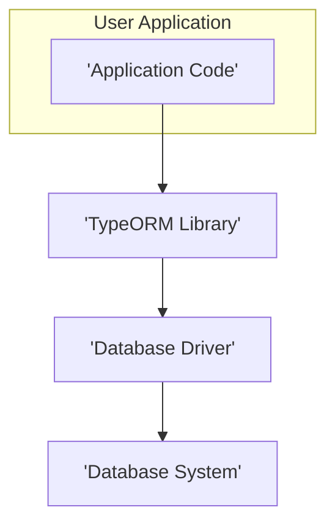
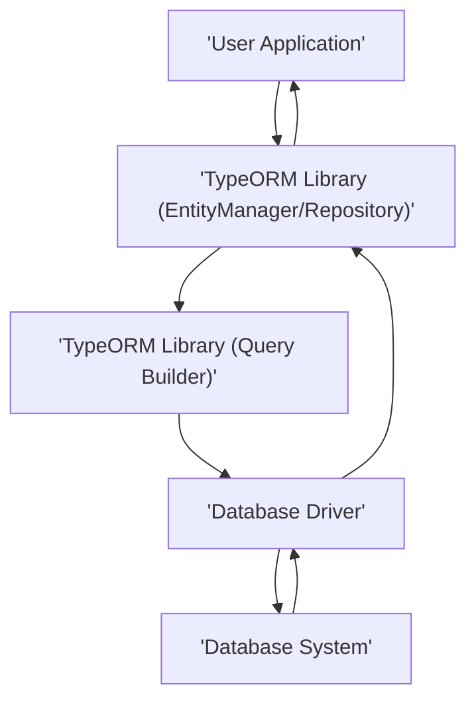

## Project Design Document: TypeORM (Improved)

**1. Introduction**

This document provides an enhanced and detailed design overview of TypeORM, an Object-Relational Mapper (ORM) for TypeScript and JavaScript, designed to facilitate subsequent threat modeling activities. It outlines the architecture, key components, data flow, and crucial security considerations of TypeORM to enable a comprehensive understanding of potential vulnerabilities and attack surfaces. This document serves as a foundation for identifying and mitigating security risks associated with the use of TypeORM in various applications.

**2. Goals and Objectives**

The primary goals of TypeORM are to:

* Offer a robust and developer-friendly abstraction layer for interacting with diverse SQL and NoSQL databases.
* Simplify common database operations through an intuitive object-oriented programming model.
* Provide essential ORM features, including entity management, database schema migrations, and a flexible query building interface.
* Ensure compatibility and seamless integration with multiple database systems through a unified application programming interface (API).
* Significantly improve developer productivity by minimizing repetitive and boilerplate code required for database interactions.

**3. System Architecture**

TypeORM's architecture is structured around several interconnected components that facilitate database interactions. The core elements are:

* **User Application:** The application code that integrates and utilizes the TypeORM library to perform database operations.
* **TypeORM Library:** The central library providing the core ORM functionalities and abstractions.
* **Database Driver:**  Specialized drivers responsible for translating TypeORM's generic commands into database-specific queries and managing connections.
* **Database System:** The underlying database server responsible for persistent data storage and management.

**3.1. Component Breakdown**

* **User Application:**
    * Defines data structures as **Entities**: TypeScript or JavaScript classes annotated to represent database tables or collections.
    * Interacts with TypeORM through its API to perform CRUD (Create, Read, Update, Delete) operations on entities.
    * Configures TypeORM with essential connection parameters, including database type, credentials, and entity locations.

* **TypeORM Library:**
    * **Entity Manager:**  The central point for managing entities. It handles persistence operations (saving, updating, removing), finding entities, and managing relationships between them.
    * **Repository:** Provides a specialized interface for interacting with specific entity types, offering convenience methods for common data access patterns.
    * **Query Builder:** A powerful and flexible API for constructing complex and type-safe database queries programmatically, offering an alternative to direct entity manipulation.
    * **Schema Builder / Migrations:**  Manages the evolution of the database schema. It allows developers to define schema changes in code and apply them to the database, ensuring consistency between the application's data model and the database structure.
    * **Connection Manager:**  Responsible for establishing and managing connections to the database. It often includes connection pooling to optimize performance and resource utilization.
    * **Metadata Storage:**  Maintains internal metadata about entities, their properties (columns), relationships, and database mappings. This metadata is crucial for TypeORM's functionality.
    * **Transaction Management:** Provides mechanisms for managing database transactions, ensuring atomicity, consistency, isolation, and durability (ACID) properties for critical operations.
    * **Logger:**  Records database interactions, errors, and other relevant information for debugging and monitoring purposes. Different logging levels can be configured.
    * **Cache (Optional):**  An optional layer for caching frequently accessed data to improve application performance by reducing database load. Different caching strategies can be employed.
    * **Command Line Interface (CLI):** Provides command-line tools for tasks such as generating migrations, running migrations, and inspecting the database schema.

* **Database Driver:**
    * Acts as an intermediary, translating TypeORM's database-agnostic operations into the specific SQL dialect or commands understood by the target **Database System**.
    * Manages the low-level details of establishing and maintaining a connection to the **Database System**.
    * Handles data type conversions between JavaScript/TypeScript and the database's native data types.
    * Examples include drivers for `'mysql'`, `'postgres'`, `'sqlite'`, `'mongodb'`, etc.

* **Database System:**
    * The actual database server where data is physically stored and managed.
    * Responsible for executing queries, enforcing data integrity, and providing data persistence.
    * Examples include MySQL, PostgreSQL, SQLite, MongoDB, and other supported databases.

**4. Data Flow**

A typical data flow for a database operation initiated by the **User Application** using TypeORM follows these steps:

1. The **User Application** initiates a database operation, such as saving a new entity or querying for existing data. This interaction typically occurs through the `EntityManager` or a specific `Repository`.
2. The **TypeORM Library** receives the request. Based on the operation, it utilizes the **Metadata Storage** to understand the structure of the involved entities and their mapping to the database.
3. If the operation involves querying data, the **Query Builder** constructs the appropriate database query. This process often involves translating object-oriented expressions into SQL or NoSQL query syntax.
4. The **TypeORM Library** selects the appropriate **Database Driver** based on the configured database type.
5. The **Query Builder** (if used) or the **Entity Manager** passes the generated query or the necessary commands to the selected **Database Driver**.
6. The **Database Driver** translates the abstract query or commands into the specific language understood by the target **Database System**. This includes formatting the query according to the database's syntax and handling any necessary data type conversions.
7. The **Database Driver** establishes a connection to the **Database System** (if not already established through the **Connection Manager**) and sends the translated query or commands.
8. The **Database System** executes the received query or commands and returns the results (e.g., retrieved data, success/failure status).
9. The **Database Driver** receives the results from the **Database System**. It then translates the database's response back into a format that TypeORM can understand, including mapping database rows to entity objects.
10. The **TypeORM Library** processes the results. For queries, it instantiates entity objects with the retrieved data. For persistence operations, it updates the state of managed entities.
11. The **TypeORM Library** returns the results (e.g., populated entity objects, confirmation of successful operation) to the **User Application**.

**5. Security Considerations**

Security is a paramount concern when using ORMs like TypeORM. Several key areas require careful attention:

* **SQL and NoSQL Injection Prevention:**
    * **Parameterized Queries:** TypeORM's query builder and `Repository` methods utilize parameterized queries by default, which significantly mitigates the risk of SQL and NoSQL injection attacks. User-provided data is treated as parameters rather than being directly embedded into the query string.
    * **Raw SQL Queries:**  Exercising caution when using raw SQL queries or the `query()` method is crucial. Ensure proper sanitization and escaping of user inputs if constructing queries manually. Failure to do so can introduce severe injection vulnerabilities.
* **Database Credentials Management:**
    * **Secure Storage:** Database credentials (username, password, connection strings) should never be hardcoded directly into the application code. Utilize environment variables, secure configuration files, or dedicated secrets management services (e.g., HashiCorp Vault, AWS Secrets Manager, Azure Key Vault).
    * **Principle of Least Privilege:**  Grant database users only the necessary permissions required for the application's operations. Avoid using overly permissive database accounts.
* **Authentication and Authorization:**
    * **Application-Level Security:** TypeORM itself does not handle application-level authentication or authorization. These mechanisms must be implemented within the **User Application** to control access to data and functionalities.
    * **Database-Level Security:**  Leverage the authentication and authorization features provided by the underlying **Database System** to further restrict access and enforce security policies.
* **Data Validation:**
    * **Input Sanitization:** Implement robust input validation and sanitization within the **User Application** before data reaches TypeORM. This helps prevent malformed or malicious data from being persisted in the database.
    * **TypeORM Validation:** Utilize TypeORM's built-in validation features (e.g., using decorators) to enforce data integrity at the ORM level.
* **Connection Security:**
    * **TLS/SSL Encryption:** Ensure that connections between the application and the **Database System** are encrypted using TLS/SSL to protect data in transit. Configure the **Database Driver** to enforce secure connections.
    * **Network Segmentation:**  Isolate the database server within a secure network segment to limit its exposure to potential attacks.
* **Dependency Management:**
    * **Regular Updates:** Keep TypeORM and its database drivers updated to the latest versions to patch any known security vulnerabilities.
    * **Vulnerability Scanning:**  Utilize dependency scanning tools to identify and address potential security risks in project dependencies.
* **Logging and Auditing:**
    * **Detailed Logging:** Implement comprehensive logging to track database interactions, including successful and failed operations, user actions, and potential security events.
    * **Audit Trails:** Consider implementing audit trails to track data modifications and access attempts for compliance and security monitoring.
* **Configuration Security:**
    * **Secure Configuration Storage:** Protect TypeORM configuration files and settings from unauthorized access. Avoid storing sensitive information directly in configuration files.
    * **Principle of Least Privilege (Configuration):**  Grant access to configuration settings only to authorized personnel or processes.
* **Mass Assignment Vulnerabilities:**
    * **Careful Handling of Input:** Be cautious when using methods that allow updating multiple entity fields based on user input. Implement proper input filtering and validation to prevent unintended or malicious data modifications. Define explicit allowed fields for updates.
* **Cross-Site Scripting (XSS) Prevention (if applicable in browser environments):**
    * **Output Encoding:** If TypeORM is used in a browser environment, ensure proper encoding of data retrieved from the database before rendering it in the user interface to prevent XSS attacks.

**6. Deployment Considerations**

TypeORM can be deployed in various environments, each with its own security implications:

* **Local Development:**  Typically less stringent security requirements but still important to avoid exposing development databases.
* **Cloud Environments (AWS, Azure, GCP):** Leverage cloud provider security features like managed database services, network security groups, and IAM roles for enhanced security.
* **Containerized Environments (Docker, Kubernetes):** Secure container images and orchestrate deployments with security best practices in mind. Implement network policies to control container communication.
* **Serverless Environments (AWS Lambda, Azure Functions):**  Manage database connections and credentials securely within the serverless environment. Utilize IAM roles for access control.

Key security considerations during deployment include:

* **Network Security:**  Configure firewalls and network security groups to restrict access to the database server.
* **Access Control:** Implement strong authentication and authorization mechanisms for accessing the application and the database.
* **Secrets Management:** Securely manage database credentials and other sensitive information.
* **Regular Security Audits:** Conduct periodic security assessments of the deployed application and infrastructure.

**7. Technologies Used**

* **Programming Languages:** TypeScript, JavaScript
* **Database Systems:**  Supports a wide range of SQL and NoSQL databases, including MySQL, PostgreSQL, SQLite, MongoDB, Microsoft SQL Server, Oracle, CockroachDB, and more.
* **Runtime Environments:** Node.js, Web Browsers, Mobile Platforms (React Native, Cordova, etc.), Electron.
* **Package Managers:** npm, yarn, pnpm.

**8. Future Considerations**

Potential future enhancements and security considerations for TypeORM include:

* **Enhanced Built-in Security Features:**  Exploring opportunities to integrate more robust security features directly into the library, such as more advanced input validation or built-in protection against common vulnerabilities.
* **Improved Documentation on Security Best Practices:**  Providing more comprehensive and readily accessible documentation on security best practices when using TypeORM.
* **Integration with Security Scanning Tools:**  Facilitating integration with static and dynamic application security testing (SAST/DAST) tools.
* **Further Refinement of Type Safety for Security:**  Leveraging TypeScript's type system to enforce stricter security-related constraints at compile time.

This improved design document provides a more detailed and security-focused overview of TypeORM, serving as a valuable resource for threat modeling and security analysis. By understanding the intricacies of its architecture, data flow, and potential security vulnerabilities, developers can build more secure applications utilizing this powerful ORM.