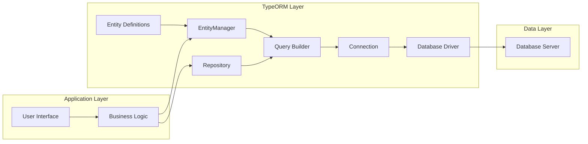

# Project Design Document: TypeORM

**Version:** 1.1
**Date:** October 26, 2023
**Author:** AI Software Architect

## 1. Project Overview

TypeORM is a versatile Object-Relational Mapper (ORM) designed for TypeScript and JavaScript environments. It supports a wide array of platforms including Node.js, browser-based applications, and various mobile development frameworks. The primary objective of TypeORM is to streamline database interactions by mapping JavaScript/TypeScript objects to relational database tables. This abstraction simplifies data access and manipulation, allowing developers to focus on application logic rather than intricate SQL. TypeORM is designed to accommodate projects ranging from simple applications to complex enterprise systems with intricate data relationships.

This document provides a detailed architectural overview of TypeORM, focusing on its key components and data flow. This information is crucial for conducting comprehensive threat modeling to identify potential security vulnerabilities.

## 2. Goals

* Provide a comprehensive and easily understandable overview of TypeORM's architecture and internal workings.
* Clearly delineate the key components of TypeORM and their interactions within the system.
* Detail the typical data flow for both read and write operations, highlighting critical stages.
* Serve as a foundational document for conducting thorough and effective threat modeling exercises.
* Identify potential security considerations arising from the architecture and data flow.

## 3. Target Audience

* Security engineers and architects tasked with performing threat modeling and security assessments.
* Software developers involved in building, maintaining, or extending applications that utilize TypeORM.
* DevOps engineers responsible for the deployment and infrastructure supporting applications using TypeORM.

## 4. Architecture Overview

TypeORM operates as an intermediary layer, abstracting the complexities of database interactions for TypeScript and JavaScript applications. It achieves this by mapping JavaScript/TypeScript classes (referred to as Entities) to corresponding tables within a relational database. The ORM manages database connections, constructs and executes queries, and translates data between the application's object model and the database's relational model. A key feature of TypeORM is its support for multiple database systems, achieved through the use of database-specific drivers. This allows developers to switch between different database backends with minimal code changes.

## 5. Key Components

* **`EntityManager`:** This is the central hub for all database operations within TypeORM. It provides a comprehensive API for managing entities, including methods for creating, reading, updating, and deleting (CRUD operations). It also handles transaction management and interacts directly with the `Connection`.
* **`Repository`:**  A specialized class associated with a specific `Entity`. It offers a more focused and convenient interface for performing data access operations on that particular entity type. Repositories are built upon the `EntityManager` and provide a higher level of abstraction.
* **`Entity`:** Represents a table in the database. Each `Entity` class is decorated with metadata that maps its properties to columns in the database table. Instances of these classes represent individual rows in the table.
* **`Connection`:** Manages the physical connection to the database. It encapsulates the underlying database driver and provides methods for executing raw SQL queries, although this is generally discouraged in favor of using the `EntityManager` or `Repository`. The `Connection` also handles connection pooling and management.
* **`QueryBuilder`:** A powerful and type-safe API for constructing complex SQL queries programmatically. It allows developers to build queries in a fluent and readable manner, reducing the risk of syntax errors and SQL injection vulnerabilities (when used correctly).
* **`SchemaBuilder`:** Responsible for the automatic generation and synchronization of the database schema based on the defined `Entity` classes. This includes creating tables, defining columns, setting up indexes, and establishing foreign key relationships.
* **`Migration`:** A system for managing changes to the database schema over time. Migration files contain code that describes how to alter the database structure, allowing for version control of the database schema and facilitating controlled updates.
* **`Database Drivers`:**  These are database-specific modules that handle the low-level communication with the respective database system (e.g., `pg` for PostgreSQL, `mysql` for MySQL). They translate TypeORM's generic database operations into the specific dialect of SQL required by the target database.
* **`Metadata Storage`:**  Internally, TypeORM maintains a registry of metadata about the defined entities, their properties, relationships, and database mappings. This metadata is crucial for query generation, schema management, and other internal operations.
* **`Transaction`:** Provides a mechanism to group multiple database operations into a single atomic unit of work. If any operation within a transaction fails, all changes are rolled back, ensuring data consistency and integrity.
* **`Listeners and Subscribers`:**  Allow developers to execute custom logic at specific points in an entity's lifecycle (e.g., before an entity is inserted, after an entity is updated). This can be used for auditing, data validation, or triggering other actions.
* **`Cache`:** An optional component that can be configured to cache the results of database queries to improve application performance by reducing the number of direct database hits. Different caching strategies and providers can be used.

## 6. Data Flow

The data flow within an application utilizing TypeORM can be broadly categorized into read and write operations.

### 6.1. Write Operation (e.g., Saving a New Entity)

1. **Application Request:** The application initiates a request to persist data (e.g., saving a new user).
2. **Repository/EntityManager Interaction:** The application interacts with a specific `Repository` or the `EntityManager` to save the entity.
3. **Data Validation and Transformation (Optional):**  Listeners or subscribers might perform data validation or transformation before persistence.
4. **Query Generation:** TypeORM translates the save operation into an appropriate SQL `INSERT` statement. The `QueryBuilder` might be involved for more complex scenarios.
5. **Connection Acquisition:** The `EntityManager` obtains a database connection from the `Connection` pool.
6. **Query Execution:** The generated SQL query is passed to the `Database Driver` associated with the configured database.
7. **Database Interaction:** The `Database Driver` communicates with the database server, executing the `INSERT` statement.
8. **Result and Potential ID Retrieval:** The database server executes the query and returns the result (e.g., number of affected rows, generated ID for auto-incrementing columns).
9. **Result Mapping:** TypeORM maps the database response back to the entity object, potentially updating auto-generated IDs.
10. **Transaction Management (if applicable):** If the operation is part of a transaction, the changes are staged until the transaction is committed.
11. **Response to Application:** The `EntityManager` or `Repository` returns a confirmation or the updated entity back to the application.

### 6.2. Read Operation (e.g., Fetching Entities)

1. **Application Request:** The application requests data from the database (e.g., fetching a list of products).
2. **Repository/EntityManager Interaction:** The application interacts with a `Repository` or the `EntityManager` to fetch the desired entities, specifying criteria (e.g., using `find`, `findOne`, or custom queries).
3. **Query Building:** TypeORM constructs the appropriate SQL `SELECT` query based on the specified criteria. The `QueryBuilder` is often used for constructing flexible and complex queries.
4. **Cache Check (Optional):** If caching is enabled, TypeORM might check the cache for the requested data before querying the database.
5. **Connection Acquisition:** The `EntityManager` obtains a database connection.
6. **Query Execution:** The generated SQL query is sent to the `Database Driver`.
7. **Database Interaction:** The `Database Driver` executes the `SELECT` query on the database server.
8. **Result Retrieval:** The database server returns the result set to the `Database Driver`.
9. **Data Hydration:** TypeORM maps the rows from the result set to instances of the corresponding `Entity` class, populating their properties with the retrieved data.
10. **Cache Population (Optional):** If caching is enabled and the data was not found in the cache, the retrieved data might be stored in the cache.
11. **Response to Application:** The `EntityManager` or `Repository` returns the hydrated entity objects (or a single entity) to the application.

```mermaid
sequenceDiagram
    participant Application
    participant EntityManager
    participant Repository
    participant QueryBuilder
    participant Connection
    participant DatabaseDriver
    participant Database

    group Write Operation (Save)
        Application->>Repository: Save Entity
        Repository->>EntityManager: Delegate Save
        EntityManager->>QueryBuilder: Generate SQL (INSERT/UPDATE)
        QueryBuilder->>Connection: Execute Query
        Connection->>DatabaseDriver: Send Query
        DatabaseDriver->>Database: Execute Query
        Database-->>DatabaseDriver: Result
        DatabaseDriver-->>Connection: Result
        Connection-->>EntityManager: Result Mapping
        EntityManager-->>Repository: Return Result
        Repository-->>Application: Confirmation
    end

    group Read Operation (Fetch)
        Application->>Repository: Find Entities
        Repository->>EntityManager: Delegate Find
        EntityManager->>QueryBuilder: Generate SQL (SELECT)
        QueryBuilder->>Connection: Execute Query
        Connection->>DatabaseDriver: Send Query
        DatabaseDriver->>Database: Execute Query
        Database-->>DatabaseDriver: Result Set
        DatabaseDriver-->>Connection: Result Set
        Connection-->>EntityManager: Data Hydration
        EntityManager-->>Repository: Return Entities
        Repository-->>Application: Entities
    end
```

## 7. Security Considerations (Detailed for Threat Modeling)

This section expands on potential security vulnerabilities, categorized for clarity during threat modeling.

* **SQL Injection:**
    * **Risk:** Malicious SQL code injected through user inputs or other external sources can be executed against the database, potentially leading to data breaches, data manipulation, or denial of service.
    * **TypeORM Context:** While TypeORM's parameterized queries mitigate this risk significantly, vulnerabilities can arise from:
        * **Improper use of raw SQL queries:**  Bypassing TypeORM's query building mechanisms with manually constructed SQL.
        * **String concatenation in `QueryBuilder`:**  Carelessly embedding untrusted data directly into query strings.
        * **Vulnerabilities in custom database functions:** If TypeORM interacts with stored procedures or functions containing SQL injection flaws.
* **Data Exposure:**
    * **Risk:** Sensitive data can be exposed to unauthorized users or systems.
    * **TypeORM Context:**
        * **Insufficient authorization checks:** Application logic failing to properly restrict access to entities or specific data fields.
        * **Over-fetching of data:**  Retrieving more data than necessary, increasing the potential impact of a data breach.
        * **Exposure through relationships:**  Unintended access to related entities due to improperly configured relationships or access controls.
        * **Logging sensitive data:**  Accidentally logging database queries or results containing sensitive information.
* **Database Credentials Management:**
    * **Risk:** Compromised database credentials allow attackers full access to the database.
    * **TypeORM Context:**
        * **Storing credentials in plain text:**  Configuration files, environment variables, or code containing unencrypted credentials.
        * **Insufficient access control to configuration files:**  Unauthorized access to files containing database credentials.
        * **Hardcoding credentials:** Embedding credentials directly within the application code.
* **Dependency Vulnerabilities:**
    * **Risk:** Security flaws in TypeORM's dependencies (including database drivers) can be exploited.
    * **TypeORM Context:**
        * **Outdated dependencies:**  Failing to regularly update TypeORM and its dependencies to patch known vulnerabilities.
        * **Vulnerabilities in specific database drivers:**  Flaws in the driver used for the target database.
* **Schema Manipulation Attacks:**
    * **Risk:** Attackers could potentially alter the database schema, leading to data corruption or denial of service.
    * **TypeORM Context:**
        * **Allowing external input to influence migrations:**  Uncontrolled execution of migration scripts based on user input.
        * **Insufficient protection of migration files:**  Unauthorized modification of migration scripts.
        * **Auto-schema synchronization in production:**  Enabling automatic schema updates in production environments without proper controls.
* **Connection String Security:**
    * **Risk:** Compromised connection strings grant attackers direct access to the database.
    * **TypeORM Context:**  Similar risks to database credential management, as connection strings often contain credentials.
* **Transaction Management Issues:**
    * **Risk:** Incorrectly implemented transactions can lead to data inconsistencies or race conditions.
    * **TypeORM Context:**
        * **Missing or improperly scoped transactions:**  Failing to wrap related operations in a transaction.
        * **Long-running transactions:**  Holding database locks for extended periods, potentially causing performance issues or deadlocks.
* **Cache Poisoning:**
    * **Risk:** Attackers could insert malicious or incorrect data into the cache, leading to application errors or serving incorrect information to users.
    * **TypeORM Context:**
        * **Vulnerabilities in the chosen caching provider:**  Exploiting flaws in the underlying caching mechanism.
        * **Lack of proper cache invalidation:**  Serving stale data due to incorrect cache invalidation logic.
* **Denial of Service (DoS):**
    * **Risk:** Maliciously crafted queries can overload the database server, making the application unavailable.
    * **TypeORM Context:**
        * **Complex queries without proper indexing:**  Leading to slow query execution and resource exhaustion.
        * **Pagination issues:**  Fetching excessively large datasets without proper pagination.
* **Information Disclosure through Error Messages:**
    * **Risk:** Verbose error messages containing sensitive database information (e.g., table names, column names, schema details) could be exposed to attackers.
    * **TypeORM Context:**  Configuration settings controlling the level of detail in error messages returned by TypeORM and the underlying database driver.
* **Authentication and Authorization:**
    * **Risk:**  Lack of proper authentication and authorization mechanisms can allow unauthorized access to data and functionality.
    * **TypeORM Context:** While TypeORM itself doesn't handle user authentication, it's crucial that the application using TypeORM implements robust authentication and authorization to control access to entities and database operations. This includes verifying user identity and ensuring they have the necessary permissions to perform requested actions.

## 8. Technology Stack

* **Primary Languages:** TypeScript, JavaScript
* **Supported Databases:** PostgreSQL, MySQL, MariaDB, SQLite, Microsoft SQL Server, Oracle, CockroachDB, SAP HANA, MongoDB (via a specific driver)
* **Runtime Environments:** Node.js, Browsers, Mobile Platforms (Cordova, React Native, Ionic, NativeScript), Electron

## 9. Deployment Model

The deployment model significantly impacts the security considerations for applications using TypeORM.

* **Server-side Applications (Node.js):** TypeORM typically runs within the backend server, establishing direct connections to the database. Security focuses on securing the server, managing database credentials securely on the server, and protecting against server-side vulnerabilities.
* **Client-side Applications (Browsers):** Direct database connections from the browser are generally discouraged. TypeORM in this context usually interacts with a backend API, shifting the primary security concerns to the API and the communication channel.
* **Mobile Applications:** Similar to browser applications, mobile apps typically use TypeORM to interact with a backend API. Security considerations involve securing the API, the communication between the app and the API, and protecting any sensitive data stored locally on the device (though TypeORM's primary function is server-side database interaction).

## 10. Diagrams

*(Diagrams remain the same as in the previous version for brevity, as the core structure hasn't fundamentally changed. The sequence diagram has been updated to show both read and write operations.)*

### 10.1. High-Level Architecture Diagram



### 10.2. Data Flow Diagram (Combined Read and Write)

```mermaid
sequenceDiagram
    participant Application
    participant EntityManager
    participant Repository
    participant QueryBuilder
    participant Connection
    participant DatabaseDriver
    participant Database

    group Write Operation (Save)
        Application->>Repository: Save Entity
        Repository->>EntityManager: Delegate Save
        EntityManager->>QueryBuilder: Generate SQL (INSERT/UPDATE)
        QueryBuilder->>Connection: Execute Query
        Connection->>DatabaseDriver: Send Query
        DatabaseDriver->>Database: Execute Query
        Database-->>DatabaseDriver: Result
        DatabaseDriver-->>Connection: Result Mapping
        Connection-->>EntityManager: Return Result
        EntityManager-->>Repository: Return Result
        Repository-->>Application: Confirmation
    end

    group Read Operation (Fetch)
        Application->>Repository: Find Entities
        Repository->>EntityManager: Delegate Find
        EntityManager->>QueryBuilder: Generate SQL (SELECT)
        QueryBuilder->>Connection: Execute Query
        Connection->>DatabaseDriver: Send Query
        DatabaseDriver->>Database: Execute Query
        Database-->>DatabaseDriver: Result Set
        DatabaseDriver-->>Connection: Result Set
        Connection-->>EntityManager: Data Hydration
        EntityManager-->>Repository: Return Entities
        Repository-->>Application: Entities
    end
```

## 11. Future Considerations

* **More Granular Data Flow Diagrams:**  Detailed diagrams for specific operations (e.g., updating an entity with relations).
* **Security Best Practices Guide:**  A dedicated section outlining recommended security practices for developers using TypeORM, including secure configuration, input validation, and authorization strategies.
* **Threat Scenario Mapping:**  Explicitly mapping identified threats to specific components and data flow stages to facilitate targeted mitigation strategies.
* **Integration with Security Tools:**  Consideration of how TypeORM's architecture might interact with static analysis tools, dynamic analysis tools, and other security assessment methodologies.

This improved design document provides a more detailed and structured overview of TypeORM, specifically tailored for effective threat modeling. The expanded security considerations and clearer data flow descriptions should enable security professionals to conduct more thorough and insightful assessments.