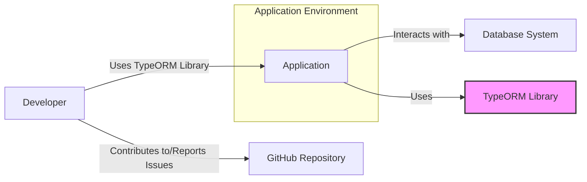
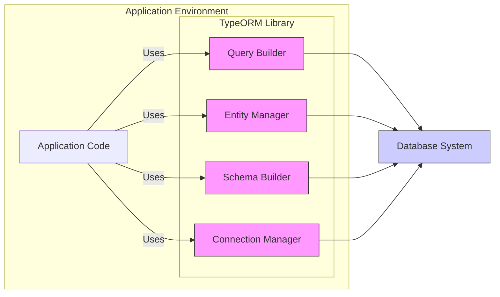
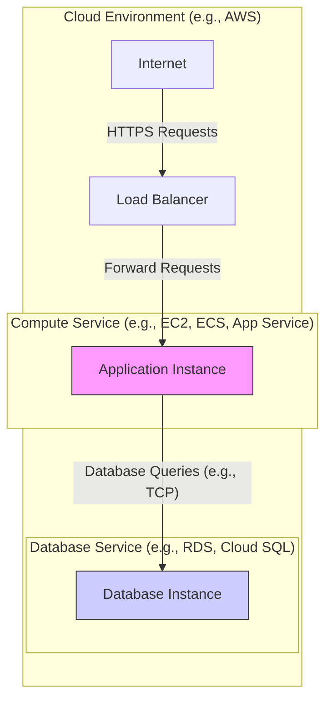

# BUSINESS POSTURE

- Business Priorities and Goals:
  - Provide a robust, flexible, and easy-to-use Object-Relational Mapper (ORM) for TypeScript and JavaScript developers.
  - Simplify database interactions, allowing developers to focus on application logic rather than database-specific code.
  - Support a wide range of database systems and features.
  - Maintain high performance and reliability.
  - Foster a strong community and provide excellent documentation and support.
- Most Important Business Risks:
  - Security vulnerabilities in TypeORM could lead to data breaches or corruption in applications that use it.
  - Bugs or instability could disrupt applications relying on TypeORM, impacting business operations.
  - Lack of support for new database features or versions could limit adoption and developer satisfaction.
  - Poor performance could negatively affect application responsiveness and user experience.
  - Insufficient documentation or community support could hinder adoption and increase development costs for users.

# SECURITY POSTURE

- Existing Security Controls:
  - security control: Open Source Code - publicly accessible code allows for community review and identification of potential vulnerabilities. Implemented in: GitHub repository.
  - security control: Unit and Integration Tests - automated tests help ensure code correctness and prevent regressions, including potential security flaws. Implemented in: GitHub Actions workflows and project's test suite.
  - security control: GitHub Issue Tracking - public issue tracker allows users to report bugs and security vulnerabilities. Implemented in: GitHub Issues.
  - security control: Dependency Management - using `npm` and `package-lock.json` to manage dependencies and ensure consistent builds. Implemented in: `package.json` and `package-lock.json`.
- Accepted Risks:
  - accepted risk: Reliance on community contributions for security vulnerability identification and patching.
  - accepted risk: Potential delay in security patch releases due to the open-source and community-driven nature of the project.
  - accepted risk: Vulnerabilities in third-party dependencies used by TypeORM.
- Recommended Security Controls:
  - security control: Implement Static Application Security Testing (SAST) in the CI/CD pipeline to automatically detect potential code-level vulnerabilities.
  - security control: Implement Dependency Vulnerability Scanning in the CI/CD pipeline to identify and alert on known vulnerabilities in third-party dependencies.
  - security control: Conduct regular security audits, potentially by external security experts, to proactively identify and address security weaknesses.
  - security control: Establish a clear process for handling security vulnerability reports, including responsible disclosure and timely patching.
  - security control: Provide security guidelines and best practices for developers using TypeORM to build secure applications, focusing on topics like input validation and secure database interactions.
- Security Requirements:
  - Authentication:
    - TypeORM itself does not handle application-level authentication.
    - TypeORM should support secure connection methods to databases that enforce authentication (e.g., username/password, certificate-based authentication, OAuth).
    - TypeORM configuration should allow specifying secure authentication mechanisms supported by the underlying database.
  - Authorization:
    - TypeORM does not enforce application-level authorization.
    - TypeORM should facilitate the implementation of authorization logic within applications by providing mechanisms to query and manipulate data based on user roles and permissions (e.g., through query builders and data access patterns).
    - TypeORM should not bypass database-level authorization mechanisms.
  - Input Validation:
    - TypeORM should provide mechanisms to prevent common injection attacks, such as SQL injection.
    - TypeORM should encourage or enforce parameterized queries or prepared statements as the default way to interact with databases to mitigate SQL injection risks.
    - TypeORM should validate input data types and formats where applicable to prevent unexpected behavior and potential vulnerabilities.
  - Cryptography:
    - TypeORM should support secure connections to databases using encryption protocols like TLS/SSL.
    - TypeORM should not implement its own cryptography for data at rest encryption, but should rely on database-level encryption features when required.
    - If TypeORM handles sensitive data in memory (e.g., during data transformation), consider secure handling practices to avoid exposing sensitive information.

# DESIGN

## C4 CONTEXT

- Context Diagram Elements:
  - - Name: Developer
    - Type: Person
    - Description: Software developers who use TypeORM library to build applications.
    - Responsibilities: Develop applications using TypeORM, configure TypeORM for database interactions, report issues and contribute to the TypeORM project.
    - Security controls: Follow secure coding practices when using TypeORM, properly configure database connections and access controls in applications.
  - - Name: Application
    - Type: Software System
    - Description: Applications built by developers using TypeORM to manage data persistence.
    - Responsibilities: Utilize TypeORM to interact with databases, implement business logic, handle user requests, manage data.
    - Security controls: Application-level authentication and authorization, input validation, secure session management, protection of sensitive data, logging and monitoring.
  - - Name: Database System
    - Type: Software System
    - Description: Relational or NoSQL database systems supported by TypeORM (e.g., PostgreSQL, MySQL, MongoDB).
    - Responsibilities: Store and manage application data, enforce data integrity, provide data access to applications via TypeORM.
    - Security controls: Database access control lists (ACLs), authentication mechanisms, encryption at rest and in transit, database auditing, vulnerability patching.
  - - Name: GitHub Repository
    - Type: Software System
    - Description: The GitHub repository hosting the TypeORM source code, issue tracker, and collaboration platform.
    - Responsibilities: Host the TypeORM codebase, manage issue reports and feature requests, facilitate community contributions, version control.
    - Security controls: GitHub access controls, branch protection rules, vulnerability scanning for dependencies, security audits of GitHub workflows.
  - - Name: TypeORM Library
    - Type: Software System
    - Description: The Object-Relational Mapper library that simplifies database interactions for TypeScript and JavaScript applications.
    - Responsibilities: Provide an abstraction layer for database interactions, map application objects to database tables, generate SQL queries, manage database connections.
    - Security controls: Input validation to prevent SQL injection, secure handling of database credentials (configuration, not storage), adherence to secure coding practices, vulnerability scanning, regular security updates.

## C4 CONTAINER

- Container Diagram Elements:
  - - Name: Query Builder
    - Type: Container/Module
    - Description: Provides an API for constructing database queries programmatically, offering a type-safe and flexible way to interact with data.
    - Responsibilities: Build SQL queries based on application logic, handle data retrieval and manipulation requests, abstract away database-specific query syntax.
    - Security controls: Parameterized query generation to prevent SQL injection, input validation within query building logic, secure handling of query parameters.
  - - Name: Entity Manager
    - Type: Container/Module
    - Description: Manages entities and their lifecycle, providing methods for persisting, retrieving, updating, and deleting entities in the database.
    - Responsibilities: Track entity state, manage database transactions, provide an object-oriented interface for data access, handle entity relationships.
    - Security controls: Authorization checks at the entity level (application responsibility, facilitated by TypeORM), data validation before persistence, secure handling of entity data.
  - - Name: Schema Builder
    - Type: Container/Module
    - Description: Responsible for generating and managing the database schema based on entity definitions.
    - Responsibilities: Create, update, and drop database tables and columns, manage database migrations, synchronize schema with entity models.
    - Security controls: Schema migration scripts review and control to prevent unintended database modifications, secure handling of database schema definition, prevent injection vulnerabilities during schema operations.
  - - Name: Connection Manager
    - Type: Container/Module
    - Description: Manages database connections, connection pooling, and transaction management.
    - Responsibilities: Establish and maintain connections to the database, handle connection pooling for performance, manage database transactions, provide connection configuration options.
    - Security controls: Secure storage and retrieval of database credentials (application configuration responsibility), secure connection protocols (TLS/SSL), connection pooling configuration to prevent resource exhaustion, proper handling of connection errors.
  - - Name: Application Code
    - Type: Container/Component
    - Description: The application-specific code that utilizes TypeORM library to interact with the database.
    - Responsibilities: Implement business logic, handle user requests, use TypeORM APIs to manage data persistence, configure TypeORM and database connections.
    - Security controls: Application-level security controls, including authentication, authorization, input validation, secure session management, and proper use of TypeORM security features.
  - - Name: Database System
    - Type: External System
    - Description: The underlying database system that stores and manages the application data.
    - Responsibilities: Store data, enforce data integrity, provide data access, handle database-level security.
    - Security controls: Database-level security controls as described in the Context Diagram.

## DEPLOYMENT

- Deployment Architecture Options:
  - Option 1: TypeORM as a library embedded within a backend application deployed on cloud infrastructure (e.g., AWS, Azure, GCP).
  - Option 2: TypeORM used in serverless functions (e.g., AWS Lambda, Azure Functions, Google Cloud Functions) to interact with databases.
  - Option 3: TypeORM used in desktop or mobile applications (less common for server-side ORMs, but possible with technologies like Electron or React Native for backend logic).

- Detailed Deployment Architecture (Option 1 - Cloud Backend Application):

- Deployment Diagram Elements:
  - - Name: Internet
    - Type: Environment
    - Description: Public internet network through which user requests are received.
    - Responsibilities: Provide network connectivity for users to access the application.
    - Security controls: DDoS protection, network firewalls at the cloud provider level.
  - - Name: Load Balancer
    - Type: Infrastructure
    - Description: Distributes incoming HTTPS requests across multiple application instances for scalability and availability.
    - Responsibilities: Load balancing, SSL termination, health checks for application instances, routing requests.
    - Security controls: HTTPS termination, SSL certificate management, access control lists, security logging, potentially WAF (Web Application Firewall) integration.
  - - Name: Application Instance
    - Type: Compute Instance (VM, Container, etc.)
    - Description: Instance running the backend application code that uses TypeORM.
    - Responsibilities: Execute application logic, handle user requests, interact with the database via TypeORM, serve application responses.
    - Security controls: Operating system hardening, application security controls (authentication, authorization, input validation), security updates, intrusion detection, logging and monitoring, network firewalls (instance level).
  - - Name: Database Instance
    - Type: Database Service (Managed Database)
    - Description: Managed database service instance (e.g., RDS, Cloud SQL) running the chosen database system.
    - Responsibilities: Store and manage application data, provide database services, ensure data durability and availability.
    - Security controls: Database access control lists (ACLs), database authentication, encryption at rest and in transit, database auditing, vulnerability patching, backups and recovery.

## BUILD

```mermaid
flowchart LR
    DEV["Developer"] -- "Code Changes" --> VCS["Version Control System (e.g., GitHub)"]
    VCS -- "Webhook/Trigger" --> CI["CI/CD System (e.g., GitHub Actions)"]
    CI -- "Build & Test" --> BUILD_ENV["Build Environment"]
    BUILD_ENV -- "SAST, Linting, Dependency Scan" --> SECURITY_CHECKS["Security Checks"]
    SECURITY_CHECKS -- "Build Artifacts" --> ARTIFACT_REPO["Artifact Repository (e.g., npmjs.com)"]
    ARTIFACT_REPO -- "Download Library" --> APP_BUILD["Application Build Process"]
    style DEV fill:#ccf,stroke:#333,stroke-width:1px
    style VCS fill:#ccf,stroke:#333,stroke-width:1px
    style CI fill:#ccf,stroke:#333,stroke-width:1px
    style BUILD_ENV fill:#f9f,stroke:#333,stroke-width:1px
    style SECURITY_CHECKS fill:#f9f,stroke:#333,stroke-width:1px
    style ARTIFACT_REPO fill:#ccf,stroke:#333,stroke-width:1px
    style APP_BUILD fill:#ccf,stroke:#333,stroke-width:1px
```

- Build Process Elements:
  - - Name: Developer
    - Type: Person
    - Description: Software developer writing and committing code changes to the TypeORM project.
    - Responsibilities: Write code, perform local testing, commit changes to version control, address code review feedback.
    - Security controls: Secure development environment, code review participation, security awareness training.
  - - Name: Version Control System (VCS)
    - Type: Software System (e.g., GitHub)
    - Description: System for managing and tracking changes to the source code.
    - Responsibilities: Store source code, manage branches and versions, track commit history, facilitate code collaboration.
    - Security controls: Access controls, branch protection rules, audit logging, secure authentication.
  - - Name: CI/CD System
    - Type: Software System (e.g., GitHub Actions)
    - Description: Automated system for building, testing, and potentially publishing the TypeORM library.
    - Responsibilities: Automate build process, run unit and integration tests, perform security checks, publish build artifacts.
    - Security controls: Secure CI/CD pipeline configuration, access controls, secret management for credentials, audit logging, vulnerability scanning of CI/CD environment.
  - - Name: Build Environment
    - Type: Infrastructure/Environment
    - Description: Environment where the TypeORM library is compiled, tested, and packaged.
    - Responsibilities: Provide necessary tools and dependencies for building TypeORM, execute build scripts, isolate build processes.
    - Security controls: Secure build environment configuration, access controls, vulnerability scanning of build environment, hardened operating system.
  - - Name: Security Checks
    - Type: Automated Security Tools
    - Description: Automated security tools integrated into the build process to identify potential vulnerabilities.
    - Responsibilities: Perform Static Application Security Testing (SAST), code linting, dependency vulnerability scanning, and other security checks.
    - Security controls: Properly configured security tools, regular updates to security tools, secure storage of scan results, automated alerts for identified vulnerabilities.
  - - Name: Artifact Repository
    - Type: Software System (e.g., npmjs.com)
    - Description: Repository for storing and distributing the built TypeORM library package.
    - Responsibilities: Store and serve TypeORM library packages, manage package versions, provide access control for publishing.
    - Security controls: Access controls, secure package publishing process, vulnerability scanning of the repository platform, integrity checks for published packages (e.g., package signing).
  - - Name: Application Build Process
    - Type: Process
    - Description: The process of building applications that depend on the TypeORM library.
    - Responsibilities: Download and integrate TypeORM library into applications, build and deploy applications, manage application dependencies.
    - Security controls: Secure dependency management practices, vulnerability scanning of application dependencies, secure application build and deployment pipelines.

# RISK ASSESSMENT

- Critical Business Processes:
  - Data Persistence and Retrieval: Ensuring reliable and secure storage and retrieval of application data is critical for all applications using TypeORM. Data loss or corruption can lead to significant business disruption.
  - Data Integrity: Maintaining the integrity of data stored and managed by TypeORM is crucial. Data corruption or unauthorized modification can have severe consequences for business operations and data accuracy.
  - Application Availability: TypeORM's stability and performance directly impact the availability of applications that depend on it. Issues in TypeORM can lead to application downtime or performance degradation.

- Data Sensitivity:
  - Data handled by TypeORM is application data, which can vary greatly in sensitivity.
  - Sensitivity depends on the application domain and can include:
    - Personally Identifiable Information (PII): User names, addresses, emails, phone numbers, etc.
    - Financial Data: Credit card numbers, bank account details, transaction history.
    - Healthcare Information: Patient records, medical history.
    - Intellectual Property: Proprietary business data, trade secrets.
    - Authentication Credentials: Passwords, API keys, tokens (indirectly, if stored in databases managed by TypeORM).
  - The sensitivity level requires careful consideration of security controls to protect confidentiality, integrity, and availability of this data.

# QUESTIONS & ASSUMPTIONS

- Questions:
  - What specific SAST and dependency scanning tools are currently used or planned for use in the TypeORM CI/CD pipeline?
  - Is there a documented process for handling security vulnerability reports for TypeORM?
  - Are there any plans for external security audits of TypeORM?
  - What are the current practices for secure configuration and credential management within TypeORM documentation and examples?
  - Are there any specific security guidelines or best practices provided for developers using TypeORM to build secure applications?

- Assumptions:
  - TypeORM is intended to be used in applications that handle potentially sensitive data.
  - Security is a significant concern for users of TypeORM.
  - The TypeORM project aims to provide a secure and reliable ORM library.
  - Developers using TypeORM are responsible for implementing application-level security controls, while TypeORM is responsible for providing secure foundations and mitigating ORM-specific vulnerabilities.
  - The deployment environment for applications using TypeORM will typically be in cloud or server-based infrastructure.