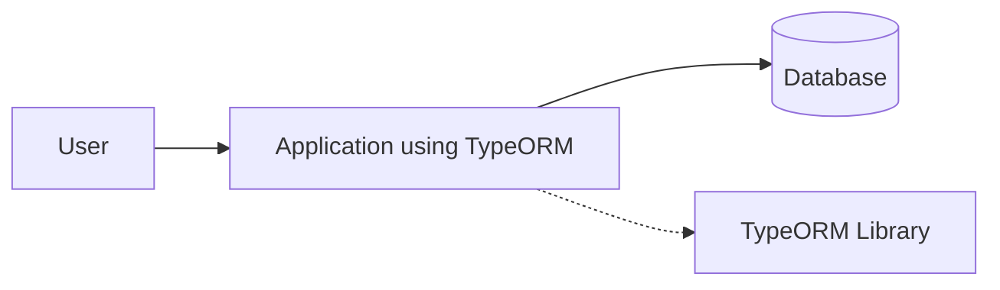
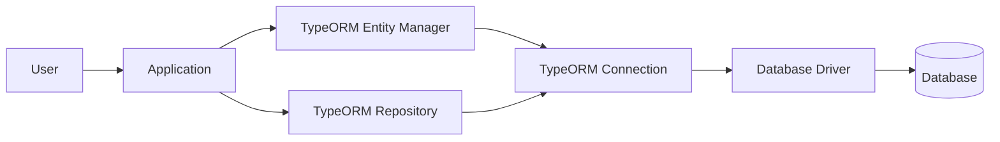
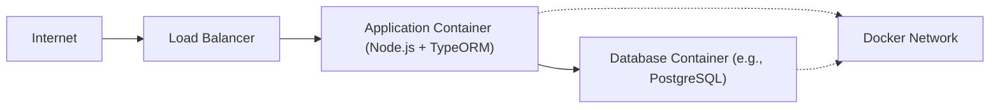
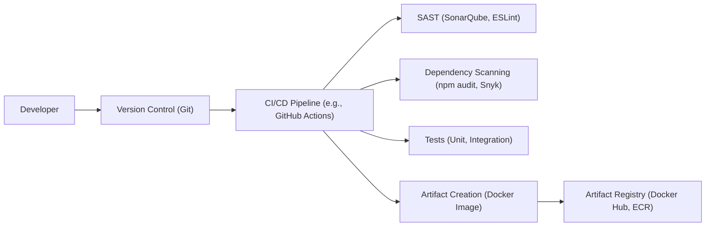

# Project Design Document: TypeORM

## BUSINESS POSTURE

TypeORM is an open-source Object-Relational Mapper (ORM) for TypeScript and JavaScript. It supports various databases and provides a way to interact with databases using object-oriented principles. The primary business goal is to simplify database interactions for developers, allowing them to focus on application logic rather than database-specific queries. It aims to increase developer productivity and reduce the risk of common database-related errors.

Business Priorities:

*   Developer Productivity: Enable rapid application development by abstracting database complexities.
*   Maintainability: Provide a clean and maintainable way to interact with databases.
*   Flexibility: Support multiple database systems and allow easy switching between them.
*   Reliability: Ensure data integrity and consistency.
*   Community Support: Foster a strong community to maintain and improve the project.

Business Risks:

*   Data Breaches: Unauthorized access to sensitive data stored in databases.
*   Data Corruption: Accidental or malicious modification or deletion of data.
*   SQL Injection: Exploitation of vulnerabilities to execute malicious SQL code.
*   Denial of Service: Attacks that make the database unavailable to legitimate users.
*   Performance Bottlenecks: Inefficient database queries that slow down the application.
*   Dependency Vulnerabilities: Security flaws in TypeORM itself or its dependencies.

## SECURITY POSTURE

Existing Security Controls:

*   security control: Parameterized Queries: TypeORM uses parameterized queries (prepared statements) to prevent SQL injection vulnerabilities. Implemented in TypeORM's query builder and entity manager.
*   security control: ORM Abstraction: The ORM layer itself provides a level of abstraction that reduces the risk of direct SQL injection, as developers primarily interact with objects and methods rather than raw SQL. Implemented throughout TypeORM's API.
*   security control: Community Auditing: Being open-source, TypeORM benefits from community scrutiny, which can help identify and address security vulnerabilities. Described in the project's GitHub repository and community forums.
*   security control: Regular Updates: The TypeORM team and community regularly release updates, including security patches. Described in the project's release notes and changelog.

Accepted Risks:

*   accepted risk: Third-Party Database Drivers: TypeORM relies on third-party database drivers, which may have their own security vulnerabilities.
*   accepted risk: Misconfiguration: Incorrect configuration of TypeORM or the database can lead to security vulnerabilities.
*   accepted risk: Zero-Day Vulnerabilities: Unknown vulnerabilities in TypeORM or its dependencies may exist.

Recommended Security Controls:

*   security control: Input Validation: Implement strict input validation on all data before it is used in database queries, even with the ORM abstraction.
*   security control: Least Privilege: Ensure that database users have only the minimum necessary permissions.
*   security control: Regular Security Audits: Conduct regular security audits of the application code and database configuration.
*   security control: Dependency Monitoring: Continuously monitor dependencies for known vulnerabilities and update them promptly.
*   security control: Data Encryption: Encrypt sensitive data at rest and in transit.

Security Requirements:

*   Authentication: Not directly applicable to TypeORM, as it relies on the database's authentication mechanisms. However, applications using TypeORM should implement strong authentication.
*   Authorization: Not directly applicable to TypeORM, as it relies on the database's authorization mechanisms. However, applications using TypeORM should implement proper authorization to control access to data.
*   Input Validation: All data used in database queries, even through the ORM, must be strictly validated to prevent injection attacks and other data-related vulnerabilities.
*   Cryptography: Sensitive data should be encrypted at rest and in transit. TypeORM should be configured to use secure connections (e.g., TLS/SSL) to the database.

## DESIGN

### C4 CONTEXT

Element Descriptions:

*   Element:
    *   Name: User
    *   Type: Person
    *   Description: Represents a user interacting with the application that uses TypeORM.
    *   Responsibilities: Interacts with the application, triggering database operations.
    *   Security controls: Authentication and authorization mechanisms within the application.

*   Element:
    *   Name: Application using TypeORM
    *   Type: Software System
    *   Description: The application that utilizes TypeORM to interact with the database.
    *   Responsibilities: Handles user requests, business logic, and database interactions.
    *   Security controls: Input validation, parameterized queries (via TypeORM), application-level security logic.

*   Element:
    *   Name: Database
    *   Type: Database System
    *   Description: The database system (e.g., PostgreSQL, MySQL, etc.) used to store data.
    *   Responsibilities: Stores and manages data, handles database queries.
    *   Security controls: Database-level access controls, encryption, auditing.

*   Element:
    *   Name: TypeORM Library
    *   Type: Library
    *   Description: The TypeORM library itself.
    *   Responsibilities: Provides an object-oriented interface for interacting with the database.
    *   Security controls: Parameterized queries, ORM abstraction.

### C4 CONTAINER

Element Descriptions:

*   Element:
    *   Name: User
    *   Type: Person
    *   Description: Represents a user interacting with the application.
    *   Responsibilities: Interacts with the application.
    *   Security controls: Authentication and authorization mechanisms within the application.

*   Element:
    *   Name: Application
    *   Type: Application
    *   Description: The application code that uses TypeORM.
    *   Responsibilities: Handles user requests, business logic, and database interactions using TypeORM.
    *   Security controls: Input validation, application-level security logic.

*   Element:
    *   Name: TypeORM Entity Manager
    *   Type: Component
    *   Description: TypeORM's central API for managing entities.
    *   Responsibilities: Provides methods for creating, reading, updating, and deleting entities.
    *   Security controls: Uses parameterized queries.

*   Element:
    *   Name: TypeORM Repository
    *   Type: Component
    *   Description: TypeORM's API for working with specific entities.
    *   Responsibilities: Provides entity-specific methods for database operations.
    *   Security controls: Uses parameterized queries.

*   Element:
    *   Name: TypeORM Connection
    *   Type: Component
    *   Description: Manages the connection to the database.
    *   Responsibilities: Establishes and maintains the database connection.
    *   Security controls: Uses secure connection protocols (e.g., TLS/SSL).

*   Element:
    *   Name: Database Driver
    *   Type: Library
    *   Description: The database-specific driver (e.g., pg for PostgreSQL, mysql2 for MySQL).
    *   Responsibilities: Provides a low-level interface for interacting with the database.
    *   Security controls: Relies on the driver's security features.

*   Element:
    *   Name: Database
    *   Type: Database System
    *   Description: The database system.
    *   Responsibilities: Stores and manages data.
    *   Security controls: Database-level access controls, encryption, auditing.

### DEPLOYMENT

Possible Deployment Solutions:

1.  Traditional Server Deployment: Application and database deployed on separate servers.
2.  Containerized Deployment (Docker): Application and database deployed as separate Docker containers.
3.  Serverless Deployment: Application deployed as serverless functions (e.g., AWS Lambda), connecting to a managed database service (e.g., AWS RDS).
4.  Cloud-Specific Deployments: Utilizing cloud provider-specific services (e.g., AWS Elastic Beanstalk, Google App Engine).

Chosen Solution: Containerized Deployment (Docker)

Element Descriptions:

*   Element:
    *   Name: Internet
    *   Type: External
    *   Description: The public internet.
    *   Responsibilities: Source of user requests.
    *   Security controls: Firewall, DDoS protection.

*   Element:
    *   Name: Load Balancer
    *   Type: Infrastructure
    *   Description: Distributes incoming traffic across multiple application containers.
    *   Responsibilities: Load balancing, SSL termination.
    *   Security controls: SSL/TLS certificates, access control lists.

*   Element:
    *   Name: Application Container (Node.js + TypeORM)
    *   Type: Container
    *   Description: Docker container running the Node.js application with TypeORM.
    *   Responsibilities: Handles application logic and database interactions.
    *   Security controls: Container security hardening, minimal base image.

*   Element:
    *   Name: Database Container (e.g., PostgreSQL)
    *   Type: Container
    *   Description: Docker container running the database server.
    *   Responsibilities: Stores and manages data.
    *   Security controls: Database-level access controls, encryption, container security hardening.

*   Element:
    *   Name: Docker Network
    *   Type: Network
    *   Description: Internal Docker network for communication between containers.
    *   Responsibilities: Facilitates communication between the application and database containers.
    *   Security controls: Network isolation.

### BUILD

The build process for applications using TypeORM typically involves the following steps, with a focus on security:

1.  Developer writes code: Developers write application code, including TypeORM entities and database interactions.
2.  Code Commit: Code is committed to a version control system (e.g., Git).
3.  CI/CD Pipeline Trigger: A commit triggers a CI/CD pipeline (e.g., GitHub Actions, Jenkins).
4.  Dependency Installation: The pipeline installs project dependencies, including TypeORM and database drivers.
5.  Security Scanning:
    *   Static Application Security Testing (SAST): Tools like SonarQube or ESLint are used to scan the code for potential security vulnerabilities.
    *   Dependency Scanning: Tools like npm audit or Snyk are used to check for known vulnerabilities in dependencies.
6.  Compilation/Transpilation: TypeScript code is transpiled to JavaScript.
7.  Testing: Unit tests, integration tests, and potentially end-to-end tests are executed.
8.  Artifact Creation: A deployable artifact (e.g., a Docker image) is created.
9.  Artifact Registry: The artifact is pushed to a container registry (e.g., Docker Hub, AWS ECR).

## RISK ASSESSMENT

Critical Business Processes:

*   Data Access and Management: Ensuring authorized access to and proper management of data stored in the database.
*   Application Functionality: Maintaining the availability and correct operation of the application that relies on TypeORM.

Data Sensitivity:

*   The sensitivity of the data depends on the specific application using TypeORM. It can range from non-sensitive data to highly sensitive personal or financial information. TypeORM itself doesn't define the data sensitivity; it's the responsibility of the application using it.

## QUESTIONS & ASSUMPTIONS

Questions:

*   What specific database systems will be used with TypeORM?
*   What is the expected scale and load on the application?
*   What are the specific data sensitivity levels for the applications using TypeORM?
*   Are there any existing security policies or compliance requirements that need to be considered?
*   What is the team's experience level with secure coding practices and database security?

Assumptions:

*   BUSINESS POSTURE: The development team prioritizes security and follows secure coding practices.
*   SECURITY POSTURE: The database will be properly configured with strong passwords, least privilege access, and regular security updates.
*   DESIGN: The application using TypeORM will implement appropriate input validation and other security measures. The deployment environment will be secured according to best practices. The build process will include security checks.