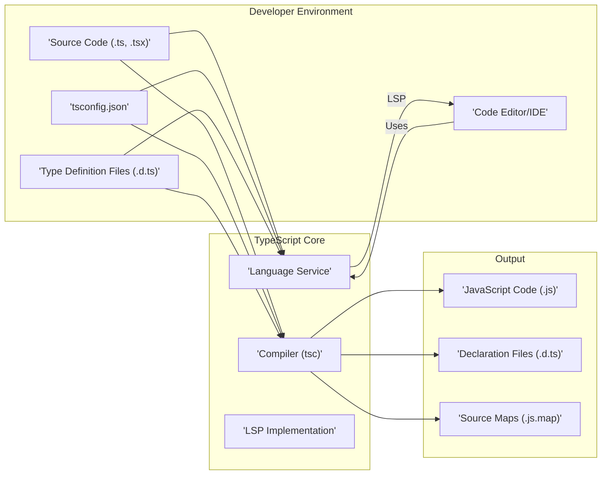

# Project Design Document: TypeScript

**Version:** 1.1
**Date:** October 26, 2023
**Author:** AI Software Architect

## 1. Introduction

This document provides an enhanced high-level design overview of the TypeScript project, based on the codebase available at [https://github.com/microsoft/typescript](https://github.com/microsoft/typescript). This revised document aims to provide a more detailed and refined understanding of the key architectural components, data flows, and interactions within the system, specifically tailored for subsequent threat modeling activities.

## 2. Goals and Objectives

The primary goals of the TypeScript project are:

*   To offer an optionally statically typed superset of JavaScript that compiles to clean, readable JavaScript code.
*   To significantly improve developer productivity and the long-term maintainability of large and complex JavaScript projects.
*   To provide a rich and seamless developer experience within various code editors and Integrated Development Environments (IDEs) through features like intelligent code completion, advanced navigation, and robust refactoring capabilities.
*   To foster a vibrant and active community around the language, encouraging contributions and ensuring its continued evolution.

## 3. System Architecture

The TypeScript project comprises a set of tightly integrated components that work in concert to deliver the language's core functionalities and associated tooling. The primary architectural components are:

*   **Compiler (`tsc`):** The central component responsible for the entire compilation process, including parsing TypeScript code, performing rigorous type checking, applying code transformations, and ultimately emitting JavaScript code.
*   **Language Service:** A sophisticated service that provides deep language intelligence to code editors and IDEs, enabling features such as IntelliSense, real-time error highlighting and diagnostics, and powerful refactoring tools.
*   **Language Server Protocol (LSP) Implementation:** A crucial component that implements the Language Server Protocol, facilitating standardized communication between the Language Service and a wide range of code editors and IDEs.
*   **Command-Line Interface (CLI):** The primary interface for developers to interact with the TypeScript compiler and related utilities directly from the command line.
*   **Node.js Modules:** A collection of packages, primarily distributed through npm, that encapsulate TypeScript's core functionality and make it available for use within Node.js environments and build processes.
*   **Type Definition Files (`.d.ts`):** Essential files that describe the structure and types of existing JavaScript libraries and APIs, allowing TypeScript to provide static type checking and enhanced tooling support for these external dependencies.
*   **Configuration Files (`tsconfig.json`):** Project-specific configuration files that specify compiler options, define the project's structure, and control various aspects of the TypeScript compilation process.



## 4. Key Components and their Functionality

This section provides a more detailed breakdown of the functionality of the core components identified in the system architecture.

*   **Compiler (`tsc`)**:
    *   **Lexical Analysis and Parsing:** Reads and parses TypeScript source code, breaking it down into tokens and constructing an Abstract Syntax Tree (AST) representing the code's structure.
    *   **Semantic Analysis and Type Checking:** Performs in-depth static analysis of the AST, enforcing TypeScript's type system, resolving symbols, and identifying potential type errors and other semantic issues.
    *   **Transformation Pipeline:** Applies a series of transformations to the AST based on the configured compiler options. This includes features like down-leveling (converting newer JavaScript features to older versions), JSX compilation, and decorator processing.
    *   **Code Generation (Emission):** Generates JavaScript code from the transformed AST, ensuring the output is valid and adheres to the specified target JavaScript version.
    *   **Declaration File Generation:**  Optionally generates `.d.ts` files that describe the public API of the TypeScript code, enabling other TypeScript projects or JavaScript code to consume it with type safety.
    *   **Source Map Generation:** Optionally generates source map files (`.js.map`) that map the generated JavaScript code back to the original TypeScript source, facilitating debugging in browser developer tools.

*   **Language Service**:
    *   **Background Compilation and Analysis:** Continuously analyzes the project's code in the background, providing up-to-date semantic information.
    *   **Real-time Error Reporting and Diagnostics:** Identifies and reports type errors, syntax errors, and other issues directly within the code editor as the developer types.
    *   **Intelligent Code Completion (IntelliSense):** Provides context-aware suggestions for code completion, including variable names, function parameters, and module members.
    *   **Code Navigation:** Enables seamless navigation through the codebase with features like "Go to Definition," "Find All References," and "Go to Implementation."
    *   **Refactoring Support:** Offers powerful refactoring capabilities, such as renaming symbols, extracting functions, and inlining variables, while maintaining code correctness.
    *   **Signature Help and Parameter Hints:** Displays information about function parameters and expected argument types as the developer writes function calls.
    *   **Quick Fixes and Code Actions:** Suggests and applies automated fixes for common errors and provides context-sensitive code actions to improve code quality.

*   **Language Server Protocol (LSP) Implementation**:
    *   **Standardized Communication Layer:** Implements the LSP specification, providing a standardized way for the Language Service to communicate with different code editors and IDEs.
    *   **Request/Response Handling:** Handles requests from the editor for various language features (e.g., code completion requests, definition requests) and sends back the corresponding responses.
    *   **Notification Handling:** Sends asynchronous notifications to the editor about changes in the code's diagnostics or other relevant events.
    *   **Abstraction of Editor-Specific APIs:**  Abstracts away the complexities of individual editor APIs, allowing the Language Service to be editor-agnostic.

*   **Command-Line Interface (CLI)**:
    *   **Direct Compiler Invocation:** Provides the `tsc` command to directly invoke the TypeScript compiler with a wide range of command-line options.
    *   **Project-Based Compilation:** Supports building entire TypeScript projects based on the configuration specified in `tsconfig.json` files.
    *   **Watch Mode Compilation:** Enables the compiler to run in the background and automatically recompile the project whenever changes are detected in the source files.
    *   **Integration with Build Systems:** Facilitates integration with various build systems and task runners.

*   **Node.js Modules**:
    *   **`typescript` npm Package:**  The primary package containing the core TypeScript compiler (`tsc`) and the Language Service, making it available for installation and use in Node.js environments.
    *   **`ts-node`:** A popular package that allows direct execution of TypeScript code in Node.js without explicit pre-compilation.
    *   **Other Utility Packages:** May include additional packages for specific tasks or integrations within the Node.js ecosystem.

*   **Type Definition Files (`.d.ts`)**:
    *   **API Surface Declaration:** Define the types, interfaces, classes, functions, and variables exposed by JavaScript libraries and modules.
    *   **Enabling Static Typing for JavaScript:** Allow TypeScript to provide static type checking and IntelliSense for existing JavaScript code.
    *   **Community-Driven Ecosystem:** A vast collection of type definition files is maintained by the DefinitelyTyped community, providing type information for a wide range of popular JavaScript libraries.

*   **Configuration Files (`tsconfig.json`)**:
    *   **Compiler Option Configuration:** Specify a wide array of options that control the behavior of the TypeScript compiler, such as the target JavaScript version, module system, strictness settings, and output directory.
    *   **Project File Inclusion and Exclusion:** Define the set of files included in the TypeScript project and specify patterns for excluding certain files or directories.
    *   **Extends Configuration Inheritance:** Allow inheriting configuration settings from other `tsconfig.json` files, promoting code reuse and consistency across projects.
    *   **Project References:** Enable building multiple related TypeScript projects in a specific order, managing dependencies between them.

## 5. Data Flow

The primary data flows within the TypeScript project involve the processing of source code and configuration to produce compiled JavaScript and related artifacts, as well as the interaction between the Language Service and code editors.

```mermaid
graph LR
    subgraph "Compilation Flow"
        A["'Source Code (.ts, .tsx)'"]
        B["'tsconfig.json'"]
        C["'Type Definition Files (.d.ts)'"]
        D["'Compiler (tsc)'"]
        E["'Abstract Syntax Tree (AST)'"]
        F["'Type Checking Results & Semantic Information'"]
        G["'Transformed AST'"]
        H["'JavaScript Code (.js)'"]
        I["'Declaration Files (.d.ts)'"]
        J["'Source Maps (.js.map)'"]
    end

    A --> D
    B --> D
    C --> D
    D --> E
    E --> D |"Type Checking & Semantic Analysis"|
    E --> G
    G --> D |"Code Generation & Emission"|
    D --> H
    D --> I
    D --> J

    subgraph "Language Service Interaction Flow"
        K["'Source Code (.ts, .tsx)'"]
        L["'tsconfig.json'"]
        M["'Type Definition Files (.d.ts)'"]
        N["'Language Service'"]
        O["'Editor/IDE Request (e.g., Completion, Diagnostics)'"]
        P["'Semantic Information & Analysis Results'"]
        Q["'Editor/IDE Response (e.g., Suggestions, Errors)'"]
    end

    K --> N
    L --> N
    M --> N
    O --> N
    N --> P
    P --> Q
```

*   **Compilation Flow:**
    *   TypeScript source code files, the `tsconfig.json` configuration file, and relevant type definition files are provided as input to the compiler.
    *   The compiler parses the source code into an Abstract Syntax Tree (AST).
    *   Type checking and semantic analysis are performed on the AST, leveraging information from type definition files and the project configuration.
    *   The AST undergoes transformations based on the specified compiler options.
    *   Finally, the compiler generates JavaScript code, optional declaration files, and optional source map files as output.

*   **Language Service Interaction Flow:**
    *   The Language Service continuously analyzes source code, `tsconfig.json`, and type definition files in the background.
    *   The code editor/IDE sends requests to the Language Service for various features, such as code completion suggestions, error diagnostics, or navigation information.
    *   The Language Service utilizes its semantic understanding of the code and analysis results to process these requests.
    *   The Language Service sends responses back to the editor/IDE, providing the requested information (e.g., code completion lists, error messages, navigation targets).

## 6. Security Considerations (Preliminary)

This section expands upon the initial security considerations, providing more specific areas of concern relevant to the TypeScript project. A comprehensive threat model will further elaborate on these points.

*   **Supply Chain Security:**
    *   **Dependency Management:**  The project's dependencies (both direct and transitive) need rigorous vetting to prevent the introduction of known vulnerabilities. This includes dependencies used during the build process and within the distributed packages.
    *   **Package Integrity:** Ensuring the integrity and authenticity of published TypeScript packages is crucial to prevent malicious actors from distributing compromised versions. Secure signing and verification mechanisms are important.
*   **Compiler Vulnerabilities:**
    *   **Malicious Code Generation:** Bugs within the compiler could potentially be exploited to generate incorrect or insecure JavaScript code that introduces vulnerabilities in downstream applications.
    *   **Parser Exploits:** Vulnerabilities in the parser could allow attackers to craft malicious TypeScript code that crashes the compiler or causes unexpected behavior, potentially leading to denial-of-service or other issues.
    *   **Type System Bypass:**  Exploits that allow bypassing the type system could lead to runtime errors or unexpected behavior in the generated JavaScript code.
*   **Language Service Security:**
    *   **Code Execution in Editor Context:**  Vulnerabilities in the Language Service could potentially be exploited to execute arbitrary code within the context of the code editor or IDE process, potentially compromising the developer's environment.
    *   **Information Disclosure:**  Bugs could lead to the disclosure of sensitive information from the developer's project or environment.
    *   **LSP Communication Security:** The communication channel between the Language Service and the editor/IDE (via LSP) should be protected against eavesdropping or tampering, especially in networked environments.
*   **Type Definition Security:**
    *   **Malicious Type Definitions:**  Carefully crafted malicious type definition files could introduce type errors or unexpected behavior in consuming code, potentially leading to runtime issues or security vulnerabilities.
    *   **Type Definition Pollution:**  Incorrect or overly permissive type definitions could weaken the type safety of the consuming code.
*   **Configuration Security:**
    *   **Insecure Compiler Options:**  Using insecure or outdated compiler options could weaken the security of the generated JavaScript code (e.g., targeting older JavaScript versions with known vulnerabilities).
    *   **`tsconfig.json` Manipulation:**  If an attacker can manipulate the `tsconfig.json` file, they could potentially alter the compilation process in malicious ways.
*   **Denial of Service:**
    *   **Resource Exhaustion:**  Maliciously crafted TypeScript code could be designed to cause the compiler or language service to consume excessive CPU or memory resources, leading to denial of service.
    *   **Infinite Loops or Recursion:**  Bugs in the compiler or language service could be triggered by specific code patterns, leading to infinite loops or excessive recursion.

## 7. Assumptions and Constraints

*   This design document is based on the current understanding of the TypeScript project as represented by the public GitHub repository as of the document's creation date.
*   The primary focus is on the core architectural components and their interactions that are most relevant for security threat modeling.
*   Detailed internal implementation specifics and low-level code details are generally not covered in this document.
*   The security considerations outlined are preliminary and will be subject to further refinement and expansion during a dedicated threat modeling exercise.

## 8. Future Considerations

*   A more granular breakdown of individual components into their constituent sub-components for a deeper level of analysis.
*   Detailed examination of the specific communication protocols and data formats used within the system, particularly within the Language Service and LSP implementation.
*   In-depth investigation of existing security features and mitigation strategies already implemented within the TypeScript project.
*   A comprehensive mapping of potential threats to specific components, data flows, and interactions within the system to facilitate risk assessment and mitigation planning.
