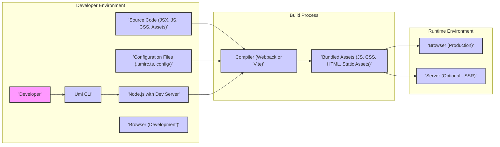
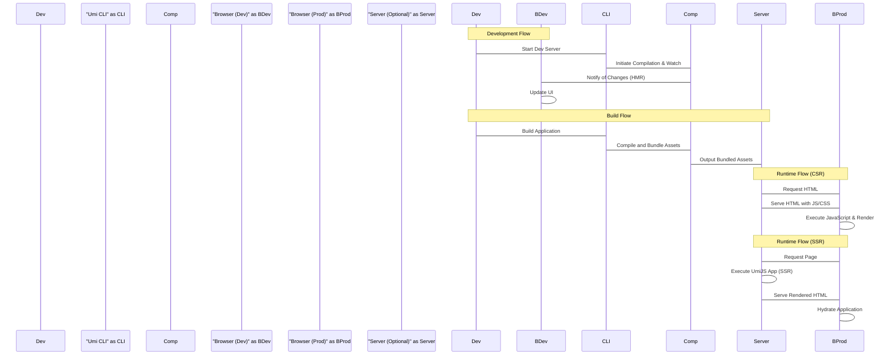

# Project Design Document: UmiJS

**Version:** 1.1
**Date:** October 26, 2023
**Author:** AI Software Architect

## 1. Introduction

This document provides a detailed design overview of the UmiJS framework (referenced from [https://github.com/umijs/umi](https://github.com/umijs/umi)). This document aims to capture the key architectural components, data flows, and interactions within the UmiJS ecosystem. It will serve as the foundation for subsequent threat modeling activities, enabling a structured approach to identifying potential security vulnerabilities.

## 2. Goals and Non-Goals

**Goals:**

*   Clearly define the major components of the UmiJS framework and their responsibilities.
*   Describe the interactions and data flow between these components during development, build, and runtime.
*   Identify key configuration points and extension mechanisms, highlighting their potential impact on security.
*   Provide a high-level overview of the build and development processes, focusing on security-relevant aspects.
*   Establish a solid understanding of the system's architecture for threat modeling, enabling the identification of attack surfaces and potential vulnerabilities.

**Non-Goals:**

*   Provide an exhaustive code-level analysis of every module within UmiJS.
*   Detail the implementation specifics of individual features beyond what is necessary for architectural understanding.
*   Offer performance benchmarks or optimization strategies.
*   Include a comprehensive list of all available plugins or configurations.
*   Serve as a user manual or tutorial for UmiJS.

## 3. High-Level Architecture

UmiJS is a pluggable enterprise-level React framework. It provides a comprehensive set of tools and conventions for building web applications. The core of UmiJS revolves around convention-over-configuration, aiming to simplify development workflows and enforce best practices.

**Key Stages:**

*   **Development:** Developers write code, configure the application, and utilize the Umi CLI and development server for rapid iteration and testing.
*   **Build:** The chosen compiler (Webpack or Vite) processes the source code, configuration files, and assets to generate optimized, bundled artifacts for deployment.
*   **Runtime:** The bundled assets are served to the browser, either directly for Client-Side Rendering (CSR) or through a server for Server-Side Rendering (SSR), enhancing initial load performance and SEO.

## 4. Key Components

*   **Umi Core:** The foundational library providing the core functionalities of the framework, including the plugin system, routing management, and lifecycle hooks.
*   **Umi CLI:** The command-line interface used by developers to interact with UmiJS for tasks such as starting the development server (`umi dev`), building the application (`umi build`), running tests (`umi test`), and managing plugins.
*   **Compiler (Webpack/Vite):**  Responsible for the crucial task of bundling modules, optimizing assets (like images and CSS), transforming code (e.g., JSX to JavaScript), and enabling features like code splitting. UmiJS's flexibility allows developers to choose between Webpack and Vite.
    *   **Webpack:** A mature and highly configurable module bundler.
    *   **Vite:** A newer build tool that leverages native ES modules for faster development builds.
*   **Router:**  Manages navigation within the application, mapping URLs to specific components. UmiJS supports both convention-based routing (based on the file system structure) and configuration-based routing for more complex scenarios.
*   **Plugin System:**  A central feature enabling developers to extend and customize UmiJS's functionality. Plugins can modify the build process, add new features, integrate with external services, and enforce project conventions. Plugins can be official, community-developed, or custom-built.
*   **Configuration System:**  Provides a structured way for developers to customize UmiJS's behavior. Configuration can be defined in various files and formats, allowing for environment-specific settings and fine-grained control over the framework's operation.
*   **Dev Server:** A local server, typically based on Webpack Dev Server or Vite's development server, that provides features like hot module replacement (HMR) for a faster development experience. It also handles serving static assets during development.
*   **Build Process:** The orchestrated sequence of steps involved in transforming source code and assets into production-ready bundles. This process includes compilation, optimization, code splitting, and asset generation.
*   **Presets:**  Pre-packaged sets of plugins and configurations that offer opinionated setups tailored for specific use cases or project types, streamlining project setup and ensuring consistency.

## 5. Data Flow

The data flow within UmiJS can be broadly categorized into development, build, and runtime flows, each with distinct characteristics and data transformations.

**Development Flow:**

*   The **Developer** modifies **Source Code** (B) or **Configuration Files** (C).
*   The **Umi CLI** (D) monitors file system events for changes.
*   The **Node.js with Dev Server** (E) detects these changes.
*   The **Compiler** (G) incrementally rebuilds the affected modules.
*   The **Browser (Development)** (F) receives updates via WebSockets, enabling Hot Module Replacement (HMR) to update the application without a full page reload.
*   **Configuration Files** (C) are read by the **Umi CLI** and **Compiler** to influence the development server's behavior and the compilation process.

**Build Flow:**

*   The **Developer** initiates the build process using the **Umi CLI** (D).
*   The **Umi CLI** (D) reads and merges **Configuration Files** (C).
*   The **Compiler** (G) processes **Source Code** (B), **Configuration Files** (C), and static assets.
*   The **Compiler** (G) performs transformations, optimizations, and bundling to generate **Bundled Assets** (H).

**Runtime Flow (Client-Side Rendering):**

*   The **Browser (Production)** (I) requests the main HTML file from the server.
*   The server (which could be a static file server or a more complex backend) serves the HTML file, which includes links to the **Bundled Assets** (H) (JavaScript, CSS, etc.).
*   The **Browser (Production)** (I) downloads and executes the JavaScript bundle.
*   The UmiJS application within the bundle renders the UI and handles user interactions, potentially making API calls to backend services (external to UmiJS).

**Runtime Flow (Server-Side Rendering - Optional):**

*   The **Browser (Production)** (I) requests a specific page.
*   The **Server (Optional - SSR)** (J) receives the request.
*   The **Server (Optional - SSR)** (J) executes a portion of the UmiJS application.
*   The **Server (Optional - SSR)** (J) renders the initial HTML content of the requested page.
*   The **Server (Optional - SSR)** (J) sends the pre-rendered HTML to the **Browser (Production)** (I).
*   The **Browser (Production)** (I) displays the initial content quickly.
*   The UmiJS application in the **Browser (Production)** (I) then "hydrates" the HTML, attaching event listeners and making it interactive.

## 6. Configuration Points

UmiJS offers several key configuration points that influence its behavior and present potential areas for security considerations:

*   **`.umirc.ts` (or `.umirc.js`):** The primary configuration file located at the project root. This file allows extensive customization of build settings (e.g., output paths, code splitting), routing configurations, plugin registrations and their options, and various other core functionalities.
*   **`config/` directory:**  This directory can contain environment-specific configuration files (e.g., `config/config.dev.ts`, `config/config.prod.ts`), allowing for different settings based on the environment in which the application is running or being built.
*   **Plugin Options:** Individual plugins often expose their own configuration options, which are typically specified within the `.umirc.ts` file. These options can control the behavior and features of the respective plugins.
*   **Environment Variables:**  Environment variables can be used to dynamically configure the application at build time or runtime, providing a mechanism for injecting sensitive information or toggling features based on the deployment environment.
*   **File System Conventions:**  UmiJS leverages file system conventions for features like routing (pages directory), layouts (layouts directory), and API routes (api directory). While simplifying development, deviations from expected conventions or unintended file exposure can pose security risks.

## 7. Extension Mechanisms

UmiJS's extensibility is primarily driven by its robust plugin system:

*   **Official Plugins:**  UmiJS maintains a set of official plugins that provide core functionalities and integrations, such as internationalization (i18n), analytics, and data fetching.
*   **Community Plugins:**  A vibrant ecosystem of community-developed plugins exists, offering a wide range of functionalities and integrations. However, the security and reliability of community plugins should be carefully evaluated.
*   **Custom Plugins:** Developers can create their own plugins to tailor UmiJS to specific project needs, encapsulate reusable logic, or integrate with internal systems.

Plugins can hook into various stages of the UmiJS lifecycle, allowing them to:

*   **Modify the Build Process:**  Plugins can directly interact with the underlying compiler (Webpack or Vite) configuration, adding custom loaders, plugins, or modifying build settings.
*   **Extend the Routing System:**  Plugins can add custom route handlers, modify route configurations, or implement advanced routing logic.
*   **Intercept and Modify Requests:**  Plugins can intercept and modify incoming or outgoing requests, enabling features like authentication, authorization, or request logging.
*   **Generate Code:**  Plugins can generate code based on configuration or other factors, automating repetitive tasks or integrating with code generation tools.
*   **Access and Modify Internal State:**  Plugins have access to certain internal states and APIs of UmiJS, allowing for deep customization and integration.

## 8. Security Considerations (Initial Thoughts for Threat Modeling)

This section outlines initial security considerations based on the architecture, serving as a starting point for a more detailed threat modeling exercise.

*   **Dependency Vulnerabilities:** UmiJS relies on a significant number of dependencies, including the chosen compiler (Webpack or Vite) and their respective ecosystems. Vulnerabilities in these dependencies could be exploited in UmiJS applications. Regular dependency updates and security scanning are crucial.
*   **Plugin Security:**  Third-party and even custom plugins can introduce security risks if they contain vulnerabilities (e.g., XSS, arbitrary code execution) or malicious code. Careful vetting and auditing of plugins are necessary.
*   **Configuration Security:**  Misconfigured settings, such as exposing API keys or secrets in configuration files, disabling security features, or setting insecure headers, can create significant vulnerabilities. Secure configuration management practices are essential.
*   **Build Process Security:**  A compromised build pipeline could lead to the injection of malicious code into the bundled assets without the developer's knowledge. Ensuring the integrity of the build environment and dependencies is critical.
*   **Server-Side Rendering (SSR) Vulnerabilities:** If SSR is enabled, it introduces server-side attack surfaces. Vulnerabilities like XSS in server-rendered content or denial-of-service attacks targeting the rendering process need to be considered.
*   **Client-Side Vulnerabilities:** Standard web application vulnerabilities like Cross-Site Scripting (XSS), Cross-Site Request Forgery (CSRF), and injection attacks are still relevant in UmiJS applications and need to be addressed through secure coding practices.
*   **Exposure of Sensitive Information:**  Accidental inclusion of sensitive data (e.g., API keys, internal URLs) in the client-side bundle or publicly accessible configuration files can have serious security implications.
*   **Denial of Service (DoS):** Potential vulnerabilities in the development server or the build process could be exploited to launch denial-of-service attacks, disrupting development workflows.
*   **Insecure Defaults:**  Reviewing the default configurations of UmiJS and its plugins is important to ensure they align with security best practices. Insecure defaults might need to be overridden.

## 9. Diagrams

The high-level architecture and sequence diagrams are included in sections 3 and 5 respectively.

## 10. Conclusion

This document provides an enhanced design overview of the UmiJS framework, offering a more detailed understanding of its components, data flows, and extension mechanisms. This information is crucial for conducting a thorough threat model to identify potential security vulnerabilities and develop appropriate mitigation strategies. The detailed breakdown of the architecture and interactions provides a solid foundation for understanding the attack surface of applications built with UmiJS and for making informed security decisions.