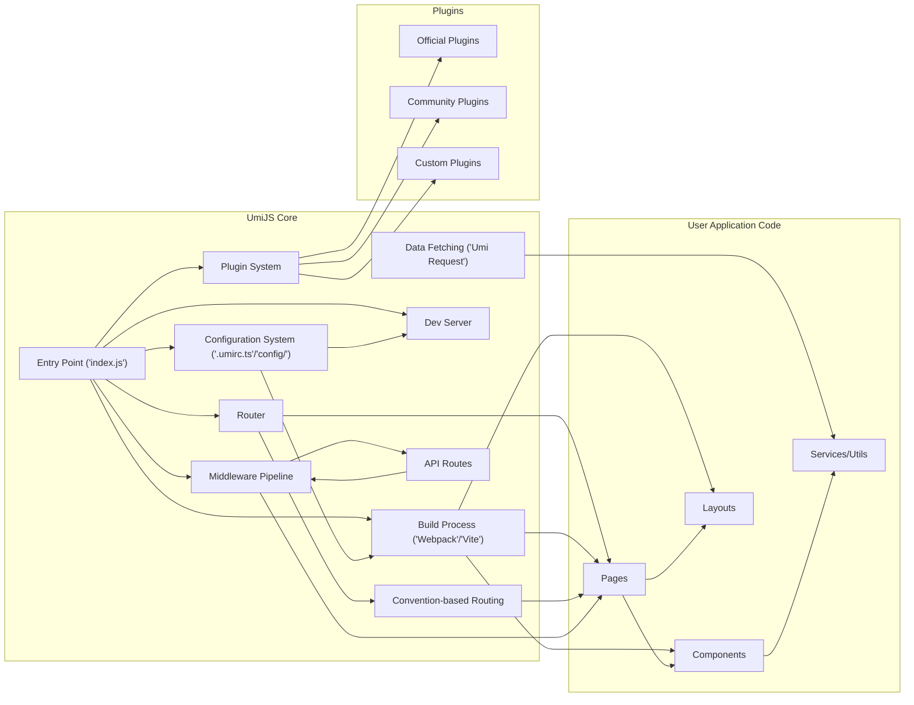

## Project Design Document: UmiJS - A Pluggable Enterprise-Level React Framework (Improved)

**1. Introduction**

This document provides an enhanced architectural design overview of UmiJS, a pluggable enterprise-level React framework, specifically tailored for threat modeling. It aims to offer a detailed understanding of the system's components, interactions, and data flow, highlighting aspects critical for identifying potential security vulnerabilities. This document focuses on the core functionalities and key architectural elements that have security implications.

**2. Project Overview**

UmiJS is a comprehensive React framework designed for building scalable and maintainable web applications. It offers features like routing, a powerful plugin system, build optimizations, and a development server. Its pluggable architecture is central to its extensibility but also introduces specific security considerations.

**3. Architectural Design**

UmiJS employs a modular, plugin-centric architecture. The core framework provides essential services, while plugins extend and customize its behavior at various lifecycle stages.

**4. Component Description (with Security Focus)**

*   **Entry Point ('index.js'):** The initial script executed, responsible for bootstrapping the UmiJS application. Security considerations include ensuring the integrity of this file to prevent malicious code injection at startup.
*   **Router:** Manages application navigation. Security implications include potential route hijacking if not configured correctly, and the need to protect sensitive routes through authentication and authorization mechanisms implemented in user code.
*   **Plugin System:**  A core mechanism for extending UmiJS. This is a critical security area as plugins have access to the application's lifecycle and configuration. Security concerns include:
    *   **Malicious Plugins:** Plugins could introduce vulnerabilities or backdoors.
    *   **Vulnerable Plugins:** Plugins might contain known security flaws.
    *   **Plugin Conflicts:**  Interactions between plugins could unintentionally create security issues.
*   **Build Process ('Webpack'/'Vite'):** Bundles and optimizes the application. Security risks involve:
    *   **Supply Chain Attacks:** Vulnerabilities in build tool dependencies.
    *   **Injection of Malicious Code:** Compromising the build process could inject malicious scripts into the final application bundle.
    *   **Exposure of Sensitive Data:**  Accidental inclusion of secrets or sensitive information during the build.
*   **Dev Server:** Provides a local development environment. Security considerations include:
    *   **Exposure to External Networks:**  Accidental or intentional exposure of the dev server could allow unauthorized access.
    *   **Information Disclosure:**  The dev server might expose debugging information or source code.
*   **Configuration System ('.umirc.ts'/'config/'):** Defines application settings. Security risks include:
    *   **Exposure of Secrets:** Storing API keys or other sensitive information directly in configuration files.
    *   **Misconfigurations:** Incorrect settings could weaken security (e.g., disabling security features).
*   **Convention-based Routing:** Automatically generates routes. Security implications are similar to the Router, requiring protection of sensitive routes.
*   **API Routes:** Enables building backend endpoints within UmiJS. Critical security considerations include:
    *   **Input Validation:**  Protecting against injection attacks.
    *   **Authentication and Authorization:**  Ensuring only authorized users can access specific endpoints.
    *   **Rate Limiting:** Preventing abuse and denial-of-service attacks.
*   **Data Fetching ('Umi Request'):**  Facilitates making API calls. Security considerations involve:
    *   **Secure Communication (HTTPS):** Ensuring data is transmitted securely.
    *   **Handling API Keys and Secrets:** Securely managing and transmitting authentication credentials.
    *   **Protection against SSRF:** If used on the server-side.
*   **Middleware Pipeline:** Allows interception and modification of requests and responses. Security implications include:
    *   **Implementing Security Policies:**  Middleware can be used for authentication, authorization, and input validation.
    *   **Vulnerable Middleware:**  Malicious or poorly written middleware can introduce security flaws.
*   **Pages:** React components representing application views. Security considerations involve preventing XSS vulnerabilities within these components.
*   **Components:** Reusable React UI elements. Similar XSS prevention concerns as Pages.
*   **Layouts:** Components providing consistent structure. Security considerations are similar to Pages and Components.
*   **Services/Utils:** Modules containing application logic. Security concerns depend on the specific functionality implemented, such as secure data handling and preventing logic flaws.
*   **Official Plugins:** Plugins maintained by the UmiJS team. While generally trustworthy, they still require scrutiny for potential vulnerabilities.
*   **Community Plugins:** Plugins developed by the community. Security risks are higher due to varying levels of security awareness and maintenance.
*   **Custom Plugins:** Plugins developed for specific projects. Security depends on the development practices and security knowledge of the developers.

**5. Data Flow (with Security Context)**

The data flow within an UmiJS application involves several stages with associated security considerations:

*   **Initialization:** The entry point loads configurations, potentially including sensitive information. Secure storage and access control for configuration files are crucial.
*   **Route Matching:** User requests are matched against defined routes. Ensure sensitive routes require authentication and authorization checks.
*   **Middleware Execution:** Incoming requests pass through the middleware pipeline. This is a key point for implementing security policies like authentication and input validation.
*   **Component Rendering:** Data fetched from APIs or application state is rendered in components. Prevent XSS vulnerabilities when displaying user-generated or external data.
*   **Data Fetching:** Components may fetch data from external APIs. Ensure secure communication (HTTPS) and proper handling of API keys and secrets. Be mindful of potential SSRF vulnerabilities if data fetching occurs on the server.
*   **API Route Handling:** Requests to API routes are processed. Implement robust input validation, authentication, and authorization to protect backend logic and data.
*   **Plugin Execution:** Plugins can intercept and modify data at various stages. Ensure plugins have appropriate permissions and are trustworthy.
*   **Build Process:** Source code and assets are processed. Protect against supply chain attacks and ensure no sensitive information is leaked during the build.

**6. Security Considerations (Detailed)**

This section expands on potential security concerns, providing more specific examples:

*   **Dependency Vulnerabilities:** Regularly scan project dependencies using tools like `npm audit` or `yarn audit` and update vulnerable packages promptly. Implement Software Composition Analysis (SCA) tools in the CI/CD pipeline.
*   **Plugin Security:** Implement a review process for plugins before integration. Restrict plugin capabilities where possible. Consider using a plugin sandbox or isolation mechanism if available.
*   **Configuration Vulnerabilities:** Utilize environment variables for storing sensitive information instead of directly embedding them in configuration files. Implement proper access controls for configuration files.
*   **Server-Side Rendering (SSR) Vulnerabilities:** Sanitize data before rendering to prevent XSS. Implement robust error handling to avoid information disclosure. Protect against SSRF by carefully controlling outbound requests made by the server.
*   **Build Process Security:** Secure the build environment and restrict access. Use checksums or signing to verify the integrity of build artifacts.
*   **Development Server Security:** Avoid running the development server in production environments or exposing it to public networks. Use strong passwords or authentication if exposure is necessary.
*   **API Route Security:** Implement robust input validation on all API endpoints. Use established authentication and authorization mechanisms (e.g., JWT, OAuth). Implement rate limiting and request throttling to prevent abuse.
*   **Data Handling:** Encrypt sensitive data at rest and in transit. Follow secure coding practices to prevent data leaks or manipulation.
*   **Client-Side Security:** Implement Content Security Policy (CSP) to mitigate XSS attacks. Use Subresource Integrity (SRI) to ensure the integrity of fetched resources. Implement secure session management.

**7. Assumptions and Constraints (Security Focused)**

*   Developers are expected to follow secure coding practices when writing application code and custom plugins.
*   The underlying Node.js environment and server infrastructure are assumed to be securely configured and maintained.
*   This design document focuses on UmiJS's architecture; security configurations within user application code (e.g., specific authentication implementations) are the responsibility of the developers.
*   The security of third-party services integrated with the UmiJS application is outside the scope of this document.

**8. Future Considerations (Security Perspective)**

*   As UmiJS evolves, new features should undergo security reviews during the design and development phases.
*   The UmiJS team should provide clear guidance and best practices for secure plugin development.
*   Consider implementing security-focused linters or static analysis tools within the UmiJS ecosystem.
*   Regular security audits and penetration testing should be conducted to identify and address potential vulnerabilities.

This improved design document provides a more detailed and security-focused overview of the UmiJS architecture, serving as a valuable resource for conducting thorough threat modeling activities. The enhanced descriptions and expanded security considerations aim to facilitate the identification of potential vulnerabilities and inform appropriate mitigation strategies.
