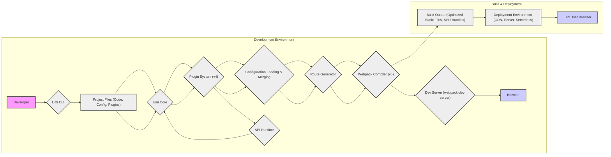
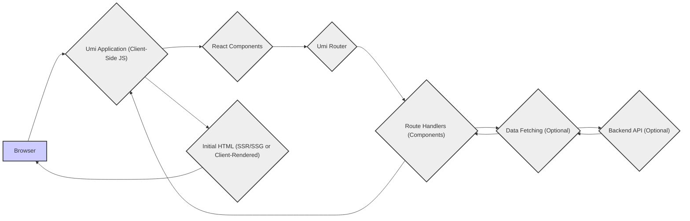

# Project Design Document: Umi Framework (Improved)

## 1. Introduction

### 1.1. Purpose of Document

This document provides an enhanced and more detailed design overview of the Umi framework, an extensible enterprise-level React application framework. Building upon the initial version, this document aims to offer a more comprehensive understanding of Umi's internal workings, data flow, and security considerations. It remains intended as the foundational document for subsequent threat modeling exercises, ensuring a robust and accurate representation of the system for security analysis.

### 1.2. Project Overview

Umi (寓意: 像水一样流动，可塑性强 - Meaning: Flowing like water, highly adaptable) is a pluggable enterprise-level React application framework designed for building complex and scalable web applications. It prioritizes developer experience and powerful features through a convention-over-configuration approach. Umi leverages industry-standard technologies like React Router v6, webpack 5, and Babel 7, offering a streamlined and efficient development workflow. Key features include:

*   **Enhanced File-system based routing:**  Automatic route generation from directory structure, now with support for dynamic routes, nested layouts, and advanced route configurations.
*   **Robust Plugin System (Umi Plugins v4):**  A highly flexible and powerful plugin system enabling deep customization and feature extension across all aspects of the framework, from build process to runtime behavior.
*   **Convention over Configuration (with escape hatches):**  Smart defaults and conventions minimize configuration needs, while providing well-defined mechanisms for customization when required.
*   **Comprehensive Built-in Tooling:**  Integrated development server with hot module replacement (HMR), advanced build tools optimized for production, testing utilities (Jest, Playwright), and code generation capabilities.
*   **Versatile Front-end Technology Support:**  Primary focus on React, but designed to be adaptable and extensible to support other front-end libraries and frameworks through plugins and community integrations.
*   **SSR and Static Site Generation (SSG) Capabilities:**  Supports both Server-Side Rendering and Static Site Generation for improved performance and SEO, configurable through plugins and build-time options.
*   **Internationalization (i18n) and Localization (l10n) Support:** Built-in mechanisms and plugins to facilitate the development of multi-language applications.
*   **Data Fetching and Management Solutions:** Integrations and patterns for efficient data fetching and state management within Umi applications.

## 2. Architecture Overview

### 2.1. High-Level Architecture Diagram (Detailed)

### 2.2. Architecture Description (Enhanced)

Umi's architecture is modular and plugin-centric, built around a robust core framework and a highly extensible plugin system (Umi Plugins v4). This design promotes flexibility, customization, and maintainability. The architecture operates in two primary phases: **Development Environment** and **Build & Deployment**, with significant overlap in core components.

*   **Development Environment (Detailed Breakdown):**
    *   **Developer Interaction (Umi CLI):** Developers use the **Umi CLI** to interact with the framework. The CLI provides commands for development, building, testing, and plugin management.
    *   **Project File Processing (Code, Config, Plugins):** The CLI and **Umi Core** process **Project Files**, including application code (React components, pages), configuration files (`config/config.ts`, `.umirc.ts`), and plugin files.
    *   **Umi Core (Orchestration Engine):** **Umi Core** acts as the central orchestrator, managing the application lifecycle, plugin system, routing, configuration, and build process.
    *   **Plugin System (v4 - Extensibility Powerhouse):** The **Plugin System (v4)** is a cornerstone of Umi's architecture. It allows plugins to deeply extend and modify almost every aspect of the framework. Plugins can:
        *   Modify configuration.
        *   Extend routing.
        *   Customize the build process (Webpack).
        *   Add new commands to the CLI.
        *   Provide runtime APIs.
    *   **Configuration Loading & Merging:** Umi loads and merges configurations from various sources (e.g., `.umirc.ts`, `config/config.ts`, plugin configurations) to create a unified configuration object.
    *   **Route Generator (File-system & Config-based):** The **Route Generator** automatically creates routes based on the file system structure within the `pages` directory and from explicit route configurations. It supports dynamic routes, nested layouts, and middleware.
    *   **Webpack Compiler (v5 - Bundling & Optimization):** **Webpack Compiler (v5)** is used for bundling and optimizing the application code and assets. Umi configures Webpack with sensible defaults, but plugins can further customize the Webpack configuration.
    *   **Dev Server (webpack-dev-server - Rapid Development):** The **Dev Server** powered by `webpack-dev-server` provides a local development environment with features like Hot Module Replacement (HMR) for fast iteration, proxying for API requests, and more.
    *   **API Runtime (Plugin-Exposed APIs):** The **API Runtime** represents the set of APIs exposed by Umi Core and plugins to be used within the application code. This includes routing APIs, configuration access, and plugin-provided utilities.
    *   **Browser (Developer Preview & Testing):** Developers use the **Browser** to preview and test the application during development, benefiting from HMR and other development-time features.

*   **Build & Deployment (Production Readiness):**
    *   The **Build & Deployment** phase reuses many of the core components from the development environment (**Umi Core**, **Plugin System**, **Configuration Loading**, **Route Generator**, **Webpack Compiler**).
    *   **Build Output (Optimized Static Files, SSR Bundles):** The build process generates optimized **Build Output**. This typically includes:
        *   Static files (HTML, CSS, JavaScript, assets) for client-side rendering (CSR) applications or static site generation (SSG).
        *   Server bundles (Node.js code) for server-side rendering (SSR) applications, if SSR is enabled.
    *   **Deployment Environment (CDN, Server, Serverless - Flexible Hosting):** The **Build Output** is deployed to a **Deployment Environment**. Umi applications can be deployed to:
        *   **CDNs (Content Delivery Networks):** For static files, offering global distribution and fast loading times.
        *   **Web Servers:** Traditional web servers (Nginx, Apache) can serve static files or act as SSR servers.
        *   **Serverless Functions:** For SSR or backend API functionalities, leveraging serverless platforms for scalability and cost-efficiency.
    *   **End User Browser (Application Access):** **End User Browsers** access the deployed application from the **Deployment Environment**.

## 3. Key Components (Detailed Functionality)

### 3.1. Core Framework (Umi Core)

*   **Description:** The central nervous system of Umi, orchestrating all aspects of the framework. It manages the application lifecycle, plugin interactions, routing, configuration, build processes, and development server.
*   **Functionality:**
    *   **Initialization & Bootstrapping:**  Sets up the Umi environment, loads initial configurations, and initializes core services.
    *   **Plugin Management (v4 Integration):**  Loads, registers, activates, and manages plugins based on configuration and conventions. Handles plugin lifecycle hooks and API exposure.
    *   **Configuration Management:** Loads, merges, validates, and provides access to the application's configuration from various sources (user config, plugin config, defaults).
    *   **Route Management & Generation:**  Generates routes based on file system conventions (pages directory) and explicit route configurations. Manages route registration, matching, and middleware.
    *   **Build Process Orchestration:**  Coordinates the entire build process, invoking Webpack compiler, running build-time plugins, and generating build outputs.
    *   **Dev Server Management:**  Starts, configures, and manages the development server (webpack-dev-server), enabling hot reloading, proxying, and other development features.
    *   **CLI Command Handling:**  Registers and handles commands invoked through the Umi CLI, delegating to relevant components and plugins.
    *   **API Exposure (Runtime & Build-time):**  Provides a set of APIs for plugins and application code to interact with Umi's core functionalities and access framework resources.
*   **Interactions:** Interacts with virtually all other components, including:
    *   **Plugin System:**  Central interaction point for plugin lifecycle and API access.
    *   **Configuration Loading:**  Manages the configuration loading and merging process.
    *   **Route Generator:**  Delegates route generation and management.
    *   **Webpack Compiler:**  Invokes and configures the Webpack compiler for build processes.
    *   **Dev Server:**  Manages the lifecycle of the development server.
    *   **CLI:**  Receives and processes commands from the CLI.
    *   **API Runtime:** Provides the runtime environment and APIs for application code.

### 3.2. Plugin System (Umi Plugins v4)

*   **Description:** A highly advanced and flexible plugin system that allows for deep customization and extension of Umi's core functionality. Plugins are the primary mechanism for adding features, modifying behavior, and integrating with other tools and libraries.
*   **Functionality:**
    *   **Plugin Registration & Discovery:**  Allows plugins to be registered and discovered through configuration, conventions, and package dependencies.
    *   **Hook System (Extensive Lifecycle Hooks):**  Provides a rich set of lifecycle hooks that plugins can tap into to modify Umi's behavior at various stages of the application lifecycle (e.g., `modifyConfig`, `beforeDevServer`, `onBuildComplete`, `modifyRoutes`).
    *   **API Contribution & Extension:**  Plugins can contribute new APIs to Umi's runtime and build-time environments, making them available to other plugins and application code.
    *   **Configuration Extension & Modification:**  Plugins can extend and modify the application's configuration, adding new options or altering existing ones.
    *   **CLI Command Extension:**  Plugins can register new commands with the Umi CLI, providing custom tooling and workflows.
    *   **Middleware Injection (Dev Server & Production):** Plugins can inject custom middleware into the development server and, in some cases, production server environments.
    *   **Code Generation & Transformation:** Plugins can generate code (e.g., routes, components) and transform existing code during the build process.
*   **Interactions:**
    *   **Umi Core:**  The primary interaction point. Plugins register with and are managed by Umi Core. They utilize Umi Core's APIs and hook system.
    *   **Configuration System:** Plugins interact with the configuration system to extend and modify application settings.
    *   **Webpack Compiler:** Plugins can directly modify the Webpack configuration to customize the build process.
    *   **Route Generator:** Plugins can influence route generation and modify the routing configuration.
    *   **Dev Server:** Plugins can customize the development server behavior through middleware and configuration.

### 3.3. Router (React Router v6 based)

*   **Description:**  Handles application routing, built upon React Router v6. It manages route definition, matching, navigation, and rendering of React components based on the current URL.
*   **Functionality:**
    *   **Route Definition (File-system & Config):**  Defines routes based on the directory structure in the `pages` directory and explicit route configurations in `config/routes.ts`. Supports nested routes, dynamic segments, and index routes.
    *   **Route Matching (Path Matching Algorithm):**  Matches incoming browser URLs to defined routes using React Router v6's path matching algorithm.
    *   **Route Rendering (Component Rendering):**  Renders the React component associated with the matched route. Supports layouts, nested layouts, and route-specific components.
    *   **Navigation (Programmatic & Declarative):**  Provides APIs for programmatic navigation (`history` API) and declarative navigation (`<Link>`, `<NavLink>` components).
    *   **Route Middleware & Interceptors:**  Supports route-level middleware or interceptors (through React Router v6 features or Umi plugins) to handle authentication, authorization, or other pre-route actions.
    *   **Dynamic Routing & Parameters:**  Handles dynamic route segments (e.g., `/users/:id`) and extracts route parameters for use in components.
*   **Interactions:**
    *   **Umi Core:**  Umi Core manages the Router's configuration and initialization.
    *   **React Components:**  React components use the Router's APIs for navigation and rendering based on the current route.
    *   **Browser History API:**  Interacts with the browser's history API to manage navigation and URL changes.

### 3.4. Compiler (Webpack v5)

*   **Description:**  Webpack v5 is the underlying module bundler and compiler. It bundles JavaScript, CSS, assets, and other modules into optimized bundles for both development and production.
*   **Functionality:**
    *   **Module Bundling & Dependency Resolution:**  Bundles application code and dependencies into optimized JavaScript bundles. Resolves module dependencies using various module resolution algorithms.
    *   **Code Transformation (Babel, Loaders):**  Uses Babel for JavaScript/TypeScript compilation and other loaders (e.g., CSS loaders, image loaders) to transform different types of assets.
    *   **Code Optimization (Minification, Tree Shaking, Code Splitting):**  Performs code optimization techniques like minification (UglifyJS, Terser), tree shaking (dead code elimination), and code splitting (bundle splitting) to reduce bundle sizes and improve performance.
    *   **Asset Management (Handling Static Assets):**  Handles static assets (images, fonts, etc.) by copying them to the output directory and optimizing them.
    *   **Hot Module Replacement (HMR):**  Enables Hot Module Replacement during development for fast and efficient code updates in the browser.
    *   **Plugin Ecosystem (Webpack Plugins):**  Leverages Webpack's extensive plugin ecosystem to extend its functionality and customize the build process.
*   **Interactions:**
    *   **Umi Core:**  Umi Core configures and invokes the Webpack compiler during the build process.
    *   **Plugin System:**  Umi plugins can modify the Webpack configuration to customize the build process further.
    *   **Dev Server:**  Webpack Dev Server is built on top of Webpack and uses Webpack's compilation output.

### 3.5. Dev Server (webpack-dev-server)

*   **Description:**  A development server based on `webpack-dev-server` that provides a local development environment with features like hot reloading, proxying, content serving, and more.
*   **Functionality:**
    *   **Static File Serving:**  Serves static files from the project's public directory and Webpack's output directory.
    *   **Hot Module Replacement (HMR):**  Provides Hot Module Replacement, automatically updating modules in the browser without full page reloads when code changes.
    *   **Proxying (API Proxy):**  Allows proxying requests to backend servers, simplifying development with APIs.
    *   **Middleware Support (Custom Middleware):**  Supports custom middleware functions to extend the dev server's functionality (e.g., request logging, authentication mocks).
    *   **Content Base & Public Path Configuration:**  Configures the content base directory and public path for serving static files.
    *   **HTTPS & Security Options:**  Supports HTTPS configuration and other security-related options for development environments.
*   **Interactions:**
    *   **Umi Core:**  Umi Core starts and manages the Dev Server.
    *   **Webpack Compiler:**  The Dev Server uses Webpack's compilation output to serve the application and enable HMR.
    *   **Browser:**  The Dev Server communicates with the browser to enable hot reloading and provide development-time features.

### 3.6. Build Process (Detailed Steps)

*   **Description:**  The process of transforming the application source code and assets into optimized and deployable static files (and potentially server bundles for SSR).
*   **Functionality (Steps):**
    1.  **Configuration Loading & Merging:** Umi Core loads and merges configurations from various sources (user config, plugin config, defaults).
    2.  **Plugin Initialization & Hook Execution:** Umi Core initializes and activates plugins, executing relevant build-time hooks (e.g., `modifyConfig`, `beforeBuild`).
    3.  **Route Generation:** The Route Generator creates route definitions based on file system conventions and configuration.
    4.  **Webpack Configuration Generation:** Umi Core generates a Webpack configuration object, potentially modified by plugins through hooks.
    5.  **Webpack Compilation:** The Webpack Compiler is invoked with the generated configuration to bundle and compile the application code and assets.
    6.  **Asset Optimization & Processing:** Webpack and its plugins perform asset optimization (image optimization, CSS minification, etc.) and processing.
    7.  **Bundle Optimization (Minification, Tree Shaking):** Webpack performs bundle optimization techniques like minification and tree shaking.
    8.  **Output Generation:** Webpack outputs the build artifacts (static files, server bundles) to the specified output directory (`dist` by default).
    9.  **Post-Build Plugin Hooks:** Umi Core executes post-build plugin hooks (e.g., `onBuildComplete`) allowing plugins to perform actions after the build process.
*   **Interactions:**
    *   **Umi Core:**  Orchestrates the entire build process.
    *   **Plugin System:**  Plugins heavily influence the build process through configuration modifications and hook execution.
    *   **Webpack Compiler:**  The core engine for compilation and bundling within the build process.
    *   **Configuration System:**  The build process relies on the application's configuration.
    *   **Route Generator:**  Route definitions are used during the build process (e.g., for pre-rendering or static site generation).

## 4. Data Flow (Enhanced Request Flow)

### 4.1. Request Flow Diagram (Detailed Client-Side & Initial Server Interaction)

### 4.2. Data Flow Description (Enhanced)

This diagram provides a more detailed view of the data flow within a Umi application, including initial server interaction (for SSR/SSG) and optional data fetching from backend APIs.

1.  **Browser Request:** The user initiates a request by entering a URL or clicking a link in the **Browser**.
2.  **Initial HTML (SSR/SSG or Client-Rendered):**
    *   **SSR/SSG:** For Server-Side Rendering (SSR) or Static Site Generation (SSG) applications, the initial request might be handled by a server. The server renders the initial HTML content of the Umi application and sends it back to the browser.
    *   **Client-Rendered:** For client-side rendered applications, the server typically serves a minimal HTML shell that loads the Umi application's JavaScript bundle.
3.  **Umi Application (Client-Side JS):** Once the initial HTML and JavaScript are loaded, the **Umi Application (Client-Side JS)** takes over.
4.  **React Components:** The application is composed of **React Components** that manage the UI and user interactions.
5.  **Umi Router:** The **Umi Router** intercepts route changes and manages navigation within the application.
6.  **Route Handlers (Components):** Based on the matched route, the **Umi Router** renders the corresponding **Route Handlers (Components)**.
7.  **Data Fetching (Optional):** Route handler components may initiate **Data Fetching** to retrieve data from a **Backend API**. This is an optional step depending on the component's data requirements.
8.  **Backend API (Optional):** If data fetching is required, the Umi application sends requests to a **Backend API** to retrieve data.
9.  **Data Response:** The **Backend API** responds with data, which is then processed by the **Data Fetching** logic.
10. **Component Rendering (with Data):** The route handler components render the UI using the fetched data (if any) and other application state. The updated UI is then displayed in the **Browser**.

**Note:** This diagram illustrates a more complete data flow, including the initial server interaction for SSR/SSG and the common pattern of client-side data fetching from backend APIs. The specific data flow can vary depending on the application's architecture and features (CSR, SSR, SSG, data fetching strategies).

## 5. Technology Stack (Detailed)

*   **Programming Languages:**
    *   JavaScript (ES6+) - Primary language for application development and framework core.
    *   TypeScript - Increasingly used for Umi plugin development and application code for enhanced type safety and developer experience.
    *   Node.js - Runtime environment for development server, build processes, and potentially SSR server.
*   **Frameworks and Libraries:**
    *   React (v18+) - Primary UI library for building user interfaces.
    *   React Router (v6) - Routing library for client-side navigation and route management.
    *   Webpack (v5) - Module bundler and compiler for bundling and optimizing application code and assets.
    *   Babel (v7) - JavaScript compiler for transpiling modern JavaScript/TypeScript code to browser-compatible versions.
    *   webpack-dev-server - Development server for local development with hot reloading and other features.
    *   Jest - JavaScript testing framework commonly used for unit and integration testing in Umi projects.
    *   Playwright - End-to-end testing framework for browser automation and UI testing.
    *   Node.js core modules and npm ecosystem libraries - Various Node.js modules for file system operations, server functionalities, utilities, and more.
*   **Build Tools & Utilities:**
    *   Umi CLI (`@umijs/cli`) - Command-line interface for interacting with Umi framework.
    *   Webpack CLI (`webpack-cli`) - Underlying CLI for Webpack, used indirectly through Umi.
    *   npm or Yarn or pnpm - Package managers for managing project dependencies.
    *   Babel CLI (`@babel/cli`) - Underlying CLI for Babel, used indirectly through Webpack.
    *   Various Umi plugins (`@umijs/plugins-*`) - Official and community plugins extending Umi's functionality.

## 6. Deployment Model (Comprehensive)

### 6.1. Deployment Process (Detailed Steps)

1.  **Project Configuration Review:** Review and finalize application configuration (`config/config.ts`, `.umirc.ts`) for production environment (e.g., `publicPath`, API endpoints, environment variables).
2.  **Dependency Installation:** Ensure all project dependencies are installed (`npm install`, `yarn install`, or `pnpm install`) in the build environment.
3.  **Build Command Execution:** Run the `umi build` command in the project root to trigger the production build process. This generates optimized static files (and server bundles if SSR is enabled) in the `dist` directory.
4.  **Build Output Verification (Optional but Recommended):**  Locally verify the build output in the `dist` directory to ensure assets are correctly generated and the application functions as expected.
5.  **Deployment Target Preparation:** Prepare the target deployment environment (CDN, web server, serverless platform) according to its specific requirements.
6.  **Static File Upload/Deployment:**
    *   **CDN/Static Hosting:** Upload the contents of the `dist` directory (static files) to the chosen CDN or static hosting service (e.g., AWS S3, Netlify, Vercel, Cloudflare Pages). Configure CDN settings (caching, invalidation, etc.).
    *   **Web Server:** Copy the `dist` directory to the web server's document root or configured static file directory. Configure the web server (Nginx, Apache) to serve these files.
7.  **SSR Server Deployment (If applicable):** If using Server-Side Rendering (SSR), deploy the server bundles (typically located within the `dist` directory in an SSR-specific subdirectory) to a Node.js server environment or serverless functions platform. Configure the server to run the SSR application.
8.  **Domain/Subdomain Configuration:** Configure DNS settings to point the desired domain or subdomain to the deployed application (CDN endpoint, web server IP, serverless function URL).
9.  **Testing and Monitoring:** Thoroughly test the deployed application in the production environment. Set up monitoring and logging to track application performance and errors.
10. **Continuous Integration/Continuous Deployment (CI/CD) Integration (Best Practice):** Integrate the build and deployment process into a CI/CD pipeline for automated builds and deployments upon code changes.

### 6.2. Deployment Environments (Expanded Options)

Umi applications offer flexible deployment options, catering to various needs and scales:

*   **Static Site Hosting (CDNs - Scalable & Performant):**
    *   Netlify, Vercel, AWS S3 + CloudFront, Cloudflare Pages, Azure Static Web Apps, Google Cloud Storage + Cloud CDN.
    *   Ideal for client-side rendered (CSR) applications and static site generation (SSG). Offers global distribution, high performance, and scalability.
*   **Traditional Web Servers (Control & Customization):**
    *   Nginx, Apache, IIS.
    *   Suitable for serving static files or as backend servers for SSR applications. Provides more control over server configuration.
*   **Serverless Functions (Scalability & Cost-Efficiency for SSR/Backend):**
    *   AWS Lambda, Azure Functions, Google Cloud Functions, Vercel Serverless Functions, Netlify Functions.
    *   Excellent for Server-Side Rendering (SSR) and backend API functionalities. Offers automatic scaling and pay-per-use pricing.
*   **Containerized Environments (Docker, Kubernetes - Orchestration & Scalability):**
    *   Docker containers deployed to platforms like Kubernetes, AWS ECS, Azure Container Instances, Google Kubernetes Engine.
    *   Provides maximum control over the deployment environment and facilitates complex deployments, especially for SSR applications or microservices architectures.
*   **Platform-as-a-Service (PaaS - Simplified Deployment & Management):**
    *   Heroku, AWS Elastic Beanstalk, Google App Engine, Azure App Service.
    *   Simplifies deployment and management of web applications, often suitable for both static sites and SSR applications.

## 7. Security Considerations (Expanded & Categorized)

This section expands upon the initial security considerations and categorizes them for a more structured threat modeling approach.

### 7.1. Input Validation & Output Encoding

*   **Client-Side Input Validation:** Implement robust client-side input validation in React components to prevent malformed or malicious data from being sent to the backend or processed client-side. This helps mitigate Cross-Site Scripting (XSS) and client-side injection vulnerabilities.
*   **Server-Side Input Validation (Backend APIs):** If the Umi application interacts with backend APIs, ensure thorough server-side input validation on the backend to prevent injection attacks (SQL injection, NoSQL injection, command injection), and other server-side vulnerabilities.
*   **Output Encoding/Escaping:** Properly encode or escape user-generated content and data retrieved from backend APIs before rendering it in React components to prevent XSS vulnerabilities. Use React's built-in mechanisms for safe rendering and avoid directly injecting raw HTML.

### 7.2. Dependency Security & Supply Chain

*   **Dependency Auditing & Management:** Regularly audit project dependencies using tools like `npm audit`, `yarn audit`, or `pnpm audit` to identify and address known vulnerabilities in dependencies. Keep dependencies updated to the latest secure versions.
*   **Supply Chain Security:** Be mindful of the security of the entire dependency supply chain. Investigate and trust the sources of npm packages and plugins used in the project. Consider using tools and practices to enhance supply chain security.

### 7.3. Build Pipeline & Infrastructure Security

*   **Secure Build Environment:** Ensure the build pipeline runs in a secure environment, minimizing the risk of compromised build servers or malicious code injection during the build process.
*   **Build Artifact Integrity:** Implement mechanisms to verify the integrity of build artifacts to ensure they haven't been tampered with during or after the build process.
*   **Infrastructure Security (Deployment Environment):** Secure the deployment environment (CDN, web server, serverless platform) by following security best practices for configuration, access control, and patching.

### 7.4. Plugin Security (Umi Plugin Ecosystem)

*   **Plugin Vetting & Trust:** Carefully vet and evaluate Umi plugins before using them in projects. Only use plugins from trusted sources and with active community support. Review plugin code for potential security vulnerabilities if necessary.
*   **Plugin Permissions & Capabilities:** Understand the permissions and capabilities requested by Umi plugins. Be cautious of plugins that request excessive permissions or access to sensitive data or functionalities.

### 7.5. Client-Side Security Best Practices

*   **Secure Coding Practices in React:** Follow secure coding practices when developing React components, especially when handling sensitive data, user authentication, and authorization.
*   **Cross-Site Scripting (XSS) Prevention:** Implement comprehensive XSS prevention measures, including input validation, output encoding, and Content Security Policy (CSP).
*   **Cross-Site Request Forgery (CSRF) Protection:** If the application interacts with backend APIs that handle state-changing requests, implement CSRF protection mechanisms (e.g., CSRF tokens).
*   **Authentication & Authorization:** Implement secure authentication and authorization mechanisms to protect sensitive resources and user data. Use established authentication protocols (OAuth 2.0, OpenID Connect) and authorization patterns.
*   **Session Management:** Securely manage user sessions, using secure cookies (HttpOnly, Secure attributes) and appropriate session expiration policies.
*   **HTTPS Enforcement:** Enforce HTTPS for all communication between the browser and the application to protect data in transit.

### 7.6. Server-Side Rendering (SSR) Specific Security

*   **SSR Vulnerabilities:** Be aware of potential security vulnerabilities specific to Server-Side Rendering, such as code injection risks if server-side code is not properly secured.
*   **Secure SSR Configuration:** Configure SSR environments securely, following best practices for Node.js server security and dependency management.

This enhanced design document provides a more detailed and comprehensive foundation for threat modeling the Umi framework and applications built upon it. By considering these architectural details and security considerations, a more effective and targeted threat model can be developed to identify and mitigate potential security risks.