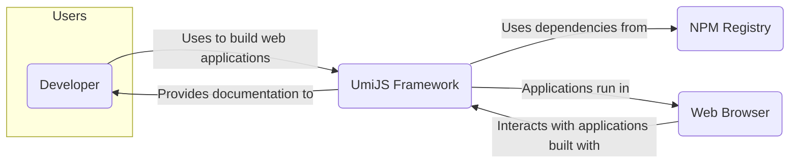
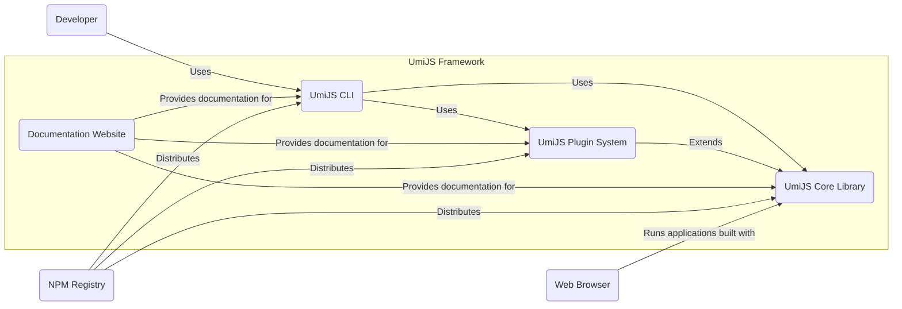
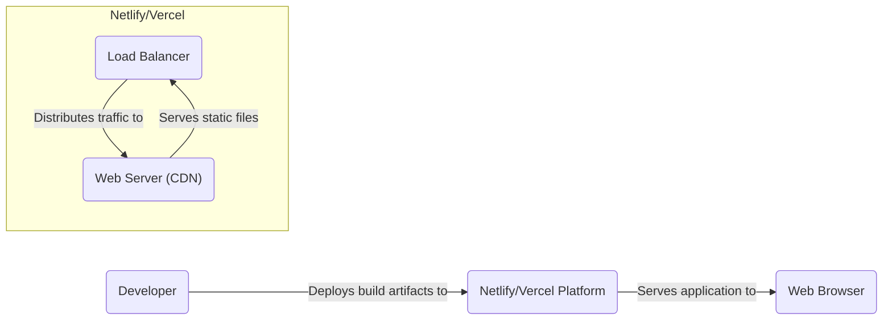
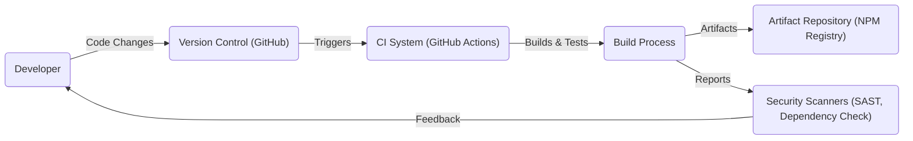

# BUSINESS POSTURE

- Business Priorities and Goals:
  - UmiJS is a pluggable enterprise-level react application framework.
  - The primary goal of UmiJS is to provide a comprehensive and efficient framework for building web applications, particularly React-based applications.
  - Key priorities include developer productivity, ease of use, flexibility through plugins, and performance of applications built with UmiJS.
  - UmiJS aims to streamline the development process, reduce boilerplate code, and offer a robust foundation for complex web applications.
- Business Risks:
  - Security vulnerabilities within the UmiJS framework itself could be inherited by all applications built using it, leading to widespread impact.
  - Supply chain risks associated with dependencies used by UmiJS could introduce vulnerabilities.
  - Improper handling of user-provided configurations or plugins could lead to security issues in applications.
  - Performance bottlenecks or instability in UmiJS could negatively impact the performance and reliability of applications built with it.
  - Lack of clear security guidance and best practices for developers using UmiJS could result in insecure applications.

# SECURITY POSTURE

- Existing Security Controls:
  - security control: Code review process for contributions to the UmiJS repository. (Implemented in: GitHub Pull Request review process)
  - security control: Dependency management using `package-lock.json` or similar to ensure consistent dependency versions. (Implemented in: Repository configuration)
  - security control: Regular updates of dependencies to address known vulnerabilities. (Implemented in: Ongoing maintenance of the repository)
  - accepted risk: Security vulnerabilities might exist in dependencies that are not yet publicly disclosed or patched.
  - accepted risk: Security vulnerabilities might be introduced by contributors despite code review processes.
  - accepted risk: Security of applications built using UmiJS is ultimately the responsibility of the application developers.

- Recommended Security Controls:
  - security control: Implement automated Static Application Security Testing (SAST) tools in the CI/CD pipeline to identify potential vulnerabilities in the UmiJS codebase.
  - security control: Implement automated Dependency Scanning tools to identify known vulnerabilities in UmiJS dependencies.
  - security control: Conduct regular penetration testing or security audits of the UmiJS framework to proactively identify and address security weaknesses.
  - security control: Provide clear and comprehensive security documentation and best practices for developers using UmiJS to build secure applications.
  - security control: Establish a process for users to report security vulnerabilities in UmiJS and ensure timely response and remediation.

- Security Requirements:
  - Authentication:
    - Applications built with UmiJS will likely need to implement their own authentication mechanisms as UmiJS is a frontend framework and does not handle backend authentication directly.
    - UmiJS should provide guidance and best practices for implementing secure authentication in applications built with it, such as recommendations for secure session management and integration with backend authentication services.
  - Authorization:
    - Similar to authentication, authorization logic will reside within applications built with UmiJS.
    - UmiJS should offer patterns or utilities to help developers implement fine-grained authorization within their applications, potentially through plugin mechanisms or recommended libraries.
  - Input Validation:
    - UmiJS should encourage and facilitate input validation within applications to prevent common vulnerabilities like Cross-Site Scripting (XSS) and injection attacks.
    - This could involve providing utilities for sanitizing user inputs or integrating with validation libraries.
    - Developers using UmiJS should be educated on the importance of input validation at all application layers.
  - Cryptography:
    - UmiJS itself may not directly implement cryptographic functions, but applications built with it will likely need to use cryptography for secure communication and data storage.
    - UmiJS documentation should recommend secure cryptographic libraries and best practices for developers, especially when handling sensitive data within applications.
    - UmiJS should avoid introducing any cryptographic weaknesses or vulnerabilities in its core functionality.

# DESIGN

## C4 CONTEXT

- Context Diagram Elements:
  - Element:
    - Name: Developer
    - Type: Person
    - Description: Software developers who use UmiJS to build web applications.
    - Responsibilities: Develop, build, test, and deploy web applications using UmiJS. Configure and customize UmiJS for specific application needs.
    - Security controls: Secure development practices, secure coding guidelines, local development environment security.
  - Element:
    - Name: UmiJS Framework
    - Type: Software System
    - Description: A pluggable enterprise-level react application framework. Provides tools, libraries, and conventions for building web applications.
    - Responsibilities: Provide a robust and efficient framework for React application development. Manage application build process, routing, state management, and plugin integration. Ensure framework stability and performance.
    - Security controls: Code review, SAST, dependency scanning, security testing, secure release process.
  - Element:
    - Name: NPM Registry
    - Type: External System
    - Description: Public repository of JavaScript packages, used to distribute and manage UmiJS and its dependencies.
    - Responsibilities: Host and distribute UmiJS packages and dependencies. Provide package management services.
    - Security controls: Package signing, vulnerability scanning of packages, access control to publish packages.
  - Element:
    - Name: Web Browser
    - Type: External System
    - Description: Web browsers used by end-users to access and interact with applications built using UmiJS.
    - Responsibilities: Render and execute web applications. Provide user interface for applications.
    - Security controls: Browser security features (Content Security Policy, Same-Origin Policy), user security practices, browser updates.

## C4 CONTAINER

- Container Diagram Elements:
  - Element:
    - Name: UmiJS CLI
    - Type: CLI Application
    - Description: Command-line interface tool for developers to create, build, and manage UmiJS applications.
    - Responsibilities: Project scaffolding, development server, build process, plugin management, code generation.
    - Security controls: Input validation for CLI commands, secure handling of user configurations, protection against command injection vulnerabilities.
  - Element:
    - Name: UmiJS Core Library
    - Type: JavaScript Library
    - Description: Core runtime library of UmiJS, providing essential functionalities for application development, such as routing, state management, and component rendering.
    - Responsibilities: Application runtime environment, core functionalities, API for plugin development.
    - Security controls: Secure coding practices, input validation within core functionalities, protection against XSS and other web vulnerabilities, memory safety.
  - Element:
    - Name: UmiJS Plugin System
    - Type: Plugin System
    - Description: Extensible plugin architecture allowing developers to extend and customize UmiJS functionality.
    - Responsibilities: Plugin loading and management, plugin API, extension points for core functionalities.
    - Security controls: Plugin isolation, input validation for plugin configurations, secure plugin loading mechanism, documentation on secure plugin development.
  - Element:
    - Name: Documentation Website
    - Type: Web Application
    - Description: Website providing documentation, guides, and examples for UmiJS framework.
    - Responsibilities: Provide comprehensive documentation, tutorials, API references, community support resources.
    - Security controls: Web application security best practices, input validation, protection against XSS and CSRF, access control for administrative functions.

## DEPLOYMENT

- Deployment Options:
  - Static Site Hosting (e.g., Netlify, Vercel, GitHub Pages): For applications that are primarily static content with client-side rendering.
  - Server-Side Rendering (SSR) Hosting (e.g., Node.js servers, AWS EC2, Google Cloud Compute Engine): For applications requiring server-side rendering for performance or SEO.
  - Containerized Deployment (e.g., Docker, Kubernetes): For more complex applications requiring scalability and orchestration.

- Detailed Deployment (Static Site Hosting - Netlify/Vercel):

- Deployment Diagram Elements (Static Site Hosting - Netlify/Vercel):
  - Element:
    - Name: Netlify/Vercel Platform
    - Type: Cloud Platform
    - Description: Cloud platform for hosting static websites and frontend applications. Provides CDN, build services, and deployment automation.
    - Responsibilities: Hosting static assets, CDN delivery, SSL termination, build and deployment automation.
    - Security controls: Platform security controls, DDoS protection, CDN security, access control for deployment, secure build environment.
  - Element:
    - Name: Load Balancer
    - Type: Network Device
    - Description: Distributes incoming traffic across multiple web servers for scalability and availability.
    - Responsibilities: Traffic distribution, load balancing, health checks.
    - Security controls: DDoS protection, rate limiting, TLS termination, security policies.
  - Element:
    - Name: Web Server (CDN)
    - Type: Web Server
    - Description: Web servers within the CDN infrastructure that serve static files to end-users.
    - Responsibilities: Serve static content, caching, content delivery.
    - Security controls: Web server hardening, access control, CDN security features, caching policies.

## BUILD

- Build Process Diagram Elements:
  - Element:
    - Name: Developer
    - Type: Person
    - Description: Software developer writing and committing code changes.
    - Responsibilities: Write code, commit changes, run local builds and tests.
    - Security controls: Secure development environment, code review, secure coding practices.
  - Element:
    - Name: Version Control (GitHub)
    - Type: Software System
    - Description: Git-based version control system used to manage the UmiJS codebase.
    - Responsibilities: Source code management, version history, collaboration, access control.
    - Security controls: Access control, branch protection, audit logs, secure communication (HTTPS, SSH).
  - Element:
    - Name: CI System (GitHub Actions)
    - Type: CI/CD System
    - Description: Continuous Integration system used to automate the build, test, and release process for UmiJS.
    - Responsibilities: Automated build, test execution, integration with security scanners, artifact publishing.
    - Security controls: Secure build environment, access control for CI workflows, secret management, audit logs.
  - Element:
    - Name: Build Process
    - Type: Automated Process
    - Description: Automated steps involved in compiling, testing, and packaging UmiJS framework. Includes steps like linting, unit testing, building distributable packages.
    - Responsibilities: Code compilation, unit testing, integration testing, packaging, running security scans.
    - Security controls: Build script security, dependency management, secure artifact creation, SAST and dependency scanning integration.
  - Element:
    - Name: Artifact Repository (NPM Registry)
    - Type: Package Registry
    - Description: NPM registry used to store and distribute UmiJS packages.
    - Responsibilities: Store and distribute UmiJS packages, version management, package integrity.
    - Security controls: Package signing, access control for publishing, vulnerability scanning, audit logs.
  - Element:
    - Name: Security Scanners (SAST, Dependency Check)
    - Type: Security Tools
    - Description: Automated security scanning tools used to identify vulnerabilities in the codebase and dependencies. Includes Static Application Security Testing (SAST) and Dependency Check tools.
    - Responsibilities: Identify potential security vulnerabilities, generate security reports, provide feedback to developers.
    - Security controls: Tool configuration, vulnerability database updates, integration with CI pipeline, reporting and alerting.

# RISK ASSESSMENT

- Critical Business Processes:
  - Development and distribution of the UmiJS framework.
  - Usage of UmiJS framework by developers to build and deploy web applications.
  - Maintaining the integrity and availability of the UmiJS framework and its documentation.
- Data Sensitivity:
  - Source code of UmiJS: High sensitivity. Confidentiality and integrity are crucial to prevent unauthorized modifications or disclosure of vulnerabilities.
  - NPM packages of UmiJS: High sensitivity. Integrity is critical to ensure users download and use untampered packages. Availability is important for developers to use the framework.
  - Documentation website content: Medium sensitivity. Integrity and availability are important for users to access accurate information.
  - User data in applications built with UmiJS: Sensitivity depends on the application. UmiJS itself does not handle user data, but applications built with it might handle sensitive user data. Security of user data is the responsibility of application developers, but UmiJS should provide guidance and not introduce vulnerabilities that could compromise user data in applications.

# QUESTIONS & ASSUMPTIONS

- Questions:
  - What are the primary use cases and industries for applications built with UmiJS? (To better understand the potential impact of security vulnerabilities).
  - What is the process for reporting and handling security vulnerabilities in UmiJS? (To assess the responsiveness and maturity of security practices).
  - Are there any specific security certifications or compliance requirements that UmiJS aims to meet? (To understand the security posture from a compliance perspective).
  - What kind of security testing is currently performed on UmiJS (e.g., penetration testing, fuzzing)? (To evaluate existing security validation efforts).

- Assumptions:
  - The UmiJS development team is committed to addressing security vulnerabilities and maintaining a secure framework.
  - Developers using UmiJS are concerned about the security of their applications and are looking for guidance and best practices.
  - UmiJS is intended to be used in a wide range of web application development scenarios, including potentially security-sensitive applications.
  - The security of dependencies used by UmiJS is a shared responsibility between the UmiJS team and the dependency maintainers.