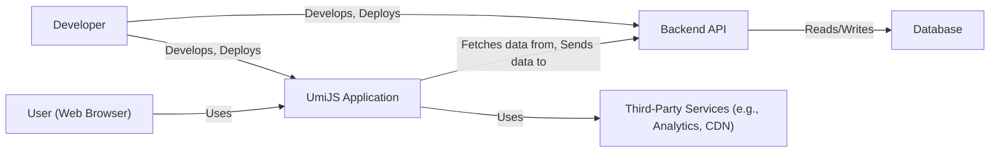
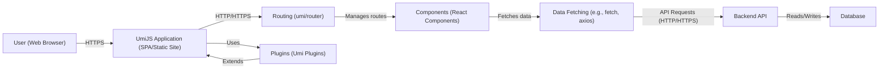
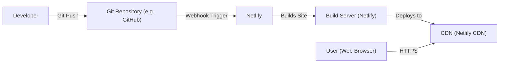
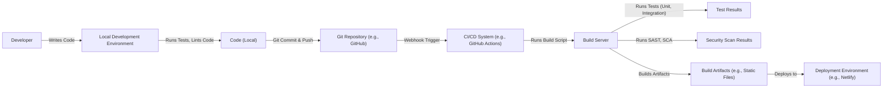

Okay, let's create a design document for the UmiJS project, focusing on aspects relevant for threat modeling.

# BUSINESS POSTURE

UmiJS is a framework designed to simplify the development of React applications, particularly single-page applications (SPAs) and static sites.  It aims to improve developer productivity and provide a streamlined, convention-over-configuration approach.

Business Priorities:

*   Developer Productivity: Reduce development time and effort for building React applications.
*   Performance:  Ensure fast loading times and optimal runtime performance for end-users.
*   Maintainability:  Provide a clear and consistent structure for projects, making them easier to maintain and scale.
*   Extensibility: Allow developers to customize and extend the framework with plugins.
*   Community Adoption:  Grow and maintain a strong community of users and contributors.
*   Ease of Use: Provide clear documentation and simple configuration.

Business Goals:

*   Become a leading choice for React application development.
*   Attract and retain a large and active user base.
*   Foster a vibrant ecosystem of plugins and extensions.

Most Important Business Risks:

*   Security Vulnerabilities:  Vulnerabilities in the framework or its dependencies could expose applications built with UmiJS to attacks, damaging the reputation and adoption of the framework.
*   Performance Bottlenecks:  Poor performance could lead to user dissatisfaction and hinder adoption.
*   Lack of Adoption:  If the framework fails to gain sufficient traction, it may become unsustainable.
*   Competition:  The React ecosystem is highly competitive; UmiJS must differentiate itself and keep pace with evolving best practices.
*   Breaking Changes:  Major updates that introduce breaking changes could disrupt existing projects and frustrate users.
*   Supply Chain Attacks: Compromised dependencies could introduce malicious code into applications built with UmiJS.

# SECURITY POSTURE

Existing Security Controls:

*   security control: Dependency Management: UmiJS uses package managers (like npm or yarn) to manage dependencies, allowing for version pinning and auditing. (Described in package.json and lock files)
*   security control: Code Quality Tools: The project likely uses linters (like ESLint) and code formatters (like Prettier) to enforce code style and identify potential issues. (Described in configuration files like .eslintrc.js, .prettierrc.js)
*   security control: Community Scrutiny: As an open-source project, UmiJS benefits from community review and contributions, which can help identify and address security vulnerabilities. (Visible on GitHub)
*   security control: Regular Updates: The project appears to be actively maintained, with frequent releases, suggesting that security patches are likely to be addressed promptly. (Visible on GitHub)

Accepted Risks:

*   accepted risk: Third-Party Dependency Vulnerabilities: While dependency management helps, there's always a risk of vulnerabilities in third-party libraries.
*   accepted risk: User-Introduced Vulnerabilities: UmiJS provides a framework, but developers can still introduce vulnerabilities in their application code.
*   accepted risk: Configuration Errors: Misconfiguration of UmiJS or its plugins could lead to security weaknesses.

Recommended Security Controls:

*   security control: Implement a robust vulnerability disclosure program.
*   security control: Integrate Software Composition Analysis (SCA) tools into the build process to automatically identify known vulnerabilities in dependencies.
*   security control: Consider implementing Content Security Policy (CSP) headers by default or providing easy configuration options.
*   security control: Provide security hardening guides and best practices documentation for developers using UmiJS.
*   security control: Conduct regular security audits and penetration testing of the framework.
*   security control: Implement Subresource Integrity (SRI) for included scripts and stylesheets where feasible.

Security Requirements:

*   Authentication:
    *   UmiJS itself does not handle authentication directly. It's a front-end framework. Authentication is typically handled by a separate backend service or a third-party authentication provider (e.g., Auth0, Firebase Authentication).
    *   Requirement: Provide clear guidance and examples for integrating with common authentication providers.
    *   Requirement: Support secure storage of authentication tokens (e.g., using HTTP-only cookies or secure local storage mechanisms).
*   Authorization:
    *   Similar to authentication, UmiJS doesn't directly implement authorization logic. This is typically handled on the backend.
    *   Requirement: Provide mechanisms for easily integrating with backend authorization systems (e.g., passing authentication tokens in API requests).
    *   Requirement: Support role-based access control (RBAC) or attribute-based access control (ABAC) patterns.
*   Input Validation:
    *   Requirement: Encourage the use of robust input validation libraries on both the client-side (for user experience) and the server-side (for security).
    *   Requirement: Provide clear documentation and examples for implementing input validation in UmiJS applications.
    *   Requirement: Sanitize user input to prevent cross-site scripting (XSS) vulnerabilities.
*   Cryptography:
    *   Requirement: Use secure cryptographic libraries for any sensitive operations (e.g., hashing passwords, encrypting data).
    *   Requirement: Follow cryptographic best practices (e.g., using strong key lengths, secure random number generators).
    *   Requirement: If handling sensitive data, ensure secure transmission using HTTPS.

# DESIGN

## C4 CONTEXT

C4 Context Element List:

*   Element:
    *   Name: User (Web Browser)
    *   Type: Person
    *   Description: The end-user interacting with the UmiJS application through a web browser.
    *   Responsibilities: Accessing and interacting with the application's features.
    *   Security controls: Browser-based security controls (e.g., same-origin policy, CSP).

*   Element:
    *   Name: UmiJS Application
    *   Type: Software System
    *   Description: The single-page application (SPA) or static site built using the UmiJS framework.
    *   Responsibilities: Providing the user interface and client-side logic.
    *   Security controls: Input validation (client-side), XSS prevention, potentially CSP.

*   Element:
    *   Name: Backend API
    *   Type: Software System
    *   Description: The server-side API that the UmiJS application interacts with.
    *   Responsibilities: Handling business logic, data access, and authentication/authorization.
    *   Security controls: Authentication, authorization, input validation (server-side), rate limiting, secure coding practices.

*   Element:
    *   Name: Third-Party Services
    *   Type: Software System
    *   Description: External services used by the UmiJS application (e.g., analytics, CDN, payment gateways).
    *   Responsibilities: Providing specific functionalities as required by the application.
    *   Security controls: Rely on the security controls provided by the third-party service.  Due diligence in selecting reputable services.

*   Element:
    *   Name: Database
    *   Type: Software System
    *   Description: The database used to store application data.
    *   Responsibilities: Storing and retrieving data.
    *   Security controls: Access control, encryption at rest, encryption in transit, database security hardening.

*   Element:
    *   Name: Developer
    *   Type: Person
    *   Description: The developer building and deploying the UmiJS application and backend API.
    *   Responsibilities: Writing code, configuring the application, deploying updates.
    *   Security controls: Secure coding practices, access control to development tools and infrastructure.

## C4 CONTAINER

C4 Container Element List:

*   Element:
    *   Name: User (Web Browser)
    *   Type: Person
    *   Description: The end-user interacting with the UmiJS application.
    *   Responsibilities: Accessing and interacting with the application.
    *   Security controls: Browser security mechanisms.

*   Element:
    *   Name: UmiJS Application (SPA/Static Site)
    *   Type: Container: Web Application
    *   Description: The client-side application running in the user's browser.
    *   Responsibilities: Rendering the UI, handling user interactions, fetching data.
    *   Security controls: Client-side input validation, XSS prevention, CSP (if implemented).

*   Element:
    *   Name: Routing (umi/router)
    *   Type: Container: Component
    *   Description: The routing mechanism provided by UmiJS.
    *   Responsibilities: Managing navigation and URL routing within the application.
    *   Security controls: Route-based access control (if implemented in conjunction with backend authorization).

*   Element:
    *   Name: Components (React Components)
    *   Type: Container: Component
    *   Description: The individual React components that make up the UI.
    *   Responsibilities: Rendering specific parts of the UI and handling user interactions.
    *   Security controls: Output encoding to prevent XSS.

*   Element:
    *   Name: Data Fetching (e.g., fetch, axios)
    *   Type: Container: Component
    *   Description: The mechanism used to fetch data from the backend API.
    *   Responsibilities: Making API requests and handling responses.
    *   Security controls: Securely handling API keys and tokens.

*   Element:
    *   Name: Backend API
    *   Type: Container: API Application
    *   Description: The server-side API.
    *   Responsibilities: Handling business logic, data access, authentication/authorization.
    *   Security controls: Authentication, authorization, input validation, rate limiting, secure coding practices.

*   Element:
    *   Name: Plugins (Umi Plugins)
    *   Type: Container: Component
    *   Description: Umi plugins that extend the functionality of the framework.
    *   Responsibilities: Providing additional features and integrations.
    *   Security controls: Dependent on the specific plugin.  Careful review of third-party plugins is essential.

*   Element:
    *   Name: Database
    *   Type: Container: Database
    *   Description: The database used to store application data.
    *   Responsibilities: Storing and retrieving data.
    *   Security controls: Access control, encryption at rest, encryption in transit.

## DEPLOYMENT

Possible Deployment Solutions:

1.  Static Site Hosting (e.g., Netlify, Vercel, AWS S3 + CloudFront, GitHub Pages): Suitable for static sites generated by UmiJS.
2.  Server-Side Rendering (SSR) with Node.js Server (e.g., using a platform like Heroku, AWS EC2, or a containerized environment with Docker and Kubernetes).
3.  Hybrid Approach:  Static generation for most pages, with SSR for specific routes requiring dynamic content.

Chosen Solution (for detailed description): Static Site Hosting (e.g., Netlify)

Deployment Element List:

*   Element:
    *   Name: Developer
    *   Type: Person
    *   Description: The developer deploying the UmiJS application.
    *   Responsibilities: Pushing code changes to the Git repository.
    *   Security controls: Access control to the Git repository, secure coding practices.

*   Element:
    *   Name: Git Repository (e.g., GitHub)
    *   Type: System
    *   Description: The source code repository.
    *   Responsibilities: Storing the application code and version history.
    *   Security controls: Access control, branch protection rules.

*   Element:
    *   Name: Netlify
    *   Type: System
    *   Description: The hosting platform (in this example, Netlify).
    *   Responsibilities: Building and deploying the static site.
    *   Security controls: Netlify's built-in security features (e.g., HTTPS, DDoS protection).

*   Element:
    *   Name: Build Server (Netlify)
    *   Type: Node
    *   Description: The server that builds the UmiJS application.
    *   Responsibilities: Running the build process (e.g., `umi build`).
    *   Security controls: Secure build environment, dependency checking (if configured).

*   Element:
    *   Name: CDN (Netlify CDN)
    *   Type: Node
    *   Description: The Content Delivery Network that serves the static assets.
    *   Responsibilities: Distributing the application's static files globally for faster access.
    *   Security controls: DDoS protection, HTTPS.

*   Element:
    *   Name: User (Web Browser)
    *   Type: Person
    *   Description: The end-user accessing the application.
    *   Responsibilities: Accessing the application through a web browser.
    *   Security controls: Browser security mechanisms.

## BUILD

Build Process Description:

1.  Developer writes code on their local machine.
2.  Local development environment runs linters, formatters, and potentially local tests.
3.  Developer commits and pushes code to a Git repository (e.g., GitHub).
4.  A webhook triggers the CI/CD system (e.g., GitHub Actions, Jenkins).
5.  The CI/CD system runs a build script on a build server.
6.  The build server runs unit and integration tests.
7.  The build server runs SAST (Static Application Security Testing) and SCA (Software Composition Analysis) tools.
8.  If all tests and scans pass, the build server builds the application artifacts (e.g., static files for a static site).
9.  The build artifacts are deployed to the deployment environment (e.g., Netlify, Vercel, AWS S3).

Security Controls in Build Process:

*   security control: Git Repository Access Control: Restricting access to the source code repository.
*   security control: CI/CD System Security: Secure configuration of the CI/CD system, including access control and secrets management.
*   security control: SAST (Static Application Security Testing): Analyzing the source code for vulnerabilities.
*   security control: SCA (Software Composition Analysis): Identifying known vulnerabilities in dependencies.
*   security control: Automated Testing: Running unit and integration tests to catch bugs and regressions.
*   security control: Build Artifact Integrity: Ensuring the integrity of the build artifacts (e.g., using checksums).
*   security control: Secure Build Environment: Using a clean and secure build environment to prevent contamination.

# RISK ASSESSMENT

Critical Business Processes to Protect:

*   Application Availability: Ensuring the UmiJS application is accessible to users.
*   Data Integrity: Maintaining the accuracy and consistency of application data.
*   User Authentication and Authorization: Protecting user accounts and ensuring proper access control.
*   Development Workflow: Protecting the development process from compromise.

Data to Protect and Sensitivity:

*   User Data (if any):  This could include personal information, user-generated content, or other sensitive data. Sensitivity depends on the specific application.
*   Application Code:  Protecting the source code from unauthorized access or modification. Sensitivity: Medium.
*   API Keys and Secrets:  Protecting API keys, database credentials, and other secrets. Sensitivity: High.
*   Configuration Data: Protecting application configuration files. Sensitivity: Medium to High.

# QUESTIONS & ASSUMPTIONS

Questions:

*   What specific types of user data will be collected and stored by applications built with UmiJS (in a general sense, or for a specific target application)?
*   What are the specific backend technologies used in conjunction with UmiJS?
*   What are the specific third-party services commonly used with UmiJS applications?
*   Are there any specific compliance requirements (e.g., GDPR, HIPAA) that need to be considered?
*   What is the expected scale of UmiJS applications (in terms of users and traffic)?
*   Does UmiJS have official security documentation or guidelines?

Assumptions:

*   BUSINESS POSTURE: Assumes that UmiJS aims to be a secure and reliable framework for building React applications.
*   SECURITY POSTURE: Assumes that the UmiJS project follows basic secure coding practices and addresses reported vulnerabilities promptly.
*   DESIGN: Assumes a typical SPA architecture with a backend API and potential use of third-party services. Assumes a static site deployment model for the detailed deployment description. Assumes use of a CI/CD system for building and deploying the application.