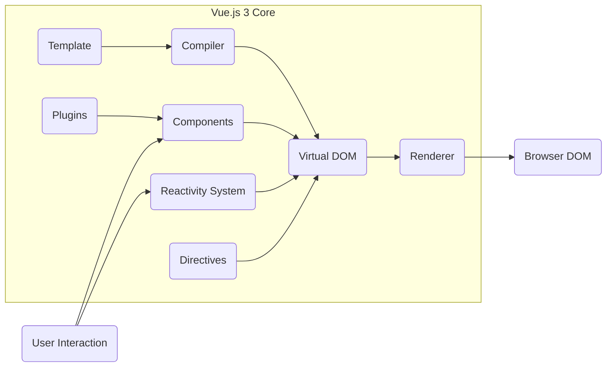
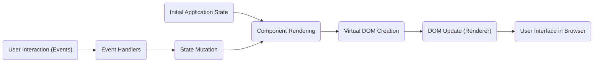

# Project Design Document: Vue.js 3 (vue-next)

**Version:** 1.1
**Date:** October 26, 2023
**Prepared By:** AI Software Architect

## 1. Introduction

This document provides a detailed design overview of the Vue.js 3 framework, codenamed "vue-next," based on the project repository at [https://github.com/vuejs/vue-next](https://github.com/vuejs/vue-next). The primary purpose of this document is to establish a clear understanding of the system's architecture, key components, and data flow to facilitate effective threat modeling.

## 2. Project Overview

Vue.js is a progressive JavaScript framework designed for building user interfaces. Version 3 is a significant evolution of the framework, engineered for enhanced performance, robust TypeScript integration, and improved maintainability. It preserves the core principles of Vue.js while introducing architectural refinements and new capabilities.

## 3. Goals

*   To provide a highly performant and resource-efficient JavaScript framework for crafting interactive user interfaces.
*   To offer a framework that is both adaptable and easy to learn, suitable for projects ranging from simple enhancements to complex applications.
*   To improve the developer experience through first-class TypeScript support and well-defined, intuitive APIs.
*   To maintain a degree of backward compatibility where technically feasible, while implementing necessary breaking changes to achieve significant architectural improvements.
*   To cultivate a thriving and supportive community around the framework.

## 4. Non-Goals

*   To fundamentally change the core reactive programming model that defines Vue.js.
*   To provide comprehensive backend framework functionalities or database management solutions.
*   To directly manage the complexities of server-side infrastructure or application deployment pipelines.

## 5. High-Level Architecture

The core of Vue.js 3 can be visualized as a set of interconnected modules working together to manage the user interface:

*   **Template:** The declarative, HTML-based syntax used by developers to define the structure and dynamic behavior of user interface components. This is the primary input for the rendering process.
*   **Compiler:** This module takes the Template as input and transforms it into highly optimized JavaScript render functions. This process involves parsing, static analysis for optimization, and code generation.
*   **Virtual DOM:** An in-memory representation of the actual DOM structure. Vue.js uses the Virtual DOM as an intermediary to efficiently update the user interface by calculating the minimal changes needed before applying them to the real DOM.
*   **Renderer:** Responsible for taking the Virtual DOM and applying the necessary updates to the actual browser DOM. This module handles platform-specific rendering logic, making Vue.js adaptable to different environments.
*   **Reactivity System:** The engine that powers Vue.js's automatic UI updates. It tracks dependencies between data and the components that use it, ensuring that the view is automatically updated when the data changes. This system relies on JavaScript proxies for efficient observation of data changes.
*   **Components:** Reusable and encapsulated building blocks of a Vue.js application. Each component manages its own logic, template, and styling, promoting modularity and maintainability.
*   **Directives:** Special HTML attributes that extend the functionality of templates, allowing developers to declaratively manipulate the DOM. Examples include `v-if` for conditional rendering and `v-for` for list rendering.
*   **Plugins:** Provide a mechanism to extend Vue.js with global-level features, such as adding global methods, components, or modifying the framework's behavior.
*   **Browser DOM:** The actual Document Object Model manipulated by the web browser to display the user interface to the user.
*   **User Interaction:** Represents events triggered by user actions within the browser (e.g., mouse clicks, keyboard input). These interactions can trigger updates to the application's state.

## 6. Key Components in Detail

*   **Compiler:**
    *   **Functionality:** Parses HTML templates into an Abstract Syntax Tree (AST), performs static analysis to optimize rendering, generates JavaScript render functions, and handles directives and expressions.
    *   **Security Relevance:**  A potential entry point for XSS if the compiler doesn't properly sanitize or escape user-provided data embedded within templates. Malicious code could be injected during the compilation phase. Error reporting mechanisms should also be robust to prevent information leakage.

*   **Reactivity System:**
    *   **Functionality:** Uses JavaScript Proxies to observe changes in reactive data objects, tracks dependencies between data and components, implements change detection and batch updates, and provides APIs for managing reactive state (`ref`, `reactive`).
    *   **Security Relevance:**  While primarily a performance feature, vulnerabilities in the reactivity system could potentially lead to unexpected state changes or allow manipulation of application logic if not carefully implemented. Prototype pollution could also be a concern if untrusted input can influence reactive object creation.

*   **Virtual DOM:**
    *   **Functionality:** Represents the UI as a tree of JavaScript objects (VNodes), implements a diffing algorithm to compare previous and current states, and identifies minimal changes for DOM updates.
    *   **Security Relevance:**  The diffing algorithm needs to be robust to prevent unexpected DOM manipulations or potential injection points if malicious data influences the Virtual DOM structure.

*   **Renderer:**
    *   **Functionality:** Takes the output of the Virtual DOM diffing process and applies the necessary changes to the browser DOM, handles platform-specific rendering, and manages component lifecycle hooks.
    *   **Security Relevance:**  This component directly interacts with the browser DOM. Improper handling of updates could lead to XSS vulnerabilities if data is not properly sanitized before being rendered.

*   **Component System:**
    *   **Functionality:** Enables the creation of reusable UI components with encapsulated templates, logic, and styles, provides mechanisms for component communication (props, events, provide/inject), and manages component lifecycle hooks.
    *   **Security Relevance:**  Component communication channels (especially props) need careful handling to prevent injection of malicious data or unintended behavior between components. Improperly secured lifecycle hooks could also be exploited.

## 7. Data Flow

Understanding how data flows through a Vue.js 3 application is crucial for identifying potential vulnerabilities:

*   **Initial Application State:** The application begins with an initial data state, often defined within components or a centralized state management solution.
*   **Component Rendering:** When a component needs to be displayed or updated, its render function is executed. This function uses the current state to generate a description of the desired UI.
*   **Virtual DOM Creation:** The render function produces a Virtual DOM representation of the component's UI, reflecting the current state.
*   **DOM Update (Renderer):** The Renderer compares the new Virtual DOM with the previous one and efficiently updates the actual Browser DOM to reflect the changes.
*   **User Interface in Browser:** The user interacts with the rendered UI in the browser.
*   **User Interaction (Events):** User actions trigger DOM events.
*   **Event Handlers:** Components define event handlers to respond to specific user interactions.
*   **State Mutation:** Event handlers often update the application's reactive state based on user input or other events.
*   **Re-render Cycle:** When the reactive state changes, the affected components are re-rendered, and the cycle repeats from the "Component Rendering" step.

## 8. Security Considerations

This section outlines key security considerations relevant to Vue.js 3, providing a starting point for threat modeling activities.

*   **Cross-Site Scripting (XSS):**
    *   **Threat:** Malicious scripts injected into the application's output, potentially allowing attackers to steal user data, hijack sessions, or deface the website.
    *   **Attack Vectors:**  Improperly sanitized user input within templates, use of `v-html` with untrusted content, vulnerabilities in third-party components.
    *   **Mitigation Strategies:**  Utilize Vue.js's built-in protections against XSS (e.g., automatic escaping), avoid using `v-html` with user-provided content, carefully vet and sanitize any external data sources.

*   **Cross-Site Request Forgery (CSRF):**
    *   **Threat:** Unauthorized actions performed on behalf of an authenticated user.
    *   **Attack Vectors:**  Exploiting the browser's automatic inclusion of cookies in requests.
    *   **Mitigation Strategies:** Implement CSRF tokens for state-changing requests to backend APIs, utilize `SameSite` cookie attribute.

*   **Injection Attacks (e.g., HTML Injection, JavaScript Injection):**
    *   **Threat:** Injecting malicious code or markup into the application.
    *   **Attack Vectors:**  Improperly handling user input when constructing dynamic content or interacting with external systems.
    *   **Mitigation Strategies:**  Sanitize and validate all user input, use parameterized queries when interacting with databases, avoid constructing HTML strings from user input.

*   **Denial of Service (DoS):**
    *   **Threat:** Making the application unavailable to legitimate users.
    *   **Attack Vectors:**  Exploiting resource-intensive operations, such as excessive rendering or manipulation of large datasets.
    *   **Mitigation Strategies:**  Implement performance optimizations, limit the size of data being processed, use techniques like pagination and virtualization for large lists.

*   **Third-Party Dependency Vulnerabilities:**
    *   **Threat:** Security flaws in external libraries used by the application.
    *   **Attack Vectors:**  Exploiting known vulnerabilities in outdated or compromised dependencies.
    *   **Mitigation Strategies:**  Regularly update dependencies, use security scanning tools to identify vulnerabilities, carefully evaluate the security posture of third-party libraries before including them.

*   **Server-Side Rendering (SSR) Security:**
    *   **Threat:** Vulnerabilities specific to server-side execution of JavaScript, such as code injection or information disclosure.
    *   **Attack Vectors:**  Improper handling of user input during SSR, exposure of sensitive server-side data.
    *   **Mitigation Strategies:**  Sanitize user input on the server-side, follow secure coding practices for Node.js applications, protect server-side secrets.

*   **Prototype Pollution:**
    *   **Threat:**  Manipulating the prototypes of built-in JavaScript objects, potentially leading to unexpected behavior or security vulnerabilities.
    *   **Attack Vectors:**  Exploiting weaknesses in how user input is processed or how objects are created.
    *   **Mitigation Strategies:**  Avoid directly manipulating prototypes, use defensive programming techniques to prevent unintended modifications.

## 9. Deployment Model

Vue.js 3 applications are typically deployed as static assets, which can be served in various ways:

*   **Client-Side Rendering (CSR):** The browser handles the rendering of the application based on the JavaScript code. This is the most common deployment approach.
*   **Server-Side Rendering (SSR):** The application is rendered on the server, and the initial HTML is sent to the client. This can improve SEO and perceived performance. Requires a Node.js server environment.
*   **Static Site Generation (SSG):** The application is pre-rendered at build time, generating static HTML files. Suitable for content-heavy websites where data changes infrequently.

## 10. Technologies Used

*   **JavaScript (ECMAScript):** The core programming language for Vue.js development.
*   **HTML:** Used to define the structure and semantics of the user interface.
*   **CSS:** Used for styling and visual presentation.
*   **TypeScript:** A superset of JavaScript that adds static typing, enhancing code maintainability and developer experience.
*   **Node.js and npm/yarn/pnpm:** Used for development tooling, package management, and potentially for SSR environments.
*   **Webpack/Vite:** Module bundlers used to package and optimize the application's assets for deployment.
*   **Web Browsers (Chrome, Firefox, Safari, Edge, etc.):** The target runtime environment for Vue.js applications.

This document provides a comprehensive design overview of Vue.js 3, focusing on aspects relevant to security considerations. This information will serve as a valuable resource for conducting thorough threat modeling and implementing appropriate security measures.