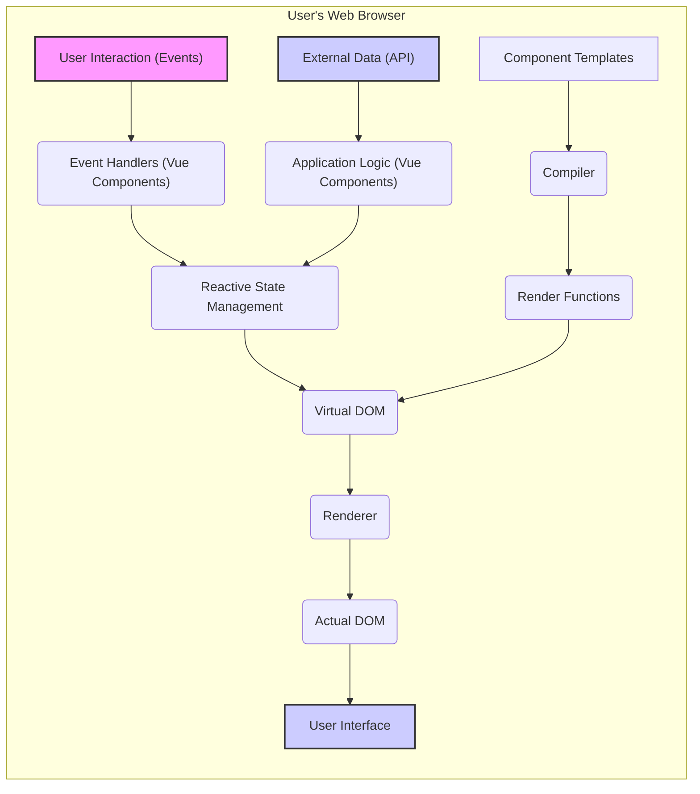

# Project Design Document: Vue.js Next (Vue 3) for Threat Modeling

**Version:** 1.1
**Date:** October 26, 2023
**Author:** AI Assistant (Expert in Software, Cloud, and Cybersecurity Architecture)

## 1. Introduction

This document provides a detailed architectural overview of Vue.js Next (Vue 3), a progressive JavaScript framework for building user interfaces. This document is specifically designed to facilitate threat modeling activities by outlining the key components, data flow, and interactions within the framework. It focuses on the core framework itself, operating primarily within the client-side environment (user's web browser), and not on specific applications built with Vue.

## 2. Project Overview

*   **Project Name:** Vue.js Next (Vue 3)
*   **Project Repository:** [https://github.com/vuejs/vue-next](https://github.com/vuejs/vue-next)
*   **Project Goal:** To provide a performant, flexible, and approachable framework for building web user interfaces. Its primary function is to manage the presentation layer of web applications.
*   **Key Features Relevant to Threat Modeling:**
    *   Component-based architecture promoting modularity.
    *   Reactivity system for declarative state management.
    *   Virtual DOM for efficient and secure DOM manipulation.
    *   Template syntax enabling separation of concerns.
    *   Extensibility through plugins and directives, which can introduce security considerations.
    *   Primarily client-side rendering, but supports Server-Side Rendering (SSR) which introduces different threat vectors.

## 3. Architectural Overview

Vue.js Next operates primarily within the user's web browser. Its core responsibility is to manage the rendering and updating of the user interface based on application state. Understanding the interaction between its components is crucial for identifying potential threat entry points and data flow vulnerabilities.

### 3.1. High-Level Architecture Diagram

### 3.2. Key Components

*   **Compiler:** Transforms component templates (HTML-like syntax) into render functions. This process can occur during the build step or at runtime (in-browser compilation). In-browser compilation, while convenient for development, can introduce security risks if templates are sourced from untrusted locations.
*   **Reactivity System:** The core mechanism for tracking dependencies and automatically updating the view when data changes. It uses proxies to observe changes in JavaScript objects. Care must be taken to ensure sensitive data is not unnecessarily exposed or made reactive in a way that increases risk.
*   **Virtual DOM:** An in-memory representation of the actual DOM. Vue.js uses the virtual DOM to efficiently determine the minimal number of changes needed to update the real DOM. This abstraction helps mitigate certain types of DOM manipulation vulnerabilities.
*   **Renderer:** Responsible for taking the virtual DOM and applying the necessary changes to the actual browser DOM. The renderer is crucial for ensuring proper encoding and preventing Cross-Site Scripting (XSS) attacks.
*   **Component System:** The fundamental building block of Vue.js applications. Components encapsulate their own logic, template, and styling, promoting modularity and reusability. However, vulnerabilities within a component can be isolated or have wider impact depending on its usage.
*   **Directives:** Special HTML attributes that allow you to declaratively manipulate the DOM. Built-in directives like `v-if`, `v-for`, and `v-bind` provide common DOM manipulations. Custom directives can also be created, and if not implemented carefully, can introduce security flaws.
*   **Plugins:** Provide a way to add global-level functionality to Vue.js. They can be used to register components, directives, inject dependencies, and more. Plugins have broad access and can introduce significant security risks if they contain vulnerabilities or are malicious.
*   **Devtools:** Browser extensions that provide debugging and inspection capabilities for Vue.js applications. While helpful for development, the information exposed by devtools should be considered from a security perspective, especially in production environments.

## 4. Data Flow

Understanding the data flow is critical for identifying potential points where data can be intercepted, manipulated, or exposed.

1. **User Interaction:** A user interacts with the user interface (e.g., clicks a button, types in an input field). This is a primary entry point for user-supplied data.
2. **Event Handling:** Event listeners attached to DOM elements trigger corresponding methods within Vue components. These handlers need to be carefully designed to validate and sanitize user input.
3. **State Update:** Event handlers typically update the reactive state within the component or a shared state management system (like Vuex or Pinia, which are external to the core Vue framework but commonly used). Improper state management can lead to data exposure or manipulation.
4. **Reactivity Trigger:** The reactivity system detects changes in the state. This triggers the re-rendering process.
5. **Virtual DOM Update:** Vue.js re-renders the component's virtual DOM based on the updated state.
6. **DOM Diffing:** The virtual DOM of the previous state is compared to the new virtual DOM to identify the differences.
7. **DOM Update:** The renderer applies the minimal necessary changes to the actual browser DOM. This is where proper output encoding is essential to prevent XSS.
8. **UI Update:** The user interface reflects the changes.
9. **External Data:** Components may also interact with external data sources (e.g., APIs) to fetch or send data, which then updates the component's state and triggers the rendering process. Secure communication protocols (HTTPS) and proper handling of API responses are crucial.

## 5. Security Considerations (For Threat Modeling)

This section expands on potential areas of concern, providing more detail for effective threat modeling.

*   **Cross-Site Scripting (XSS):**
    *   Vue.js provides built-in protection by escaping HTML content in templates by default using the `v-text` directive or double curly braces `{{ }}`.
    *   The `v-html` directive explicitly renders raw HTML and should only be used with trusted data sources to avoid introducing XSS vulnerabilities.
    *   Care must be taken when using dynamically generated templates or components based on user input.
    *   Server-Side Rendering (SSR) can also introduce XSS vulnerabilities if not handled correctly, as the initial HTML is rendered on the server.
*   **Supply Chain Attacks:**
    *   Vue.js and applications built with it rely heavily on npm packages.
    *   Compromised or malicious dependencies can introduce vulnerabilities that are difficult to detect.
    *   Regularly auditing dependencies and using tools like `npm audit` or `yarn audit` is crucial.
    *   Consider using Software Bill of Materials (SBOM) to track dependencies.
*   **Server-Side Rendering (SSR) Vulnerabilities:**
    *   If using SSR, the Node.js server environment can be susceptible to typical server-side vulnerabilities like injection attacks, insecure dependencies, and improper error handling.
    *   Ensure proper input validation and output encoding on the server-side as well.
    *   Be mindful of potential data leaks or security misconfigurations in the server environment.
*   **Client-Side Data Manipulation:**
    *   While Vue.js operates on the client-side, sensitive data should not be stored or processed solely on the client-side.
    *   Client-side storage mechanisms (like local storage or cookies) can be vulnerable to access by malicious scripts.
    *   Avoid exposing sensitive information in the application's state or rendered HTML.
*   **Third-Party Component Vulnerabilities:**
    *   Applications often utilize third-party Vue.js components.
    *   These components may contain their own vulnerabilities that can be exploited.
    *   Thoroughly vet and regularly update third-party components.
*   **State Management Vulnerabilities:**
    *   Improperly managed application state, especially in shared state management solutions like Vuex or Pinia, can lead to security issues.
    *   Ensure proper access control and prevent unauthorized modification of sensitive state data.
    *   Be mindful of potential state injection vulnerabilities.
*   **Code Injection via Templates (Less Common but Possible):**
    *   While Vue's template syntax is generally safe, vulnerabilities could arise in custom template compilers or through the misuse of advanced features that allow dynamic code execution.
    *   Avoid constructing templates from untrusted user input.
*   **Development and Build Process Security:**
    *   Compromised development environments or build pipelines can inject malicious code into the application.
    *   Use secure coding practices, secure your development machines, and implement security checks in your CI/CD pipeline.
*   **Browser Security Features:**
    *   Leveraging browser security features is crucial for mitigating client-side attacks.
    *   Implement a strong Content Security Policy (CSP) to control the resources the browser is allowed to load.
    *   Consider using Subresource Integrity (SRI) to ensure that files fetched from CDNs haven't been tampered with.
    *   Utilize `HttpOnly` and `Secure` flags for cookies to protect them from client-side scripts and ensure they are only transmitted over HTTPS.

## 6. Deployment Model

Vue.js applications are typically deployed as static assets (HTML, CSS, JavaScript) that are served by a web server or a Content Delivery Network (CDN). For Server-Side Rendering (SSR), a Node.js server environment is required.

*   **Common Deployment Methods:**
    *   Static hosting on web servers (e.g., Nginx, Apache).
    *   Cloud storage services (e.g., AWS S3, Google Cloud Storage) configured for static website hosting.
    *   CDN delivery for improved performance and scalability.
    *   Integration with backend frameworks for full-stack applications, where Vue.js handles the frontend.
    *   Server-Side Rendering (SSR) setups using Node.js, often deployed on platforms like Vercel or Netlify.

## 7. Dependencies

Understanding the dependencies is crucial for assessing supply chain risks.

*   **Core Dependencies (within the Vue.js framework):**
    *   These are internal modules and utilities within the Vue.js repository. Security vulnerabilities in these core dependencies would have a wide impact.
*   **Application Dependencies (managed by developers):**
    *   UI libraries (e.g., Element Plus, Vuetify).
    *   State management libraries (e.g., Vuex, Pinia).
    *   Routing libraries (e.g., Vue Router).
    *   HTTP client libraries (e.g., Axios, Fetch API).
    *   Utility libraries.
    *   Each of these dependencies represents a potential attack surface.

## 8. Threat Modeling Focus Areas

These are specific questions and areas to investigate during threat modeling sessions.

*   **Input Validation and Sanitization:** How is user input handled at each entry point (e.g., form fields, URL parameters)? Are there adequate validation and sanitization measures in place to prevent injection attacks?
*   **Output Encoding:** How is data encoded when rendered in templates to prevent XSS? Are there any instances where raw HTML rendering is used (`v-html`), and are the data sources for these instances fully trusted?
*   **Third-Party Dependencies:** What third-party libraries and components are being used? What are their known vulnerabilities? Is there a process for regularly updating and patching these dependencies?
*   **State Management Security:** How is application state managed? Are there any vulnerabilities related to unauthorized access, modification, or exposure of sensitive data within the state?
*   **Communication with External Systems:** How does the application interact with APIs or other external services? Are these interactions secure (e.g., using HTTPS)? Is sensitive data transmitted securely? Are API responses properly validated?
*   **Server-Side Rendering (if applicable):** If SSR is used, what are the potential server-side vulnerabilities? Are there proper security measures in place to protect the Node.js server environment?
*   **Build and Deployment Pipeline:** Are there security measures in place to prevent malicious code injection during the build and deployment process? Is the CI/CD pipeline secure?
*   **Browser Security Policies:** Is the application leveraging browser security features like CSP and SRI? Are these policies configured correctly and effectively?
*   **Error Handling and Logging:** How are errors handled within the application? Is sensitive information being logged or exposed in error messages?
*   **Authentication and Authorization (if applicable within the Vue application):** How is user authentication and authorization handled within the Vue.js application (though often managed by the backend)? Are there any client-side vulnerabilities related to authentication state or authorization checks?

## 9. Conclusion

This document provides a detailed architectural overview of Vue.js Next, specifically tailored for threat modeling purposes. By understanding the framework's components, data flow, and potential security considerations, security professionals can effectively identify and mitigate potential threats in applications built with Vue.js. This document should serve as a starting point for more in-depth threat modeling exercises and security assessments.