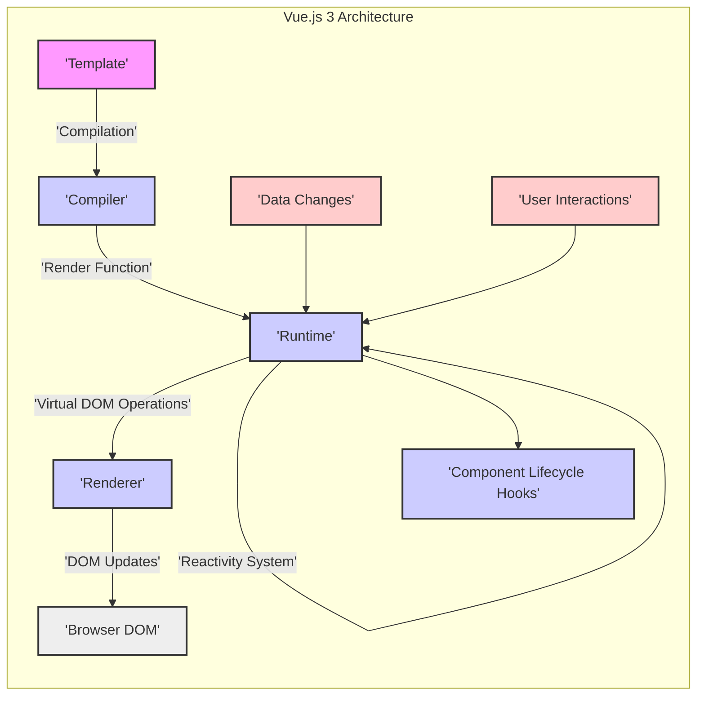
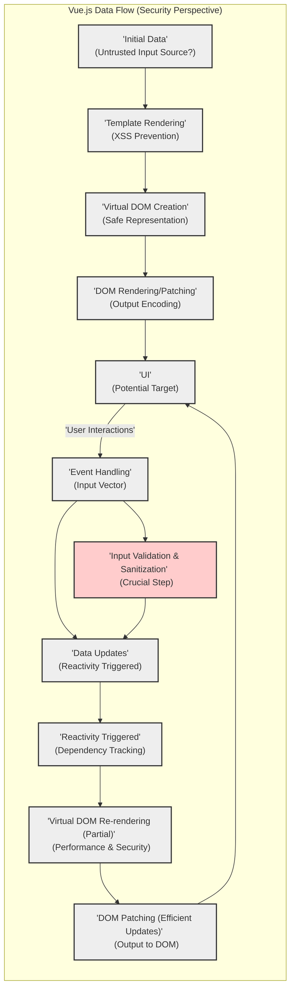

# Project Design Document: Vue.js 3 (vue-next) for Threat Modeling - Improved

## 1. Project Overview

*   **Project Name:** Vue.js 3 (vue-next)
*   **Project Repository:** [https://github.com/vuejs/vue-next](https://github.com/vuejs/vue-next)
*   **Project Description:** Vue.js 3, known as "vue-next" during its development phase, represents a significant evolution of the Vue.js progressive JavaScript framework. This major version update prioritizes enhanced performance, robust TypeScript integration, refined APIs, and improved scalability for building complex user interfaces. Vue.js is fundamentally a client-side framework, designed for creating single-page applications (SPAs) and enriching traditional web pages with interactive components.
*   **Primary Goal:** To deliver a highly performant, exceptionally flexible, and developer-centric framework that empowers the creation of cutting-edge web applications.
*   **Target Audience:** Web developers, front-end engineers, UI/UX developers, and development teams involved in building web applications of all sizes.
*   **Security Focus for this Document:** This design document provides a detailed architectural blueprint of Vue.js 3, specifically tailored for security threat modeling. It highlights core components, elucidates data flow pathways, and pinpoints potential security vulnerabilities inherent within the framework's architecture.  It is crucial to understand that this document focuses on the security architecture *of the framework itself*. It does not delve into security best practices for developers *using* Vue.js to build applications.  Application-level security is a separate concern that builds upon the framework's security foundations.

## 2. Architecture Overview

Vue.js 3 adopts a component-based architecture, with reactivity as its central tenet. The framework is modular and can be conceptually divided into these key modules, which work in concert:

*   **Compiler:**  The compiler's role is to transform Vue templates, which are HTML-like syntax enriched with Vue-specific directives and expressions, into highly optimized JavaScript render functions. This compilation step is crucial for performance.
*   **Runtime:** The runtime environment is responsible for executing the render functions generated by the compiler. It manages the virtual DOM (Document Object Model), orchestrates the reactivity system, handles component lifecycle hooks, and ultimately interacts with the browser's DOM to reflect UI updates.
*   **Reactivity System:** This is the engine of Vue.js, providing fine-grained dependency tracking. It intelligently monitors data changes and efficiently updates only the necessary parts of the DOM when data is modified, ensuring optimal performance and responsiveness.
*   **Server-Side Rendering (SSR):** SSR enables Vue components to be pre-rendered on the server. This pre-rendered HTML is then sent to the client, improving initial page load times and enhancing SEO (Search Engine Optimization) by making content readily indexable by search engines.
*   **Component System:** Vue.js's component system is fundamental to its reusability and modularity. Components are self-contained, reusable units of UI. They encapsulate their own logic, templates, and styles, facilitating the construction of complex UIs from smaller, manageable pieces.
*   **Template Syntax:** Vue.js employs a declarative template syntax, which is an extension of HTML. This syntax allows developers to define the structure and behavior of the UI in a clear and concise manner, using directives and expressions to bind data and handle events.

The following diagram illustrates the high-level architecture of Vue.js 3, depicting the key components and their interactions in a simplified manner:

## 3. Component Breakdown and Security Considerations

This section provides a detailed breakdown of each major component within Vue.js 3, specifically focusing on security considerations relevant for threat modeling.

### 3.1. Compiler

*   **Functionality:** The Vue.js compiler is responsible for transforming Vue templates into efficient JavaScript render functions. This process involves parsing the template syntax, optimizing for performance, and generating code that the runtime can execute.
*   **Inputs:**
    *   **Vue Templates:** These are HTML-like structures that define the UI, including directives (e.g., `v-if`, `v-for`, `v-bind`), expressions (JavaScript code within templates), and data bindings. Templates can be provided in various forms: within HTML files, as part of single-file components (`.vue` files), or as string templates in JavaScript.
    *   **Compiler Options:**  Configuration settings that influence the compilation process. These options can include optimization flags to fine-tune performance, error handling strategies, and other compiler-specific settings.
*   **Outputs:**
    *   **JavaScript Render Functions:**  Executable JavaScript code that, when invoked by the runtime, describes how to construct the virtual DOM representation of the UI. These functions are highly optimized for efficient virtual DOM operations.
    *   **Static Render Functions:**  For parts of the template that are identified as unchanging (static), the compiler can generate optimized static render functions. These functions bypass the virtual DOM diffing process for static content, further enhancing performance.
*   **Security Considerations:**
    *   **Template Injection Vulnerabilities:**  A critical security concern is template injection. If Vue templates are dynamically constructed from untrusted user input *before* being processed by the compiler, it could create a template injection vulnerability.  An attacker might be able to inject malicious template syntax that, when compiled and rendered, could execute arbitrary JavaScript or manipulate the application in unintended ways.  *However, Vue.js is designed with built-in XSS prevention mechanisms. The template compilation process inherently escapes HTML entities and prevents the direct execution of arbitrary JavaScript within templates through data bindings and directives. This significantly mitigates the risk of XSS via template injection in typical Vue.js usage.*
    *   **Compiler Bugs:**  Like any complex software component, the compiler is susceptible to bugs.  Vulnerabilities within the compiler itself could potentially lead to the generation of incorrect or insecure render functions.  This could manifest as unexpected behavior or create pathways for exploitation. The Vue.js core team prioritizes rigorous testing and maintenance of the compiler to minimize this risk.
    *   **Source Code Exposure (Primarily a Development/Debugging Concern):** While less of a direct framework security vulnerability in production, verbose error messages or debugging outputs from the compiler during development or in misconfigured production environments could inadvertently expose sensitive source code or internal application details. This information leakage could be valuable to attackers during reconnaissance.

### 3.2. Runtime

*   **Functionality:** The Vue.js runtime is the execution engine for Vue applications. It takes the render functions produced by the compiler and orchestrates the process of rendering and updating the UI. Key responsibilities include managing the virtual DOM, implementing the reactivity system, handling component lifecycle hooks (e.g., `mounted`, `updated`, `destroyed`), and interacting with the browser's DOM through the renderer to reflect changes on the screen.
*   **Inputs:**
    *   **Render Functions:**  The JavaScript functions generated by the compiler, which define the UI structure.
    *   **Component Data:**  The dynamic data associated with Vue components, including component state (`data`), props (input data passed to components), and computed properties (derived data).
    *   **User Interactions:** Events originating from user actions in the browser, such as clicks, keyboard input, mouse movements, and form submissions.
    *   **Lifecycle Hooks:**  Events triggered at various stages of a component's lifecycle, allowing developers to execute code at specific points (e.g., when a component is created, mounted, updated, or destroyed).
*   **Outputs:**
    *   **Virtual DOM Updates:**  The runtime manages changes to the virtual DOM representation of the UI based on data changes and user interactions.
    *   **DOM Manipulations:**  Through the Renderer module, the runtime instructs the browser to update the actual DOM to reflect the changes in the virtual DOM. This is done efficiently using virtual DOM diffing algorithms to minimize DOM operations.
    *   **Component Lifecycle Events:**  The runtime triggers lifecycle hook functions defined in components, allowing components to react to lifecycle events.
*   **Security Considerations:**
    *   **Cross-Site Scripting (XSS) Prevention (Runtime's Role):** The runtime, working in conjunction with the compiler, is a critical component in Vue.js's XSS prevention strategy. By executing render functions and manipulating the virtual DOM, Vue.js ensures that data is properly escaped when it is rendered into the DOM. This escaping process prevents the injection of malicious scripts through data bindings. *However, developers must be aware of directives like `v-html`, which explicitly render raw HTML and bypass Vue's automatic escaping. Using `v-html` with untrusted user input is a significant XSS risk and should be avoided or handled with extreme caution, requiring rigorous sanitization of the HTML content.*
    *   **Reactivity System Vulnerabilities (Indirect):** While the reactivity system itself is not typically a direct source of security vulnerabilities, bugs or inefficiencies in its implementation could have security implications. For example, a vulnerability causing excessive or uncontrolled re-renders could lead to denial-of-service (DoS) conditions by consuming excessive client-side resources.
    *   **Event Handling Security:** Vue.js event handlers, typically methods defined within components, are generally secure. They are bound to the component's scope and execute within a controlled environment. *However, developers must exercise caution in the code they write within event handlers. If event handlers process user-provided data, proper input validation and sanitization are still essential to prevent vulnerabilities like injection attacks or logic flaws within the application's event handling logic.*
    *   **Server-Side Rendering (SSR) Specific Security Considerations:** When using SSR, the Vue.js runtime executes on the server. This introduces server-side security considerations that are not present in client-side rendering alone.  *For instance, if the SSR process interacts with external resources (APIs, databases, etc.) based on user input without proper validation and authorization, it could be vulnerable to Server-Side Request Forgery (SSRF) attacks.  Furthermore, sensitive data rendered on the server might be inadvertently exposed in server logs if logging practices are not carefully reviewed and secured.*

### 3.3. Reactivity System

*   **Functionality:** The reactivity system is the core mechanism that enables Vue.js's declarative and efficient UI updates. It automatically tracks dependencies between data and the UI. When reactive data changes, the system efficiently identifies and updates only the components and DOM elements that are affected by those changes, minimizing unnecessary re-renders and maximizing performance.
*   **Components:**
    *   **Observables (Reactive Data):**  Objects or data properties that are made reactive. Vue.js uses proxies to observe changes to these objects. When a reactive property is accessed or modified, the reactivity system is notified.
    *   **Dependencies (Dependency Tracking):** The reactivity system maintains a graph of dependencies. It tracks which components, computed properties, and watchers depend on specific reactive data. This dependency tracking is crucial for efficient updates.
    *   **Watchers (Observers):** Mechanisms to observe changes in reactive data. Watchers are used internally by Vue.js to trigger component re-renders when their dependencies change. Developers can also use watchers to execute custom code when reactive data changes.
*   **Inputs:**
    *   **Data Mutations:** Changes to reactive data within Vue components, including modifications to component state (`data`), props, or computed properties. These mutations are detected by the reactivity system's proxy mechanism.
*   **Outputs:**
    *   **Dependency Notifications:** When reactive data changes, the reactivity system notifies all watchers and dependent components that are tracking that data.
    *   **Component Re-renders (Triggered):**  Notifications from the reactivity system trigger the re-rendering process for components that depend on the changed data. This re-rendering is typically partial and efficient, updating only the necessary parts of the virtual DOM and subsequently the actual DOM.
*   **Security Considerations:**
    *   **Denial of Service (DoS) through Reactivity Loops or Excessive Computations:**  While Vue.js's reactivity system is designed to prevent infinite loops in most common scenarios, poorly designed reactivity logic or excessively complex computed properties could *potentially* lead to performance issues or even DoS. For example, a circular dependency in computed properties or a watcher that triggers expensive computations on every data change could degrade performance or exhaust client-side resources. Developers should carefully design reactivity logic to avoid performance bottlenecks and potential DoS scenarios.
    *   **Information Disclosure (Highly Unlikely, but Theoretically Possible in Buggy Scenarios):** In extremely rare and buggy scenarios within the reactivity system's dependency tracking or update mechanisms, it is *theoretically* possible that incorrect dependency management could lead to unintended data exposure between components. However, this is highly improbable in practice due to the robust design, extensive testing, and maturity of Vue.js's reactivity system.  Such issues would likely be considered critical bugs and addressed promptly by the Vue.js team.

### 3.4. Server-Side Rendering (SSR)

*   **Functionality:** Server-Side Rendering (SSR) in Vue.js allows Vue components to be rendered into HTML strings on the server. This pre-rendered HTML is then sent to the client's browser. Upon arrival, the client-side Vue.js runtime "hydrates" this static HTML, making it interactive and attaching client-side event listeners and reactivity. SSR is primarily used to improve initial page load performance (perceived speed) and enhance SEO by making content readily crawlable by search engines.
*   **Components:**
    *   **Server Renderer:**  A module within Vue.js specifically designed for rendering Vue application instances into HTML strings on the server. It handles the component rendering process in a server environment.
    *   **Client-Side Hydration:**  The process that occurs in the browser when a server-rendered Vue application is loaded. The client-side Vue.js runtime takes the static HTML received from the server and "hydrates" it, attaching event listeners, establishing reactivity, and making the application fully interactive in the browser.
*   **Inputs:**
    *   **Vue Application Instance:** The root Vue application instance that needs to be rendered on the server.
    *   **Server Request Context:** Information about the incoming server request, such as the URL, headers, and potentially user session data. This context can be used to tailor the server-rendered output.
*   **Outputs:**
    *   **HTML String:** The primary output of SSR is an HTML string representing the fully rendered Vue application. This HTML is sent as the server response to the client's browser request.
*   **Security Considerations:**
    *   **Server-Side Request Forgery (SSRF) Vulnerabilities (Application Level Concern, Framework Context):** If the SSR process on the server makes external requests (e.g., to APIs, databases, or other services) based on user-controlled input from the client request *without proper validation and sanitization*, it could create a Server-Side Request Forgery (SSRF) vulnerability. An attacker might be able to manipulate these server-side requests to access internal resources, bypass security controls, or potentially execute arbitrary code on the server in vulnerable configurations. *While SSRF is primarily an application-level vulnerability arising from how SSR is implemented, the framework's SSR capabilities provide the context in which such vulnerabilities can occur. Developers using SSR must be acutely aware of SSRF risks and implement robust input validation and output sanitization in their SSR logic.*
    *   **Data Exposure in Server Logs (Logging Practices):** Sensitive data that is rendered on the server during SSR might inadvertently be logged in server logs if logging practices are not carefully considered and secured. This could lead to information disclosure if server logs are not properly protected or if they are accessible to unauthorized parties. Developers should review their server-side logging configurations and ensure that sensitive data is not logged unnecessarily or that logs are appropriately secured.
    *   **Injection Vulnerabilities in SSR Context (Context-Specific Escaping):** Similar to template injection, if user input is directly incorporated into the SSR rendering process without proper escaping *in the server-side context*, it could lead to injection vulnerabilities. While Vue.js SSR generally handles HTML escaping to prevent XSS, developers need to be mindful of context-specific escaping requirements. For example, if server-side code constructs SQL queries or shell commands based on user input during SSR, appropriate escaping and sanitization for those specific contexts are crucial to prevent SQL injection or command injection vulnerabilities.
    *   **Client-Side Hydration Mismatches (Potential for Unexpected Behavior):** While not a direct security vulnerability in itself, hydration mismatches (differences between the HTML rendered on the server and the HTML rendered on the client after hydration) can lead to unexpected behavior in the application. In some cases, these mismatches could *indirectly* create attack vectors if they cause client-side code to behave in unintended ways or if they expose inconsistencies that attackers could exploit.  While Vue.js strives to minimize hydration mismatches, developers should be aware of this potential issue and test SSR implementations thoroughly to ensure proper hydration and consistent behavior between server and client rendering.

## 4. Data Flow within Vue.js Applications (Security Perspective)

The typical data flow in a Vue.js application, viewed through a security lens, can be summarized as follows, highlighting potential security implications at each stage:

1.  **Initial Data (Potential Source of Untrusted Input):** Components are initialized with data. This data can originate from various sources, including hardcoded values, API responses, or *user input*. If initial data includes user input that is not properly validated and sanitized *at the point of entry*, it can introduce vulnerabilities from the outset.
2.  **Template Rendering (XSS Prevention):** The component's template is compiled into a render function. Vue.js's template compilation process plays a crucial role in *preventing XSS* by automatically escaping HTML entities in data bindings. However, developers must be aware of directives like `v-html` that bypass this escaping and require manual sanitization.
3.  **Virtual DOM Creation (Safe Representation):** The render function executes to create a virtual DOM representation. The virtual DOM is an abstraction that helps Vue.js efficiently update the actual DOM and contributes to *XSS prevention* by working with data in a safe, programmatic way before rendering to the DOM.
4.  **DOM Rendering/Patching (Output Encoding):** The virtual DOM is used to render the initial UI or patch the existing DOM. Vue.js's DOM patching process ensures that data is *output-encoded* correctly when rendered to the DOM, further mitigating XSS risks.
5.  **UI (User Interface - Potential Target):** The rendered UI is presented to the user. This is the *target* of many client-side attacks, including XSS. Vue.js's built-in XSS prevention mechanisms aim to protect the UI from malicious scripts.
6.  **User Interactions (Event Handling - Input Vector):** User interactions trigger events. These interactions are a primary *input vector* for user-provided data. Event handlers must be designed to handle user input securely.
7.  **Event Handling (Input Validation & Sanitization Needed):** Event handlers (methods) are executed. This is where developers must implement *input validation and sanitization* if handling user-provided data from events. Failure to do so can lead to various vulnerabilities, including injection attacks.
8.  **Data Updates (Reactivity Triggered - Propagation of Changes):** Event handlers often update component data. Data updates trigger the reactivity system, propagating changes throughout the application. If data updates include unsanitized user input, vulnerabilities can be propagated through the application's reactive data flow.
9.  **Reactivity Triggered (Dependency Tracking - Efficient Updates):** Data updates trigger the reactivity system, which efficiently tracks dependencies and identifies components that need to be updated. While reactivity itself is not a direct security vulnerability, inefficient reactivity logic could lead to DoS.
10. **Virtual DOM Re-rendering (Partial Updates - Performance & Security):** Only affected components are re-rendered, creating a new virtual DOM representation. Efficient partial re-rendering improves performance and can indirectly contribute to security by reducing the attack surface and minimizing unnecessary DOM manipulations.
11. **DOM Patching (Efficient Updates - Output to DOM):** The virtual DOM diffing algorithm efficiently patches the actual DOM. This process ensures that only necessary DOM updates are performed, improving performance and contributing to a more secure and efficient application.
12. **UI Update (Reflected Changes - User Perception):** The UI is updated to reflect data changes. Users perceive these updates. Secure data handling throughout this flow is crucial to maintain the integrity and security of the UI and the application as a whole.

This data flow diagram, annotated with security considerations, provides a more detailed view of how data moves through a Vue.js application and highlights critical points where security measures are essential.

## 5. Security Considerations Summary for Threat Modeling

This section summarizes the key security considerations derived from the architectural analysis, providing a focused list for threat modeling Vue.js 3 applications and the framework itself.

*   **Cross-Site Scripting (XSS) Vulnerabilities:**
    *   **Default XSS Prevention:** Vue.js provides robust default XSS prevention through template compilation and automatic HTML escaping in data bindings.
    *   **`v-html` Directive Risk:**  The `v-html` directive bypasses automatic escaping and renders raw HTML. Its use with untrusted user input is a major XSS risk.  Always sanitize HTML content before using `v-html`.
    *   **Manual DOM Manipulation:** Directly manipulating the DOM outside of Vue's rendering mechanisms can bypass XSS protection if not done carefully.
    *   **Compiler/Runtime Bugs (Low Probability):** While unlikely, potential bugs in the compiler or runtime could theoretically bypass XSS prevention. Regular updates and security monitoring are important.

*   **Server-Side Rendering (SSR) Vulnerabilities (If SSR is Used):**
    *   **Server-Side Request Forgery (SSRF):** SSR logic making external requests based on unsanitized user input is vulnerable to SSRF. Implement robust input validation and output sanitization in SSR code.
    *   **Data Exposure in Server Logs:** Sensitive data rendered during SSR might be logged. Review logging configurations and secure server logs.
    *   **Injection Vulnerabilities in SSR Context:**  Ensure context-specific escaping and sanitization when incorporating user input into server-side operations during SSR (e.g., SQL queries, shell commands).
    *   **Client-Side Hydration Mismatches (Indirect Security Impact):** Hydration mismatches can lead to unexpected behavior and potentially create indirect attack vectors. Thorough testing of SSR implementations is crucial.

*   **Denial of Service (DoS):**
    *   **Reactivity Loops/Inefficient Logic:**  Poorly designed reactivity logic or complex computed properties can lead to DoS through excessive client-side resource consumption. Design reactivity logic carefully.
    *   **Resource Exhaustion:**  Uncontrolled client-side rendering or DOM manipulation could exhaust resources. Optimize component rendering and updates.

*   **Dependency Vulnerabilities (Framework and Application Dependencies):**
    *   **Framework Dependencies:** Vue.js itself relies on dependencies. Vulnerabilities in these dependencies could affect Vue.js applications. The Vue.js team manages and updates dependencies.
    *   **Application Dependencies:** Applications built with Vue.js also have dependencies. Regularly update and audit application dependencies for security vulnerabilities.

*   **Input Validation and Sanitization (Application Developer Responsibility):**
    *   **Crucial for Application Security:** While Vue.js handles output escaping, *input validation and sanitization are the responsibility of application developers*. Implement robust input validation and sanitization for all user-provided data to prevent injection attacks and other vulnerabilities.

*   **Client-Side Security Best Practices (General Web Security):**
    *   **HTTPS:** Use HTTPS for secure communication.
    *   **Content Security Policy (CSP):** Implement CSP to mitigate XSS and other attacks.
    *   **Subresource Integrity (SRI):** Use SRI to ensure the integrity of external resources.
    *   **Regular Security Audits and Penetration Testing:** Conduct regular security assessments of Vue.js applications.

This improved design document provides a more detailed and security-focused architectural overview of Vue.js 3, suitable for in-depth threat modeling. It emphasizes both the framework's built-in security features and areas where developers need to be vigilant to build secure Vue.js applications. Further threat modeling should involve a deeper dive into specific attack vectors and mitigation strategies based on these considerations.