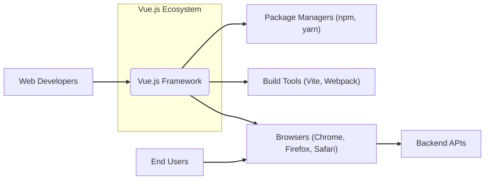
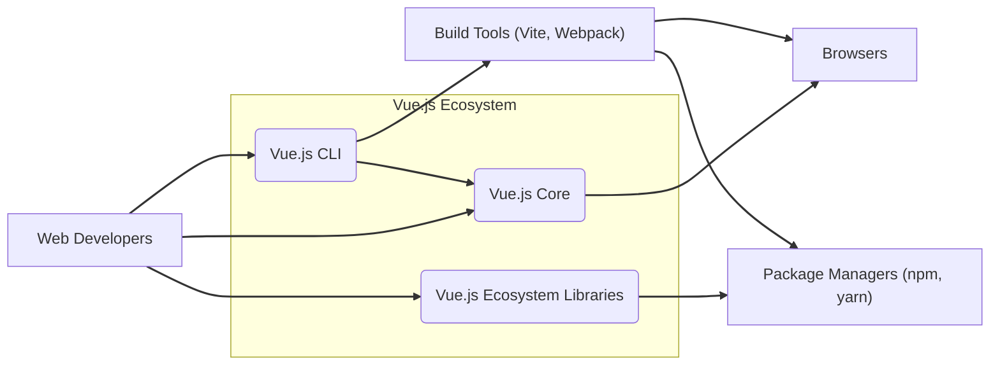
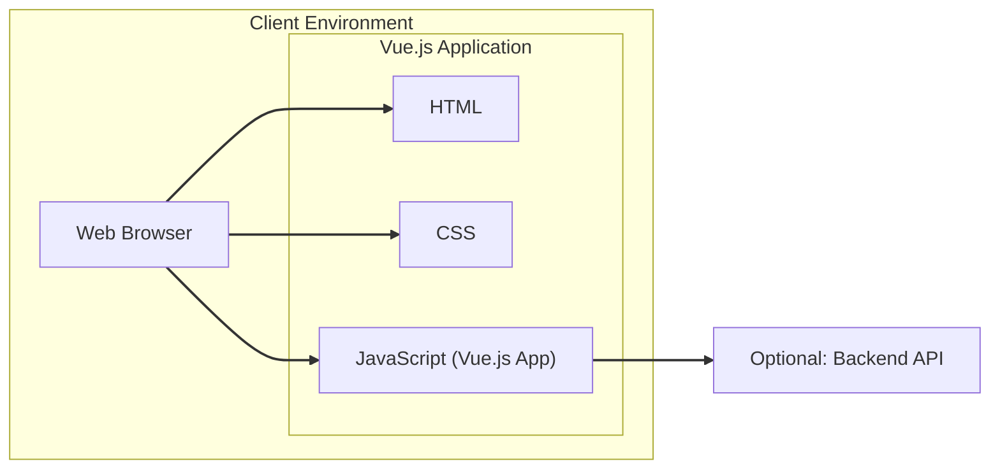

# BUSINESS POSTURE

This project is the development and maintenance of Vue.js, an open-source JavaScript framework for building user interfaces and single-page applications.

## Business Priorities and Goals

- Provide a performant, flexible, and approachable framework for web developers to build user interfaces.
- Maintain a strong and active open-source community around Vue.js.
- Ensure the framework is stable, reliable, and well-documented.
- Continuously improve the framework with new features and optimizations based on community feedback and web development trends.
- Facilitate the creation of secure web applications by providing secure defaults and guidance.
- Promote the adoption of Vue.js within the web development ecosystem.

## Business Risks

- Security vulnerabilities in the Vue.js framework could lead to widespread security issues in applications built with Vue.js, damaging the framework's reputation and user trust.
- Performance regressions or architectural flaws could negatively impact the user experience of applications built with Vue.js, leading to developer dissatisfaction and decreased adoption.
- Breaking changes without proper migration paths could disrupt existing Vue.js projects and frustrate developers.
- Lack of community engagement or insufficient maintenance could lead to stagnation and eventual decline of the framework.
- Competition from other JavaScript frameworks could reduce Vue.js market share and impact its long-term viability.
- Supply chain attacks targeting Vue.js dependencies or build process could compromise the framework and applications using it.

# SECURITY POSTURE

## Existing Security Controls

- security control: Code reviews are performed via GitHub Pull Requests before merging code changes. Implemented in: GitHub workflow.
- security control: Issue tracking and vulnerability reporting are managed through GitHub Issues. Implemented in: GitHub Issues.
- security control: Version control using Git and GitHub to track changes and manage codebase history. Implemented in: GitHub repository.
- security control: Community contributions and public scrutiny of the codebase. Implemented in: Open Source nature of the project.
- security control: Standard GitHub security features like branch protection and vulnerability scanning (Dependabot). Implemented in: GitHub repository settings.

## Accepted Risks

- accepted risk: As an open-source project, vulnerability disclosure is public, which could be exploited before patches are widely adopted.
- accepted risk: Reliance on community contributions for identifying and reporting security issues, which might have delays or gaps.
- accepted risk: Potential for vulnerabilities in third-party dependencies used by Vue.js.

## Recommended Security Controls

- security control: Implement automated Static Application Security Testing (SAST) tools in the CI/CD pipeline to detect potential vulnerabilities in code changes.
- security control: Implement automated Dependency Vulnerability Scanning to identify and alert on known vulnerabilities in third-party dependencies.
- security control: Establish a clear process for handling security vulnerability reports, including triage, patching, and disclosure.
- security control: Conduct periodic security audits and penetration testing of the Vue.js framework by external security experts.
- security control: Promote and enforce secure coding practices within the development team and community contributors through documentation and guidelines.
- security control: Implement a Content Security Policy (CSP) header in example applications and documentation to demonstrate and encourage secure application development.
- security control: Consider signing releases and artifacts to ensure integrity and prevent tampering.

## Security Requirements

- Authentication: Not directly applicable to the Vue.js framework itself. Authentication is a concern for applications built using Vue.js. Vue.js should not impose or hinder secure authentication practices in applications.
- Authorization: Not directly applicable to the Vue.js framework itself. Authorization is a concern for applications built using Vue.js. Vue.js should provide tools and guidance to implement secure authorization in applications.
- Input Validation: Vue.js must provide mechanisms and promote best practices for developers to perform input validation in applications built with Vue.js to prevent vulnerabilities like Cross-Site Scripting (XSS) and injection attacks. Template rendering should escape HTML by default to mitigate XSS.
- Cryptography: Vue.js itself should not implement custom cryptography. If cryptographic operations are needed within the framework (unlikely), it should rely on well-established and secure browser APIs or standard JavaScript libraries. Vue.js should not introduce cryptographic vulnerabilities.

# DESIGN

## C4 CONTEXT



### Context Diagram Elements

- Name: Vue.js Framework
  - Type: Software System
  - Description: The Vue.js JavaScript framework, providing components, reactivity, and tooling for building user interfaces.
  - Responsibilities:
    - Provide a component-based architecture for UI development.
    - Manage application state and reactivity.
    - Offer a developer-friendly API and development experience.
    - Ensure performance and efficiency in UI rendering.
  - Security controls:
    - Security control: Input escaping in template rendering to prevent XSS.
    - Security control: Secure coding practices in framework development.
    - Security control: Vulnerability scanning and patching.

- Name: Web Developers
  - Type: Person
  - Description: Developers who use Vue.js to build web applications.
  - Responsibilities:
    - Utilize Vue.js framework to develop user interfaces.
    - Implement application logic and features.
    - Deploy and maintain Vue.js applications.
    - Follow secure coding practices when using Vue.js.
  - Security controls:
    - Security control: Responsible for secure application development using Vue.js.
    - Security control: Implement input validation and sanitization in applications.
    - Security control: Securely configure and deploy Vue.js applications.

- Name: End Users
  - Type: Person
  - Description: Users who interact with web applications built using Vue.js through web browsers.
  - Responsibilities:
    - Use web applications built with Vue.js.
    - Expect secure and functional applications.
  - Security controls:
    - Security control: Rely on browser security features.
    - Security control: Expect applications to protect their data and privacy.

- Name: Package Managers (npm, yarn)
  - Type: Software System
  - Description: Package managers used to distribute and install Vue.js and its ecosystem libraries.
  - Responsibilities:
    - Host and distribute Vue.js packages.
    - Manage dependencies for Vue.js projects.
  - Security controls:
    - Security control: Package integrity checks (checksums).
    - Security control: Vulnerability scanning of packages.
    - Security control: Repository security measures.

- Name: Build Tools (Vite, Webpack)
  - Type: Software System
  - Description: Build tools used to bundle and optimize Vue.js applications for deployment.
  - Responsibilities:
    - Bundle Vue.js code and application code.
    - Optimize assets for performance.
    - Provide development server and build processes.
  - Security controls:
    - Security control: Dependency vulnerability scanning.
    - Security control: Secure configuration of build process.
    - Security control: Plugin security considerations.

- Name: Browsers (Chrome, Firefox, Safari)
  - Type: Software System
  - Description: Web browsers that execute Vue.js applications.
  - Responsibilities:
    - Execute JavaScript code, including Vue.js framework and applications.
    - Render user interfaces.
    - Enforce browser security policies (CSP, Same-Origin Policy).
  - Security controls:
    - Security control: Browser security features (CSP, XSS protection, etc.).
    - Security control: Sandboxing of web applications.
    - Security control: Regular security updates.

- Name: Backend APIs
  - Type: Software System
  - Description: Backend servers and APIs that Vue.js applications may interact with to fetch or send data.
  - Responsibilities:
    - Provide data and services to Vue.js applications.
    - Handle business logic and data storage.
    - Implement server-side security controls.
  - Security controls:
    - Security control: Authentication and authorization for API access.
    - Security control: Input validation and sanitization on the server-side.
    - Security control: Secure API design and implementation.

## C4 CONTAINER



### Container Diagram Elements

- Name: Vue.js Core
  - Type: Container (JavaScript Library)
  - Description: The core runtime library of Vue.js, responsible for reactivity, component rendering, and core framework functionalities. Distributed as npm package `@vue/runtime-dom`, `@vue/runtime-core`.
  - Responsibilities:
    - Provide the core API for Vue.js development.
    - Manage the virtual DOM and efficient updates.
    - Implement reactivity system.
    - Handle component lifecycle and rendering.
  - Security controls:
    - Security control: Input escaping in template rendering.
    - Security control: Secure coding practices in core library development.
    - Security control: Vulnerability scanning and patching of core library.

- Name: Vue.js CLI
  - Type: Container (Command Line Interface Application)
  - Description: The official command-line interface for Vue.js, providing tools for project scaffolding, development server, building, and project management. Distributed as npm package `@vue/cli`.
  - Responsibilities:
    - Project initialization and scaffolding.
    - Development server with hot-reloading.
    - Build process for production deployment.
    - Project dependency management.
  - Security controls:
    - Security control: Secure dependency management in CLI tooling.
    - Security control: Secure defaults for project setup.
    - Security control: Vulnerability scanning of CLI dependencies.

- Name: Vue.js Ecosystem Libraries
  - Type: Container (JavaScript Libraries)
  - Description: A collection of official and community-contributed libraries and plugins that extend Vue.js functionality (e.g., Vue Router, Vuex, Pinia, and numerous community components and utilities). Distributed via npm.
  - Responsibilities:
    - Provide additional features and functionalities for Vue.js applications.
    - Offer reusable components and utilities.
    - Extend the core framework capabilities.
  - Security controls:
    - Security control: Community review and scrutiny (for open-source libraries).
    - Security control: Dependency vulnerability scanning for libraries.
    - Security control: Encouraging secure development practices for library authors.

- Name: Web Developers
  - Type: Person
  - Description: Developers who use Vue.js tools and libraries to build web applications.
  - Responsibilities:
    - Utilize Vue.js CLI to create and manage projects.
    - Integrate Vue.js Core and ecosystem libraries into applications.
    - Develop application-specific components and logic.
  - Security controls:
    - Security control: Responsible for secure application architecture and development.
    - Security control: Choose and use ecosystem libraries responsibly.
    - Security control: Configure build tools and CLI securely.

- Name: Package Managers (npm, yarn)
  - Type: Software System
  - Description: Package managers used to install Vue.js CLI, Core, and ecosystem libraries.
  - Responsibilities:
    - Provide access to Vue.js packages.
    - Manage dependencies for Vue.js projects and tools.
  - Security controls:
    - Security control: Package integrity verification.
    - Security control: Vulnerability scanning of packages.

- Name: Build Tools (Vite, Webpack)
  - Type: Software System
  - Description: Build tools integrated with Vue.js CLI to bundle and optimize Vue.js applications.
  - Responsibilities:
    - Bundle Vue.js code and application code.
    - Optimize assets for production.
    - Provide development build and production build processes.
  - Security controls:
    - Security control: Secure configuration of build process.
    - Security control: Dependency vulnerability scanning.
    - Security control: Plugin security considerations.

- Name: Browsers
  - Type: Software System
  - Description: Web browsers that execute Vue.js applications built using Vue.js Core and ecosystem libraries.
  - Responsibilities:
    - Execute Vue.js application code.
    - Render user interfaces.
  - Security controls:
    - Security control: Browser security features.
    - Security control: Enforce web security standards.

## DEPLOYMENT

Vue.js applications are primarily deployed as client-side applications, meaning the Vue.js code runs in the user's web browser.  Server-Side Rendering (SSR) is also possible, where Vue.js components are rendered on a server and then sent to the browser. For simplicity, we will focus on client-side deployment.



### Deployment Diagram Elements

- Name: Web Browser
  - Type: Deployment Environment (Client)
  - Description: The user's web browser (e.g., Chrome, Firefox, Safari) where the Vue.js application is executed.
  - Responsibilities:
    - Execute HTML, CSS, and JavaScript code of the Vue.js application.
    - Render the user interface.
    - Provide a runtime environment for the application.
  - Security controls:
    - Security control: Browser security features (CSP, XSS protection, etc.).
    - Security control: Sandboxing of web applications.
    - Security control: Regular browser updates.

- Name: HTML
  - Type: Deployment Artifact (Static File)
  - Description: The HTML file that provides the structure of the Vue.js application and loads the CSS and JavaScript.
  - Responsibilities:
    - Define the entry point of the Vue.js application.
    - Load CSS and JavaScript assets.
    - Provide basic structure of the UI.
  - Security controls:
    - Security control: Content Security Policy (CSP) can be defined in HTML.
    - Security control: Minimize inline JavaScript and CSS.

- Name: CSS
  - Type: Deployment Artifact (Static File)
  - Description: CSS files that define the styling and visual presentation of the Vue.js application.
  - Responsibilities:
    - Style the HTML elements and components.
    - Control the visual appearance of the application.
  - Security controls:
    - Security control: Avoid including external CSS from untrusted sources.
    - Security control: Sanitize user-provided CSS if allowed (generally not recommended).

- Name: JavaScript (Vue.js App)
  - Type: Deployment Artifact (Static Files)
  - Description: JavaScript files containing the Vue.js application code, including Vue.js framework, application components, and logic.
  - Responsibilities:
    - Implement application functionality using Vue.js.
    - Handle user interactions and data manipulation.
    - Dynamically update the UI.
  - Security controls:
    - Security control: Secure coding practices in application development.
    - Security control: Input validation and sanitization in application code.
    - Security control: Use Vue.js security features (template escaping).

- Name: Optional: Backend API
  - Type: Deployment Environment (Server)
  - Description: An optional backend server and API that the Vue.js application may communicate with to fetch or send data.
  - Responsibilities:
    - Provide data and services to the Vue.js application.
    - Handle server-side logic and data storage.
  - Security controls:
    - Security control: Server-side security controls (authentication, authorization, input validation).
    - Security control: Secure API design and implementation.
    - Security control: Network security (TLS/HTTPS).

## BUILD

```mermaid
flowchart LR
    A["Developer"] --> B["Code Editor"]
    B --> C["Git (Local)"]
    C --> D["GitHub Repository (Remote)"]
    D --> E["GitHub Actions (CI)"]
    E --> F["Build Process (npm install, build)"]
    F --> G["Security Checks (SAST, Dependency Scan)"]
    G --> H["Build Artifacts (npm package)"]
    H --> I["npm Registry"]

    style A fill:#f9f,stroke:#333,stroke-width:2px
    style B fill:#ccf,stroke:#333,stroke-width:2px
    style C fill:#ccf,stroke:#333,stroke-width:2px
    style D fill:#ccf,stroke:#333,stroke-width:2px
    style E fill:#ccf,stroke:#333,stroke-width:2px
    style F fill:#ccf,stroke:#333,stroke-width:2px
    style G fill:#fcc,stroke:#333,stroke-width:2px
    style H fill:#ccf,stroke:#333,stroke-width:2px
    style I fill:#ccf,stroke:#333,stroke-width:2px

    linkStyle 0,1,2,3,4,5,6,7,8 stroke:#333,stroke-width:2px;
```

### Build Process Elements

- Name: Developer
  - Type: Person
  - Description: A software developer contributing to the Vue.js project.
  - Responsibilities:
    - Write and modify Vue.js source code.
    - Commit code changes to Git.
    - Create pull requests for code review.
  - Security controls:
    - Security control: Secure development environment.
    - Security control: Code review participation.
    - Security control: Adherence to secure coding practices.

- Name: Code Editor
  - Type: Tool
  - Description: The Integrated Development Environment (IDE) or code editor used by the developer (e.g., VS Code, WebStorm).
  - Responsibilities:
    - Code authoring and editing.
    - Local code testing and debugging.
    - Git integration.
  - Security controls:
    - Security control: Code editor security updates.
    - Security control: Plugin security considerations.

- Name: Git (Local)
  - Type: Tool (Version Control)
  - Description: Local Git repository on the developer's machine for version control.
  - Responsibilities:
    - Track code changes locally.
    - Manage branches and commits.
  - Security controls:
    - Security control: Secure local file system permissions.

- Name: GitHub Repository (Remote)
  - Type: Platform (Version Control & Collaboration)
  - Description: The remote GitHub repository hosting the Vue.js source code (`vuejs/vue-next`).
  - Responsibilities:
    - Central code repository.
    - Collaboration platform for development team and community.
    - Issue tracking and pull request management.
  - Security controls:
    - Security control: Access control and authentication (GitHub accounts).
    - Security control: Branch protection rules.
    - Security control: Audit logs.

- Name: GitHub Actions (CI)
  - Type: Platform (Continuous Integration)
  - Description: GitHub Actions workflows configured for the Vue.js repository to automate the build, test, and release process.
  - Responsibilities:
    - Automated build execution upon code changes.
    - Automated testing (unit tests, integration tests).
    - Automated security checks (SAST, dependency scanning).
    - Package publishing.
  - Security controls:
    - Security control: Secure configuration of CI workflows.
    - Security control: Access control to CI configurations and secrets.
    - Security control: Isolation of build environments.

- Name: Build Process (npm install, build)
  - Type: Process (Automated Build)
  - Description: The automated build process defined in GitHub Actions workflows, typically involving installing dependencies (`npm install`) and running build scripts (`npm run build`).
  - Responsibilities:
    - Compile and bundle Vue.js source code.
    - Generate build artifacts (JavaScript files, CSS files, etc.).
    - Run linters and code formatters.
  - Security controls:
    - Security control: Use of trusted build tools and scripts.
    - Security control: Dependency integrity checks during `npm install`.
    - Security control: Secure handling of build secrets and credentials.

- Name: Security Checks (SAST, Dependency Scan)
  - Type: Process (Security Automation)
  - Description: Automated security checks integrated into the build process, including Static Application Security Testing (SAST) to find code vulnerabilities and Dependency Vulnerability Scanning to identify vulnerable dependencies.
  - Responsibilities:
    - Identify potential security vulnerabilities in code and dependencies.
    - Report security findings to developers.
    - Prevent vulnerable code from being merged or released.
  - Security controls:
    - Security control: Configuration and maintenance of SAST and dependency scanning tools.
    - Security control: Review and remediation of security findings.
    - Security control: Integration of security checks into CI pipeline.

- Name: Build Artifacts (npm package)
  - Type: Artifact (Software Package)
  - Description: The packaged build artifacts, typically an npm package containing the Vue.js library, ready for distribution.
  - Responsibilities:
    - Contain the compiled and bundled Vue.js code.
    - Be installable via package managers (npm, yarn).
  - Security controls:
    - Security control: Integrity checks (checksums) for packages.
    - Security control: Signing of packages (optional, recommended).
    - Security control: Secure storage and transfer of build artifacts.

- Name: npm Registry
  - Type: Platform (Package Repository)
  - Description: The npm registry (or potentially other package registries) where Vue.js packages are published and made available for download by developers.
  - Responsibilities:
    - Host and distribute Vue.js packages.
    - Provide package download and installation services.
  - Security controls:
    - Security control: Package integrity checks.
    - Security control: Vulnerability scanning of packages.
    - Security control: Registry security measures.

# RISK ASSESSMENT

## Critical Business Processes

- Maintaining the integrity and security of the Vue.js framework codebase.
- Ensuring the availability and reliability of the Vue.js framework for developers.
- Protecting the reputation and trust in the Vue.js project and community.
- Securely building and distributing Vue.js packages to prevent supply chain attacks.

## Data Sensitivity

- Source code of Vue.js: Publicly available, but integrity is critical. Modifications or vulnerabilities injected into the source code would have widespread impact.
- npm package: Publicly available, but integrity is critical. Tampering with the npm package would directly impact developers and applications using Vue.js.
- Developer credentials and secrets used in the build process: Confidential. Compromise could lead to unauthorized code changes or package tampering.
- Vulnerability reports: Confidential until publicly disclosed. Premature disclosure could lead to exploitation.

# QUESTIONS & ASSUMPTIONS

## Questions

- What is the intended audience for this design document? Is it primarily for the core Vue.js team, or for a broader security review?
- What level of detail is required for the threat model that will follow this design document? Should we delve deeper into specific components or functionalities?
- Are there any specific security incidents or concerns that are driving this design and threat modeling exercise?
- What is the risk appetite of the Vue.js project and the Vue.js organization regarding security vulnerabilities?
- Are there any existing security policies or guidelines that the Vue.js project adheres to?

## Assumptions

- The Vue.js project is committed to maintaining a secure and reliable framework.
- Security is considered an important aspect of the Vue.js development lifecycle.
- The Vue.js team is responsive to security vulnerability reports and actively works to address them.
- Standard open-source development practices are followed, including code reviews and community contributions.
- GitHub and npm are considered trusted platforms for code hosting and package distribution, respectively, while acknowledging the inherent risks of using third-party services.
- The focus of this document is on the security of the Vue.js framework itself and its development/build/release processes, rather than the security of applications built with Vue.js (although the framework's security directly impacts application security).