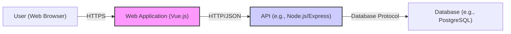

Okay, let's create a design document for the Vue.js 3 (vue-next) project, keeping in mind its purpose and potential security considerations.

# BUSINESS POSTURE

Vue.js is a progressive, incrementally-adoptable JavaScript framework for building UI on the web.  The project's primary goal is to provide a component-based, reactive, and performant way to develop web interfaces.  It aims to be approachable for beginners while being powerful enough for complex applications.  It competes with other front-end frameworks like React and Angular.  Given its open-source nature and widespread use, several key business priorities and risks emerge:

Priorities:

*   Maintainability and Stability:  Vue.js needs to be easy to maintain and evolve over time, ensuring backward compatibility where possible and providing clear migration paths for breaking changes.
*   Performance:  Rendering speed and efficiency are critical for user experience.
*   Developer Experience:  A smooth and intuitive API, good documentation, and a supportive community are essential for adoption and retention.
*   Community Trust:  Maintaining the trust of the large and active Vue.js community is paramount. This includes transparency, responsiveness to issues, and responsible handling of security vulnerabilities.
*   Ecosystem Compatibility:  Vue.js needs to integrate well with other popular tools and libraries in the web development ecosystem.

Business Risks:

*   Security Vulnerabilities:  As a widely used framework, any security vulnerabilities in Vue.js could have a significant impact on a large number of applications.  This is the most critical business risk.
*   Loss of Community Trust:  Mishandling security issues, introducing major breaking changes without adequate support, or a decline in community engagement could lead to developers switching to alternative frameworks.
*   Competition:  The front-end framework landscape is highly competitive.  Vue.js needs to continuously innovate and improve to maintain its position.
*   Maintainer Burnout:  Relying on a small group of core maintainers can lead to burnout and slow down development.
*   Fragmentation:  The risk of the ecosystem becoming fragmented with too many competing or incompatible libraries and tools.

# SECURITY POSTURE

Vue.js, being a client-side framework, has a specific security profile.  It primarily deals with rendering data and handling user interactions within the browser's sandbox.  However, it's crucial to understand how it interacts with data and the potential vulnerabilities that can arise.

Existing Security Controls:

*   security control: Input Sanitization: Vue.js automatically sanitizes HTML content bound using the `v-html` directive to prevent Cross-Site Scripting (XSS) attacks.  This is a core security feature. (Described in Vue.js documentation and source code).
*   security control: Template Compilation: Vue.js compiles templates into JavaScript render functions, which helps to mitigate template injection vulnerabilities. (Described in Vue.js documentation and source code).
*   security control: Regular Security Audits: The Vue.js team and community conduct regular security audits and reviews of the codebase. (Refer to Vue.js GitHub repository and security advisories).
*   security control: Dependency Management: Vue.js uses package managers (npm/yarn) to manage dependencies, allowing for tracking and updating of potentially vulnerable libraries. (Described in `package.json` and `yarn.lock` files).
*   security control: Content Security Policy (CSP) Compatibility: Vue.js is designed to be compatible with CSP, a browser security mechanism that helps prevent XSS and other code injection attacks. (Described in Vue.js documentation).
*   security control: Secure Development Practices: The Vue.js team follows secure development practices, including code reviews, testing, and addressing security issues reported by the community. (Evident in the GitHub repository's commit history and issue tracker).

Accepted Risks:

*   accepted risk: Third-Party Library Vulnerabilities: While Vue.js manages its dependencies, vulnerabilities in third-party libraries used within Vue.js applications are a potential risk. This is a common risk for all web development projects.
*   accepted risk: Client-Side Manipulation: As with any client-side framework, data and logic handled by Vue.js can be manipulated by a malicious user with browser developer tools.  This is mitigated by server-side validation and authorization.
*   accepted risk: Misconfiguration by Developers:  Developers can inadvertently introduce security vulnerabilities in their applications by misusing Vue.js features or not following secure coding practices.

Recommended Security Controls:

*   security control:  Automated Security Scanning: Integrate automated security scanning tools (e.g., Snyk, Dependabot) into the CI/CD pipeline to detect vulnerabilities in dependencies and the codebase.
*   security control:  Regular Penetration Testing: Conduct periodic penetration testing of applications built with Vue.js to identify potential vulnerabilities that may be missed by automated tools.
*   security control:  Subresource Integrity (SRI): Encourage the use of SRI when including Vue.js from a CDN to ensure that the loaded file hasn't been tampered with.

Security Requirements:

*   Authentication: Vue.js itself does not handle authentication. Authentication is typically implemented using server-side logic and communicated to the Vue.js application via APIs.  Any authentication mechanisms (e.g., JWT, OAuth) must be implemented securely on the server-side.
*   Authorization: Similar to authentication, authorization is primarily a server-side concern.  Vue.js can be used to display different UI elements based on user roles, but the actual authorization checks must be performed on the server.
*   Input Validation: While Vue.js provides some built-in sanitization, developers should always validate user input on both the client-side (for user experience) and the server-side (for security).  This includes validating data types, lengths, and formats.
*   Cryptography: Vue.js does not provide cryptographic functions.  Any cryptographic operations (e.g., hashing passwords, encrypting data) should be performed on the server-side using secure libraries.  Sensitive data should never be stored in client-side code or local storage.

# DESIGN

## C4 CONTEXT

Element Descriptions:

*   Element:
    *   Name: User (Web Browser)
    *   Type: Person
    *   Description: The end-user interacting with the Vue.js application through a web browser.
    *   Responsibilities: Initiates requests, views data, interacts with the UI.
    *   Security Controls: Browser security features (e.g., same-origin policy, CSP), HTTPS.

*   Element:
    *   Name: Vue.js Application
    *   Type: Software System
    *   Description: The client-side application built using Vue.js.
    *   Responsibilities: Renders UI, handles user interactions, communicates with the backend API.
    *   Security Controls: Input sanitization, template compilation, CSP compatibility.

*   Element:
    *   Name: Backend API (e.g., REST, GraphQL)
    *   Type: Software System
    *   Description: The server-side API that provides data and services to the Vue.js application.
    *   Responsibilities: Handles business logic, authenticates and authorizes requests, interacts with the database and external services.
    *   Security Controls: Authentication, authorization, input validation, rate limiting, encryption.

*   Element:
    *   Name: Third-Party Libraries (e.g., Axios, Vue Router)
    *   Type: Software System
    *   Description: External libraries used by the Vue.js application.
    *   Responsibilities: Provide specific functionalities (e.g., HTTP requests, routing).
    *   Security Controls: Regular updates, dependency scanning.

*   Element:
    *   Name: Database (e.g., PostgreSQL, MongoDB)
    *   Type: Software System
    *   Description: The database used to store application data.
    *   Responsibilities: Stores and retrieves data.
    *   Security Controls: Access control, encryption at rest, regular backups.

*   Element:
    *   Name: External Services (e.g., Payment Gateway, Email Service)
    *   Type: Software System
    *   Description: External services used by the backend API.
    *   Responsibilities: Provide specific functionalities (e.g., processing payments, sending emails).
    *   Security Controls: Secure communication (HTTPS), API keys, authentication.

## C4 CONTAINER

Element Descriptions:

*   Element:
    *   Name: User (Web Browser)
    *   Type: Person
    *   Description: The end-user interacting with the web application.
    *   Responsibilities: Initiates requests, views data, interacts with the UI.
    *   Security Controls: Browser security features, HTTPS.

*   Element:
    *   Name: Web Application (Vue.js)
    *   Type: Container: Web Application
    *   Description: The Vue.js application running in the user's browser.  This includes components, routing, state management, etc.
    *   Responsibilities: Renders UI, handles user input, communicates with the API.
    *   Security Controls: Input sanitization, template compilation, CSP compatibility.

*   Element:
    *   Name: API (e.g., Node.js/Express)
    *   Type: Container: API Application
    *   Description: The server-side API that handles requests from the web application.
    *   Responsibilities: Processes requests, authenticates and authorizes users, interacts with the database.
    *   Security Controls: Authentication, authorization, input validation, rate limiting, encryption.

*   Element:
    *   Name: Database (e.g., PostgreSQL)
    *   Type: Container: Database
    *   Description: The database that stores application data.
    *   Responsibilities: Stores and retrieves data.
    *   Security Controls: Access control, encryption at rest, regular backups.

## DEPLOYMENT

Vue.js applications are typically deployed as static files (HTML, CSS, JavaScript) to a web server or CDN.  There are several deployment options:

1.  **Traditional Web Server:** Deploying to a web server like Apache or Nginx.
2.  **Cloud Platforms:** Using cloud platforms like AWS S3 + CloudFront, Google Cloud Storage + CDN, Azure Blob Storage + CDN, Netlify, Vercel, etc.
3.  **Containerization:** Containerizing the application with Docker and deploying to a container orchestration platform like Kubernetes.

We'll describe deployment using **AWS S3 + CloudFront** as it's a common and cost-effective solution:

Element Descriptions:

*   Element:
    *   Name: Developer
    *   Type: Person
    *   Description: The developer writing and committing code.
    *   Responsibilities: Develops features, fixes bugs, writes tests.
    *   Security Controls: Code reviews, secure coding practices.

*   Element:
    *   Name: Git Repository (e.g., GitHub)
    *   Type: Software System
    *   Description: The version control system storing the application code.
    *   Responsibilities: Stores code, tracks changes, enables collaboration.
    *   Security Controls: Access control, branch protection rules.

*   Element:
    *   Name: CI/CD Pipeline (e.g., GitHub Actions)
    *   Type: Software System
    *   Description: The automated pipeline that builds, tests, and deploys the application.
    *   Responsibilities: Automates the build, test, and deployment process.
    *   Security Controls: Secure configuration, access control, dependency scanning.

*   Element:
    *   Name: Build Artifacts (HTML, CSS, JS)
    *   Type: Artifact
    *   Description: The static files generated by the build process.
    *   Responsibilities: Represents the deployable application.
    *   Security Controls: Integrity checks (e.g., hashing).

*   Element:
    *   Name: AWS S3 Bucket
    *   Type: Infrastructure Node: Cloud Storage
    *   Description: The AWS S3 bucket storing the static files.
    *   Responsibilities: Stores the application files.
    *   Security Controls: Access control, encryption at rest, versioning.

*   Element:
    *   Name: AWS CloudFront (CDN)
    *   Type: Infrastructure Node: Content Delivery Network
    *   Description: The CDN that distributes the application globally.
    *   Responsibilities: Caches and serves content closer to users, improves performance and security.
    *   Security Controls: HTTPS, WAF (Web Application Firewall) integration, access logs.

*   Element:
    *   Name: User (Web Browser)
    *   Type: Person
    *   Description: The end-user accessing the application.
    *   Responsibilities: Interacts with the application.
    *   Security Controls: Browser security features, HTTPS.

## BUILD

The build process for Vue.js typically involves using a module bundler like Webpack, Rollup, or Parcel.  Vue CLI provides a pre-configured build setup.  The process generally follows these steps:

1.  **Code Checkout:** The CI/CD pipeline checks out the code from the Git repository.
2.  **Dependency Installation:** Dependencies are installed using npm or yarn.
3.  **Linting:** Code is linted to enforce coding standards and identify potential errors.
4.  **Compilation:** Vue.js single-file components (.vue files) are compiled into JavaScript, CSS, and HTML.
5.  **Bundling:** The compiled code and dependencies are bundled into optimized files for production.
6.  **Testing:** Unit tests and end-to-end tests are run.
7.  **Artifact Creation:** The final build artifacts (HTML, CSS, JavaScript) are created.
8.  **Deployment:** Artifacts are deployed to target environment.

Security Controls in Build Process:

*   security control: Dependency Scanning: Tools like `npm audit` or `yarn audit` are used to identify known vulnerabilities in dependencies.
*   security control: Static Application Security Testing (SAST): SAST tools can be integrated into the CI/CD pipeline to scan the codebase for potential security vulnerabilities.
*   security control: Linter Configuration: Linters with security-focused rules (e.g., ESLint with security plugins) can help enforce secure coding practices.
*   security control: Secure CI/CD Configuration: The CI/CD pipeline itself should be configured securely, with limited access and secure handling of secrets.

# RISK ASSESSMENT

*   Critical Business Process: Delivering a functional and performant user interface for web applications.
*   Data to Protect:
    *   User Data (Indirectly): While Vue.js primarily handles presentation, it interacts with user data fetched from backend APIs. The sensitivity of this data depends on the specific application. Examples include Personally Identifiable Information (PII), financial data, health data, etc. The framework itself doesn't store this data persistently.
    *   Application Code: The source code of the Vue.js framework and applications built with it. This is publicly available for the framework itself (open source), but proprietary applications built *with* Vue.js would have their source code as a valuable asset.
    *   Configuration Data: Environment variables, API keys, and other configuration settings used by the application. These should be stored securely and not exposed in client-side code.

# QUESTIONS & ASSUMPTIONS

*   Questions:
    *   What specific types of user data will applications built with Vue.js be handling? This will influence the security requirements for those applications.
    *   What are the specific compliance requirements (e.g., GDPR, HIPAA, PCI DSS) for applications built with Vue.js?
    *   What is the expected threat model for applications built with Vue.js? (e.g., targeted attacks, opportunistic attacks)
    *   What level of security expertise is available within the development teams using Vue.js?

*   Assumptions:
    *   BUSINESS POSTURE: The Vue.js project prioritizes security and will address reported vulnerabilities promptly.
    *   SECURITY POSTURE: Developers building applications with Vue.js will follow secure coding practices and implement appropriate server-side security controls.
    *   DESIGN: The backend API is designed and implemented securely, with proper authentication, authorization, and input validation. The deployment environment is configured securely.