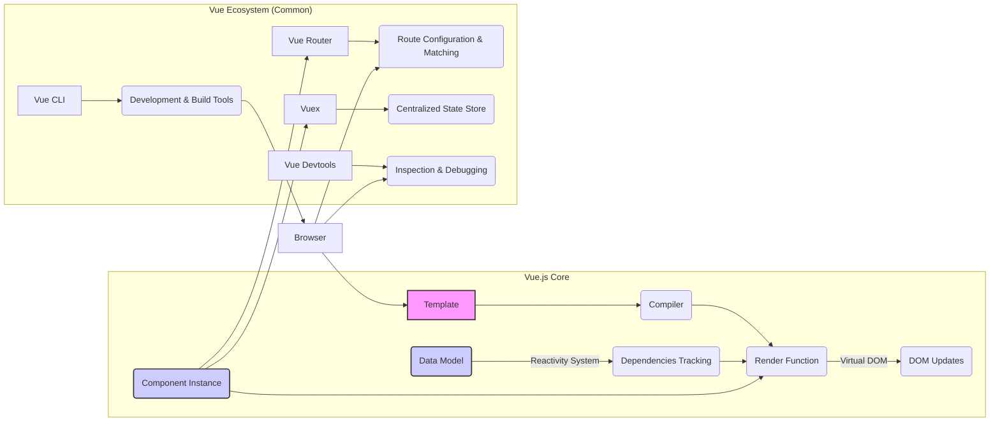
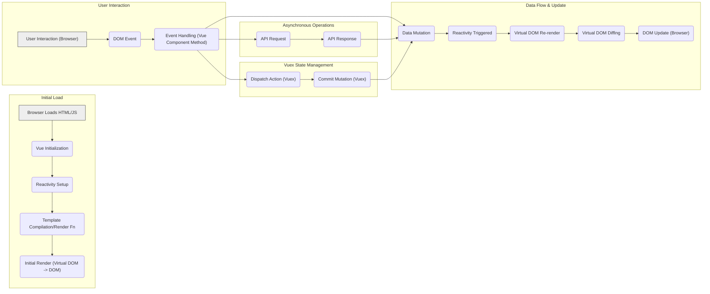

## Project Design Document: Vue.js (Improved)

**1. Introduction**

This document provides an enhanced architectural overview of the Vue.js project, specifically tailored for threat modeling activities. It delves deeper into the core components, functionalities, and interactions within the Vue.js ecosystem to facilitate the identification of potential vulnerabilities and attack vectors. This detailed design serves as a robust foundation for security professionals to conduct thorough threat assessments.

**2. Project Overview**

Vue.js is a progressive JavaScript framework designed for building user interfaces. Its key characteristic is its incremental adoptability, allowing seamless integration into existing projects. The core library focuses solely on the view layer, offering ease of learning and integration with other libraries or existing applications. When combined with modern tooling and supporting libraries, Vue.js is fully capable of powering complex Single-Page Applications (SPAs).

**3. System Architecture**

The fundamental architecture of Vue.js is built upon a reactive data binding system and a modular component-based structure.

*   **Template:**  Vue utilizes HTML-based templates to define the structure of user interfaces. These templates can incorporate Vue-specific directives for dynamic data binding, conditional rendering, and iterative loops.
*   **Compiler:**  Responsible for parsing the templates and transforming them into Render Functions.
*   **Render Function:**  A JavaScript function that describes how the Virtual DOM should be constructed based on the component's data.
*   **Data Model:** Represents the application's data. Vue's reactivity system ensures that changes in the data model automatically trigger updates in the DOM.
*   **Reactivity System:** A core mechanism in Vue that observes changes in the Data Model. It uses techniques like Proxies (or `Object.defineProperty` in older browsers) to track dependencies.
*   **Dependencies Tracking:** The process within the reactivity system of identifying which parts of the DOM (through the Render Function) depend on specific pieces of data.
*   **Virtual DOM:** Vue employs a Virtual DOM as an optimization technique. Instead of directly manipulating the real DOM, Vue creates a lightweight in-memory representation. Changes are compared in the Virtual DOM, and only the necessary updates are applied to the actual DOM.
*   **DOM Updates:** The process of efficiently applying the changes calculated in the Virtual DOM to the browser's actual DOM.
*   **Component Instance:** Each Vue component is a self-contained unit with its own data, methods, computed properties, watchers, and lifecycle hooks. Components are designed for reusability and modularity.
*   **Vue Router:**  The official library for building SPAs, enabling navigation between different views or components without full page reloads.
*   **Route Configuration & Matching:** The process of defining the application's routes and matching the current URL to a specific route and its associated component.
*   **Vuex:** The official state management library for Vue.js applications. It provides a centralized store for managing the application's state in a predictable manner, especially useful for complex applications with shared data.
*   **Centralized State Store:** A single source of truth for the application's data, making state management more organized and predictable.
*   **Vue CLI:**  The standard command-line interface for scaffolding, developing, and building Vue.js applications. It offers features like hot-reloading, linting, and production builds.
*   **Development & Build Tools:**  The set of tools provided by Vue CLI to streamline the development workflow and optimize the application for production.
*   **Vue Devtools:** A browser extension that provides powerful debugging capabilities for Vue.js applications, allowing inspection of components, data, and state.
*   **Inspection & Debugging:** The process of examining the application's internal state and component structure to identify and resolve issues.
*   **Browser:** The end-user's web browser environment where the compiled Vue.js application executes.

**4. Data Flow (Detailed)**

The data flow within a Vue.js application can be broken down into several key stages:

*   **Initialization:**
    *   The browser loads the initial HTML and JavaScript.
    *   Vue initializes the root component instance.
    *   The reactivity system sets up watchers and dependencies on the component's data.
    *   The component's template is compiled into a render function (or the render function is directly defined).
    *   The initial render process creates the Virtual DOM and updates the actual DOM.
*   **User Interaction & Event Handling:**
    *   A user interacts with the application in the browser (e.g., clicks, types).
    *   The browser dispatches a DOM event.
    *   Vue event listeners (defined using `v-on` or `@`) trigger corresponding methods within the component instance.
*   **Data Mutation & Reactivity:**
    *   Component methods update the data model.
    *   The reactivity system detects these changes.
    *   Dependencies tracking identifies which parts of the Virtual DOM need to be re-rendered.
*   **Virtual DOM Re-rendering & Diffing:**
    *   Vue re-executes the render function for the affected components, creating a new Virtual DOM tree.
    *   The new Virtual DOM is compared (diffed) against the previous Virtual DOM to identify the minimal set of changes required.
*   **DOM Update:**
    *   Vue efficiently patches the actual DOM with the calculated differences, updating the user interface.
*   **Asynchronous Operations (e.g., API Calls):**
    *   Component methods may initiate asynchronous operations, such as fetching data from an API.
    *   Upon completion of the asynchronous operation, the component's data is updated.
    *   The reactivity system triggers the re-rendering process as described above.
*   **State Management (with Vuex):**
    *   Components dispatch actions to the Vuex store.
    *   Actions commit mutations to the store's state.
    *   Mutations update the state, triggering reactivity in components that subscribe to that state.

**5. Key Technologies**

*   **JavaScript (ES Modules):** The primary programming language for Vue.js development, leveraging modern features like ES Modules.
*   **HTML5:** Used for structuring the UI templates, often with semantic elements.
*   **CSS (and CSS Preprocessors like Sass/Less):** Used for styling the UI, with preprocessors offering enhanced features.
*   **Node.js and npm/yarn/pnpm:**  Essential for managing project dependencies and running development and build scripts.
*   **Webpack/Vite/Rollup:** Module bundlers used to package the application's source code and assets into optimized bundles for deployment.
*   **Browser APIs:** Vue.js interacts extensively with various browser APIs for DOM manipulation, network requests (`fetch`, `XMLHttpRequest`), local storage, and more.

**6. User Interactions (Detailed)**

User interactions represent potential entry points for malicious activity. Understanding these interactions is crucial for threat modeling:

*   **Direct DOM Interactions:** Clicking buttons, links, interacting with form elements. These trigger event listeners and can lead to data mutations and state changes.
*   **Input Handling:** Typing in text fields, selecting options, uploading files. This user-provided data needs careful sanitization and validation to prevent XSS and other injection attacks.
*   **Navigation:** Using browser navigation (back/forward buttons) or in-app routing (via Vue Router). Improper handling of navigation can lead to security vulnerabilities.
*   **Authentication/Authorization Flows:** Logging in, logging out, accessing protected resources. These flows involve sensitive data and require robust security measures.
*   **Drag and Drop:**  Interactions involving dragging and dropping elements, which can potentially be exploited if not handled securely.
*   **Custom Events:** Components can emit custom events that are handled by parent components, creating another interaction layer to consider.

**7. Deployment Model (Expanded)**

The deployment model significantly impacts the attack surface of a Vue.js application.

*   **Static Hosting (CDN or Object Storage):**  Deploying the pre-built application assets to a Content Delivery Network (CDN) or object storage service like AWS S3 or Google Cloud Storage. This model simplifies deployment but requires careful configuration of access controls and CORS policies.
*   **Server-Side Rendering (SSR) with Node.js:**  Rendering the initial HTML on a Node.js server. This improves SEO and perceived performance but introduces server-side vulnerabilities if not implemented securely. Requires careful handling of user input and protection against server-side attacks.
*   **Jamstack Architecture:** Combining static site generation (SSG) or SSR with dynamic client-side rendering. This approach offers performance benefits but requires careful consideration of the build process and API interactions.
*   **Containerization (Docker/Kubernetes):**  Packaging the application into Docker containers for deployment and orchestration using Kubernetes. This provides scalability and isolation but requires securing the container images and the orchestration platform.
*   **Integration with Backend Frameworks (Monolithic Applications):**  Deploying the Vue.js frontend as part of a larger application managed by a backend framework (e.g., Django, Ruby on Rails, Laravel). Security considerations extend to the entire application stack.

**8. Security Considerations (Detailed)**

This section expands on the initial security considerations, providing more specific examples and context relevant to Vue.js applications:

*   **Cross-Site Scripting (XSS):**
    *   **Threat:** Malicious scripts injected into the application can execute in users' browsers, potentially stealing credentials, session tokens, or performing unauthorized actions.
    *   **Vue.js Mitigation:** Vue.js provides built-in protection against XSS by escaping HTML content in templates by default. However, developers must be cautious when using `v-html` or rendering user-provided content directly.
    *   **Example:**  Displaying user comments without proper sanitization could allow attackers to inject `<script>` tags.
*   **Cross-Site Request Forgery (CSRF):**
    *   **Threat:** An attacker tricks a logged-in user into making unintended requests on a web application.
    *   **Vue.js Context:** While the backend is primarily responsible for CSRF protection (using techniques like synchronizer tokens), the frontend needs to be aware of and handle these tokens correctly when making requests.
    *   **Example:**  A malicious website could contain a form that submits data to the vulnerable application while the user is logged in.
*   **Injection Attacks:**
    *   **Threat:**  Exploiting vulnerabilities where user-provided data is used directly in backend queries or commands (e.g., SQL injection, command injection).
    *   **Vue.js Context:** Vue.js itself doesn't directly interact with databases. However, it's crucial to sanitize and validate data on the frontend *before* sending it to the backend APIs to prevent these attacks.
    *   **Example:**  Failing to sanitize user input in a search bar could allow an attacker to inject malicious SQL queries into the backend.
*   **Authentication and Authorization:**
    *   **Threat:**  Unauthorized access to application resources or functionality.
    *   **Vue.js Context:**  The frontend plays a role in managing user sessions (e.g., storing tokens), redirecting unauthorized users, and making authenticated requests. Securely storing and handling authentication tokens is critical.
    *   **Example:**  Storing authentication tokens in local storage without proper protection could make them vulnerable to XSS attacks.
*   **Data Security:**
    *   **Threat:**  Exposure of sensitive data.
    *   **Vue.js Context:** Ensure that communication with the backend uses HTTPS to encrypt data in transit. Avoid storing sensitive data directly in the frontend if possible.
    *   **Example:**  Sending login credentials over an unencrypted HTTP connection.
*   **Dependency Management:**
    *   **Threat:**  Using outdated or vulnerable third-party libraries.
    *   **Vue.js Context:** Regularly update dependencies using npm/yarn/pnpm and use tools like `npm audit` or `yarn audit` to identify and address vulnerabilities.
    *   **Example:**  Using an outdated version of a UI library with a known XSS vulnerability.
*   **Client-Side Security:**
    *   **Threat:**  Exploiting vulnerabilities in the client-side code.
    *   **Vue.js Context:**  Avoid storing sensitive information in the client-side code. Be mindful of the data exposed in the browser's developer tools. Implement proper input validation and sanitization.
    *   **Example:**  Exposing API keys or other secrets in the frontend JavaScript code.
*   **Build Process Security:**
    *   **Threat:**  Compromising the build pipeline to inject malicious code into the application.
    *   **Vue.js Context:**  Secure the development environment, use trusted dependencies, and consider using tools for verifying the integrity of build artifacts.
    *   **Example:**  A compromised dependency injecting malicious code during the build process.

**9. Conclusion**

This improved design document provides a more in-depth architectural analysis of Vue.js, specifically focusing on aspects relevant to threat modeling. By detailing the core components, data flow, user interactions, and deployment models, along with expanded security considerations, this document aims to equip security professionals with the necessary knowledge to conduct comprehensive threat assessments for Vue.js projects. This detailed understanding is crucial for proactively identifying potential vulnerabilities and implementing effective security measures to protect Vue.js applications.