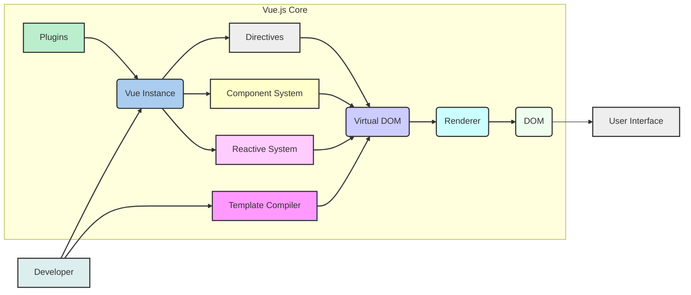

# Project Design Document: Vue.js Framework

**Project Name:** Vue.js Framework

**Project Repository:** [https://github.com/vuejs/vue](https://github.com/vuejs/vue)

**Document Version:** 1.1
**Date:** 2023-10-27
**Author:** AI Software Architect

## 1. Project Overview

### 1.1. Project Description

Vue.js is a progressive JavaScript framework for building user interfaces. It is designed to be incrementally adoptable, meaning it can be easily integrated into existing projects. Vue.js focuses on the view layer, making it simple to create single-page applications and interactive components.  Its core library provides a declarative and component-based programming model that helps developers efficiently build user interfaces, ranging from simple to complex. Vue.js prioritizes ease of use, performance, and flexibility, making it a popular choice for both small and large-scale web applications.

### 1.2. Project Goals

*   **Maintainability:**  Provide a clear and well-structured codebase that is easy to understand, maintain, and extend by the core team and community contributors. This includes well-documented code, modular design, and adherence to coding standards.
*   **Performance:**  Ensure high performance in rendering and updating the user interface, offering a smooth and responsive user experience. Focus on efficient algorithms, minimal DOM manipulations, and optimized code execution.
*   **Developer Experience:**  Offer a pleasant and efficient development experience through clear and intuitive APIs, comprehensive and helpful documentation, and robust developer tooling. This includes features like hot-reloading, debugging support, and helpful error messages.
*   **Flexibility and Scalability:**  Design the framework to be flexible enough to adapt to various project sizes and complexities, from small interactive widgets to large-scale, complex applications. Support for different architectural patterns and integration with other libraries and tools is crucial.
*   **Community Growth:** Foster a vibrant and active community around the framework to encourage contributions, provide support, and drive growth. This involves active community engagement, clear contribution guidelines, and a welcoming environment for new contributors.
*   **Security:**  Implement secure coding practices within the framework itself and provide features and guidance that help developers build secure applications using Vue.js. This includes mitigating common web vulnerabilities and providing tools for secure development.

### 1.3. Target Audience

*   Web developers of all skill levels, from beginners learning front-end development to experienced professionals building complex web applications.
*   Organizations and businesses looking for a modern, performant, and maintainable front-end framework to build user interfaces for their web products and services.
*   Open-source contributors interested in contributing to a popular and impactful JavaScript framework, improving its features, performance, and security.
*   Educators and trainers who teach front-end web development and need a framework that is easy to learn and use for educational purposes.

## 2. Architecture Overview

### 2.1. High-Level Architecture Diagram

### 2.2. Key Components

*   **Template Compiler:**
    *   **Function:** Parses Vue.js templates (HTML-like syntax with Vue.js directives) into highly optimized render functions.
    *   **Details:**  Performs static analysis and optimizations during compilation to improve runtime performance. Can operate in two modes:
        *   **Runtime Compilation:** Templates are compiled in the browser at runtime. This increases bundle size but offers more flexibility.
        *   **Pre-compilation:** Templates are compiled during the build process (e.g., using Vue CLI or build tools). This reduces bundle size and improves initial rendering performance.
    *   **Security Relevance:**  The compiler plays a role in XSS prevention by default escaping HTML entities in template expressions.

*   **Reactive System:**
    *   **Function:**  The core engine for reactivity in Vue.js. It automatically tracks dependencies and efficiently updates the DOM when data changes.
    *   **Details:**  Utilizes Proxy objects (in modern browsers) or `Object.defineProperty` (for older browsers) to observe data properties.  Maintains a dependency graph to track which parts of the application (components, watchers, computed properties) depend on specific data.
    *   **Security Relevance:**  While not directly a security component, its efficiency impacts performance, which can indirectly affect security by preventing denial-of-service scenarios due to slow rendering.

*   **Virtual DOM:**
    *   **Function:**  An in-memory representation of the DOM. Acts as an intermediary layer between the reactive system and the actual DOM.
    *   **Details:**  When data changes, Vue.js creates a new Virtual DOM tree. It then compares this new tree with the previous one using a diffing algorithm to identify the minimal set of changes needed to update the real DOM. This minimizes direct DOM manipulations, which are performance-intensive.
    *   **Security Relevance:**  Indirectly contributes to security by improving performance and reducing the attack surface related to direct DOM manipulation vulnerabilities (though less common in modern frameworks).

*   **Renderer:**
    *   **Function:**  Takes the Virtual DOM diff (the minimal changes identified) and applies these changes to the actual browser DOM.
    *   **Details:**  Handles the low-level DOM operations, including creating, updating, moving, and removing DOM nodes.  Optimized for performance to ensure smooth and efficient UI updates.
    *   **Security Relevance:**  Not directly a security component, but its efficiency contributes to overall application performance and responsiveness.

*   **Component System:**
    *   **Function:**  Allows developers to encapsulate reusable UI elements and logic into components. Components are the building blocks of Vue.js applications.
    *   **Details:**  Provides features like:
        *   **Props:**  Passing data down from parent to child components.
        *   **Events:**  Communication from child to parent components.
        *   **Slots:**  Flexible content distribution within components.
        *   **Lifecycle Hooks:**  Methods triggered at different stages of a component's lifecycle (creation, mounting, updating, destruction).
    *   **Security Relevance:**  Component isolation and clear prop/event interfaces can improve code organization and reduce the risk of unintended side effects, indirectly contributing to security. However, developers must still ensure components handle data securely, especially user inputs.

*   **Directives:**
    *   **Function:**  Special attributes in Vue.js templates that provide declarative ways to manipulate the DOM based on data.
    *   **Details:**  Examples include:
        *   `v-if`, `v-show`: Conditional rendering.
        *   `v-for`:  List rendering.
        *   `v-bind`:  Dynamically binding attributes.
        *   `v-on`:  Event handling.
        *   `v-model`:  Two-way data binding for form inputs.
    *   **Security Relevance:**  Directives like `v-html` can introduce XSS vulnerabilities if used improperly with unsanitized user input. Developers must use them cautiously and sanitize data when necessary.  Other directives like `v-bind` and `v-on` can also be misused to create vulnerabilities if not handled carefully.

*   **Plugins:**
    *   **Function:**  Extend Vue.js core functionality by adding global-level features.
    *   **Details:**  Plugins can be used to add:
        *   Global components or directives.
        *   Instance methods or properties.
        *   Modify Vue.js options.
    *   **Security Relevance:**  Plugins can introduce security risks if they are not from trusted sources or if they introduce vulnerabilities themselves.  Carefully vet and audit plugins before using them in production applications.

*   **Vue Instance:**
    *   **Function:**  The root instance of a Vue.js application. Serves as the central point for managing data, methods, computed properties, watchers, and the component tree.
    *   **Details:**  Created using `new Vue({...})`.  Provides the entry point for interacting with the Vue.js framework and managing the application's state.
    *   **Security Relevance:**  The Vue instance holds the application's data and logic. Securely managing data within the instance and preventing unauthorized access or modification is crucial for application security.

## 3. Component Breakdown and Interactions

### 3.1. Reactive System Details

*   **Data Observation Mechanisms:**
    *   **Proxies (Modern Browsers):**  Provide a powerful and performant way to intercept property access and modifications. Vue.js uses Proxies when available for optimal reactivity.
    *   **`Object.defineProperty` (Older Browsers):**  Used as a fallback for browsers that do not support Proxies. Less performant than Proxies but still provides reactivity.

*   **Dependency Tracking Process:**
    *   **Dependency Graph:**  The reactive system builds a graph that maps data properties to their dependent components, watchers, and computed properties.
    *   **Watcher Functions:**  When a component or computed property is rendered or evaluated, the reactive system tracks which data properties are accessed. These components/properties become "watchers" of those data properties.

*   **Change Propagation and Update Scheduling:**
    *   **Asynchronous Updates:**  Vue.js updates are asynchronous and batched. When multiple data changes occur, Vue.js queues them and updates the DOM in a single batch in the next "tick" of the event loop. This optimizes performance by reducing DOM updates.
    *   **Efficient Updates:**  Only components and parts of the DOM that are affected by data changes are re-rendered or updated, thanks to the Virtual DOM diffing and patching process.

### 3.2. Virtual DOM and Rendering Process

*   **Template Compilation to Render Functions:**
    *   **Render Function Output:** The template compiler transforms templates into render functions. These functions are JavaScript code that, when executed, return Virtual DOM trees.
    *   **Optimization in Render Functions:**  Render functions are optimized to be as efficient as possible, minimizing object creation and function calls during rendering.

*   **Virtual DOM Tree Creation and Management:**
    *   **Lightweight JavaScript Objects:** Virtual DOM nodes are plain JavaScript objects that represent DOM elements, attributes, and text content.
    *   **Tree Structure:**  Virtual DOM nodes are organized in a tree structure that mirrors the actual DOM structure.

*   **Diffing Algorithm (Reconciliation):**
    *   **Comparison of Trees:**  The diffing algorithm compares the new Virtual DOM tree with the previous one, node by node and level by level.
    *   **Identifying Minimal Changes:**  The algorithm aims to find the minimal set of operations (node creation, update, removal, move) needed to transform the old Virtual DOM tree into the new one.
    *   **Optimized Diffing Strategies:**  Vue.js uses optimized diffing strategies (like key-based diffing for lists) to further improve performance.

*   **Patching and DOM Updates:**
    *   **Applying Changes to DOM:** The Renderer takes the diff output (patch instructions) and applies them to the actual DOM.
    *   **Efficient DOM Operations:**  Patching operations are optimized to minimize direct DOM manipulations, focusing on only changing what is necessary.

### 3.3. Component Lifecycle

*   **Creation Hooks:**
    *   `beforeCreate`:  Initialization phase, called before reactivity and data observation are set up. Useful for early setup tasks, but data and DOM are not yet available.
    *   `created`:  Instance is created, data observation and reactivity are active, events and watchers are set up.  Ideal for initial data fetching or logic setup that doesn't require DOM access.

*   **Mounting Hooks:**
    *   `beforeMount`:  Called right before the component is mounted to the DOM. Render function is about to be called for the first time.
    *   `mounted`:  Component is mounted to the DOM.  DOM access is available. Good for DOM manipulations, integration with third-party libraries that require DOM, or fetching data that needs DOM information.

*   **Updating Hooks:**
    *   `beforeUpdate`:  Called before the component re-renders due to data changes. Useful for accessing the DOM state before the update.
    *   `updated`:  Called after the component and its children have been updated in the DOM.  DOM is updated. Be cautious about causing infinite loops by modifying state within `updated` that triggers another update.

*   **Unmounting Hooks:**
    *   `beforeUnmount`:  Called right before a component instance is unmounted. Component is still fully functional. Good for cleanup tasks like removing event listeners or timers.
    *   `unmounted`:  Component is unmounted and destroyed. All directives unbound, event listeners removed, child components unmounted.  Final cleanup tasks.

*   **Error Handling Hooks:**
    *   `errorCaptured`:  Called when an error from a descendant component is captured. Allows for error handling and logging within parent components.
    *   `renderTracked`:  For debugging reactivity. Called when a reactive dependency is tracked during render.
    *   `renderTriggered`:  For debugging reactivity. Called when a reactive dependency triggers a re-render.

## 4. Data Flow

### 4.1. Data Flow Diagram

```mermaid
graph LR
    A["Data Source (API, User Input, Internal State)"] --> B("Vue Instance Data (Reactive)");
    B --> C["Reactive System (Dependency Tracking)"];
    C --> D["Virtual DOM (Tree Creation & Diffing)"];
    D --> E["Renderer (DOM Patching)"];
    E --> F["DOM (Browser)"];
    F --> G["User Interface (Visual Output)"];
    style A fill:#aaf,stroke:#333,stroke-width:2px
    style B fill:#afa,stroke:#333,stroke-width:2px
    style C fill:#faa,stroke:#333,stroke-width:2px
    style D fill:#aee,stroke:#333,stroke-width:2px
    style E fill:#eea,stroke:#333,stroke-width:2px
    style F fill:#eae,stroke:#333,stroke-width:2px
    style G fill:#eee,stroke:#333,stroke-width:2px
    linkStyle 0,1,2,3,4,5 stroke-width:2px
```

### 4.2. Data Flow Description

1.  **Data Source:** Data originates from various sources:
    *   **Backend APIs:** Data fetched from servers via HTTP requests.
    *   **User Input:** Data entered by users through forms, interactions, etc.
    *   **Internal Application State:** Data managed within the Vue.js application itself (e.g., component data, Vuex store).

2.  **Vue Instance Data (Reactive):** Data is managed within the `data` property of Vue instances or in state management solutions like Vuex. This data is made reactive by the Reactive System.

3.  **Reactive System (Dependency Tracking):** The Reactive System monitors changes to the reactive data. It tracks which components, computed properties, and watchers depend on specific data properties.

4.  **Virtual DOM (Tree Creation & Diffing):** When reactive data changes, components that depend on it are marked for re-rendering. Render functions are executed to create a new Virtual DOM tree. The diffing algorithm compares the new tree with the previous one to find minimal changes.

5.  **Renderer (DOM Patching):** The Renderer receives the diff output and efficiently updates the actual DOM in the browser to reflect the changes identified by the diffing algorithm.

6.  **DOM (Browser):** The browser's Document Object Model is updated with the changes.

7.  **User Interface (Visual Output):** The updated DOM is rendered by the browser, resulting in a visual update to the user interface, reflecting the data changes.

## 5. Security Considerations

### 5.1. Client-Side Security

*   **Cross-Site Scripting (XSS) Prevention - Built-in Protections:**
    *   **Template Escaping:** Vue.js templates, by default, escape HTML entities in data bindings (using `{{ }}` interpolation). This prevents basic XSS attacks by rendering user-provided text as plain text instead of executing it as HTML or JavaScript.
    *   **`v-text` Directive:**  The `v-text` directive also enforces text-only rendering, further mitigating XSS risks in text content.

*   **Cross-Site Scripting (XSS) Prevention - Developer Responsibilities:**
    *   **`v-html` Directive Caution:** The `v-html` directive renders raw HTML. **Avoid using `v-html` with user-provided content.** If necessary, sanitize user-provided HTML using a trusted library (like DOMPurify) before rendering it with `v-html`.
    *   **URL Sanitization:** When binding URLs dynamically (e.g., in `<a>` tags or image `src` attributes), ensure URLs are properly validated and sanitized to prevent JavaScript injection via `javascript:` URLs.
    *   **Attribute Injection:** Be careful when dynamically binding HTML attributes using `v-bind`. Ensure attribute values are properly escaped and validated to prevent attribute injection vulnerabilities.

*   **Dependency Management and Supply Chain Security:**
    *   **Regular Dependency Audits:** Regularly audit project dependencies using `npm audit`, `yarn audit`, or similar tools to identify and address known vulnerabilities in third-party libraries.
    *   **Dependency Updates:** Keep Vue.js and its dependencies updated to receive security patches and bug fixes.
    *   **Verify Dependency Integrity:** Use package lock files (`package-lock.json`, `yarn.lock`) to ensure consistent dependency versions and prevent supply chain attacks through dependency substitution.

*   **Content Security Policy (CSP) Implementation:**
    *   **CSP Headers:** Encourage developers to implement Content Security Policy (CSP) headers on the server. CSP helps mitigate XSS attacks by controlling the sources from which the browser is allowed to load resources (scripts, stylesheets, images, etc.).
    *   **Nonce and Hash-based CSP:**  For stricter CSP, consider using nonces or hashes for inline scripts and styles to further restrict execution of untrusted code.

*   **Secure Coding Practices:**
    *   **Input Validation:** Validate all user inputs on both the client-side and server-side. Client-side validation enhances user experience, but server-side validation is crucial for security.
    *   **Output Encoding:**  While Vue.js provides default escaping, understand context-specific output encoding needs. For example, when rendering data in JavaScript strings, ensure proper JavaScript escaping.
    *   **Principle of Least Privilege:** Apply the principle of least privilege in client-side code. Avoid storing sensitive data in client-side JavaScript if possible. If necessary, protect it appropriately.

### 5.2. Server-Side Rendering (SSR) Security (If Applicable)

*   **Server-Side XSS Prevention:**
    *   **Context-Aware Output Encoding:** When using SSR, ensure that data rendered on the server is properly encoded based on the output context (HTML, JavaScript, URL, etc.) to prevent server-side XSS vulnerabilities.
    *   **Template Security in SSR:**  Apply the same template security principles as in client-side rendering. Be extremely cautious with `v-html` and user-provided content in SSR templates.

*   **Server-Side Request Forgery (SSRF) Prevention:**
    *   **Validate External Requests:** If the SSR application makes external HTTP requests (e.g., to fetch data for rendering), carefully validate and sanitize any user inputs that influence the URLs or parameters of these requests to prevent SSRF attacks.
    *   **Restrict Outbound Network Access:**  In SSR environments, consider restricting outbound network access from the server to only necessary domains and ports to limit the potential impact of SSRF vulnerabilities.

*   **Injection Attacks (SQL, NoSQL, Command Injection):**
    *   **Parameterized Queries:** If the SSR application interacts with databases, use parameterized queries or prepared statements to prevent SQL or NoSQL injection vulnerabilities.
    *   **Input Sanitization for Backend Interactions:** Sanitize and validate user inputs before passing them to backend systems or executing system commands to prevent injection attacks.

### 5.3. General Security Best Practices for Vue.js Applications

*   **Regular Security Audits and Penetration Testing:** Conduct regular security audits and penetration testing of Vue.js applications to proactively identify and address potential vulnerabilities.
*   **Security Training for Developers:** Provide security training to development teams to educate them about common web security threats, secure coding practices, and Vue.js-specific security considerations.
*   **Stay Updated with Security Advisories:** Monitor Vue.js security advisories and community security discussions to stay informed about potential vulnerabilities and recommended security practices.
*   **Secure Configuration of Server Environments:** Ensure secure configuration of server environments hosting Vue.js applications, including proper access controls, firewall rules, and security updates.
*   **Rate Limiting and защитные механизмы (Defense Mechanisms):** Implement rate limiting and other defense mechanisms to protect against brute-force attacks, DDoS attacks, and other forms of abuse.

## 6. Deployment Model

### 6.1. Common Deployment Scenarios

*   **Static File Hosting (CDN or Web Server):**
    *   **Description:**  Build the Vue.js application into static HTML, CSS, and JavaScript files. Host these files on a CDN (Content Delivery Network) for global distribution and fast loading times, or on a traditional web server (like Nginx, Apache, or cloud storage services like AWS S3, Google Cloud Storage, Azure Blob Storage).
    *   **Use Cases:**  Ideal for client-side rendered single-page applications (SPAs), static websites, and applications where the backend API is decoupled and served separately.
    *   **Advantages:**  Simple deployment, highly scalable, cost-effective, excellent performance due to CDN caching.

*   **Server-Side Rendering (SSR) with Node.js:**
    *   **Description:**  Use a Node.js server to pre-render Vue.js components on the server and send fully rendered HTML to the client. Subsequent interactions are handled client-side. Frameworks like Nuxt.js simplify SSR setup.
    *   **Use Cases:**  Applications requiring improved SEO (search engine optimization), faster First Contentful Paint (FCP), and better performance on low-powered devices.
    *   **Advantages:**  Improved SEO, faster initial load times, better perceived performance, can improve accessibility.
    *   **Considerations:**  More complex deployment setup, requires a Node.js server environment, increased server load compared to static hosting.

*   **Integration with Backend Frameworks (Backend as a Service - BaaS):**
    *   **Description:**  Integrate Vue.js as the front-end view layer with various backend frameworks and platforms (e.g., Node.js with Express, Python with Django/Flask, Ruby on Rails, Java Spring Boot, serverless BaaS platforms like Firebase, AWS Amplify, Netlify Functions). The backend handles API endpoints, data persistence, authentication, and server-side logic.
    *   **Use Cases:**  Full-stack web applications, complex applications requiring server-side logic, database interactions, user authentication, and API integrations.
    *   **Advantages:**  Flexibility in backend technology choice, separation of concerns between front-end and back-end, leverage backend framework features.
    *   **Considerations:**  More complex architecture, requires coordination between front-end and back-end development teams.

### 6.2. Build Process

*   **Dependency Management:**
    *   **Tools:** Use package managers like npm or yarn to manage project dependencies (Vue.js core, libraries, tools).
    *   **`package.json` and Lock Files:**  `package.json` defines project dependencies. Lock files (`package-lock.json`, `yarn.lock`) ensure consistent dependency versions across environments.

*   **Build Tools and Bundling:**
    *   **Webpack, Vite, Rollup:** Utilize module bundlers like Webpack, Vite (recommended for Vue 3), or Rollup to bundle Vue.js components, JavaScript code, CSS, and assets into optimized bundles for production.
    *   **Code Transformation and Optimization:** Build tools perform tasks like:
        *   **Transpilation:** Converting modern JavaScript (ES6+) to browser-compatible JavaScript (using Babel).
        *   **Minification:** Reducing code size by removing whitespace and shortening variable names.
        *   **Tree Shaking:** Removing unused code to reduce bundle size.
        *   **CSS Processing:**  Processing CSS (e.g., using PostCSS, CSS Modules, preprocessors like Sass/Less).
        *   **Asset Optimization:** Optimizing images and other assets.

*   **Vue CLI (Command Line Interface):**
    *   **Project Scaffolding:**  Vue CLI simplifies project setup and provides a standardized project structure.
    *   **Development Server:**  Provides a development server with hot-reloading for efficient development.
    *   **Build Commands:**  Offers commands to build the application for production (`vue-cli-service build`).

## 7. Technology Stack

### 7.1. Core Technologies

*   **JavaScript (ECMAScript):** The fundamental programming language for Vue.js development.
*   **HTML5:** Used for structuring the user interface and creating templates.
*   **CSS3:** Used for styling and visual presentation of the user interface.

### 7.2. Development and Build Tools

*   **Node.js and npm/yarn:**  JavaScript runtime environment (Node.js) and package managers (npm or yarn) for managing dependencies and running build scripts.
*   **Webpack/Vite/Rollup:** Module bundlers for packaging and optimizing Vue.js applications. Vite is the recommended build tool for Vue 3 projects due to its speed and modern features.
*   **Vue CLI (Command Line Interface):**  Official CLI tool for Vue.js project scaffolding, development, and building.
*   **Browser Developer Tools:**  Essential for debugging, inspecting components, and profiling performance in Vue.js applications (e.g., Chrome DevTools, Firefox Developer Tools).

### 7.3. Optional Technologies (Depending on Project Needs)

*   **TypeScript:**  A statically-typed superset of JavaScript. Can be used with Vue.js for improved code maintainability, scalability, and developer tooling. Vue 3 is written in TypeScript and offers excellent TypeScript support.
*   **Nuxt.js (for SSR and more):**  A higher-level framework built on top of Vue.js that simplifies server-side rendering, static site generation, and provides a more structured application architecture.
*   **Vue Router:**  Official routing library for building single-page applications with navigation and route management in Vue.js.
*   **Vuex (for State Management):**  Official state management library for Vue.js applications, especially useful for complex applications with shared state across components. Pinia is a more modern and recommended alternative for Vue 3.
*   **Pinia (for State Management - Vue 3):** A modern state management library for Vue.js, offering a simpler and more intuitive API compared to Vuex, especially for Vue 3.
*   **Testing Frameworks:**
    *   **Unit Testing:** Jest, Vitest (recommended for Vite projects).
    *   **Component Testing:** Vue Test Utils (official), Cypress Component Testing.
    *   **End-to-End (E2E) Testing:** Cypress, Playwright, Selenium.
*   **UI Component Libraries (e.g., Element Plus, Vuetify, Ant Design Vue):**  Pre-built UI component libraries to accelerate development and provide consistent UI elements.

This improved design document provides a more detailed and comprehensive overview of the Vue.js framework, with enhanced security considerations and more specific descriptions of components and processes. It is better suited for threat modeling and security analysis, offering a deeper understanding of the framework's architecture and potential security aspects.