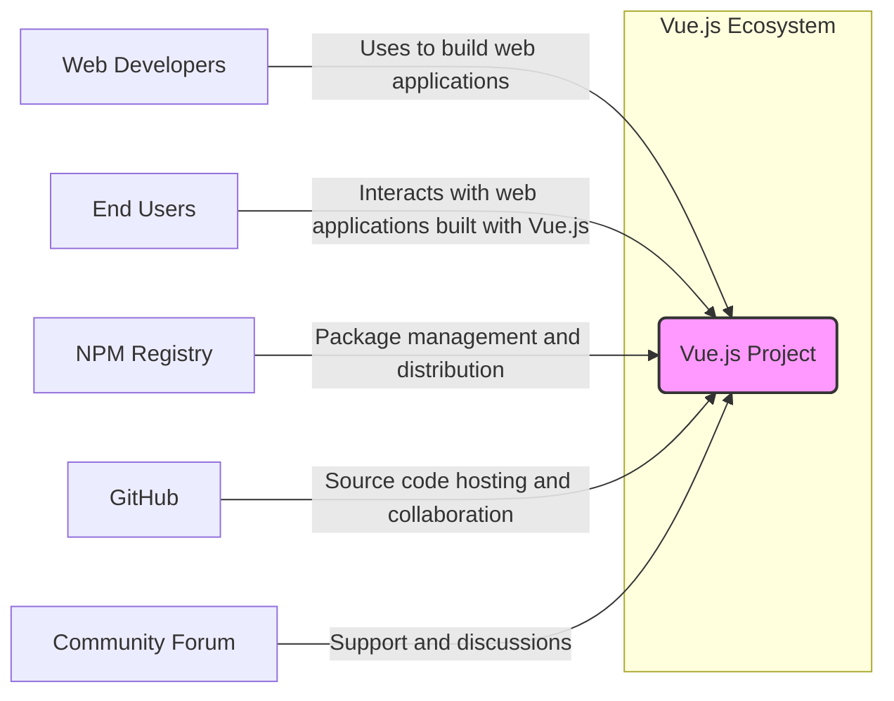
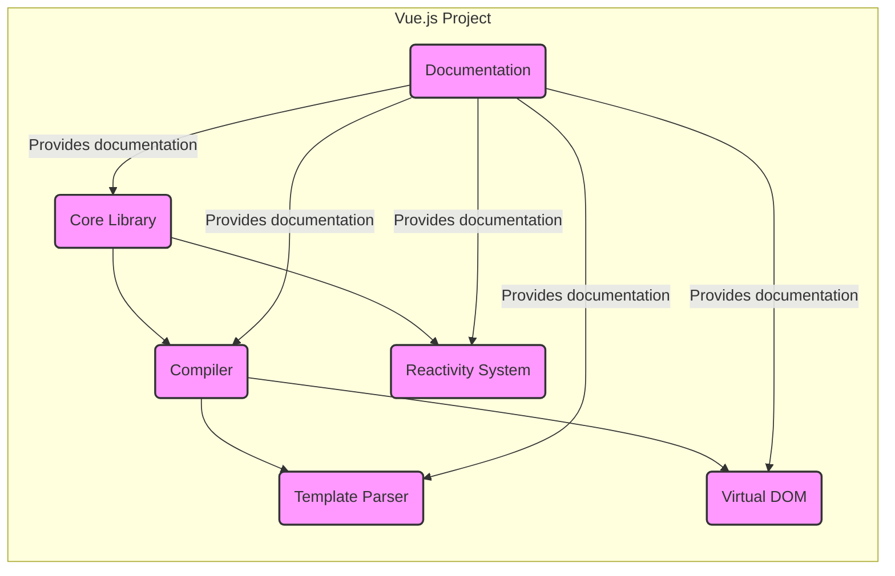
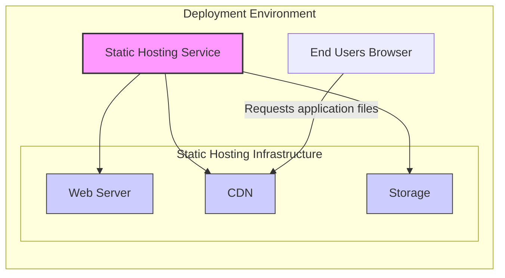

# BUSINESS POSTURE

This project, Vue.js, aims to provide a progressive, incrementally-adoptable JavaScript framework for building user interfaces and single-page applications. Its primary business goal is to empower developers to create interactive and performant web applications efficiently. Vue.js prioritizes developer experience, ease of learning, and flexibility, making it suitable for a wide range of projects from small widgets to large-scale applications.

Business priorities for Vue.js are:
- Maintainability: Ensuring the framework is easy to maintain and update, reducing technical debt for projects using Vue.js.
- Performance: Providing a performant framework that enables fast and responsive user interfaces.
- Community Growth: Expanding the Vue.js community to ensure a vibrant ecosystem of libraries, tools, and support.
- Developer Experience: Focusing on making Vue.js enjoyable and efficient to use for developers of all skill levels.
- Wide Adoption: Increasing the adoption of Vue.js across different industries and project types.

Most important business risks that need to be addressed:
- Security vulnerabilities in the framework itself could impact all applications built with Vue.js, leading to widespread security incidents.
- Supply chain attacks targeting Vue.js dependencies or build process could compromise the integrity of the framework.
- Lack of community support or maintainability issues could lead to decreased adoption and developer trust.
- Performance bottlenecks in the framework could negatively impact user experience and project success.

# SECURITY POSTURE

Existing security controls:
- security control: GitHub repository with public access for code review and transparency. Implemented in: GitHub repository.
- security control: Issue tracking system on GitHub for reporting and managing bugs and security vulnerabilities. Implemented in: GitHub repository issue tracker.
- security control: Community contributions and peer review process for code changes. Implemented in: GitHub pull request process.
- security control: Regular updates and releases to address reported issues and vulnerabilities. Implemented in: Vue.js release cycle.
- accepted risk: Reliance on community contributions for identifying and reporting security vulnerabilities.

Recommended security controls:
- security control: Implement automated security scanning (SAST, DAST, dependency scanning) in the CI/CD pipeline for Vue.js development.
- security control: Conduct regular security audits and penetration testing of the Vue.js framework by external security experts.
- security control: Establish a clear vulnerability disclosure policy and incident response plan for security issues in Vue.js.
- security control: Implement supply chain security measures, including dependency scanning and verification, to protect against compromised dependencies.

Security requirements:
- Authentication: Not directly applicable to Vue.js framework itself, but applications built with Vue.js will require robust authentication mechanisms.
- Authorization: Not directly applicable to Vue.js framework itself, but applications built with Vue.js will require robust authorization mechanisms to control access to resources and functionalities.
- Input Validation: Vue.js applications must implement thorough input validation to prevent injection attacks (XSS, etc.) at the application level. Vue.js itself provides mechanisms for secure data binding and templating to mitigate some XSS risks.
- Cryptography: Not directly applicable to Vue.js framework itself, but applications built with Vue.js will need to utilize cryptography for secure data transmission and storage where necessary. Vue.js can be used in conjunction with secure communication protocols (HTTPS) and can interact with backend services that handle cryptographic operations.

# DESIGN

## C4 CONTEXT

Context Diagram Elements:

- Element:
    - Name: Vue.js Project
    - Type: Software System
    - Description: The Vue.js JavaScript framework for building user interfaces.
    - Responsibilities: Provides components, reactivity system, templating engine, and other features for building web applications.
    - Security controls: Security controls are focused on the development and distribution of the framework itself, including secure development practices, vulnerability management, and supply chain security.

- Element:
    - Name: Web Developers
    - Type: Person
    - Description: Developers who use Vue.js to build web applications.
    - Responsibilities: Utilize Vue.js framework to create user interfaces, implement application logic, and ensure application security.
    - Security controls: Responsible for implementing security controls within the applications they build using Vue.js, including authentication, authorization, input validation, and secure data handling.

- Element:
    - Name: End Users
    - Type: Person
    - Description: Users who interact with web applications built using Vue.js.
    - Responsibilities: Use web applications to access information and perform tasks.
    - Security controls: Rely on the security of the web applications they use, which is the responsibility of the developers and operators of those applications.

- Element:
    - Name: NPM Registry
    - Type: External System
    - Description: Node Package Manager registry, used for distributing and managing Vue.js packages and dependencies.
    - Responsibilities: Hosts and provides access to Vue.js packages and related libraries.
    - Security controls: NPM Registry implements security controls to protect against malware and supply chain attacks. Vue.js project relies on NPM's security measures for package distribution.

- Element:
    - Name: GitHub
    - Type: External System
    - Description: Platform for hosting the Vue.js source code, issue tracking, and collaboration.
    - Responsibilities: Provides infrastructure for Vue.js development, version control, and community contributions.
    - Security controls: GitHub implements security controls for code hosting, access management, and vulnerability scanning. Vue.js project benefits from GitHub's security features.

- Element:
    - Name: Community Forum
    - Type: External System
    - Description: Online forum and communities where Vue.js developers can seek support, share knowledge, and discuss Vue.js related topics.
    - Responsibilities: Provides a platform for community support and knowledge sharing.
    - Security controls: Forum security is managed by the forum platform provider. Vue.js project relies on the forum's security measures to protect user data and prevent malicious activities.

## C4 CONTAINER

Container Diagram Elements:

- Element:
    - Name: Core Library
    - Type: Library
    - Description: The main Vue.js library, providing the runtime functionalities for reactivity, component system, and API.
    - Responsibilities: Manages component lifecycle, reactivity, and provides core APIs for developers to build applications.
    - Security controls: Code review, automated testing, and vulnerability scanning to ensure the core library is secure and free from vulnerabilities.

- Element:
    - Name: Compiler
    - Type: Library
    - Description: The Vue.js compiler that transforms templates into render functions.
    - Responsibilities: Compiles Vue.js templates into JavaScript code that can be executed by the browser.
    - Security controls: Input validation during template compilation to prevent injection attacks. Code review and testing to ensure the compiler generates secure code.

- Element:
    - Name: Template Parser
    - Type: Library
    - Description: Component of the compiler responsible for parsing Vue.js templates.
    - Responsibilities: Parses template syntax and generates an abstract syntax tree (AST) for further processing by the compiler.
    - Security controls: Input validation and sanitization during template parsing to prevent injection attacks.

- Element:
    - Name: Virtual DOM
    - Type: Library
    - Description: Vue.js's Virtual DOM implementation for efficient UI updates.
    - Responsibilities: Manages and optimizes updates to the actual DOM, improving performance.
    - Security controls:  The Virtual DOM itself does not directly introduce security vulnerabilities, but secure coding practices are followed in its implementation to avoid potential issues.

- Element:
    - Name: Reactivity System
    - Type: Library
    - Description: Vue.js's reactivity system that automatically tracks dependencies and updates the DOM when data changes.
    - Responsibilities: Enables reactive data binding and automatic UI updates.
    - Security controls: The reactivity system itself does not directly introduce security vulnerabilities, but secure coding practices are followed in its implementation.

- Element:
    - Name: Documentation
    - Type: Website
    - Description: Official Vue.js documentation website.
    - Responsibilities: Provides comprehensive documentation, guides, and API references for Vue.js.
    - Security controls: Standard web application security practices for the documentation website itself, such as HTTPS, input validation for user interactions (if any), and protection against common web vulnerabilities.

## DEPLOYMENT

Vue.js itself is not deployed as a standalone application. Instead, Vue.js applications built by developers are deployed. Typical deployment scenarios for Vue.js applications include:

- Static Hosting: Deploying the built application (HTML, CSS, JavaScript files) to static hosting services like Netlify, Vercel, AWS S3, or GitHub Pages.
- Server-Side Rendering (SSR): Deploying a Node.js server that renders Vue.js applications on the server and serves pre-rendered HTML to clients. This can be deployed on cloud platforms like AWS EC2, Google Cloud Compute Engine, or PaaS providers.
- Hybrid Rendering: Combining static site generation (SSG) with client-side rendering for specific parts of the application.

For simplicity, let's consider the static hosting deployment scenario.

Deployment Diagram Elements (Static Hosting):

- Element:
    - Name: Static Hosting Service
    - Type: Cloud Service
    - Description: A service that hosts static files (HTML, CSS, JavaScript, images) for web applications. Examples include Netlify, Vercel, AWS S3, GitHub Pages.
    - Responsibilities: Serving static application files to end users, providing CDN for content delivery, and managing storage.
    - Security controls: Security controls are managed by the static hosting provider and include infrastructure security, DDoS protection, CDN security, and access controls.

- Element:
    - Name: Web Server
    - Type: Software
    - Description: Web server component within the static hosting infrastructure responsible for serving HTTP requests.
    - Responsibilities: Handling incoming HTTP requests and serving static files.
    - Security controls: Web server security configurations, HTTPS enforcement, and protection against common web server vulnerabilities.

- Element:
    - Name: CDN
    - Type: Cloud Service
    - Description: Content Delivery Network for caching and distributing static application files globally.
    - Responsibilities: Caching static content and delivering it to users from geographically closer servers, improving performance and availability.
    - Security controls: CDN security features, including DDoS protection, secure content delivery, and protection against CDN-specific attacks.

- Element:
    - Name: Storage
    - Type: Data Store
    - Description: Storage service for storing static application files.
    - Responsibilities: Persistently storing application files and providing access to the web server.
    - Security controls: Storage service security features, including access controls, data encryption at rest, and data integrity checks.

- Element:
    - Name: End Users Browser
    - Type: Software
    - Description: Web browser used by end users to access the Vue.js application.
    - Responsibilities: Rendering the Vue.js application and interacting with the user.
    - Security controls: Browser security features, including sandboxing, content security policy (CSP) enforcement, and protection against malicious scripts.

## BUILD

```mermaid
graph LR
    A["Developer"] -- "Code Changes" --> B["Code Repository (GitHub)"]
    B -- "Code Push" --> C["CI/CD Pipeline (GitHub Actions)"]
    subgraph "CI/CD Pipeline"
        C -- "Checkout Code" --> D["Build Stage"]
        D -- "Run Build Scripts, Security Checks (SAST, Dependency Scan)" --> E["Test Stage"]
        E -- "Run Unit & Integration Tests" --> F["Publish Stage"]
        F -- "Publish to NPM Registry" --> G["NPM Registry"]
    end
    style C fill:#f9f,stroke:#333,stroke-width:2px
    style D fill:#ccf,stroke:#333,stroke-width:1px,dash-style:5 5
    style E fill:#ccf,stroke:#333,stroke-width:1px,dash-style:5 5
    style F fill:#ccf,stroke:#333,stroke-width:1px,dash-style:5 5
```

Build Process Diagram Elements:

- Element:
    - Name: Developer
    - Type: Person
    - Description: Vue.js framework developers who write and maintain the code.
    - Responsibilities: Writing code, fixing bugs, implementing new features, and ensuring code quality and security.
    - Security controls: Secure coding practices, code review, and adherence to security guidelines.

- Element:
    - Name: Code Repository (GitHub)
    - Type: Code Repository
    - Description: GitHub repository hosting the Vue.js source code.
    - Responsibilities: Version control, code storage, collaboration, and managing code changes.
    - Security controls: Access control, branch protection, and GitHub's security features.

- Element:
    - Name: CI/CD Pipeline (GitHub Actions)
    - Type: Automation System
    - Description: Automated CI/CD pipeline using GitHub Actions for building, testing, and publishing Vue.js.
    - Responsibilities: Automating the build, test, and release process, ensuring code quality and security checks are performed.
    - Security controls: Secure pipeline configuration, access control to pipeline resources, and integration of security scanning tools.

- Element:
    - Name: Build Stage
    - Type: Build Process
    - Description: Stage in the CI/CD pipeline where Vue.js is built and compiled.
    - Responsibilities: Compiling code, bundling assets, and preparing build artifacts.
    - Security controls: Use of secure build environments, dependency management, and build process hardening.

- Element:
    - Name: Test Stage
    - Type: Test Process
    - Description: Stage in the CI/CD pipeline where automated tests are executed.
    - Responsibilities: Running unit tests, integration tests, and potentially security tests to ensure code quality and identify vulnerabilities.
    - Security controls: Automated testing frameworks, security test integration (SAST, dependency scanning), and test environment security.

- Element:
    - Name: Publish Stage
    - Type: Publish Process
    - Description: Stage in the CI/CD pipeline where build artifacts are published to the NPM Registry.
    - Responsibilities: Packaging and publishing Vue.js packages to the NPM Registry for distribution.
    - Security controls: Secure publishing process, signing packages, and verifying package integrity.

- Element:
    - Name: NPM Registry
    - Type: Package Registry
    - Description: Node Package Manager registry for distributing Vue.js packages.
    - Responsibilities: Hosting and providing access to Vue.js packages for developers.
    - Security controls: NPM Registry security controls to protect against malware and supply chain attacks, package verification, and vulnerability scanning.

# RISK ASSESSMENT

Critical business processes we are trying to protect:
- Development and distribution of the Vue.js framework itself.
- Maintaining the integrity and availability of the Vue.js framework for developers worldwide.
- Ensuring the security of applications built using Vue.js (indirectly, by providing a secure and reliable framework).

Data we are trying to protect and their sensitivity:
- Vue.js source code: Highly sensitive, as its compromise could lead to vulnerabilities in the framework and applications built with it. Requires confidentiality and integrity.
- Build artifacts (published packages): Highly sensitive, as compromised packages could be distributed to millions of developers, leading to widespread supply chain attacks. Requires integrity and availability.
- Developer credentials and access keys: Highly sensitive, as their compromise could allow unauthorized access to the code repository, build pipeline, and publishing infrastructure. Requires confidentiality and integrity.
- Community forum user data (if any): Sensitive, depending on the data collected (usernames, emails, etc.). Requires confidentiality and integrity.

# QUESTIONS & ASSUMPTIONS

Questions:
- What are the specific security concerns of the user requesting this document regarding Vue.js?
- Is the user planning to use Vue.js in a specific type of application or industry with specific security requirements?
- Are there any existing security policies or frameworks that need to be considered in relation to Vue.js?

Assumptions:
- BUSINESS POSTURE: The primary business goal of Vue.js is to provide a popular and effective JavaScript framework for web development.
- SECURITY POSTURE: Security for Vue.js project focuses on the framework itself and its distribution, with the understanding that application-level security is the responsibility of developers using Vue.js.
- DESIGN: The design is based on the open-source nature of Vue.js and its typical usage in web application development, including static hosting as a common deployment scenario. The build process is assumed to be automated using CI/CD practices.